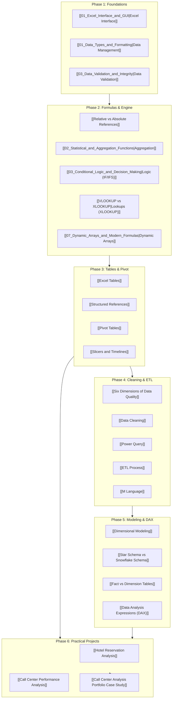

# 🗺️ Master Course Map of Content (MOC)

> [!abstract] Global Knowledge Graph
> Visual and structured Map of Content linking core modules, atomic concepts, formulas, and capstone analytics projects.

---

## 📚 Direct Topic Navigation

### 1. Core Modules
- **[[01_Excel_Interface_and_GUI|Module 1: Excel Interface & Data Analytics Overview]]**
- **[[01_Data_Types_and_Formatting|Module 2: Data Management, Types, & Shortcuts]]**
- **[[01_Formula_Basics_and_Cell_Referencing|Module 3: Formulas, Functions, & Referencing]]**
- **[[01_Excel_Tables_Architecture|Module 4: Excel Tables & Structured References]]**
- **[[01_Visual_Analytics_and_Chart_Selection|Module 5: Charts & Visualization Best Practices]]**
- **[[01_Pivot_Table_Foundations|Module 6: Pivot Tables & Slicer Interactivity]]**
- **[[01_Data_Quality_Dimensions_and_Audit|Module 7: Data Quality, Cleaning & Enterprise Sources]]**
- **[[01_Power_Query_Fundamentals_and_ETL|Module 8: Power Query, Data Pipelines & M Language]]**
- **[[01_Dimensional_Modeling_Principles|Module 9: Data Modeling, Power Pivot & DAX]]**

### 2. Standalone Concept Notes
- [[Excel Tables]] | [[Structured References]] | [[Relative vs Absolute References]] | [[Conditional Formatting]]
- [[VLOOKUP vs XLOOKUP]] | [[INDEX and MATCH]] | [[Pivot Tables]] | [[Slicers and Timelines]]
- [[Data Cleaning]] | [[Six Dimensions of Data Quality]] | [[Power Query]] | [[ETL Process]] | [[M Language]]
- [[Dimensional Modeling]] | [[Star Schema vs Snowflake Schema]] | [[Fact vs Dimension Tables]]
- [[Data Analysis Expressions (DAX)]] | [[Calculated Columns vs DAX Measures]] | [[Dashboard Design Principles]] | [[Data Analysis Life Cycle]]

### 3. Key Projects
- 🏨 [[Hotel Reservation Analysis]]: 36,000+ booking records, cancellation trends, RevPAR, ADR, channel performance.
- 📞 [[Call Center Performance Analysis]]: 5,000 PwC customer service calls, CSAT, Speed of Answer, Agent Scorecard.

---

## 🌐 Interactive Online Mindmaps & Architecture Blueprints
- 🧠 **Interactive Course Mindmap (MindMeister)**: [Open Live MindMeister Course Map](https://www.mindmeister.com/app/map/3782166881?t=I9gXHbkAlV)
- 🗺️ **Enterprise Architecture Topology**: [[Enterprise Architecture Mindmap|Enterprise Architecture Mindmap (Infographic)]]
- 🔍 **Data Quality Audit Flow**: [[Data Quality Framework Mind Map|Data Quality Framework Visual Mind Map]]
- 📄 **Excel GUI Blueprint**: [[Excel Interface Blueprint|Excel Interface Blueprint (PDF Manual)]]
- 🎥 **Navigation Video**: [[Excel Navigation and Setup Video Guide|Excel Navigation and Setup Video Walkthrough]]

