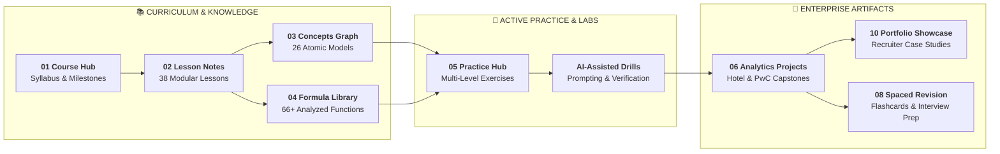

# 📊 Excel Zero to Hero: Knowledge System & Second Brain

> [!abstract] Course Mission & Second Brain
> Welcome to the comprehensive **Excel Zero to Hero (8-Hour Masterclass + Call Center Capstone)** Second Brain! This learning repository transforms raw lecture content into an interconnected, actionable knowledge system designed for accelerated retention, hands-on practice, and portfolio demonstration.

---

## ⚡ Quick Navigation

| Navigation Hub | Description | Primary Link |
| :--- | :--- | :--- |
| 🎛️ **Command Center** | Progress tracking, Dataview queries, and active queue | [[Course Dashboard]] |
| 🗺️ **Curriculum Map** | Full 9-module syllabus, lecture index, and objectives | [[Course Curriculum]] |
| 🧭 **Learning Roadmap** | Progressive path: Understand ➔ Practice ➔ Build | [[Learning Roadmap]] |
| 🧠 **Concept Graph** | Standalone atomic concept notes and mental models | [[Course Map]] |
| 📞 **Capstone Project** | End-to-end PwC Call Center Performance Analysis | [[Call Center Performance Analysis]] |
| 💼 **Portfolio Showcase** | Executive case study formatted for recruiters & clients | [[Call Center Analysis Portfolio Case Study]] |

---

## 📂 Vault Architecture Overview

- **[[00_Home/Home|00_Home]]**: Daily driver dashboards, progress trackers, and visual maps of content.
- **[[01_Course/Course Overview|01_Course]]**: Ground-truth curriculum, lesson index, and learning milestones.
- **[[02_Notes/01_Fundamentals/01_Excel_Interface_and_GUI|02_Notes]]**: Comprehensive modular lecture notes for all 9 course chapters.
- **[[03_Concepts/Excel Tables|03_Concepts]]**: Atomic concept notes answering the 10 core architectural questions.
- **[[04_Formulas/Lookup/XLOOKUP|04_Formulas]]**: Categorized Excel formula knowledge base with syntax and edge cases.
- **[[05_Practice/Exercises/Ex01_Data_Management_and_Formatting|05_Practice]]**: Multi-level practice questions, business scenarios, and verified solutions.
- **[[06_Projects/Call Center Performance Analysis/Project Overview|06_Projects]]**: Hotel Reservation Analysis & PwC Call Center Analytics Case Studies.
- **[[07_Reference/Excel Cheat Sheet|07_Reference]]**: Keyboard shortcuts, syntax cheat sheets, and terminology glossary.
- **[[08_Revision/Flashcards|08_Revision]]**: Spaced-repetition flashcards, interview questions, and error logs.
- **[[09_Source_Materials/Module 1|09_Source_Materials]]**: Preserved original datasets, PowerPoint decks, and raw assets.
- **[[10_Portfolio/Call Center Analysis Portfolio Case Study|10_Portfolio]]**: Production-ready case study for GitHub and professional portfolios.

---

## 🎯 Active Learning Protocol

1. **Before Learning**: Review [[Course Dashboard]] and the targeted module's [[Learning Objectives]].
2. **During Learning**: Open the corresponding lesson note in `02_Notes/`, trace formulas, and examine live examples.
3. **After Learning**: Complete exercises in `05_Practice/` and update your status in [[Progress Tracker]].
4. **During Revision**: Test your recall with [[Flashcards]] and review [[Common Mistakes]].
5. **Project Phase**: Build the interactive dashboards in [[06_Projects/Call Center Performance Analysis/Project Overview|PwC Call Center Analysis]].
