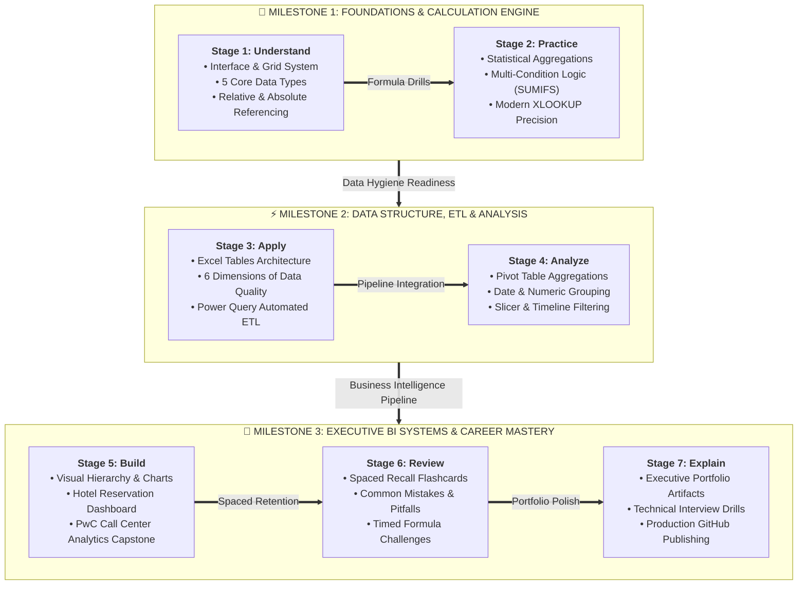

# 🧭 Excel Analytics Learning Roadmap

> [!abstract] Pedagogical Architecture
> A disciplined 7-stage learning journey designed to take you from initial conceptual understanding to building executive-ready business intelligence systems.

---

## 阶段 1: Understand (Concepts & Foundations)
- [x] Understand the Excel interface, Grid coordinates, and Ribbon structure ([[01_Excel_Interface_and_GUI]]). ✅ 2026-09-28
- [x] Differentiate data types (Text, Number, Date, Boolean, Formula) and custom number formatting ([[01_Data_Types_and_Formatting]]). ✅ 2026-09-29
- [x] Master relative, absolute (`$A$1`), and mixed references (`$A1`, `A$1`) ([[Relative vs Absolute References]]). ✅ 2026-09-29
- [x] Understand the power of Excel Tables (`Ctrl + T`) and structured references ([[Excel Tables]]). ✅ 2026-09-29

## 阶段 2: Practice (Drills & Formula Fluency)
- [x] Execute aggregation formulas: `SUM`, `AVERAGE`, `COUNT`, `COUNTA` ([[02_Statistical_and_Aggregation_Functions]]). ✅ 2026-09-29
- [x] Build conditional aggregation logic: `SUMIFS`, `COUNTIFS`, `AVERAGEIFS` ([[SUMIFS]]). ✅ 2026-09-29
- [x] Master modern lookup architecture: `XLOOKUP` vs `VLOOKUP` vs `INDEX/MATCH` ([[VLOOKUP vs XLOOKUP]]). ✅ 2026-09-29
- [x] Handle text cleansing formulas: `TRIM`, `PROPER`, `LEN`, `TEXTJOIN`, `TEXTSPLIT` ([[05_Text_Manipulation_Functions]]). ✅ 2026-09-29
- [x] Complete practice drills in [[Ex01_Data_Management_and_Formatting]] and [[Ex02_Formulas_and_Lookup_Logic]]. ✅ 2026-09-29

## 阶段 3: Apply (Data Structuring & Cleaning)
- [x] Evaluate datasets against the [[Six Dimensions of Data Quality]]. ✅ 2026-09-29
- [x] Implement data validation dropdowns, input alerts, and error constraints ([[03_Data_Validation_and_Integrity]]). ✅ 2026-09-29
- [x] Clean text using Flash Fill (`Ctrl + E`) and Text to Columns ([[04_Data_Transformation_Tools]]). ✅ 2026-09-29
- [x] Ingest multi-format external datasets (CSV, JSON, SQL, REST APIs) into Power Query ([[01_Power_Query_Fundamentals_and_ETL]]). ✅ 2026-09-29
- [x] Execute ETL transformations: unpivoting, merging (joins), and appending (unions) in [[Power Query]]. ✅ 2026-09-29

## 阶段 4: Analyze (Multi-Dimensional Summarization)
- [x] Construct dynamic Pivot Tables with Row, Column, Value, and Filter dimensions ([[Pivot Tables]]). ✅ 2026-09-29
- [x] Utilize advanced Pivot calculations: `% of Grand Total`, `Difference From`, `Running Total` ([[02_Advanced_Calculations_and_Show_Values_As]]). ✅ 2026-09-29
- [x] Group dates by Year/Quarter/Month and numerical values into distribution bins ([[03_Grouping_and_Calculated_Fields]]). ✅ 2026-09-29
	- [x] Connect interactive Slicers and Timelines across multiple Pivot Tables via Report Connections ([[Slicers and Timelines]]). ✅ 2026-09-29

## 阶段 5: Build (End-to-End Analytics Dashboards)
- [x] Design visual layouts using preattentive attributes and visual hierarchy ([[Dashboard Design Principles]]). ✅ 2026-09-29
- [x] Construct the [[Hotel_Reservation_Dashboard_Mini_Project|Hotel Reservation Management Dashboard]]. ✅ 2026-09-29
- [x] Architect the full [[Call Center Performance Analysis|PwC Call Center Performance Analysis Capstone]]: ✅ 2026-09-29
  - Model 5,000 raw call interactions.
  - Implement dynamic KPI cards: Total Calls, Answer Rate, Resolution Rate, Speed of Answer, CSAT.
  - Integrate interactive Slicers and VBA Reset Macro ([[06_Projects/Call Center Performance Analysis/Project Overview]]).

## 阶段 6: Review (Retention & Spaced Repetition)
- [x] Run through the [[Flashcards]] active recall deck. ✅ 2026-09-29
- [x] Study the [[Common Mistakes]] log to avoid common formula and modeling traps. ✅ 2026-09-29
- [x] Conduct timed formula tests using [[Quick Review]]. ✅ 2026-09-29

## 阶段 7: Explain (Portfolio & Interview Mastery)
- [x] Articulate analytical decisions using the [[Call Center Analysis Portfolio Case Study]]. ✅ 2026-09-29
- [x] Practice answering technical questions in [[Interview Questions]]. ✅ 2026-09-29
- [x] Publish the GitHub repository with clean documentation and demonstrate technical proficiency. ✅ 2026-09-29

## 阶段 8: Relational Engineering (SQL Server & Database Discovery)
- [x] Configure Microsoft SQL Server 2022 local developer instance and install/restore official samples ([[SQL Server Learning Environment]] & [[SQL Server Installation References]]). ✅ 2026-10-01
- [x] Master systematic database discovery: ANSI catalogs, schemas, tables, and physical storage ([[Lab_01_Database_Discovery]]). ✅ 2026-10-01
- [x] Profile data types, null distributions, boundary constraints, and orphan records across 8 labs ([[Lab_04_Data_Profiling]]). ✅ 2026-10-01
- [x] Author advanced analytical SQL: Multi-table joins, subqueries, CTEs, and Window Functions ([[Lab_06_Analytical_SQL]]). ✅ 2026-10-01

## 阶段 9: Enterprise Analytics & Pipeline Mastery (SQL to Excel Projects)
- [x] **Project 01**: Northwind SQL to Excel Sales Analytics — Joins, Net Sales views, Power Query ingestion ([[12_SQL_Projects/01_Northwind_SQL_to_Excel/README]]). ✅ 2026-10-01
- [x] **Project 02**: Pubs Publishing Sales Intelligence — Resolving Many-to-Many bridge tables and royalty weighting ([[12_SQL_Projects/02_Pubs_Publishing_Analytics/README]]). ✅ 2026-10-01
- [x] **Project 03**: AdventureWorks Enterprise Sales Analytics — Multi-schema 3NF OLTP modeling & B2B/B2C segmentation ([[12_SQL_Projects/03_AdventureWorks_Sales_Analytics/README]]). ✅ 2026-10-01
- [x] **Project 04**: AdventureWorksDW Dimensional Analytics — Kimball Star Schema, Fact/Dim separation, Power Pivot DAX ([[12_SQL_Projects/04_AdventureWorksDW_Dimensional_Analytics/README]]). ✅ 2026-10-01
- [x] **Project 05**: Production SQL to Excel Analytics Pipeline — Decoupled Views, Query Folding, DAX, Modular VBA Automation ([[12_SQL_Projects/05_Production_SQL_to_Excel_Pipeline/README]]). ✅ 2026-10-01
- [x] Defend analytical architectures in technical interviews using the comprehensive question bank ([[SQL Database Interview Questions]]). ✅ 2026-10-01

