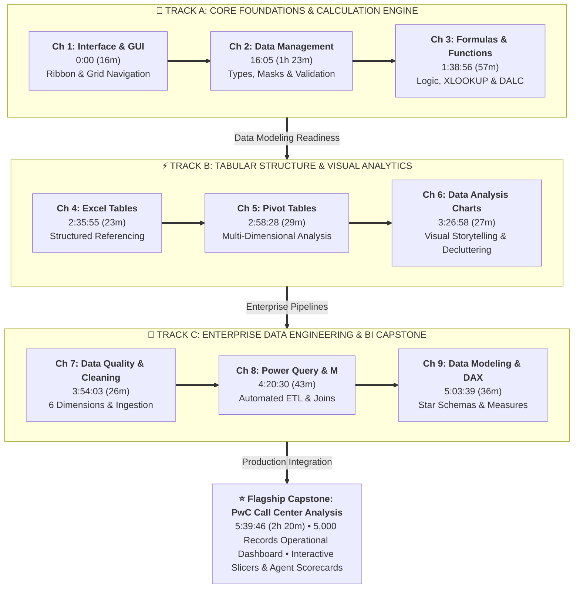

# 📋 Comprehensive Course Curriculum & Video Timestamps

> [!abstract] Course Masterclass Roadmap
> **Course**: *Excel from Zero to Hero in 8 Hours | Complete Course + Call Center Analysis Project*  
> **Instructor**: Mostafa Hamed (@mostavadel)  
> **Masterclass Video**: [Watch on YouTube](https://youtu.be/uv1bxe2gdnU)  
> **Total Duration**: ~8 Hours | **Structure**: 9 Core Modules + 1 Production Capstone Project

---

## 🎥 Official Video Chapter Curriculum

| Chapter | Title | Video Timestamp | Duration | Core Topics & Key Concepts Covered | Practice Files | Capstone Connection |
| :---: | :--- | :---: | :---: | :--- | :--- | :--- |
| **Ch 1** | **Excel Introduction & GUI** | [0:00](https://www.youtube.com/watch?v=uv1bxe2gdnU) | `16m 05s` | Interface Anatomy, Ribbon, Formula Bar, Name Box, Grid System, Status Bar, BI Analyst Career Roadmap | `BI Analyst.pdf`, `Data Analyst Roadmap.pdf` | Workspace setup & environmental readiness |
| **Ch 2** | **Data Management** | [16:05](https://www.youtube.com/watch?v=uv1bxe2gdnU&t=965s) | `1h 22m 51s` | Data Types, Custom Number Formats (`0.00%`, `#,##0`), Multi-level Sort, AutoFilter, Data Validation (dropdowns/rules), Flash Fill (`Ctrl + E`), Text to Columns, File Formats & Extensions (`XLSX`, `XLSM`, `XLSB`, `CSV`) | `2-Module_2 Test Data.xlsx`, `Sample_Superstore_Full.csv`, `3-من اين اتت الداتا؟.pptx` | Data hygiene & validation for call record inputs |
| **Ch 3** | **Excel Formulas & Functions** | [1:38:56](https://www.youtube.com/watch?v=uv1bxe2gdnU&t=5936s) | `56m 59s` | Relative vs Absolute (`$`), Arithmetic, `SUMIFS`, `COUNTIFS`, `AVERAGEIFS`, `IF`, `IFS`, `IFERROR`, `XLOOKUP`, `INDEX/MATCH`, `TRIM`, `TEXTJOIN`, Date math (`DATEDIF`, `NETWORKDAYS`), Dynamic Arrays (`FILTER`, `UNIQUE`), DALC 6-Phase Framework | `2-Conditional Formatting.xlsx`, `3-Module_3 Test Sheet.xlsx`, `4-Test Sheet Part 2.xlsx`, `5-DALC.pptx` | Underlying mathematical calculation engine for call KPIs |
| **Ch 4** | **Excel Tables** | [2:35:55](https://www.youtube.com/watch?v=uv1bxe2gdnU&t=9355s) | `22m 33s` | Range vs Table (`Ctrl + T`), Structured Referencing (`[@Column]`, `Table[[#Data]]`), Auto-expansion, Total Row, Slicer integration, Dynamic Named Ranges | `Module 4 Data_Set.xlsx`, `Module 4 Tables.pptx` | Encapsulating raw call records into dynamic tables |
| **Ch 5** | **Pivot Tables** | [2:58:28](https://www.youtube.com/watch?v=uv1bxe2gdnU&t=10708s) | `28m 30s` | In-memory cache, Pivot Field layout (Rows, Columns, Values, Filters), Show Values As (`% of Total`, `Difference From`, `Running Total`), Date Grouping, Calculated Items/Fields, Multi-pivot Slicer Connections | `1-Pivot tables.xlsx`, `2- Hotel Reservations.csv`, `4- Hotel Reservation Dashboard.xlsx` | Hotel Reservation mini-project and call center aggregation grids |
| **Ch 6** | **Data Analysis Charts** | [3:26:58](https://www.youtube.com/watch?v=uv1bxe2gdnU&t=12418s&pp=0gcJCWMAwfN6Pr3D) | `27m 05s` | Preattentive attributes, Chart Selection Matrix (Comparison, Trend, Distribution, Composition), Edward Tufte Data-Ink ratio, Eliminating chart junk, Cohesive color palettes, KPI card design, Dynamic chart titles | `Charts.pptx`, `Tester.xlsx`, `Tourism Kpis.pptx` | Executive KPI cards, call volume hourly distributions, agent scorecards |
| **Ch 7** | **Importing Data & Data Cleaning** | [3:54:03](https://www.youtube.com/watch?v=uv1bxe2gdnU&t=14043s) | `26m 27s` | Six Dimensions of Data Quality (Accuracy, Completeness, Consistency, Validity, Uniqueness, Timeliness), Forensic Auditing, Handling Operational Nulls vs Corrupt Nulls, Ingesting CSV/XML/JSON/SQL/REST APIs, Enterprise Business Systems (SAP, Salesforce, Workday) | `1-Data Quality.pptx`, `Sales.xlsx`, `Supermarket data.csv`, `Quries.sql`, `M language to Deal with API.txt` | Auditing and validating 5,000 call records & resolving 946 null values |
| **Ch 8** | **Power Query & M Language** | [4:20:30](https://www.youtube.com/watch?v=uv1bxe2gdnU&t=15630s) | `43m 09s` | Extract, Transform, Load (ETL), Applied Steps DAG, Column splitting, Unpivot columns (wide-to-tall), Append (Union), Merge (Relational Joins), M Language (`let ... in`), Formula Bar editing | `1-Power Query.xlsx`, `1.csv`, `2.csv`, `HR - Presentaion.pdf`, `Tester.xlsx` | Automated ETL pipeline for HR workforce analysis and raw call ingestion |
| **Ch 9** | **Data Modeling, Power Pivot & DAX** | [5:03:39](https://www.youtube.com/watch?v=uv1bxe2gdnU&t=18219s) | `36m 07s` | Kimball Dimensional Modeling, Star Schema, Fact vs Dimension tables, Primary Key / Foreign Key, 1-to-Many Relationships, VertiPaq columnar engine, Calculated Columns vs Measures, Explicit DAX (`CALCULATE`, `DIVIDE`, `RELATED`, `USERELATIONSHIP`), Context Transition | `Module 9 - Introduction to Data Modelling.pdf`, `DAX.pdf`, `Tester.xlsx` | Power Pivot analytical data model connecting call logs to agent dimensions |
| **Capstone** | **Final Project (PwC Call Center Performance Analysis)** | [5:39:46](https://www.youtube.com/watch?v=uv1bxe2gdnU&t=20386s) | `2h 20m 14s` | End-to-End Business Intelligence Lifecycle, 5,000 Inbound Call Records, Operational Metrics (81.08% Answer Rate, 89.94% Resolution Rate, 67.52s ASA, 3.40 CSAT), Agent Benchmark Matrix, Interactive Slicers, VBA Filter Clear Macro (`Clear All Filters.txt`), Executive KPI Cards | `PWC Dataset.xlsx`, `Clear All Filters.txt`, `PWC.png`, `Tester.xlsx` | Flagship Capstone Project & Portfolio Artifact |

---

## 🗺️ Chronological Learning Architecture

---

## 📚 Granular Chapter Syllabi & Notes Cross-Reference

### Chapter 1: Excel Introduction & GUI
- 🎥 **Video Timestamp**: [0:00](https://www.youtube.com/watch?v=uv1bxe2gdnU) | **Duration**: `16m 05s`
- 🎯 **Core Competencies**: Interface Anatomy, Ribbon, Formula Bar, Name Box, Grid System, Status Bar, BI Analyst Career Roadmap
- 📁 **Associated Lab Files**: `BI Analyst.pdf`, `Data Analyst Roadmap.pdf`
- 📝 **Dedicated Vault Notes**:
  - [[01_Excel_Interface_and_GUI]]: Lesson 1.1: Excel Interface Architecture & Navigation
  - [[02_Data_Analytics_Overview_and_Roles]]: Lesson 1.2: Data Analytics Ecosystem & Analyst Pathways

### Chapter 2: Data Management
- 🎥 **Video Timestamp**: [16:05](https://www.youtube.com/watch?v=uv1bxe2gdnU&t=965s) | **Duration**: `1h 22m 51s`
- 🎯 **Core Competencies**: Data Types, Custom Number Formats (`0.00%`, `#,##0`), Multi-level Sort, AutoFilter, Data Validation (dropdowns/rules), Flash Fill (`Ctrl + E`), Text to Columns
- 📁 **Associated Lab Files**: `2-Module_2 Test Data.xlsx`, `3-من اين اتت الداتا؟.pptx`
- 📝 **Dedicated Vault Notes**:
  - [[01_Data_Types_and_Formatting]]: Lesson 2.1: Data Types & Custom Number Formatting
  - [[02_Sorting_and_Filtering]]: Lesson 2.2: Advanced Sorting & AutoFilter
  - [[03_Data_Validation_and_Integrity]]: Lesson 2.3: Data Validation & Input Integrity
  - [[04_Data_Transformation_Tools]]: Lesson 2.4: Flash Fill, Text to Columns & Deduplication
  - [[05_Keyboard_Shortcuts_and_Navigation]]: Lesson 2.5: High-Velocity Keyboard Ergonomics

### Chapter 3: Excel Formulas & Functions
- 🎥 **Video Timestamp**: [1:38:56](https://www.youtube.com/watch?v=uv1bxe2gdnU&t=5936s) | **Duration**: `56m 59s`
- 🎯 **Core Competencies**: Relative vs Absolute (`$`), Arithmetic, `SUMIFS`, `COUNTIFS`, `AVERAGEIFS`, `IF`, `IFS`, `IFERROR`, `XLOOKUP`, `INDEX/MATCH`, `TRIM`, `TEXTJOIN`, Date math (`DATEDIF`, `NETWORKDAYS`), Dynamic Arrays (`FILTER`, `UNIQUE`), DALC 6-Phase Framework
- 📁 **Associated Lab Files**: `2-Conditional Formatting.xlsx`, `3-Module_3 Test Sheet.xlsx`, `4-Test Sheet Part 2.xlsx`, `5-DALC.pptx`
- 📝 **Dedicated Vault Notes**:
  - [[01_Formula_Basics_and_Cell_Referencing]]: Lesson 3.1: Formula Architecture & Coordinate Locking
  - [[02_Statistical_and_Aggregation_Functions]]: Lesson 3.2: Statistical & Aggregation Functions
  - [[03_Conditional_Logic_and_Decision_Making]]: Lesson 3.3: Conditional Decision Trees (IF, IFS, IFERROR)
  - [[04_Lookup_and_Reference_Functions]]: Lesson 3.4: Lookup Systems (XLOOKUP vs VLOOKUP vs INDEX/MATCH)
  - [[05_Text_Manipulation_Functions]]: Lesson 3.5: String Cleansing & Text Functions
  - [[06_Date_and_Time_Intelligence]]: Lesson 3.6: Temporal Analytics & Date Functions
  - [[07_Dynamic_Arrays_and_Modern_Formulas]]: Lesson 3.7: Dynamic Arrays & Spill Engine
  - [[08_Data_Analysis_Life_Cycle_DALC]]: Lesson 3.8: Data Analysis Life Cycle (DALC) Framework

### Chapter 4: Excel Tables
- 🎥 **Video Timestamp**: [2:35:55](https://www.youtube.com/watch?v=uv1bxe2gdnU&t=9355s) | **Duration**: `22m 33s`
- 🎯 **Core Competencies**: Range vs Table (`Ctrl + T` / `Ctrl + L`), 4-Tables Mindmap, Structured Referencing (`[@Column]`, `Table[[#Data]]`), Auto-expansion, Total Row (`SUBTOTAL 109`), Slicer Interactivity, Pivot Table Integration (`Sheet1`), Power Query Ingestion, "It's Just a Dashboard!" Micro-Dashboard Architecture
- 📁 **Associated Lab Files**: [`Module_4_Demo.xlsx`](file:///d:/courses/Data%20Analysis%2026-27/7-Introducation%20to%20Data%20Fields%20%28Excel%29/11_Demos_and_Workbooks/04_Tables/Module_4_Demo.xlsx) (6 operational sheets), `Module 4 Data_Set.xlsx`, `Module 4 Tables.pptx`, `assets/module_4_tables_mindmap.png`
- 📝 **Dedicated Vault Notes**:
  - [[01_Excel_Tables_Architecture]]: Lesson 4.1: Range vs Table Architecture & Creation (Mindmap Grounding)
  - [[02_Structured_References]]: Lesson 4.2: Structured References & Formula Engineering
  - [[03_Table_Features_and_Best_Practices]]: Lesson 4.3: Table Tools, Features & "It's Just a Dashboard!"
  - [[Ex03_Excel_Tables_and_Structured_References]]: Practice Exercise (5 Mastery Levels) & [[Ex03_Solutions]]
  - [[Module 4 Dataset Documentation]]: Full 6-sheet schema & data dictionary

### Chapter 5: Pivot Tables
- 🎥 **Video Timestamp**: [2:58:28](https://www.youtube.com/watch?v=uv1bxe2gdnU&t=10708s) | **Duration**: `28m 30s`
- 🎯 **Core Competencies**: In-memory cache, Pivot Field layout (Rows, Columns, Values, Filters), Show Values As (`% of Total`, `Difference From`, `Running Total`), Date Grouping, Calculated Items/Fields, Multi-pivot Slicer Connections
- 📁 **Associated Lab Files**: `1-Pivot tables.xlsx`, `2- Hotel Reservations.csv`, `4- Hotel Reservation Dashboard.xlsx`
- 📝 **Dedicated Vault Notes**:
  - [[01_Pivot_Table_Foundations]]: Lesson 5.1: Pivot Table Architecture & Field Layouts
  - [[02_Advanced_Calculations_and_Show_Values_As]]: Lesson 5.2: Advanced Calculations & Show Values As
  - [[03_Grouping_and_Calculated_Fields]]: Lesson 5.3: Date/Number Grouping & Calculated Fields
  - [[04_Interactive_Filtering_with_Slicers_and_Timelines]]: Lesson 5.4: Slicers, Timelines & Report Connections

### Chapter 6: Data Analysis Charts
- 🎥 **Video Timestamp**: [3:26:58](https://www.youtube.com/watch?v=uv1bxe2gdnU&t=12418s&pp=0gcJCWMAwfN6Pr3D) | **Duration**: `27m 05s`
- 🎯 **Core Competencies**: Preattentive attributes, Chart Selection Matrix (Comparison, Trend, Distribution, Composition), Edward Tufte Data-Ink ratio, Eliminating chart junk, Cohesive color palettes, KPI card design, Dynamic chart titles
- 📁 **Associated Lab Files**: `Charts.pptx`, `Tester.xlsx`, `Tourism Kpis.pptx`
- 📝 **Dedicated Vault Notes**:
  - [[01_Visual_Analytics_and_Chart_Selection]]: Lesson 6.1: Visual Analytics & Chart Selection Matrix
  - [[02_Formatting_and_Chart_Design_Rules]]: Lesson 6.2: Decluttering, Data-Ink Ratio & Palettes
  - [[03_Dashboard_Visual_Hierarchy]]: Lesson 6.3: Executive Dashboard Layout & Visual Hierarchy

### Chapter 7: Importing Data & Data Cleaning
- 🎥 **Video Timestamp**: [3:54:03](https://www.youtube.com/watch?v=uv1bxe2gdnU&t=14043s) | **Duration**: `26m 27s`
- 🎯 **Core Competencies**: Six Dimensions of Data Quality (Accuracy, Completeness, Consistency, Validity, Uniqueness, Timeliness), Forensic Auditing, Handling Operational Nulls vs Corrupt Nulls, Ingesting CSV/XML/JSON/SQL/REST APIs, Enterprise Business Systems (SAP, Salesforce, Workday)
- 📁 **Associated Lab Files**: `1-Data Quality.pptx`, `Sales.xlsx`, `Supermarket data.csv`, `Quries.sql`, `M language to Deal with API.txt`
- 📝 **Dedicated Vault Notes**:
  - [[01_Data_Quality_Dimensions_and_Audit]]: Lesson 7.1: Six Dimensions of Data Quality & Audit Framework
  - [[02_Data_Cleaning_Techniques_in_Excel]]: Lesson 7.2: Systematic Data Cleaning & Anomaly Correction
  - [[03_Importing_Data_from_Enterprise_Sources]]: Lesson 7.3: Ingesting External Sources (CSV, XML, JSON, SQL, APIs)
  - [[04_Business_Systems_for_Analysts]]: Lesson 7.4: Enterprise Data Architecture (ERP, CRM, HRIS)

### Chapter 8: Power Query & M Language
- 🎥 **Video Timestamp**: [4:20:30](https://www.youtube.com/watch?v=uv1bxe2gdnU&t=15630s) | **Duration**: `43m 09s`
- 🎯 **Core Competencies**: Extract, Transform, Load (ETL), Applied Steps DAG, Column splitting, Unpivot columns (wide-to-tall), Append (Union), Merge (Relational Joins), M Language (`let ... in`), Formula Bar editing
- 📁 **Associated Lab Files**: `1-Power Query.xlsx`, `1.csv`, `2.csv`, `HR - Presentaion.pdf`, `Tester.xlsx`
- 📝 **Dedicated Vault Notes**:
  - [[01_Power_Query_Fundamentals_and_ETL]]: Lesson 8.1: Power Query ETL Architecture & Applied Steps
  - [[02_Core_Data_Transformations]]: Lesson 8.2: Core Transformations (Split, Replace, Unpivot)
  - [[03_Combining_Data_Append_and_Merge]]: Lesson 8.3: Combining Datasets (Append Unions & Merge Joins)
  - [[04_Introduction_to_M_Language_and_APIs]]: Lesson 8.4: M Formula Language Syntax & Custom Queries

### Chapter 9: Data Modeling, Power Pivot & DAX
- 🎥 **Video Timestamp**: [5:03:39](https://www.youtube.com/watch?v=uv1bxe2gdnU&t=18219s) | **Duration**: `36m 07s`
- 🎯 **Core Competencies**: Kimball Dimensional Modeling, Star Schema, Fact vs Dimension tables, Primary Key / Foreign Key, 1-to-Many Relationships, VertiPaq columnar engine, Calculated Columns vs Measures, Explicit DAX (`CALCULATE`, `DIVIDE`, `RELATED`, `USERELATIONSHIP`), Context Transition
- 📁 **Associated Lab Files**: `Module 9 - Introduction to Data Modelling.pdf`, `DAX.pdf`, `Tester.xlsx`
- 📝 **Dedicated Vault Notes**:
  - [[01_Dimensional_Modeling_Principles]]: Lesson 9.1: Dimensional Modeling & Star Schema
  - [[02_Star_Schema_and_Relationships]]: Lesson 9.2: Star Schema Architecture & Relationships
  - [[03_DAX_Fundamentals_Calculated_Columns_vs_Measures]]: Lesson 9.3: DAX Fundamentals (Calculated Columns vs Measures)
  - [[04_Essential_DAX_Functions_and_Context]]: Lesson 9.4: Filter Context, Row Context & CALCULATE

### Chapter 10: Final Project (PwC Call Center Performance Analysis)
- 🎥 **Video Timestamp**: [5:39:46](https://www.youtube.com/watch?v=uv1bxe2gdnU&t=20386s) | **Duration**: `2h 20m 14s`
- 🎯 **Core Competencies**: End-to-End Business Intelligence Lifecycle, 5,000 Inbound Call Records, Operational Metrics (81.08% Answer Rate, 89.94% Resolution Rate, 67.52s ASA, 3.40 CSAT), Agent Benchmark Matrix, Interactive Slicers, VBA Filter Clear Macro (`Clear All Filters.txt`), Executive KPI Cards
- 📁 **Associated Lab Files**: `PWC Dataset.xlsx`, `Clear All Filters.txt`, `PWC.png`, `Tester.xlsx`
- 📝 **Dedicated Vault Notes**:
  - [[Project Overview]]: Capstone: PwC Call Center Project Overview
  - [[Business Problem]]: Capstone: Business Problem & Operational SLA Context
  - [[Dataset Documentation]]: Capstone: Dataset Documentation (5,000 Records)
  - [[Data Dictionary]]: Capstone: Granular Attribute Data Dictionary
  - [[Data Quality Assessment]]: Capstone: Forensic Data Quality Audit & Null Analysis
  - [[Analysis Plan]]: Capstone: 6-Phase DALC Execution Methodology
  - [[KPIs]]: Capstone: Mathematical KPI Formulas & DAX Measures
  - [[Findings]]: Capstone: Empirical Findings & Agent Performance Scorecards
  - [[Recommendations]]: Capstone: Actionable Operational & Staffing Recommendations
  - [[Project Retrospective]]: Capstone: Engineering Retrospective & Demonstrated Competencies

