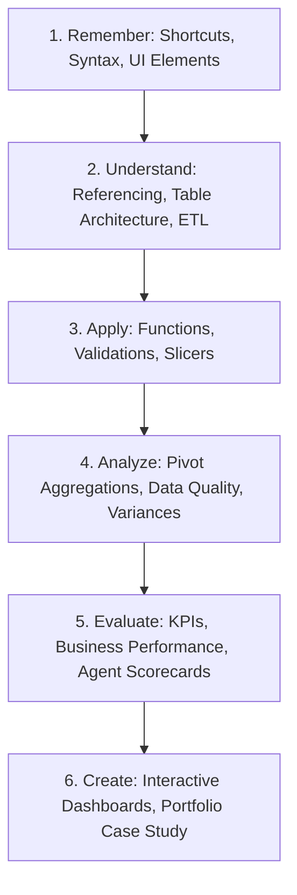

# 🎯 Course Learning Objectives & Competency Matrix

> [!abstract] Pedagogical Grounding
> These learning objectives are structured according to Bloom's Revised Taxonomy, ensuring progression from foundational understanding to creative synthesis and executive communication.

---

## Competency Level Breakdown

### 1. Remember & Understand
- Identify all primary interface components of Microsoft Excel (Ribbon, Formula Bar, Name Box, Status Bar).
- Articulate the mechanical difference between relative (`A1`), absolute (`$A$1`), and mixed (`$A1`, `A$1`) cell referencing.
- Differentiate between standard cell ranges and formal Excel Tables (`ListObjects`).
- Explain the role of the six dimensions of data quality in business decision-making.

### 2. Apply & Execute
- Write syntactically correct multi-condition formulas using `SUMIFS`, `COUNTIFS`, and `AVERAGEIFS`.
- Implement robust lookup pipelines using modern `XLOOKUP` with custom fallback handling.
- Build clean data entry controls using Data Validation rules (lists, numerical ranges, custom formulas).
- Automate data transformations in Power Query using the graphical interface and M scripts.

### 3. Analyze & Evaluate
- Construct multi-dimensional analytical summaries using Pivot Tables with calculated fields and `Show Values As`.
- Audit messy datasets for missing values, structural duplicates, and data type inconsistencies.
- Derive actionable business insights from customer service logs (identifying abandoned call patterns, agent performance bottlenecks, topic distribution).

### 4. Create & Synthesize
- Architect an executive-grade Business Intelligence dashboard featuring synchronized Slicers, KPI cards, and dynamic visual indicators.
- Package analytical findings into a professional portfolio case study ready for recruiter and client presentation.
