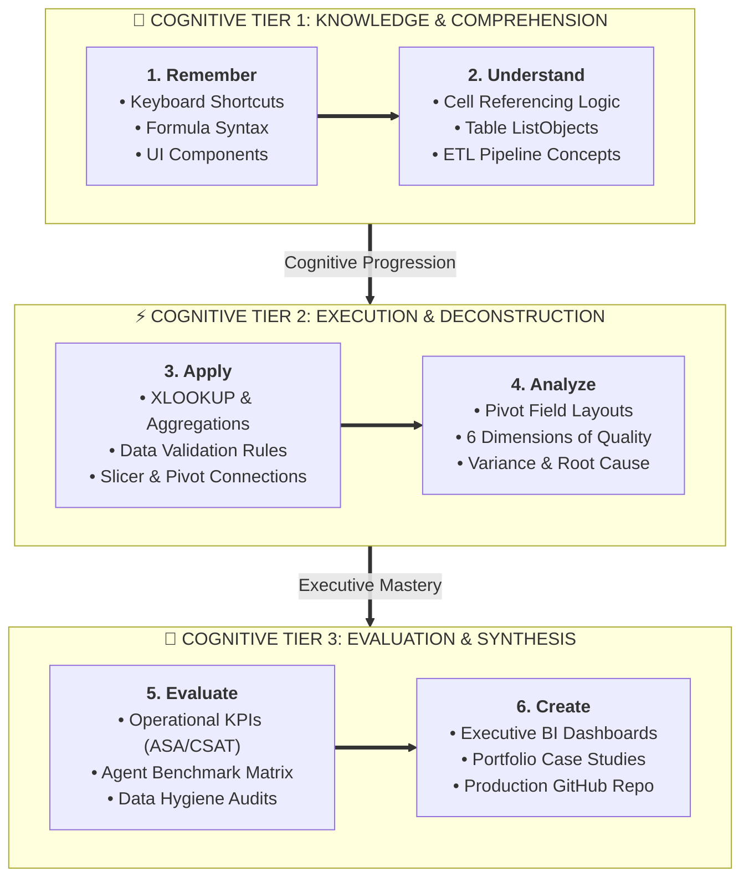

# 🎯 Course Learning Objectives & Competency Matrix

> [!abstract] Pedagogical Grounding
> These learning objectives are structured according to Bloom's Revised Taxonomy, ensuring progression from foundational understanding to creative synthesis and executive communication.

---

## Competency Level Breakdown

### 1. Remember & Understand
- Identify all primary interface components of Microsoft Excel (Ribbon, Formula Bar, Name Box, Status Bar).
- Articulate the mechanical difference between relative (`A1`), absolute (`$A$1`), and mixed (`$A1`, `A$1`) cell referencing.
- Differentiate between standard cell ranges and formal Excel Tables (`ListObjects`).
- Explain the role of the six dimensions of data quality in business decision-making.

### 2. Apply & Execute
- Write syntactically correct multi-condition formulas using `SUMIFS`, `COUNTIFS`, and `AVERAGEIFS`.
- Implement robust lookup pipelines using modern `XLOOKUP` with custom fallback handling.
- Build clean data entry controls using Data Validation rules (lists, numerical ranges, custom formulas).
- Automate data transformations in Power Query using the graphical interface and M scripts.

### 3. Analyze & Evaluate
- Construct multi-dimensional analytical summaries using Pivot Tables with calculated fields and `Show Values As`.
- Audit messy datasets for missing values, structural duplicates, and data type inconsistencies.
- Derive actionable business insights from customer service logs (identifying abandoned call patterns, agent performance bottlenecks, topic distribution).

### 4. Create & Synthesize
- Architect an executive-grade Business Intelligence dashboard featuring synchronized Slicers, KPI cards, and dynamic visual indicators.
- Package analytical findings into a professional portfolio case study ready for recruiter and client presentation.

---

### 5. AI-Assisted Excel Analytics Competencies
By the end of the AI-assisted analytics track, an analyst will be able to:
1. **Install Approved Tools**: Successfully deploy verified Excel AI add-ins via Microsoft AppSource.
2. **Identify Publisher & Product**: Accurately distinguish third-party add-ins (e.g. GPT for MS Excel by Twistly) from foundation providers (OpenAI) and official native tools (Claude for Excel by Anthropic).
3. **Analyze Capabilities & Limits**: Explain precisely what each AI tool can and cannot do without exaggerating capabilities.
4. **Engineer Structured Prompts**: Write constrained, context-rich Excel prompts following professional templates.
5. **Generate Formula Logic**: Formulate modern dynamic array and multi-condition formulas with AI acceleration.
6. **Debug Error Codes**: Rapidly diagnose root causes of `#VALUE!`, `#N/A`, `#SPILL!`, and `#REF!` errors using AI assistants.
7. **Accelerate Data Cleaning**: Leverage AI to propose regex, text-cleansing formulas, and Power Query transformation steps.
8. **Explore Datasets**: Formulate rapid data profiling, grain identification, and exploratory hypotheses using AI.
9. **Brainstorm KPIs & Visuals**: Synthesize relevant operational metrics, ratios, and visual chart types for business domains.
10. **Validate Calculations Empirically**: Execute rigorous manual verification checklists against AI-generated outputs.
11. **Identify AI Hallucinations**: Detect subtle AI calculation errors, unstated assumptions, and improper imputation advice.
12. **Reproduce Solutions Manually**: Rebuild any AI-assisted spreadsheet solution completely by hand using native Excel.
13. **Explain Calculation Mechanics**: Clearly articulate the underlying Excel calculation engine mechanics to stakeholders without referencing AI.
14. **Enforce Privacy & Governance**: Apply enterprise security decision gates and data anonymization before transmitting spreadsheet data.
15. **Incorporate AI Responsibly**: Integrate AI tools seamlessly into a professional, auditable, high-velocity analytics lifecycle.

