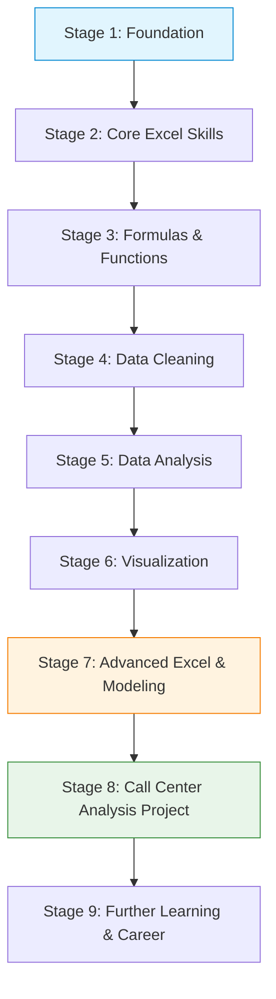

# 🗺️ Supplementary Learning Path: Modern Excel Data Analytics

## Overview
This curated progression integrates core masterclass lectures with supplementary resources, visual blueprints, and advanced practice drills from the Gemini Notebook. It structures the 8-hour learning journey into 9 clear phases, progressing from interface literacy to enterprise portfolio artifacts.

---

## Stage-by-Stage Curriculum Roadmap

### Stage 1: Foundation (Interface & Workbook Architecture)
- **Recommended Resource**: [[Excel Interface Blueprint]] (PDF Guide) + [[01_Excel_Interface_and_GUI]]
- **Why It Is Useful**: Establishes fluent ribbon navigation, formula bar management, and Status Bar telemetry without mouse dependency.
- **Prerequisite**: None.
- **Expected Outcome**: Instant familiarity with Excel 365 GUI layout, backstage settings, and shortcut keys.
- **Requirement Level**: `Required`

---

### Stage 2: Core Excel Skills (Data Management & Tables)
- **Recommended Resource**: [[Excel Tables]] + [[01_Data_Types_and_Formatting]] + [[Ex01_Data_Management_and_Formatting]]
- **Why It Is Useful**: Prevents format corruption, masters Flash Fill, and adopts structured tables (`ListObject`) as the default data container.
- **Prerequisite**: Stage 1.
- **Expected Outcome**: Ability to convert raw ranges into auto-expanding structured tables with calculated column inheritance.
- **Requirement Level**: `Required`

---

### Stage 3: Formulas & Functions (Analytical Calculations)
- **Recommended Resource**: [[XLOOKUP and Modern Lookups]] + [[04_Lookup_and_Reference_Functions]] + [[Dynamic Arrays and Modern Calculation]]
- **Why It Is Useful**: Replaces fragile `VLOOKUP` with bidirectional `XLOOKUP`, learns `SUMIFS`/`COUNTIFS` multi-condition aggregations, and unlocks dynamic spill arrays.
- **Prerequisite**: Stage 2.
- **Expected Outcome**: Robust formula authoring with native error trapping and automated spill outputs (`#`).
- **Requirement Level**: `Required`

---

### Stage 4: Data Cleaning (Data Quality & Ingestion)
- **Recommended Resource**: [[Power Query ETL Transformations]] + [[Six Dimensions of Data Quality]] + [[01_Data_Quality_Dimensions_and_Audit]]
- **Why It Is Useful**: Introduces auditable, non-destructive data preparation, column unpivoting, and forensic auditing for missing data.
- **Prerequisite**: Stage 3.
- **Expected Outcome**: Ability to build automated ETL ingestion queries that refresh cleanly upon receiving new data feeds.
- **Requirement Level**: `Required`

---

### Stage 5: Data Analysis (Pivot Tables & Aggregations)
- **Recommended Resource**: [[Pivot Tables]] + [[01_Pivot_Table_Foundations]] + [[Ex04_Pivot_Table_Summaries]]
- **Why It Is Useful**: Rapid multidimensional summarization, custom calculations ("% of Column Total"), and grouping by time periods.
- **Prerequisite**: Stage 4.
- **Expected Outcome**: Instant generation of cross-tabular executive summaries without writing complex cell formulas.
- **Requirement Level**: `Required`

---

### Stage 6: Visualization (Charts & Dashboard Design)
- **Recommended Resource**: [[Executive Dashboard Design Principles]] + [[01_Visual_Analytics_and_Chart_Selection]] + [[Slicers and Timelines]]
- **Why It Is Useful**: Enforces visual hierarchy, removes chart clutter, synchronizes interactive slicers across reports, and implements one-click reset macros.
- **Prerequisite**: Stage 5.
- **Expected Outcome**: Production of a publication-ready single-page dashboard featuring KPI cards and interactive charts.
- **Requirement Level**: `Recommended`

---

### Stage 7: Advanced Excel (Data Modeling, Power Pivot & DAX)
- **Recommended Resource**: [[DAX Measures and Data Modeling]] + [[Analytics Pipeline Comparison]] + [[01_Dimensional_Modeling_Principles]]
- **Why It Is Useful**: Transitions the analyst from flat single-sheet tables to relational star schemas with explicit DAX measures computed in-memory.
- **Prerequisite**: Stages 4, 5, and 6.
- **Expected Outcome**: Construction of relational models connecting Fact and Dimension tables with safe `DIVIDE` and `CALCULATE` measures.
- **Requirement Level**: `Recommended`

---

### Stage 8: Capstone Project (PwC Call Center Performance Analysis)
- **Recommended Resource**: [[Call Center KPI Analytics]] + [[06_Projects/Call Center Performance Analysis/Project Overview]] + [[06_Projects/Call Center Performance Analysis/KPIs]]
- **Why It Is Useful**: Applies every acquired skill to a real-world 5,000-record consulting dataset, analyzing call resolution, queue wait times, and CSAT drivers.
- **Prerequisite**: Stages 1 through 7.
- **Expected Outcome**: Completed executive dashboard, data quality audit document, and stakeholder recommendation report.
- **Requirement Level**: `Required`

---

### Stage 9: Further Learning & Career (Portfolio & Enterprise Stack)
- **Recommended Resource**: [[10_Portfolio/Call Center Analysis Portfolio Case Study]] + [[Enterprise Architecture Mindmap]] + [[08_Revision/Interview Questions]]
- **Why It Is Useful**: Prepares the learner for senior data analyst technical interviews, GitHub portfolio presentation, and transition to Power BI/SQL.
- **Prerequisite**: Stage 8.
- **Expected Outcome**: Confident communication of analytical methodology, metric trade-offs, and technical problem-solving to hiring managers.
- **Requirement Level**: `Optional` / `Reference`
