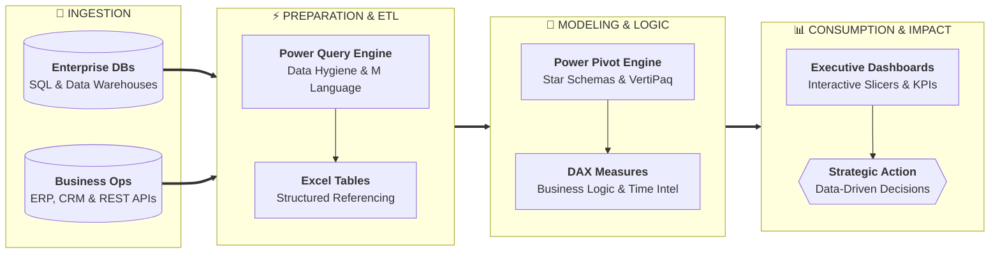

# Lesson 1.2: The Modern Data Analytics Ecosystem & Analyst Roadmaps

> [!abstract] Learning Objective
> Contextualize Microsoft Excel within the enterprise Business Intelligence (BI) ecosystem and understand the core competencies expected of modern data analysts.

> 🎥 **Video Chapter**: [Chapter 1 – Excel Introduction & GUI (0:00)](https://www.youtube.com/watch?v=uv1bxe2gdnU)

## Why This Matters
Excel is not an isolated tool; it acts as the bridge between raw database extracts, business operational systems (ERP, CRM), and executive decision-making. Knowing when to use Excel versus SQL or Power BI is a hallmark of a senior analyst.

## Core Concepts
- **Descriptive Analytics**: What happened? (Summary statistics, historical sales reporting).
- **Diagnostic Analytics**: Why did it happen? (Variance analysis, drill-downs, root-cause investigation).
- **The Modern Analytics Stack**:
  - *Excel*: Ad-hoc modeling, quick turnaround analysis, flexible financial modeling.
  - *SQL*: Querying large-scale relational databases, extracting tabular subsets.
  - *Power BI / Tableau*: Enterprise-wide interactive reporting, automated cloud refreshes.
  - *Python / R*: Advanced statistical inference, machine learning, large-scale automation.
- **Data Analyst Core Competencies**: Business acumen, data literacy, data cleaning, statistical fluency, and visual storytelling.

## Related Knowledge
- Concepts: [[Data Analysis Life Cycle]], [[Dashboard Design Principles]]
- Reference: [[Glossary]]

## Self-Test & Interview Questions
1. *When should an analyst use Excel instead of a specialized BI tool like Power BI?* (For rapid prototyping, ad-hoc data reconciliation, flexible modeling, and scenarios requiring customized cell-level calculation logic).
2. *What are the 4 stages of analytical maturity?* (Descriptive, Diagnostic, Predictive, Prescriptive).
