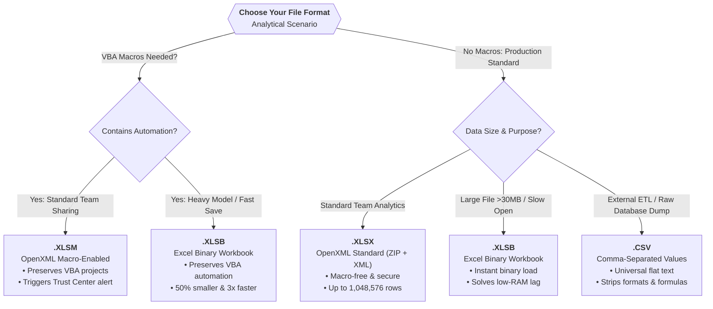

# Lesson 2.6: Excel File Formats & Extensions: XLSX, XLSM, XLSB, and CSV

> [!abstract] Learning Objective
> Master the architectural distinctions, performance characteristics, macro security constraints, and storage tradeoffs between the four primary spreadsheet file types: **XLSX**, **XLSM**, **XLSB**, and **CSV**.

> 🎥 **Video Chapter**: [Chapter 2 – Data Management (16:05)](https://www.youtube.com/watch?v=uv1bxe2gdnU&t=965s)

---

## 📌 The Four Core Formats at a Glance

| File Format | Full Extension Name | Underlying Architecture | Primary Analytical Role | VBA Macro Support |
| :--- | :--- | :--- | :--- | :---: |
| **`.xlsx`** | Excel OpenXML Workbook | Compressed ZIP of XML files | Default modern standard; macro-free and secure | ❌ Stripped on Save |
| **`.xlsm`** | Macro-Enabled Workbook | OpenXML + Binary VBA Project | Preserves VBA code, UserForms, and automation scripts | ✅ Fully Supported |
| **`.xlsb`** | Excel Binary Workbook | Pure Proprietary Binary Stream | 50% smaller file size, 2–4x faster load time for massive models | ✅ Fully Supported |
| **`.csv`** | Comma-Separated Values | Plain Text (ASCII / UTF-8) | Universal flat data interchange for SQL, Python, and Power Query | ❌ Plain Text Only |

---

## 🎯 Why This Matters in Commercial Analytics

Selecting the wrong file extension can permanently destroy your work, compromise security, or throttle computer performance:
1. **The Macro-Stripping Trap**: If you write hours of VBA automation code in an `.xlsx` workbook and hit Save, **Excel permanently strips away all macros** without recovery.
2. **The Spreadsheet Lag Barrier**: Large enterprise workbooks (50MB+, 100,000+ formula rows) that freeze in `.xlsx` load up to **4x faster** and take **50% less disk space** when converted to `.xlsb`.
3. **ETL Pipeline Ingestion**: Modern data tools (SQL databases, Python Pandas, Power BI, Power Query) require flat, lightweight `.csv` files for data ingestion, avoiding proprietary formatting overhead.

---

## 🔬 Architectural Deep Dive



### 1. `XLSX` (Excel OpenXML Spreadsheet) — *The Default Format*
- **Architecture**: A compressed ZIP archive containing human-readable XML files (schemas, styles, worksheets, shared strings).
- **Introduced**: Office 2007 (replacing the legacy 65,536-row binary `.xls`).
- **Capacity**: 1,048,576 rows by 16,384 columns per worksheet.
- **Security Rule**: **Macro-free by design**. It cannot harbor executable VBA code, making it safe for email transmission across corporate firewalls.
- **Best For**: 90% of day-to-day financial models, analytical reports, dashboards, and shared team workbooks.

### 2. `XLSM` (Excel OpenXML Macro-Enabled Spreadsheet) — *The Automation Format*
- **Architecture**: Same OpenXML ZIP structure as `.xlsx`, but explicitly includes the `vbaProject.bin` binary stream.
- **Security Rule**: Triggers the Excel Trust Center security warning bar (*"Macros have been disabled. Enable Content"*).
- **Critical Caveat**: If you save an `.xlsm` file containing macros as an `.xlsx` file, Excel displays a warning:
  > *"The following features cannot be saved in macro-free workbooks: VB project. To save a file with these features, click No, and then choose a macro-enabled file type in the File Type list."*
  If you click **Yes**, all VBA code is irrevocably erased!
- **Best For**: Automated reporting engines, custom user forms, macro utility toolkits, and legacy VBA data scrapers.

### 3. `XLSB` (Excel Binary Workbook) — *The High-Velocity Performance Format*
- **Architecture**: Instead of verbose XML text files, sheets and data are compiled into compressed **binary records** (`BIFF12`).
- **Performance Benefits**:
  - **File Size**: Typically **50% to 75% smaller** than `.xlsx`.
  - **Save/Open Velocity**: Opens and saves **2x to 4x faster** because Excel doesn't need to parse and serialize millions of XML text tags.
  - **Macro Compatible**: Fully supports VBA macros without needing a separate extension!
- **Limitations**: Third-party tools (like web-based SaaS apps or Python libraries expecting pure XML) may not natively parse binary records.
- **Best For**: Massive datasets (100,000+ to 1,000,000 rows), complex financial models with heavy calculation load, and resolving low-RAM computer freezing.

### 4. `CSV` (Comma-Separated Values) — *The Data Set Format*
- **Architecture**: Raw, uncompressed plain text. Each line is a data row; columns are separated by a delimiter (comma `,` or semicolon `;`).
- **What CSV Strips Out**:
  - ❌ No multiple worksheets (only saves the active sheet).
  - ❌ No cell formatting (fonts, bold, colors, borders are discarded).
  - ❌ No formulas (only the calculated static text results are saved).
  - ❌ No Pivot Tables, charts, shapes, or slicers.
- **Superstore Example**: The [[Sample Superstore Dataset Documentation]] (`Sample_Superstore_Full.csv`) is distributed as a CSV because it represents pure tabular transaction data meant for universal loading into Excel, Power BI, Python, or SQL databases.
- **Best For**: Data exports from ERP/CRM systems, database dump ingestion, Power Query pipelines, and cross-platform data exchange.

---

## 📊 Comprehensive Comparison Matrix

| Attribute | `XLSX` | `XLSM` | `XLSB` | `CSV` |
| :--- | :---: | :---: | :---: | :---: |
| **Primary Descriptor** | Default Format | Macro Format | Fast / Compact | Raw Data Set |
| **Underlying Tech** | Compressed XML | Compressed XML + VBA | Binary (`BIFF12`) | Plain Text |
| **Supports VBA Macros?** | ❌ Strictly No | ✅ Yes | ✅ Yes | ❌ Strictly No |
| **Supports Formulas?** | ✅ Yes | ✅ Yes | ✅ Yes | ❌ Values Only |
| **Supports Multiple Sheets?** | ✅ Yes | ✅ Yes | ✅ Yes | ❌ Single Sheet Only |
| **Relative File Size** | Moderate (100%) | Moderate (100%) | **Smallest (25%–50%)** | Variable |
| **Open / Save Speed** | Standard | Standard | **Fastest (2x–4x)** | Instant (Text) |
| **Security Risk Level** | Low (Macro-safe) | High (Requires Trust) | High (Contains code) | None (Pure text) |
| **Power Query Ingestion** | Supported | Supported | Supported | **Native / Ideal** |

---

## 🛠️ Step-by-Step: Changing File Formats in Excel

1. Open your workbook in Excel.
2. Press **`F12`** to open the **Save As** dialog directly (much faster than `File > Save As`).
3. Click the **Save as type** dropdown:
   - Choose **Excel Workbook (*.xlsx)** for standard team sharing.
   - Choose **Excel Macro-Enabled Workbook (*.xlsm)** if you wrote VBA code.
   - Choose **Excel Binary Workbook (*.xlsb)** if your file is sluggish or over 30 MB.
   - Choose **CSV (Comma delimited) (*.csv)** to export flat data to external databases.
4. Click **Save**.

```text
[F12] ➔ Save As Dialog ➔ Save as type:
 ├── Excel Workbook (*.xlsx)
 ├── Excel Macro-Enabled Workbook (*.xlsm)
 ├── Excel Binary Workbook (*.xlsb)
 └── CSV (Comma delimited) (*.csv)
```

---

## ⚠️ Common Mistakes & Critical Edge Cases

> [!WARNING] The CSV Double-Click Trap
> When you double-click a `.csv` file in Windows, Excel opens it and auto-formats columns. Leading zeros (e.g. US Zip Code `02134`) are silently truncated into integers (`2134`), and date formats can be corrupted based on regional settings. 
> **Best Practice**: Never double-click raw CSVs for analysis. Instead, open a blank `.xlsx` and import via **Data > Get Data > From Text/CSV** using Power Query!

> [!CAUTION] The "Accidental CSV Save" Disaster
> If you open a `.csv` file, spend 3 hours building VLOOKUPs, Pivot Tables, and charts, and press `Ctrl + S`, Excel saves it as a CSV. When you close and reopen the file, **all formulas, multiple tabs, and charts are permanently gone!** Always immediately `F12` save as `.xlsx` before designing reports.

---

## 🧪 Practice & Application Drills

- [x] **Level 1 (Recall)**: Name the 4 primary extensions and their 1-word role (`XLSX = Default`, `XLSM = Macro`, `XLSB = Fast`, `CSV = Data Set`). ✅ 2026-09-28
- [x] **Level 2 (Application)**: Take `09_Source_Materials/Module 2/Sample_Superstore_Full.csv`. Open it in Excel, save it as `XLSX` inside `11_Demos_and_Workbooks/02_Data_Management/`, and check the file size change. ✅ 2026-09-28
- [x] **Level 3 (Real-World Stress Test)**: If a corporate financial consolidation model with 500,000 formulas takes 45 seconds to open in `.xlsx`, convert it to `.xlsb` using `F12`. Benchmark the new load time and file size reduction. ✅ 2026-09-28

---

## 🔗 Related Knowledge
- Notes: [[01_Data_Types_and_Formatting]], [[04_Data_Transformation_Tools]]
- Concepts: [[Power Query]], [[Six Dimensions of Data Quality]]
- Datasets: [[Sample Superstore Dataset Documentation]]
- Student Hub: [[11_Demos_and_Workbooks/README|Student Demos & Workbooks]]

---

## ❓ Self-Test & Interview Questions

### Self-Test Questions
1. *Why does Excel prevent saving VBA macros in standard `.xlsx` files?*  
   **Answer**: Security. By enforcing the `.xlsm` extension for macros, system administrators and users can filter and identify potentially malicious macro-enabled files before opening them.
2. *If an Excel file contains 3 tabs ("Orders", "Returns", "People"), what happens if you save it as CSV?*  
   **Answer**: Excel only saves the currently active tab. The other two tabs and all formatting/formulas are permanently discarded.
3. *Why would an enterprise analyst convert an `.xlsx` model into `.xlsb`?*  
   **Answer**: To reduce disk space by up to 50-70% and accelerate opening and saving speeds by 2-4x through binary encoding.

### Senior Data Analyst Interview Questions
1. *"You are designing an automated ETL data pipeline between an AWS S3 data lake, SQL Server, and business users in Excel. Which format do you choose for the data lake export and why?"*  
   **Answer**: CSV (or Parquet/JSON upstream) for the data lake export because CSV is vendor-neutral, lightweight, and universally ingestible across all platforms without Microsoft Office runtime dependencies. The business user consumes it via Power Query into an `.xlsx` or `.xlsb` analytical layer.
2. *"A junior analyst accidentally saved an automation workbook as `.xlsx` instead of `.xlsm`. Can the VBA macros be recovered from the `.xlsx` file?"*  
   **Answer**: No. The OpenXML specification for `.xlsx` strictly disallows the `vbaProject.bin` stream, so Excel strips and deletes the code during serialization. Recovery is only possible from backup versions, OneDrive version history, or autosave caches.
