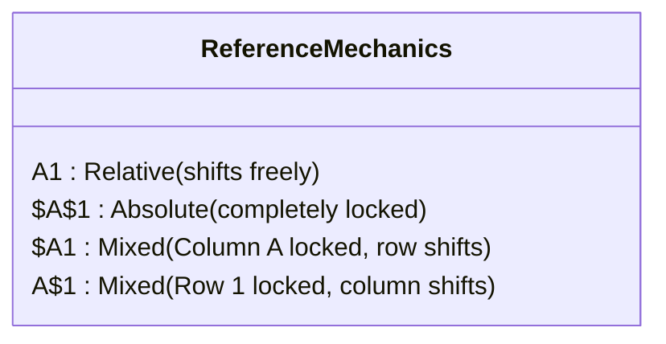

# Lesson 3.1: Formula Architecture & Cell Referencing Mechanics

> [!abstract] Learning Objective
> Master the mechanical distinction between Relative, Absolute, and Mixed cell referencing to construct scalable, reusable formulas across 2D grids.

> 🎥 **Video Chapter**: [Chapter 3 – Excel Formulas & Functions (1:38:56)](https://www.youtube.com/watch?v=uv1bxe2gdnU&t=5936s)

## Why This Matters
Cell referencing errors are the single greatest cause of financial and operational modeling failures. Understanding how references shift when dragged across rows and columns guarantees scalable formulas.

## Core Concepts
- **Relative Reference (`A1`)**: Position-relative. When dragged down one row, it becomes `A2`. When dragged right one column, it becomes `B1`.
- **Absolute Reference (`$A$1`)**: Locked coordinate. The `$` before the column letter locks the column; the `$` before the row number locks the row.
- **Mixed References**:
  - `$A1`: Column locked, row relative. Ideal for side headers in multiplication tables.
  - `A$1`: Column relative, row locked. Ideal for top headers in summary tables.

## Reference Types Breakdown

## Step-by-Step: The F4 Toggle
1. Type `=A1` in a formula.
2. Press `F4` once: `$A$1` (Absolute).
3. Press `F4` twice: `A$1` (Row locked).
4. Press `F4` three times: `$A1` (Column locked).
5. Press `F4` four times: `A1` (Relative).

## Related Knowledge
- Concepts: [[Relative vs Absolute References]], [[Structured References]]
- Practice: [[Ex02_Formulas_and_Lookup_Logic]]
