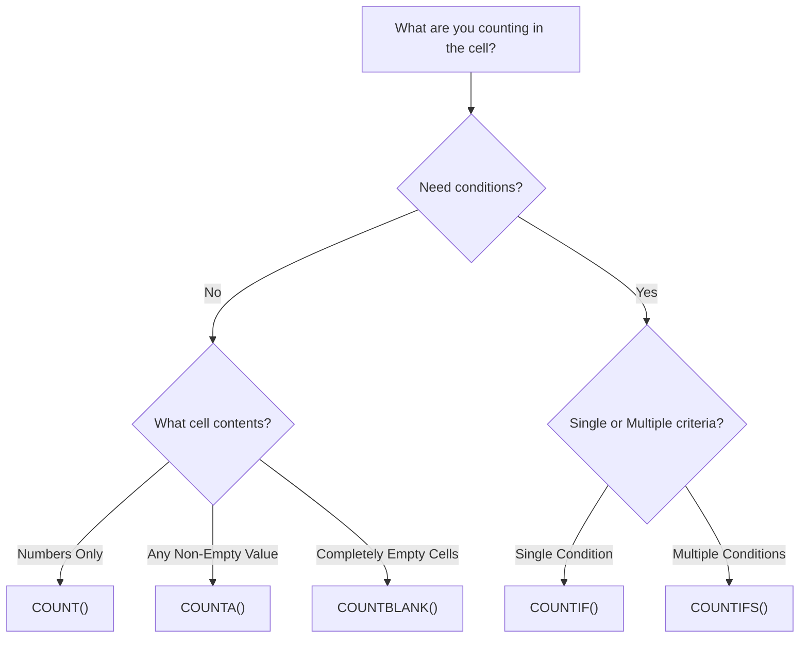

# Lesson 3.2: Aggregations, Counting & Multi-Condition Logic

> [!abstract] Learning Objective
> Master arithmetic math operations (`PRODUCT`, `QUOTIENT`, `MOD`), fundamental aggregations (`SUM`, `AVERAGE`, `MIN`, `MAX`), precise counting functions (`COUNT`, `COUNTA`, `COUNTBLANK`), and multi-condition analytical filters (`SUMIF`, `SUMIFS`, `COUNTIF`, `COUNTIFS`, `AVERAGEIFS`).

> 🎥 **Video Chapter**: [Chapter 3 – Excel Formulas & Functions (1:38:56)](https://www.youtube.com/watch?v=uv1bxe2gdnU&t=5936s)

---

## 1. Arithmetic & Math Functions

| Function | Syntax | Mathematical Definition | Key Analytical Use Case |
| :--- | :--- | :--- | :--- |
| **`SUM`** | `=SUM(number1, [number2], ...)` | $\sum x$ | Totaling columns or adjacent row expressions (`=SUM(B3+A3)`). |
| **`PRODUCT`** | `=PRODUCT(number1, [number2], ...)` | $\prod x$ | Compounding rates, unit price $\times$ quantity $\times$ tax factors. |
| **`QUOTIENT`** | `=QUOTIENT(numerator, denominator)` | $\lfloor \frac{\text{num}}{\text{den}} \rfloor$ | Integer division (discards the fractional remainder). Packaging batches or full cartons. |
| **`MOD`** | `=MOD(number, divisor)` | $\text{num} \pmod{\text{div}}$ | Remainder of division. Alternating row shading (`=MOD(ROW(), 2)=0`), time/shift rollover, inventory units left over. |
| **`POWER`** | `=POWER(number, power)` | $x^y$ | Exponential growth, CAGR calculations, compound interest models. |

---

## 2. Statistical Aggregations

- `=AVERAGE(range)`: Arithmetic mean ($\bar{x} = \frac{\sum x}{n}$). Automatically ignores empty cells and text strings.
- `=MIN(range)`: Finds the minimum numeric value in a dataset.
- `=MAX(range)`: Finds the maximum numeric value in a dataset.

---

## 3. Counting Logic: Choosing the Right Function

Understanding what each counting function detects is critical for accurate KPIs and denominator calculations:



| Function | What it Counts | Ignores | Edge Case Caveat |
| :--- | :--- | :--- | :--- |
| **`COUNT(range)`** | Numbers, dates, numeric formulas | Text, empty cells, logicals, errors | Ignores numbers formatted as text. |
| **`COUNTA(range)`** | Any non-empty cell (text, numbers, booleans, error codes) | Empty cells | Counts `""` (empty strings returned by formulas). |
| **`COUNTBLANK(range)`** | Empty cells and cells with formula-generated `""` | Non-blank cells | Formula returning `""` counts as blank. |
| **`COUNTIF(range, criteria)`** | Cells satisfying 1 condition | Cells not matching | Wildcards `*` and `?` supported. |
| **`COUNTIFS(crit_range1, crit1, ...)`** | Cells satisfying all conditions (AND logic) | Non-matching rows | Criteria ranges must be identical dimensions. |

---

## 4. Conditional Aggregations: Single vs Multi-Condition

```excel
=SUMIF(criteria_range, criteria, [sum_range])
=SUMIFS(sum_range, criteria_range1, criteria1, [criteria_range2, criteria2], ...)
=COUNTIFS(criteria_range1, criteria1, [criteria_range2, criteria2], ...)
=AVERAGEIFS(average_range, criteria_range1, criteria1, ...)
```

> [!important] The SUMIFS vs SUMIF Syntax Trap
> - In single-condition `SUMIF(criteria_range, criteria, [sum_range])`, the `sum_range` comes **last** (and is optional if the criteria range itself is summed).
> - In multi-condition `SUMIFS(sum_range, criteria_range1, criteria1, ...)`, the `sum_range` comes **first**!
> - **Best Practice Rule**: Default to `SUMIFS` even for single conditions to keep syntax habits consistent and future-proof.

---

## 5. Practical Implementation Examples

### Example A: Call Center Answer Rate
To calculate total answered calls by Agent "Diane":
```excel
=COUNTIFS(CallData[Agent], "Diane", CallData[Answered (Y/N)], "Y")
```

### Example B: Modulo Batching
To identify items remaining after packaging into 12-unit cartons:
```excel
=MOD(B3, 12)
```

---

## Related Knowledge
- **Formulas**: [[SUM]], [[SUMIFS]], [[AVERAGE]], [[AVERAGEIFS]], [[COUNT]], [[COUNTA]], [[COUNTIFS]]
- **Concepts**: [[Relative vs Absolute References]], [[Structured References]]
- **Practice**: [[Ex02_Formulas_and_Lookup_Logic]]
- 📂 **Personal Workbook Demo**: [`11_Demos_and_Workbooks/03_Formulas_and_Functions/Formulas_&_Functions_Part_1.xlsx`](file:///d:/courses/Data%20Analysis%2026-27/7-Introducation%20to%20Data%20Fields%20%28Excel%29/11_Demos_and_Workbooks/03_Formulas_and_Functions/Formulas_&_Functions_Part_1.xlsx)
  - Tab **`Arithmetic and statistical`**: Hands-on formula practice for `SUM`, `SUM_IF`, `SUM_IFS`, `MIN`, `MAX`, `AVERAGE` (mean), `PRODUCT`, `QUOTIENT`, `MOD`, and `POWER`.
  - Tab **`Counting `**: Practical comparative drills implementing `COUNT`, `COUNTA`, `COUNTBLANK`, `COUNTIF`, and `COUNTIFS`.
