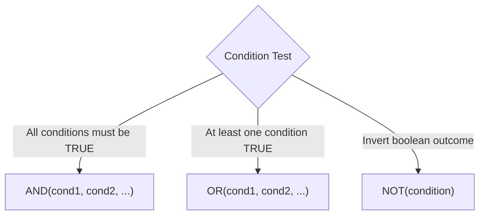

# Lesson 3.3: Conditional Logic, Boolean Evaluation & Error Handling

> [!abstract] Learning Objective
> Build robust decision trees and defensive calculations using `IF`, `IFS`, `SWITCH`, compound Boolean logic (`AND`, `OR`, `NOT`), defensive error trapping (`IFERROR`, `IFNA`), and diagnose the 7 master Excel error types.

> 🎥 **Video Chapter**: [Chapter 3 – Excel Formulas & Functions (1:38:56)](https://www.youtube.com/watch?v=uv1bxe2gdnU&t=5936s)

---

## 1. Core Conditional Functions & Syntax

| Function | Syntax | Description & Behavioral Rules |
| :--- | :--- | :--- |
| **`IF`** | `=IF(logical_test, val_if_true, [val_if_false])` | Binary branching test. If `val_if_false` is omitted and condition is `FALSE`, returns boolean `FALSE`. |
| **`IFS`** | `=IFS(test1, val1, [test2, val2], ...)` | Multi-condition evaluation in sequential order. Stops at the **first** `TRUE` condition. Always append `TRUE, fallback_val` as final default. |
| **`SWITCH`** | `=SWITCH(expression, val1, result1, [default])` | Evaluates a single expression against an exact list of values and returns matching result. Cleaner than nested `IF`s for category mapping. |
| **`IFERROR`** | `=IFERROR(value, value_if_error)` | Traps **any** formula error (`#DIV/0!`, `#N/A`, `#VALUE!`, `#REF!`, etc.) and substitutes a safe fallback. |
| **`IFNA`** | `=IFNA(value, value_if_na)` | Traps **only** `#N/A` errors (e.g. missing lookup keys) while letting real mathematical or reference bugs break through for visibility. |

---

## 2. Compound Boolean Logic: AND, OR, NOT



- **`AND(logical1, [logical2], ...)`**: Returns `TRUE` if **all** arguments evaluate to `TRUE`.
- **`OR(logical1, [logical2], ...)`**: Returns `TRUE` if **any** argument evaluates to `TRUE`.
- **`NOT(logical)`**: Inverts the logical state (`TRUE` $\rightarrow$ `FALSE`, `FALSE` $\rightarrow$ `TRUE`).

### Practical Workbook Combination Drill:
From `Formulas_&_Functions_Part_2.xlsx` (Sheet `Logical `):
```excel
=OR(C27 > 80, C28 > 80)
=NOT(OR(C27 > 80, C28 > 80))
```

---

## 3. The 7 Master Excel Errors Audit Table

Understanding the root cause of Excel calculation errors is an essential data analyst competency:

| Error Code | Error Name | Root Technical Cause | Demonstration Example | Defensive Prevention Strategy |
| :---: | :--- | :--- | :--- | :--- |
| **`#DIV/0!`** | Division by Zero | A formula attempts to divide a number by `0` or an empty cell. | `=C27 / 0` or `=A1 / B1` (where `B1` is blank) | `=IF(B1=0, 0, A1/B1)` or `=IFERROR(A1/B1, 0)` |
| **`#VALUE!`** | Wrong Data Type | Mathematical operator applied to non-numeric text. | `="Ahmed" + 5` | Clean text with `VALUE()` or audit data types |
| **`#NAME?`** | Unrecognized Name | Misspelled function name, missing quotes around text, or invalid named range. | `=SUUM(A1:A5)` or `=IF(A1=Cairo, 1, 0)` | Check formula spelling and wrap strings in quotes (`"Cairo"`) |
| **`#REF!`** | Invalid Cell Reference | Cell, row, column, or worksheet referenced by the formula was deleted. | `=A1 + B1` after deleting Column B | Use Excel Tables with structured references or restore deleted columns |
| **`#N/A`** | Not Available | Lookup function cannot locate the search key in the lookup array. | `=VLOOKUP(5, A1:B3, 2, FALSE)` (when `5` is missing) | Wrap with `=IFNA(VLOOKUP(...), "Not Found")` or use `XLOOKUP(..., "Not Found")` |
| **`#NUM!`** | Invalid Numeric Value | Number is too large/small for Excel ($>10^{308}$) or mathematically invalid (e.g. square root of negative). | `=POWER(1000, 1000)` or `=SQRT(-4)` | Validate numeric inputs, check calculation limits |
| **`#NULL!`** | Null Intersection | Space operator used between two cell ranges that do not intersect. | `=SUM(F54 G54)` (missing comma `,`) | Replace inadvertent space with comma `,` or colon `:` |

---

## 4. Practical Implementation Patterns

### Pattern A: Employee Performance Tier
From `Formulas_&_Functions_Part_2.xlsx`:
```excel
=IF(C27 > 80, "Ex", "Needs Improvement")
```

### Pattern B: Multi-Tier IFS Scorecard
```excel
=IFS(
    C27 >= 90, "Exceeds Expectations",
    C27 >= 75, "Meets Expectations",
    C27 >= 60, "Needs Improvement",
    TRUE, "Unsatisfactory"
)
```

### Pattern C: Defensive Division with IFERROR
```excel
=IFERROR(CallData[ResolvedCalls] / CallData[AnsweredCalls], 0)
```

---

## Related Knowledge
- **Formulas**: [[IF]], [[IFS]], [[SWITCH]], [[IFERROR]], [[IFNA]], [[AND]], [[OR]], [[NOT]]
- **Concepts**: [[Why Not Always Formulas]], [[Relative vs Absolute References]]
- 📂 **Personal Workbook Demo**: [`11_Demos_and_Workbooks/03_Formulas_and_Functions/Formulas_&_Functions_Part_2.xlsx`](file:///d:/courses/Data%20Analysis%2026-27/7-Introducation%20to%20Data%20Fields%20%28Excel%29/11_Demos_and_Workbooks/03_Formulas_and_Functions/Formulas_&_Functions_Part_2.xlsx)
  - Tab **`Logical `**: Hands-on implementations of `IF`, `IFS`, `IFERROR`, `IFNA`, `AND`, `OR`, `NOT`, `SWITCH`, and the complete 7-error taxonomy audit matrix.
