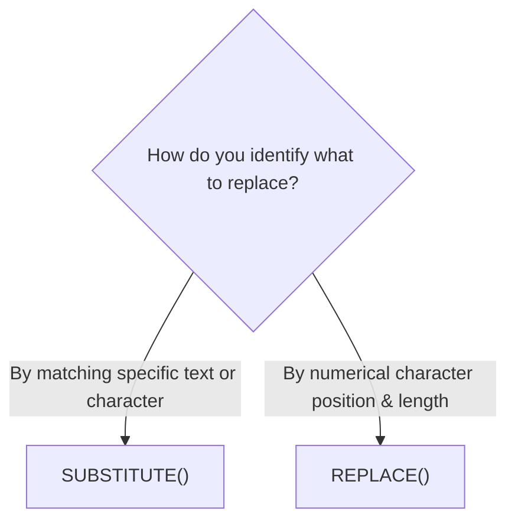

# Lesson 3.5: String Cleansing, Text Parsing & Concatenation

> [!abstract] Learning Objective
> Clean, extract, substitute, search, and assemble text strings using `CONCAT`, `LEFT`, `RIGHT`, `MID`, `LEN`, `TRIM`, `SUBSTITUTE`, `REPLACE`, `FIND`, `SEARCH`, `UPPER`, `LOWER`, `PROPER`, `TEXTJOIN`, and `TEXTSPLIT`.

> 🎥 **Video Chapter**: [Chapter 3 – Excel Formulas & Functions (1:38:56)](https://www.youtube.com/watch?v=uv1bxe2gdnU&t=5936s)

---

## 1. Core Text Functions Overview

| Category | Function | Syntax | Description & Behavioral Rules |
| :--- | :--- | :--- | :--- |
| **Joining** | `CONCAT` | `=CONCAT(text1, [text2], ...)` | Joins multiple strings or cell ranges without inserting delimiters. |
| **Joining** | `TEXTJOIN` | `=TEXTJOIN(delim, ignore_blank, text1, ...)` | Joins strings with a specified separator; can automatically skip empty cells. |
| **Extract** | `LEFT` | `=LEFT(text, [num_chars])` | Returns specified number of characters from the beginning (left) of a string. |
| **Extract** | `RIGHT` | `=RIGHT(text, [num_chars])` | Returns specified number of characters from the end (right) of a string. |
| **Extract** | `MID` | `=MID(text, start_num, num_chars)` | Returns characters from the middle of a string starting at `start_num`. |
| **Length** | `LEN` | `=LEN(text)` | Returns total count of characters, including letters, digits, and all whitespace. |
| **Clean** | `TRIM` | `=TRIM(text)` | Strips leading/trailing spaces and reduces multiple consecutive spaces to one. |
| **Case** | `UPPER` | `=UPPER(text)` | Converts all characters to uppercase (`"CAIRO"`). |
| **Case** | `LOWER` | `=LOWER(text)` | Converts all characters to lowercase (`"cairo"`). |
| **Case** | `PROPER` | `=PROPER(text)` | Converts string to Title Case (capitalizes first letter of each word). |

---

## 2. Dynamic Text Parsing: SUBSTITUTE vs REPLACE

A common interview and practical hurdle is choosing between `SUBSTITUTE` and `REPLACE`:



| Dimension | `SUBSTITUTE` | `REPLACE` |
| :--- | :--- | :--- |
| **Mechanism** | Matches target text content | Targets exact character index/position |
| **Syntax** | `=SUBSTITUTE(text, old_text, new_text, [instance_num])` | `=REPLACE(old_text, start_num, num_chars, new_text)` |
| **Case Sensitivity** | **Case-Sensitive** (`"A"` $\neq$ `"a"`) | N/A (operates on index numbers) |
| **Instance Control** | Can replace all instances or only instance `1`, `2`, etc. | Single fixed position replacement |
| **Best Scenario** | Replacing phone hyphens, swapping currency symbols | Masking credit cards, replacing fixed-width codes |

---

## 3. Substring Locators: FIND vs SEARCH

| Feature | `FIND` | `SEARCH` |
| :--- | :--- | :--- |
| **Case Sensitivity** | **Case-Sensitive** | **Case-Insensitive** |
| **Wildcard Support** | No (`*` and `?` are treated as literal characters) | **Yes** (`*` for any string, `?` for single character) |
| **Return Value** | 1-based character position index | 1-based character position index |
| **Error When Missing**| Returns `#VALUE!` error | Returns `#VALUE!` error |
| **Common Partner** | Combined inside `MID` or `LEFT` for dynamic splitting | Combined inside `ISNUMBER(SEARCH(...))` for keyword flags |

---

## 4. Practical Implementation Patterns

### Pattern A: Standardized Name Cleaning
```excel
=PROPER(TRIM(A2))
```

### Pattern B: Dynamic First Name Extraction
Extracts first name dynamically regardless of length:
```excel
=LEFT(A2, SEARCH(" ", A2) - 1)
```

### Pattern C: Safe Delimiter Replacement
Replace the second hyphen in an SKU code:
```excel
=SUBSTITUTE(A2, "-", "/", 2)
```

---

## Related Knowledge
- **Concepts**: [[Data Cleaning]], [[Structured References]]
- **Formulas**: [[TRIM]], [[PROPER]], [[TEXTJOIN]], [[TEXTSPLIT]], [[LEFT]], [[RIGHT]], [[MID]], [[LEN]], [[SUBSTITUTE]], [[REPLACE]], [[FIND]], [[SEARCH]], [[CONCAT]]
- 📂 **Personal Workbook Demo**: [`11_Demos_and_Workbooks/03_Formulas_and_Functions/Formulas_&_Functions_Part_1.xlsx`](file:///d:/courses/Data%20Analysis%2026-27/7-Introducation%20to%20Data%20Fields%20%28Excel%29/11_Demos_and_Workbooks/03_Formulas_and_Functions/Formulas_&_Functions_Part_1.xlsx)
  - Tab **`Text`**: Hands-on practice with `CONCAT`, `LEFT`, `RIGHT`, `MID`, `LEN`, `TRIM`, `SUBSTITUTE` vs `REPLACE`, `FIND` vs `SEARCH`, `UPPER`, and `LOWER`.
