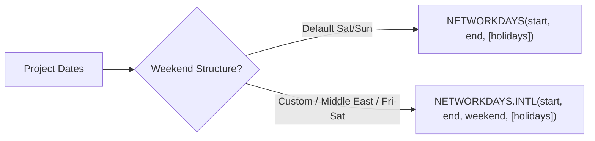

# Lesson 3.6: Date Mathematics & Time-Series Calculations

> [!abstract] Learning Objective
> Execute dynamic date calculations, decompose date serials (`DAY`, `MONTH`, `YEAR`), calculate calendar cycles (`WEEKDAY`, `WEEKNUM`), compute tenure (`DATEDIF`), and analyze business day ranges with international weekend schedules (`NETWORKDAYS`, `NETWORKDAYS.INTL`).

> 🎥 **Video Chapter**: [Chapter 3 – Excel Formulas & Functions (1:38:56)](https://www.youtube.com/watch?v=uv1bxe2gdnU&t=5936s)

---

## 1. The 4-Tier Date Analytics Framework

From `Formulas_&_Functions_Part_2.xlsx` (Sheet `Date and Time `), date analytics functions fall into four clear functional categories:

| Category | Function | Syntax | Technical Mechanics | Key Analytical Use Case |
| :--- | :--- | :--- | :--- | :--- |
| **1. التاريخ الحالي<br>(Current Serials)** | **`TODAY`** | `=TODAY()` | Volatile integer serial (updates on recalculation). | Dynamic client age (`=DATEDIF(DOB, TODAY(), "Y")`). |
| **1. التاريخ الحالي<br>(Current Serials)** | **`NOW`** | `=NOW()` | Volatile decimal serial (integer date + fractional time). | Real-time SLA timestamps, operational clocks. |
| **2. فك التاريخ<br>(Decomposition)** | **`DAY`** | `=DAY(serial_number)` | Returns integer day of the month (`1` to `31`). | Cohort analysis, monthly billing cycles (`=DAY(D8)`). |
| **2. فك التاريخ<br>(Decomposition)** | **`MONTH`** | `=MONTH(serial_number)` | Returns integer month of the year (`1` to `12`). | Monthly trend aggregation, seasonal indices (`=MONTH(D8)`). |
| **2. فك التاريخ<br>(Decomposition)** | **`YEAR`** | `=YEAR(serial_number)` | Returns 4-digit integer year (`1900` to `9999`). | Annual sales reporting, multi-year slicing (`=YEAR(D8)`). |
| **3. حسابات التاريخ<br>(Calculations)** | **`DATEDIF`** | `=DATEDIF(start, end, unit)` | Computes exact elapsed periods (`"Y"`, `"M"`, `"D"`). | Client tenure, contract lifespan. |
| **3. حسابات التاريخ<br>(Calculations)** | **`NETWORKDAYS`** | `=NETWORKDAYS(start, end, [hol])` | Whole business workdays (excludes Sat/Sun). | Turnaround time for standard Western schedule. |
| **3. حسابات التاريخ<br>(Calculations)** | **`NETWORKDAYS.INTL`**| `=NETWORKDAYS.INTL(start, end, mask, [hol])` | Whole business workdays with custom weekend masks. | Middle East schedules (`"0000011"` for Fri/Sat). |
| **4. تحليل زمني<br>(Time Analysis)** | **`WEEKDAY`** | `=WEEKDAY(serial, [type])` | Day-of-week index (`1` to `7`). Answers: **اليوم كام في الأسبوع؟** | Staffing models, peak day volume (`=WEEKDAY(D8)`). |
| **4. تحليل زمني<br>(Time Analysis)** | **`WEEKNUM`** | `=WEEKNUM(serial, [type])`| Week number of the year (`1` to `54`). Answers: **الأسبوع كام في السنة؟** | Weekly sprint tracking, retail 4-5-4 calendars (`=WEEKNUM(D8)`). |

---

## 2. Elapsed Time & Tenure: DATEDIF

`DATEDIF` computes the exact difference between two dates according to a specified unit interval:

```excel
=DATEDIF(start_date, end_date, unit)
```

| Unit Code | Output Description | Business Example |
| :---: | :--- | :--- |
| **`"Y"`** | Complete elapsed years | Customer/Client Age: `=DATEDIF(B6, TODAY(), "Y")` |
| **`"M"`** | Complete elapsed months | Customer tenure, subscription duration |
| **`"D"`** | Complete elapsed days | Days to delivery, inventory holding duration |
| **`"YM"`** | Months remaining after full years are excluded | Formatted tenure strings (e.g., "5 Years, 3 Months") |
| **`"YD"`** | Days remaining after full years are excluded | Year-to-date anniversary tracking |
| **`"MD"`** | Days remaining after full months are excluded | Exact day residue in age calculation |

> [!warning] Start Date Before End Date Rule
> If `start_date` is later than `end_date`, `DATEDIF` immediately returns a `#NUM!` error.

---

## 3. Business Days: NETWORKDAYS vs NETWORKDAYS.INTL

Tracking working business days while excluding weekends and statutory holidays is fundamental for SLAs and financial turnarounds:



### Standard Western Schedule
```excel
=NETWORKDAYS(StartDate, EndDate, [Holidays])
```
Automatically excludes Saturdays and Sundays.

### Regional / Middle East Weekend Schedule
```excel
=NETWORKDAYS.INTL(StartDate, EndDate, "0000011", [Holidays])
```
From `Formulas_&_Functions_Part_2.xlsx` (Sheet `Date and Time `):
- `"0000011"`: String mask of 7 digits starting from Monday. `0` = working day, `1` = non-working day. Here, Friday (`6th`) and Saturday (`7th`) are designated as weekends (Egypt / Middle East business week).
- Alternatively, integer weekend code `7` (Fri/Sat) or `11` (Sunday only) can be specified.

---

## 4. Practical Implementation Patterns

### Pattern A: Tenure Calculation (DATEDIF)
From `Formulas_&_Functions_Part_2.xlsx` (cell `D17`):
```excel
=DATEDIF(H18, H17, "y")
```
Calculates completed years between Start Date `2024-03-24` and End Date `2026-12-20` ($\rightarrow 2$ years).

### Pattern B: Business Days with Friday/Saturday Weekend
From `Formulas_&_Functions_Part_2.xlsx` (cell `D19`):
```excel
=NETWORKDAYS.INTL(H18, H17, "0000011")
```

### Pattern C: Time Analysis (Periodicity)
From `Formulas_&_Functions_Part_2.xlsx` (cells `D22` & `D23`):
```excel
=WEEKDAY(D8)   // Day index of today (اليوم كام في الأسبوع)
=WEEKNUM(D8)   // Week index of today (الأسبوع كام في السنة)
```

---

## Related Knowledge
- **Formulas**: [[TODAY]], [[NOW]], [[DAY]], [[MONTH]], [[YEAR]], [[DATEDIF]], [[NETWORKDAYS]], [[NETWORKDAYS.INTL]], [[WEEKDAY]], [[WEEKNUM]]
- **Concepts**: [[Data Cleaning]], [[Excel File Formats]]
- 📂 **Personal Workbook Demo**: [`11_Demos_and_Workbooks/03_Formulas_and_Functions/Formulas_&_Functions_Part_2.xlsx`](file:///d:/courses/Data%20Analysis%2026-27/7-Introducation%20to%20Data%20Fields%20%28Excel%29/11_Demos_and_Workbooks/03_Formulas_and_Functions/Formulas_&_Functions_Part_2.xlsx)
  - Tab **`Date and Time `**: Hands-on calculations for `TODAY`, `NOW`, `DAY`, `MONTH`, `YEAR`, `DATEDIF`, `NETWORKDAYS`, `NETWORKDAYS.INTL`, `WEEKDAY`, and `WEEKNUM`.
