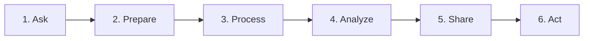

# Lesson 3.8: The Data Analysis Life Cycle (DALC & CRISP-DM Frameworks)

> [!abstract] Learning Objective
> Apply industry-standard analytical frameworks (Google 6-Phase DALC and CRISP-DM) to structure end-to-end analytical problem solving from initial stakeholder inquiry to executive action.

> 🎥 **Video Chapter**: [Chapter 3 – Excel Formulas & Functions (1:38:56)](https://www.youtube.com/watch?v=uv1bxe2gdnU&t=5936s)

## The 6 Phases Breakdown
1. **Ask**: Frame the business problem, identify stakeholders, and define measurable objectives.
2. **Prepare**: Discover, collect, and verify data sources; inspect schema and data dictionaries.
3. **Process**: Clean data, handle missing values, resolve duplicates, and ensure data integrity.
4. **Analyze**: Aggregate, calculate KPIs, identify patterns, trends, and correlations.
5. **Share**: Create executive dashboards, data visualizations, and contextual narratives.
6. **Act**: Formulate evidence-based recommendations and monitor business implementation.

## Related Knowledge
- Concepts: [[Data Analysis Life Cycle]], [[Six Dimensions of Data Quality]]
- Projects: [[06_Projects/Call Center Performance Analysis/Project Overview]]
