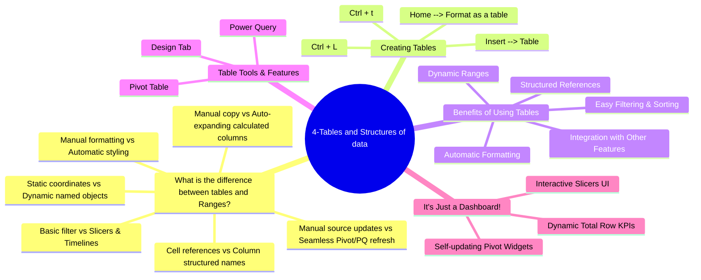
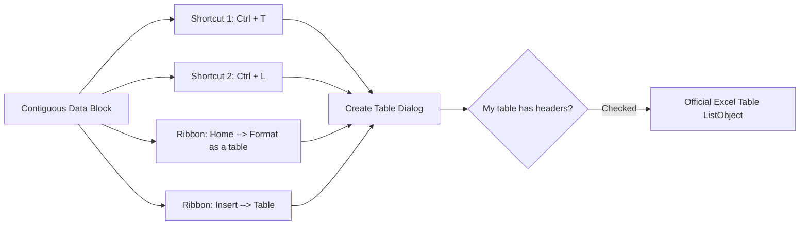

# Lesson 4.1: Excel Tables (ListObjects) Architecture & Creation

> [!abstract] Learning Objective
> Grounded in the course mindmap **"4-Tables and Structures of data"** and demo workbook `Module_4_Demo.xlsx`, master the fundamental architectural distinctions between standard ranges and Excel Tables (`ListObjects`). Execute all four table creation methods (`Ctrl + T`, `Ctrl + L`, Ribbon Insert, Format as Table), leverage the core benefits of tabular structures, and prepare datasets for downstream analytics.

> 🎥 **Video Chapter**: [Chapter 4 – Excel Tables (2:35:55)](https://www.youtube.com/watch?v=uv1bxe2gdnU&t=9355s)

---

## 🗺️ Module Mindmap: 4-Tables and Structures of Data

The entire architecture of Module 4 is structured around five strategic analytical pillars:



> [!tip] Visual Architecture Reference
> Below is the conceptual lecture mindmap:
> 
> 

---

## 1. Branch 1: What is the Difference Between Tables and Ranges?

In `11_Demos_and_Workbooks/04_Tables/Module_4_Demo.xlsx`, the opening sheet **`table VS range `** poses the foundational analytical question at cell `B2`:

> **"What is the difference between them?"**

To demonstrate this empirically, the workbook displays a side-by-side comparison:
- **Unstructured Range (`C6:E12`)**: Three columns (`Mostafa`, `Omar`, `Safaa`) containing static numeric rows (`12`, `23`, `434`).
- **Official Excel Table (`Table2`, `G6:J12`)**: Four structured columns (`Salah `, `Nariman `, `Smmar `, `Malak`) styled with `TableStyleLight9` containing rows (`44`, `54`, `45`, `454`).

### Detailed Architectural Comparison Matrix

| Dimension | Standard Range (`C6:E12`) | Excel Table / `ListObject` (`Table2`, `G6:J12`) | Analytical Impact |
| :--- | :--- | :--- | :--- |
| **Object Model** | Loose matrix of individual coordinate cells | Unified `ListObject` container with schema metadata | Treats rows as atomic records and columns as fields |
| **Referencing** | Static coordinates (`C7:E12`, `$A$2:$J$101`) | Dynamic structured names (`SalesTable[UnitPrice]`) | Formulas are readable and resilient to column moves |
| **Formatting** | Manual fill, borders, and font colors | **Automatic Formatting**: banded rows, branded styles | Preserves visual hierarchy across thousands of rows |
| **Formula Propagation** | Manual drag down with fill handle (`Ctrl + D`) | **Calculated Column**: auto-fills entire column instantly | Prevents broken models caused by incomplete drag-downs |
| **Dynamic Range** | Static boundary; new rows below are ignored | **Auto-Expanding**: table grows automatically with new rows | Eliminates formula range maintenance when appending data |
| **Filtering & Sorting** | Basic AutoFilter dropdown arrows | Enhanced AutoFilter + **Interactive Slicers** | Enables dashboard-style point-and-click filtering |
| **Total Row** | Manual `SUM` formulas risking range drift | One-click toggle (`Ctrl + Shift + T`) with `SUBTOTAL` | `SUBTOTAL(109, ...)` dynamically excludes filtered rows |
| **Integration** | Requires manual "Change Data Source" | Seamless native link to **Pivot Tables** & **Power Query** | Simple refresh (`Alt + F5`) ingests new records |

---

## 2. Branch 2: Creating Tables in Excel

The mindmap outlines the four canonical methods to create an Excel Table:



### The 4 Creation Methods:
1. **`Ctrl + t`**: The primary data analyst shortcut. Select any cell in the contiguous data range and press `Ctrl + T`.
2. **`Ctrl + L`**: The classic legacy shortcut (`L` stands for *List*, the original Excel terminology for `ListObject`). Behaves identically to `Ctrl + T`.
3. **`Home --> Format as a table`**: Select the range $\rightarrow$ navigate to the **Home** tab $\rightarrow$ click **Format as Table** $\rightarrow$ choose a Light, Medium, or Dark palette style.
4. **`Insert --> Table`**: Select the range $\rightarrow$ navigate to the **Insert** tab $\rightarrow$ click **Table** in the Tables group.

### Best Practices Before Creating a Table:
- **Clean Headers**: Ensure Row 1 has clear, non-empty, descriptive text headers.
- **Eliminate Detached Rows**: Remove trailing rogue entries (such as the orphan dirty entry in `Sales_Data` row 102: `'  Mohamed El-Sayed  '`) before creating the table.
- **Rename Immediately**: Default names like `Table1` or `Table2` degrade formula readability. Immediately rename the table on the **Table Design** tab to a clear business noun (e.g. `SalesTable`, `EmployeeTable`, `InventoryTable`).

---

## 3. Branch 3: Benefits of Using Tables

The mindmap highlights five core operational benefits:

### 1. Automatic Formatting
- Instant application of clean, legible table styles.
- **Banded Rows**: Alternating light and dark stripes prevent eye tracking errors across wide datasets.
- Styling automatically extends to newly added rows.

### 2. Structured References
- Formulas replace cryptic coordinates with clear column tokens:
  ```excel
  =[@Quantity] * [@UnitPrice]
  ```
- Detailed in depth in [[02_Structured_References]].

### 3. Dynamic Ranges
- Tables automatically grow or shrink when rows or columns are inserted or deleted.
- Appending a row at the bottom (or pressing `Tab` in the bottom-right cell) expands the table boundary and automatically cascades down all column formulas.

### 4. Easy Filtering & Sorting
- Every column header includes instant sort (A-Z, Z-A, by color) and multi-criteria filter options.
- Visual filter status indicators clearly show which columns are currently filtered.

### 5. Integration with Other Features
- Native handshakes with **Pivot Tables**, **Charts**, and **Power Query**.
- When underlying table data changes, simply refresh downstream reports without redefining ranges.

---

## 4. Hands-on Conversion Targets in `Module_4_Demo.xlsx`

The companion workbook `Module_4_Demo.xlsx` provides realistic conversion drills:

1. **`Sales_Data` (`A1:J101`)**:
   - 101 retail transactions across Egyptian governorates (Cairo, Giza, Alexandria, Asyut, Luxor, Sohag, Gharbia).
   - Convert range to table: select cell `A1` $\rightarrow$ press `Ctrl + T` $\rightarrow$ rename table to `SalesTable`.
2. **`Employee_Records` (`A1:I31`)**:
   - 30 employee records across 6 departments with salary and performance metrics.
   - Convert range to table: press `Ctrl + L` $\rightarrow$ rename table to `EmployeeTable`.
3. **`Product_Inventory` (`A1:F52`)**:
   - 51 hardware product SKUs with stock levels, unit costs, and selling prices.
   - Convert range to table: `Insert > Table` $\rightarrow$ rename table to `InventoryTable`.

---

## 5. Self-Check: Test Your Understanding

> [!question]- 1. What are the two keyboard shortcuts that instantiate an Excel Table?
> **Answer**: **`Ctrl + T`** and **`Ctrl + L`** (where `L` historically stood for *List*).

> [!question]- 2. In `Module_4_Demo.xlsx`, why does typing a value into cell `G13` behave differently from typing into `C13`?
> **Answer**: `C13` is directly below an unstructured range, so Excel treats it as an isolated cell without extending formatting or formulas. `G13` is directly adjacent to `Table2`, so Excel's table engine automatically detects the input, expands the table boundary to row 13, and extends banded formatting.

> [!question]- 3. Why is it dangerous to create a table from a dataset containing completely blank rows?
> **Answer**: Excel auto-detects table boundaries based on contiguous cell blocks. A blank row halts auto-detection, causing Excel to convert only the data above the blank row, silently excluding the remaining records.

---

## 6. Senior Data Analyst Interview Questions

### Question 1: "How do Excel Tables improve model governance and reduce spreadsheet risk in enterprise finance?"
**Model Answer**:  
"Excel Tables reduce spreadsheet risk primarily through calculated columns and dynamic expansion. In coordinate-based spreadsheets, formulas must be manually dragged down. If a user pastes new rows without dragging formulas, or accidentally alters a formula midway down a column, silent calculation gaps occur. Tables enforce uniform calculated column logic across 100% of rows automatically. Furthermore, structured references ensure formulas remain intelligible and auditable, even when columns are reordered by other users."

---

### Question 2: "What is the mechanical difference between `Ctrl + T` and `Home > Format as Table`?"
**Model Answer**:  
"Functionally, both methods create an identical underlying `ListObject` data structure with dynamic boundaries and structured references. The difference is purely in the workflow: `Ctrl + T` applies Excel's default style (typically TableStyleMedium2 or TableStyleLight9) immediately via shortcut, whereas `Home > Format as Table` opens the full visual style gallery first, allowing the analyst to select a custom visual palette prior to table instantiation."

---

## Related Knowledge
- **Mindmap Node**: [[01_Excel_Tables_Architecture|What is the difference between tables and Ranges?]], [[01_Excel_Tables_Architecture|Creating Tables]]
- **Concepts**: [[Excel Tables]], [[Structured References]], [[Pivot Tables]], [[Power Query]]
- **Formulas**: [[SUBTOTAL]], [[SUMIFS]], [[COUNTIFS]]
- **Practice**: [[Ex03_Excel_Tables_and_Structured_References]]
- 📂 **Personal Workbook Demo**:
  - [`11_Demos_and_Workbooks/04_Tables/Module_4_Demo.xlsx`](file:///d:/courses/Data%20Analysis%2026-27/7-Introducation%20to%20Data%20Fields%20%28Excel%29/11_Demos_and_Workbooks/04_Tables/Module_4_Demo.xlsx)
    - Tab **`table VS range `**: Live drill comparing Range `C6:E12` against `Table2` (`G6:J12`).
    - Tab **`Sales_Data`**: 101 retail transactions for `SalesTable` conversion.
    - Tab **`Employee_Records`**: 30 HR records for `EmployeeTable` conversion.
    - Tab **`Product_Inventory`**: 51 hardware SKUs for `InventoryTable` conversion.
