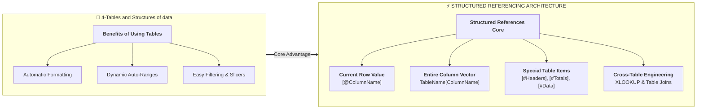

# Lesson 4.2: Structured References & Formula Engineering

> [!abstract] Learning Objective
> Positioned under the **Benefits of Using Tables** branch of our course mindmap, master the syntax, grammar, and mechanics of **Structured References**. Construct readable, auditable calculated columns and cross-table formulas across the datasets in `Module_4_Demo.xlsx`.

> 🎥 **Video Chapter**: [Chapter 4 – Excel Tables (2:35:55)](https://www.youtube.com/watch?v=uv1bxe2gdnU&t=9355s)

---

## 🗺️ Mindmap Placement

In the master mindmap **"4-Tables and Structures of data"**, structured referencing represents the intellectual core of table data engineering:



---

## 1. Why Structured References Outperform Cell Coordinates

In traditional spreadsheets, calculating revenue requires coordinate formulas like `=E2 * F2`. This introduces significant operational risks:
1. **Ambiguity**: An auditor looking at `=E2 * F2` must scroll up to column headers to understand what values are being multiplied.
2. **Fragility**: If a coworker inserts a new column between E and F, coordinate formulas can drift or corrupt.
3. **Copy Errors**: If formulas are dragged down manually, blank cells or broken fill handles can leave calculation holes.

In an Excel Table, writing:
```excel
=[@Quantity] * [@UnitPrice]
```
transforms the formula into **self-documenting business logic** that automatically populates down 100% of rows instantly.

---

## 2. Complete Structured Referencing Grammar

| Structured Token | Scope Referenced | Example from `Module_4_Demo.xlsx` | Evaluation Output |
| :--- | :--- | :--- | :--- |
| **`[@ColumnName]`** | Value of `ColumnName` in the **current active row** | `=[@CostPerUnit] * 1.25` | Single scalar numeric/text value |
| **`TableName[ColumnName]`** | The entire data body of that column | `=SUM(InventoryTable[CurrentStock])` | 1D vector of numbers (excluding headers/totals) |
| **`TableName[[#Headers], [ColumnName]]`** | The specific header cell of a column | `=SalesTable[[#Headers], [TotalPrice]]` | String: `"TotalPrice"` |
| **`TableName[#Headers]`** | The entire row of table headers | `=COUNTA(SalesTable[#Headers])` | Total column count (`10`) |
| **`TableName[[#Totals], [ColumnName]]`** | The specific summary cell in the Total Row | `=InventoryTable[[#Totals], [CurrentStock]]` | Evaluated total value |
| **`TableName[#Totals]`** | The complete summary total row | `=COUNT(InventoryTable[#Totals])` | Array of total row values |
| **`TableName[#Data]`** | All data cells across all columns | `=ROWS(SalesTable[#Data])` | Count of transaction rows (`101`) |
| **`TableName[#All]`** | Header row + Data rows + Total row | `=ROWS(SalesTable[#All])` | Total vertical span (`102` or `103`) |
| **`TableName[[ColA]:[ColB]]`** | Contiguous multi-column slice | `=INDEX(SalesTable[[Quantity]:[TotalPrice]], 1, 0)` | Multi-column row array |

> [!important] The `@` Symbol (Implicit Intersection)
> In legacy Excel (2007/2010), the active row was written without `@` as `[ColumnName]`. Starting in Excel 2013 and standardized in Microsoft 365, the **`@`** operator explicitly denotes **implicit intersection** (evaluating the value on *this row*).

---

## 3. The Absolute Coordinate Lock Trap Outside Tables

What happens when you write a structured reference outside of a table and drag it across cells?

- **The Problem**:
  If cell `L2` contains `=SUM(SalesTable[Quantity])` and you drag it one cell to the right into `M2`, Excel treats the column reference **relatively**. The formula automatically shifts to:
  ```excel
  =SUM(SalesTable[UnitPrice])
  ```
- **The Solution (Double Bracket Lock)**:
  To lock a structured column reference so it acts like an absolute anchor (`$E$2:$E$102`), repeat the column name inside double brackets:
  ```excel
  =SUM(SalesTable[[Quantity]:[Quantity]])
  ```
  Now, when dragged horizontally, the reference remains firmly anchored to `Quantity`!

---

---

## 4. Real-World Formula Engineering in `Module_4_Demo.xlsx`

The companion workbook provides live implementations of structured references demonstrating both shorthand (`[@...]`) and fully qualified (`TableName[[#This Row], [...]]`) notation:

### A. Sales Transactions (`Sales_Data` $\rightarrow$ `SalesTable`)

In `Module_4_Demo.xlsx`, the 101 sales orders have been converted to an official 12-column table `SalesTable` featuring three live calculated columns:

1. **Calculated Column: `OrderYear` (Column C)**:
   - *Workbook Formula*:
     ```excel
     =YEAR(SalesTable[[#This Row],[Date]])
     ```
   - *Equivalent Shorthand*: `=YEAR([@Date])`
   - *Evaluation*: Extracts `2024` down all 101 rows.

2. **Calculated Column: `TotalPrice` (Column H)**:
   - *Workbook Formula*:
     ```excel
     =SalesTable[[#This Row],[Quantity]] * SalesTable[[#This Row],[UnitPrice]]
     ```
   - *Equivalent Shorthand*: `=[@Quantity] * [@UnitPrice]`
   - *Evaluation*: Evaluates line revenues (e.g., `9,791.34` EGP, `2,443.93` EGP).

3. **Calculated Column: `EmailDomain` (Column K)**:
   - *Workbook Formula*:
     ```excel
     =RIGHT(SalesTable[[#This Row],[Email]], LEN(SalesTable[[#This Row],[Email]]) - FIND("@", SalesTable[[#This Row],[Email]]))
     ```
   - *Equivalent Shorthand*: `=RIGHT([@Email], LEN([@Email]) - FIND("@", [@Email]))`
   - *Evaluation*: Dynamically parses domain `"egypt.com"` across all 101 customer profiles.

---

### B. Table vs Range Multiplication (`Table_VS_Range ` $\rightarrow$ `Table2`)

In the opening demonstration tab `Table_VS_Range `:
- **Calculated Column: `Malak` (Column J)**:
  ```excel
  =Table2[[#This Row],[Smmar ]]*Table2[[#This Row],[Nariman ]]
  ```
  Evaluates $45 \times 54 = 2,430$ down rows 7 to 12.
- **Contrast with Range**:
  In column E (`Safaa`) of the unstructured grid, the formula relies on static coordinates: `=D7*C7`.

---

### B. Hardware Stock Management (`Product_Inventory` $\rightarrow$ `InventoryTable`)

1. **Calculated Column: `InventoryValuation`**
   ```excel
   =[@CurrentStock] * [@CostPerUnit]
   ```

2. **Calculated Column: `GrossMarginEGP`**
   ```excel
   =[@SellingPrice] - [@CostPerUnit]
   ```

3. **Calculated Column: `MarkupPercentage`**
   ```excel
   =([@SellingPrice] - [@CostPerUnit]) / [@CostPerUnit]
   ```

4. **Calculated Column: `ReorderAlert`**
   ```excel
   =IF([@CurrentStock] <= [@ReorderLevel], "REORDER REQUIRED", "IN STOCK")
   ```
   Immediately flags stockouts for items like `EGY004 Phone Charger` (Stock: `30`, Reorder: `35`) and `EGY014 Laptop HP Egypt` (Stock: `16`, Reorder: `47`).

---

### C. Relational Cross-Table Lookups (`Employee_Records` $\rightarrow$ `Dept_Heads`)

In `Module_4_Demo.xlsx`, `Employee_Records` lists employee departments, while `Dept_Heads` maps department managers horizontally:

| Department | Sales | Marketing | HR | IT | Finance | Operations |
| :--- | :--- | :--- | :--- | :--- | :--- | :--- |
| **Manager** | Ahmed El-Masry | Fatima Nour | Omar Farouk | Yasmin Hassan | Mohamed Samir | Aisha Mahmoud |

To enrich each row in `EmployeeTable` with their department manager's name:

#### Modern `XLOOKUP` Implementation:
```excel
=XLOOKUP([@Department], Dept_Heads!$A$1:$F$1, Dept_Heads!$A$2:$F$2, "Unassigned")
```

#### Classic `HLOOKUP` Implementation:
```excel
=HLOOKUP([@Department], Dept_Heads!$A$1:$F$2, 2, FALSE)
```

This demonstrates relational data modeling using native Excel Tables without complex database software.

---

## 5. Self-Check: Test Your Understanding

> [!question]- 1. What is the difference between `=[@CostPerUnit]` and `=InventoryTable[CostPerUnit]`?
> **Answer**: `=[@CostPerUnit]` evaluates exclusively to the single cost value on the current row. `=InventoryTable[CostPerUnit]` refers to the entire column vector of 51 cost figures across all products.

> [!question]- 2. How do you reference the `CustomerName` header text inside a formula?
> **Answer**: `=SalesTable[[#Headers], [CustomerName]]`. This returns the literal header string `"CustomerName"`.

> [!question]- 3. How do you prevent a structured reference column from shifting when copying a formula to the right outside the table?
> **Answer**: Use the double bracket bracketed column syntax: `SalesTable[[Quantity]:[Quantity]]`.

---

## 6. Senior Data Analyst Interview Questions

### Question 1: "Why do structured references improve formula auditing in corporate model reviews?"
**Model Answer**:  
"Structured references make spreadsheets self-documenting. In coordinate formulas like `=G2*H2`, an auditor must constantly verify row numbers and cross-reference column letters with headers. Structured references like `=[@Quantity]*[@UnitPrice]` explicitly state business intent. Furthermore, structured references do not break when columns are inserted, moved, or deleted, eliminating the common `#REF!` errors associated with legacy coordinate formulas."

---

### Question 2: "What is the computational impact of using full-column structured references like `SUM(Table[Sales])` inside a calculated column?"
**Model Answer**:  
"Referencing the entire column `Table[Sales]` inside an un-aggregated calculated column causes formula evaluation overhead or unintended dynamic array spilling (`#SPILL!`). If placed inside an aggregator like `SUMIFS(Table[Sales], Table[Region], [@Region])`, it evaluates an $O(N^2)$ operation across $N$ rows, which can severely degrade performance on datasets with over 50,000 rows. In high-volume scenarios, such aggregations are better handled via Pivot Tables or DAX measures."

---

## Related Knowledge
- **Mindmap Node**: [[02_Structured_References|Benefits of Using Tables > Structured References]]
- **Concepts**: [[Structured References]], [[Excel Tables]], [[Relative vs Absolute References]]
- **Formulas**: [[XLOOKUP]], [[HLOOKUP]], [[SUBTOTAL]], [[IF]], [[YEAR]]
- **Practice**: [[Ex03_Excel_Tables_and_Structured_References]]
- 📂 **Personal Workbook Demo**:
  - [`11_Demos_and_Workbooks/04_Tables/Module_4_Demo.xlsx`](file:///d:/courses/Data%20Analysis%2026-27/7-Introducation%20to%20Data%20Fields%20%28Excel%29/11_Demos_and_Workbooks/04_Tables/Module_4_Demo.xlsx)
    - Tab **`Sales_Data`**: `=[@Quantity] * [@UnitPrice]`, Date extraction.
    - Tab **`Product_Inventory`**: Valuation, Margins, Reorder Alert logic.
    - Tab **`Employee_Records` & `Dept_Heads`**: Relational manager lookup.
