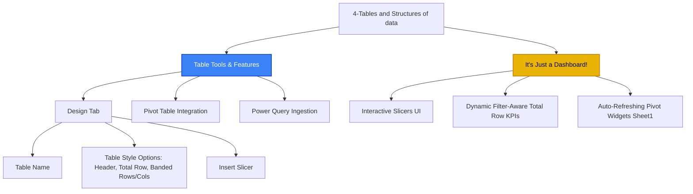
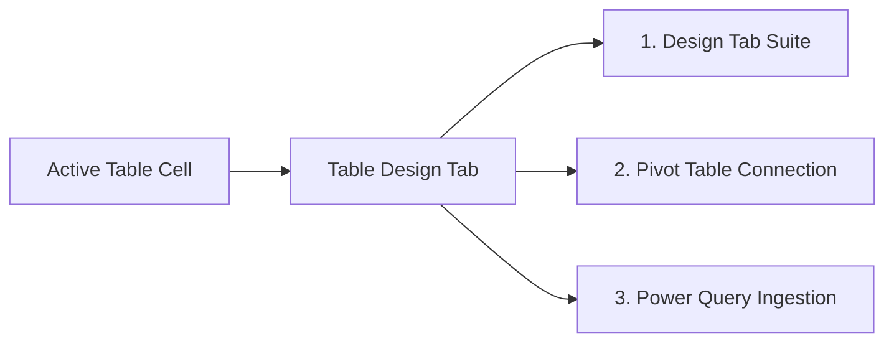
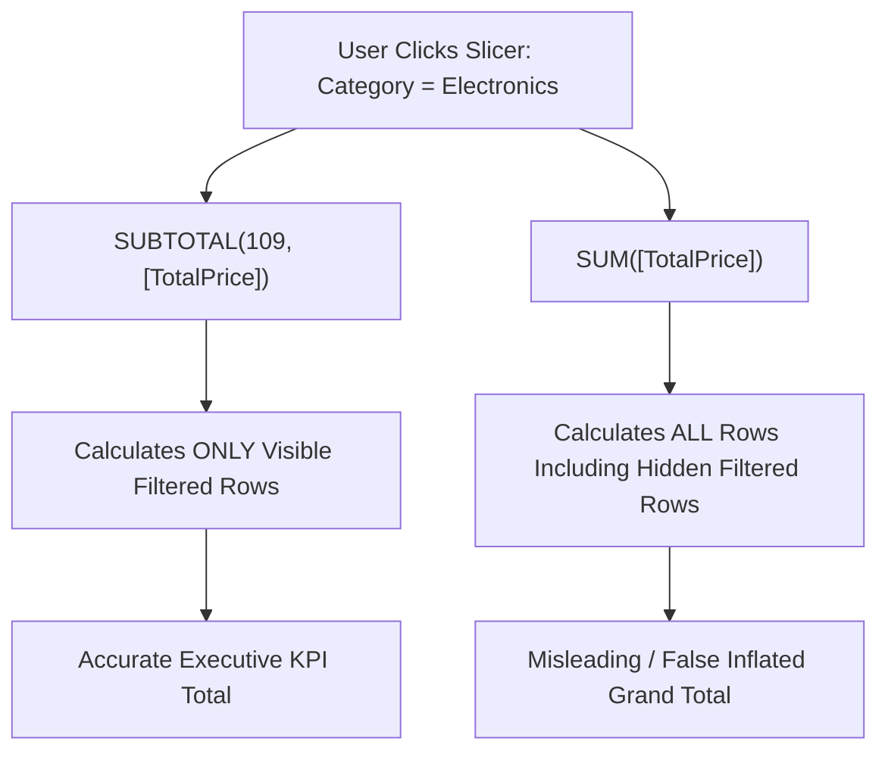
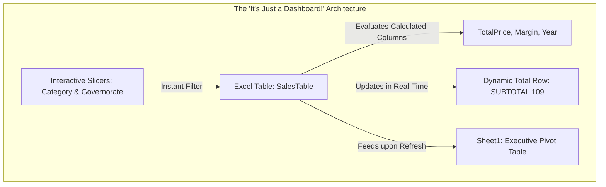

# Lesson 4.3: Table Tools, Features & "It's Just a Dashboard!"

> [!abstract] Learning Objective
> Grounded in the **Table Tools & Features** and **"It's Just a Dashboard!"** branches of the course mindmap, master the Table Design ribbon suite, configure dynamic Total Rows powered by `=SUBTOTAL(109, ...)`, deploy interactive Slicers, connect to Pivot Tables (`Sheet1` in `Module_4_Demo.xlsx`) and Power Query, and transform raw tables into interactive operational micro-dashboards.

> 🎥 **Video Chapter**: [Chapter 4 – Excel Tables (2:35:55)](https://www.youtube.com/watch?v=uv1bxe2gdnU&t=9355s)

---

## 🗺️ Mindmap Placement

This lesson addresses the bottom two core branches of the master **"4-Tables and Structures of data"** mindmap:



---

## 1. Branch 4: Table Tools & Features

Selecting any cell within an Excel Table activates the contextual **Table Design** tab on the Ribbon, providing access to three primary operational tools:



### Pillar 1: The Design Tab Suite

1. **Properties**:
   - **Table Name**: Set a unique, meaningful identifier (`SalesTable`, `EmployeeTable`, `InventoryTable`). Names cannot contain spaces and cannot start with numbers.
   - **Resize Table**: Adjust the coordinate boundary manually if needed.
2. **Tools**:
   - **Summarize with PivotTable**: Creates an instant Pivot Table anchored to the table name.
   - **Remove Duplicates**: Deduplicates records across selected column attributes.
   - **Convert to Range**: Dissolves the table container while retaining colors and fonts.
3. **Table Style Options**:
   - **Header Row**: Toggles column header visibility.
   - **Total Row (`Ctrl + Shift + T`)**: Appends a dynamic summary row.
   - **Banded Rows / Banded Columns**: Alternates zebra striping to reduce visual fatigue.
   - **First Column / Last Column**: Applies distinct formatting to callout IDs or row-end summaries.
   - **Filter Button**: Toggles AutoFilter arrows on headers.
4. **Insert Slicer**: Launches visual point-and-click filter tiles.

---

### Pillar 2: Total Row Mechanics & `SUBTOTAL(109, ...)`

When you toggle the Total Row on `Product_Inventory` or `Sales_Data`, Excel automatically inserts `=SUBTOTAL(109, [ColumnName])` for sums and `=SUBTOTAL(101, [ColumnName])` for averages.

#### The Mathematical Justification: Why Not `SUM()`?



| Function Code | Base Function | Treatment of Rows Hidden by Slicers / Filters |
| :---: | :--- | :--- |
| **`109`** | `SUM` | **Excludes hidden rows** (Calculates strictly visible active records) |
| **`101`** | `AVERAGE` | **Excludes hidden rows** (Computes mean of visible records) |
| **`102`** | `COUNT` | **Excludes hidden rows** (Counts numbers in visible records) |
| **`103`** | `COUNTA` | **Excludes hidden rows** (Counts non-empty cells in visible records) |
| **`104`** | `MAX` | **Excludes hidden rows** (Maximum value among visible records) |
| **`105`** | `MIN` | **Excludes hidden rows** (Minimum value among visible records) |

> [!important] The 100-Series Rule
> Functions numbered `1-11` include manually hidden rows. Functions numbered `101-111` ignore all hidden and filtered rows. Excel Tables strictly mandate the `100-series` to maintain mathematical truth during interactive analysis.

---

### Pillar 3: Pivot Table Integration (Demonstrated on `Sheet1`)

In `Module_4_Demo.xlsx`, the sheet **`Sheet1`** demonstrates the gold standard enterprise relationship between Excel Tables and Pivot Tables:

```
Row Labels               Sum of CostPerUnit
Adapter USB-C            2068.96
Cable HDMI               5175.45
Desktop Lenovo           4283.64
...
Webcam Logitech          4967.33
Grand Total              65537.70
```

`Sheet1` summarizes the 51 SKUs from `Product_Inventory`:
- **The Problem with Raw Ranges**: If built from `'Product_Inventory'!$A$1:$F$52`, appending new product rows requires manually editing the source range inside *PivotTable Analyze > Change Data Source*.
- **The Table Solution**: When built from `=InventoryTable`, appending new rows automatically expands the table boundary. Pressing **`Alt + F5`** (or right-clicking $\rightarrow$ **Refresh**) immediately pulls the new products into `Sheet1` with zero range reconfiguration!

---

### Pillar 4: Power Query Integration

Slide 8 of the course lecture emphasizes why Power Query prefers Excel Tables:
1. **Clean Ingestion**: Selecting **Data > Get Data > From Table/Range** imports strictly the named table container, discarding surrounding blank worksheet cells.
2. **Maintainable M Code**: The source step reads cleanly in the formula bar:
   ```powerquery
   Source = Excel.CurrentWorkbook(){[Name="SalesTable"]}[Content]
   ```
3. **Automated Pipeline**: When new transactions are pasted into `SalesTable`, clicking **Data > Refresh All** (`Ctrl + Alt + F5`) re-runs all ETL cleansing steps automatically.

---

## 2. Branch 5: "It's Just a Dashboard!"

The final branch of the mindmap delivers Mostafa Hamed's central pedagogical message for Module 4:

> **"It's Just a Dashboard!"**

Many analysts assume a business dashboard requires complex Business Intelligence platforms (Power BI, Tableau) or intricate VBA macros. 

In reality, **an Excel Table combined with Slicers, a Total Row, and a linked Pivot Table IS an interactive operational dashboard!**



### How to Build a Micro-Dashboard from `Module_4_Demo.xlsx`:
1. **Container Setup**: Convert `Sales_Data` (`A1:J101`) to table `SalesTable` (`Ctrl + T`) and apply a clean dark or medium style (`TableStyleMedium9`).
2. **KPI Calculations**: Add calculated column `TotalPrice = [@Quantity] * [@UnitPrice]`.
3. **Dynamic Scorecard**: Enable Total Row (`Ctrl + Shift + T`). Set `Quantity` to `SUM` and `TotalPrice` to `SUM`.
4. **Interactive Controls**: Insert Slicers for **`Category`** (`Electronics`, `Peripherals`) and **`Governorate`** (`Cairo`, `Alexandria`, `Asyut`, `Giza`, `Luxor`, `Sohag`, `Gharbia`).
5. **Layout Ergonomics**: Position the Slicers at the top or side of the worksheet in 3-4 horizontal columns.

**The User Experience**:  
An executive can click `"Asyut"` and `"Electronics"`. The table instantly filters, the Total Row recalculates visible revenue on the fly, and the linked Pivot Table reflects the active slice—**delivering a complete BI dashboard experience directly in native Excel!**

---

## 3. Data Hygiene: Pre-Conversion Auditing

In `Module_4_Demo.xlsx` sheet `Sales_Data`, row 102 contains a detached orphan entry:
- Cell `H102`: `'  Mohamed El-Sayed  '` with surrounding blank cells and no OrderID.

### Pre-Conversion Checklist:
1. **Remove Orphan / Fragmented Rows**: Delete trailing partial records before pressing `Ctrl + T` to prevent inflating table dimensions.
2. **Trim Extra Whitespace**: Use `=TRIM()` to remove leading/trailing spaces (like those in cell `H102`).
3. **Verify Distinct Headers**: Ensure every column has a unique text label.
4. **Remove Existing Subtotals**: Delete any manual summary rows at the bottom so they aren't ingested as transaction records.

---

## 4. Self-Check: Test Your Understanding

> [!question]- 1. Why does the mindmap conclude with the phrase "It's Just a Dashboard!"?
> **Answer**: Because an Excel Table equipped with Slicers, calculated columns, a dynamic `SUBTOTAL` Total Row, and linked Pivot Tables functions as a fully interactive, point-and-click operational dashboard without needing external BI software.

> [!question]- 2. What happens to formulas when you click "Convert to Range"?
> **Answer**: The table structure dissolves into regular cells. Structured references (e.g. `[@TotalPrice]`) are automatically rewritten by Excel into standard coordinate references (e.g. `G2`), and dynamic auto-expansion is permanently disabled.

> [!question]- 3. How do you refresh the Pivot Table on `Sheet1` when new data is added to `Product_Inventory`?
> **Answer**: Right-click anywhere inside the Pivot Table and select **Refresh**, or press **`Alt + F5`**.

---

## 5. Senior Data Analyst Interview Questions

### Question 1: "How do you handle stakeholder requests for an interactive dashboard when your organization restricts Power BI licensing?"
**Model Answer**:  
"I deploy an Excel Table micro-dashboard following the 'It's Just a Dashboard' philosophy. By structuring clean transactional data into an official Excel Table, adding calculated columns, and enabling a `SUBTOTAL(109)` Total Row, I create a dynamic data layer. I then attach modern multi-column Slicers for key dimensions (e.g., Department, Region) and link secondary Pivot Tables and Pivot Charts. This delivers a responsive, point-and-click analytical dashboard within a standard `.xlsx` workbook that requires zero licensing overhead."

---

### Question 2: "Explain why Power Query scripts that ingest Excel Tables are more resilient than scripts referencing worksheet ranges."
**Model Answer**:  
"Power Query ingests tables using `Excel.CurrentWorkbook(){[Name="TableName"]}[Content]`. This explicitly targets the defined XML table object, ignoring any peripheral notes, scratch calculations, or blank rows elsewhere on the worksheet. If an analyst moves the table to a different tab, renames the sheet, or inserts rows above the table, the Power Query ETL pipeline continues running without breaking. Range-based ingestion (`Sheet1!A1:F50`), by contrast, fails or ingests garbage data whenever coordinates shift."

---

## Related Knowledge
- **Mindmap Node**: [[03_Table_Features_and_Best_Practices|Table Tools & Features]], [[03_Table_Features_and_Best_Practices|It's Just a Dashboard!]]
- **Concepts**: [[Excel Tables]], [[Slicers and Timelines]], [[Pivot Tables]], [[Power Query]]
- **Formulas**: [[SUBTOTAL]], [[SUM]], [[AVERAGE]]
- **Practice**: [[Ex03_Excel_Tables_and_Structured_References]]
- 📂 **Personal Workbook Demo**:
  - [`11_Demos_and_Workbooks/04_Tables/Module_4_Demo.xlsx`](file:///d:/courses/Data%20Analysis%2026-27/7-Introducation%20to%20Data%20Fields%20%28Excel%29/11_Demos_and_Workbooks/04_Tables/Module_4_Demo.xlsx)
    - Tab **`Sheet1`**: Pivot Table demo aggregating `Product_Inventory` by `Sum of CostPerUnit` (65,537.70 EGP).
    - Tab **`Sales_Data`**: Building the interactive Slicer dashboard (`Category`, `Governorate`).
    - Tab **`Employee_Records`**: Testing Slicers for `Department` and `Status`.
    - Tab **`Product_Inventory`**: Total Row averaging unit cost (`SUBTOTAL(101, ...)`).
