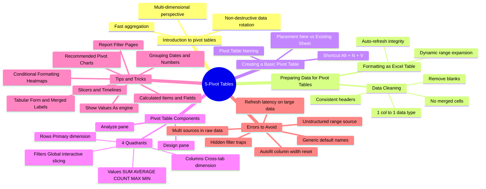
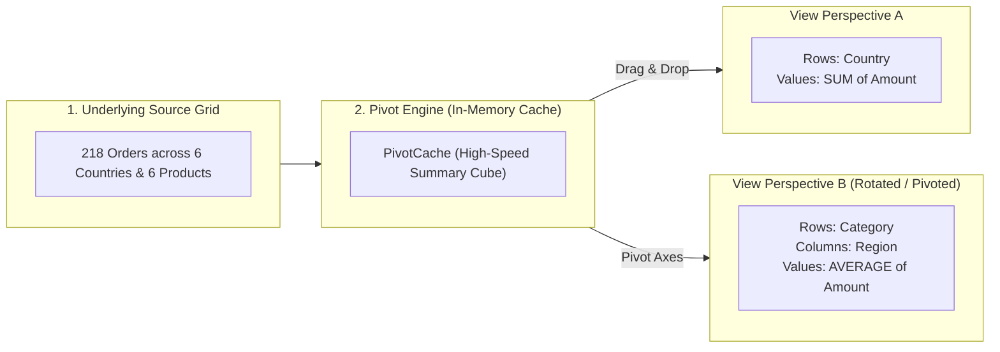
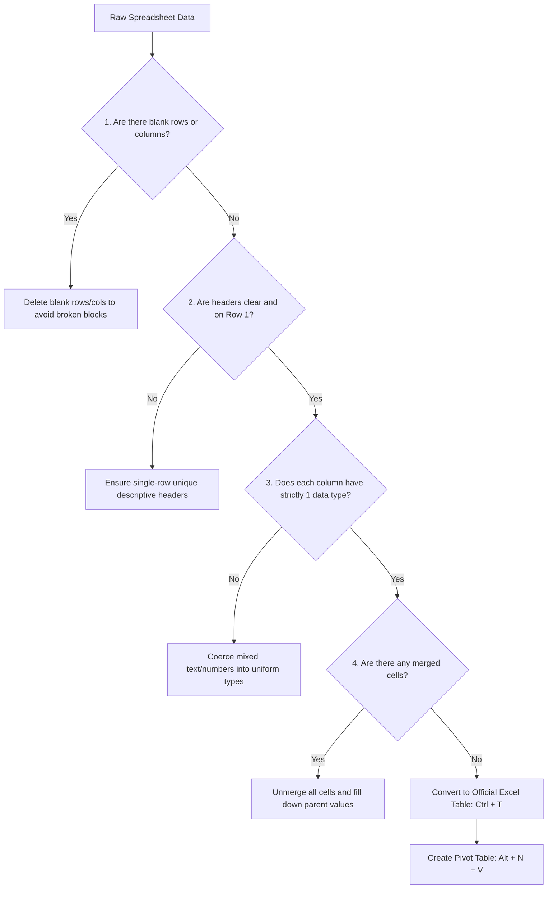
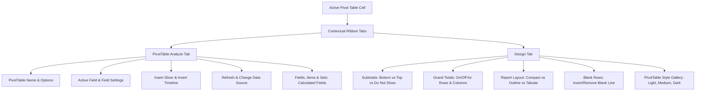

# Lesson 5.1: Pivot Table Foundations & Data Preparation Architecture

> [!abstract] Learning Objective
> Master the mechanical and architectural foundations of Pivot Tables. Learn how to audit and prepare raw tabular data according to the 4 strict cleaning rules, initialize Pivot Tables using dynamic table references and keyboard shortcuts (`Alt + N + V`), navigate contextual ribbon tools (Analyze vs. Design), and leverage the 4 layout quadrants (Rows, Columns, Values, Filters) to summarize multidimensional business datasets in seconds without formulas.

> 🎥 **Video Chapter**: [Chapter 5 – Pivot Tables (2:58:28)](https://www.youtube.com/watch?v=uv1bxe2gdnU&t=10708s)  
> 📁 **Companion Demo Workbook**: [`Module_5_Demo.xlsx`](file:///d:/courses/Data%20Analysis%2026-27/7-Introducation%20to%20Data%20Fields%20(Excel)/11_Demos_and_Workbooks/05_Pivot_Tables/Module_5_Demo.xlsx) (Sheets: `What is pivot table`, `Sample Data`, `Retail_part_1 `, `Retail_part_2`)  
> 🗺️ **Visual Architecture**: Based on the course mindmap [`assets/module_5_pivot_tables_mindmap.png`](file:///d:/courses/Data%20Analysis%2026-27/7-Introducation%20to%20Data%20Fields%20(Excel)/assets/module_5_pivot_tables_mindmap.png)

---

## 1. Module 5 Architecture Mindmap

The entire lifecycle of building, optimizing, and governing Pivot Tables in Microsoft Excel is organized into six interconnected branches:



---

## 2. What is a Pivot Table & Why is it Called "Pivot"?

As demonstrated in the companion workbook [`Module_5_Demo.xlsx`](file:///d:/courses/Data%20Analysis%2026-27/7-Introducation%20to%20Data%20Fields%20(Excel)/11_Demos_and_Workbooks/05_Pivot_Tables/Module_5_Demo.xlsx) (*Sheet: `What is pivot table`*):

> **Core Definition**:  
> A **Pivot Table** is an interactive engine built into Microsoft Excel used to rapidly summarize, aggregate, explore, and analyze large datasets without writing complex multi-condition array formulas (`SUMIFS`, `COUNTIFS`).
>
> *(أداة في برنامج Excel تُستخدم لتلخيص وتحليل مجموعات البيانات الكبيرة بسرعة)*

### The Meaning of "Pivot"
It is called a **Pivot** because you can literally rotate the dataset around its axes—turning rows into columns and columns into rows—to examine the same underlying business records from completely different analytical angles without modifying a single cell of the original source data:



---

## 3. Preparing Data for Pivot Tables (The 4 Golden Rules)

A Pivot Table is only as reliable as the underlying table structure. Feeding dirty or poorly structured data into a Pivot Table leads to missing totals, duplicate categories, or outright calculation errors.

Before creating a Pivot Table, always verify the **Data Cleaning & Structure Checklist**:



### The 4 Data Preparation Rules

| # | Preparation Rule | Why It Matters | Failure Symptom in Pivot Table |
|---|---|---|---|
| **1** | **Remove Blanks** | Entirely blank rows can cause Excel to miscalculate the range boundary. Blank values in key fields create an unwanted `(blank)` category row. | Pivot totals don't match source grand totals; confusing `(blank)` line items appear. |
| **2** | **Consistent Headers** | Pivot Tables require every single column to have a non-empty, unique, single-row text label. | Excel throws error: *"The PivotTable field name is not valid. You must use data that is organized as a list with labeled columns."* |
| **3** | **1 Column = 1 Data Type** | Numerical columns must not contain text strings like `"N/A"`, `"pending"`, or space characters. | A single text entry forces Excel to default to **`COUNT`** instead of **`SUM`** when dragged into Values! |
| **4** | **No Merged Cells** | Merged cells only hold data in the top-left cell. All other merged cells evaluate to `NULL` / blank. | Sub-rows lose their category affiliation and group under `(blank)`. |

### Formatting as an Official Excel Table (`Ctrl + T`)
Always convert the raw range into an official Excel Table (`Ctrl + T` or `Ctrl + L`) before invoking the Pivot Table command.
- **Dynamic Source Expansion**: When you paste new transactions into an Excel Table, the table automatically expands. When you right-click the Pivot Table and click **Refresh** (`Alt + F5`), the Pivot Table captures the new rows immediately without manually updating the data source coordinates.

---

## 4. Creating a Basic Pivot Table

### Keyboard Shortcut Workflow
1. Select any cell inside your source table (`Table2` in sheet `Sample Data`).
2. Press the ribbon acceleration keys sequentially:
   - **`Alt + N + V`** (Insert > PivotTable)
   - Or in modern Excel 365: **`Alt + N + V + T`** (From Table/Range)
3. In the dialog, choose **New Worksheet** (recommended for clean dashboard organization) or **Existing Worksheet**.
4. Click **OK**.

```
┌────────────────────────────────────────────────────────┐
│ Create PivotTable                                  [X] │
├────────────────────────────────────────────────────────┤
│ Choose the data that you want to analyze:              │
│  (•) Select a table or range                           │
│      Table/Range: Table2                               │
│                                                        │
│ Choose where you want the PivotTable report placed:    │
│  (•) New Worksheet                                     │
│  ( ) Existing Worksheet: _________________             │
│                                                        │
│ [OK]                                        [Cancel]   │
└────────────────────────────────────────────────────────┘
```

> [!TIP] Pro Tip: Naming Your Pivot Table Immediately
> As soon as the Pivot Table is initialized, go to **PivotTable Analyze > PivotTable Name** (leftmost group in the ribbon) and rename it from the generic `PivotTable1` to a clear, functional name like `pt_CountrySales` or `pt_CategorySummary`. This is mandatory for professional workbooks that contain multiple tables and slicers.

---

## 5. Pivot Table Components & Contextual Ribbons

When you click inside any Pivot Table, two contextual tabs appear on the Excel Ribbon:



### The 4 Pivot Table Drop Zones (Quadrants)

In the **PivotTable Fields** task pane (toggle on/off via `PivotTable Analyze > Field List`), you drag column fields into four functional zones:

```
┌──────────────────────────────────────────────────────────────┐
│  PIVOTTABLE FIELDS                                           │
│  Choose fields to add to report:                             │
│  [X] Order ID    [X] Product     [X] Country     [X] Month   │
│  [X] Date        [X] Category    [X] Region      [X] Amount  │
├──────────────────────────────┬───────────────────────────────┤
│  FILTERS                     │  COLUMNS                      │
│  ┌────────────────────────┐  │  ┌─────────────────────────┐  │
│  │ Category               │  │  │ Region                  │  │
│  └────────────────────────┘  │  └─────────────────────────┘  │
├──────────────────────────────┼───────────────────────────────┤
│  ROWS                        │  VALUES                       │
│  ┌────────────────────────┐  │  ┌─────────────────────────┐  │
│  │ Country                │  │  │ Sum of Amount           │  │
│  │ Product                │  │  │ Average of Amount       │  │
│  └────────────────────────┘  │  └─────────────────────────┘  │
└──────────────────────────────┴───────────────────────────────┘
```

1. **Rows (Primary Dimension)**:
   - Categorical dimensions placed here stack vertically.
   - Example: Placing `Country` on Rows groups all 218 transactions into distinct country lines (`Australia`, `Canada`, `France`, `Germany`, `New Zealand`, `UK`, `US`).
2. **Columns (Cross-Tabulation Dimension)**:
   - Categorical dimensions placed here distribute horizontally across the top header.
   - Example: Placing `Region` or `Category` creates a two-dimensional matrix.
3. **Values (Aggregation Engine)**:
   - Numerical metrics placed here are mathematically computed.
   - **`SUM`**: Used for additive quantities (e.g. `Sum of Amount`, `Sum of SalesAmount`).
   - **`AVERAGE`**: Used for unit metrics, prices, and test scores.
   - **`COUNT` / `COUNTA`**: Used for counting occurrences or text IDs (`Count of OrderID`).
   - **`MAX` / `MIN`**: Peak and floor values.
4. **Filters (Global Page-Level Filter)**:
   - Placed above the grid to slice the entire table by a top-level category without crowding the row/column headers.

---

## 6. Step-by-Step Hands-on Walkthrough: `Sample Data`

Using the dataset from [`Module_5_Demo.xlsx`](file:///d:/courses/Data%20Analysis%2026-27/7-Introducation%20to%20Data%20Fields%20(Excel)/11_Demos_and_Workbooks/05_Pivot_Tables/Module_5_Demo.xlsx) (*Sheet: `Sample Data`*):

### Objective: Build an Executive Country vs. Category Revenue Matrix
1. **Source Inspection**:
   - Sheet: `Sample Data`
   - Records: 216 orders (Rows 4 to 218).
   - Table Name: `Table2`.
   - Key Fields: `Country`, `Category`, `Product`, `Amount`.
2. **Creation**:
   - Click anywhere in `Table2`. Press **`Alt + N + V`** -> Enter.
   - Rename Pivot Table to `pt_RevenueMatrix`.
3. **Field Configuration**:
   - Drag `Country` to **Rows**.
   - Drag `Category` to **Columns** (`Fruit` vs `Vegetables`).
   - Drag `Amount` to **Values** (defaults to `Sum of Amount`).
4. **Number Formatting**:
   - Right-click any number in the table -> click **Value Field Settings...** (`Alt + H + V + S`).
   - Click **Number Format** button in lower left.
   - Choose **Currency** (`$#,##0`) or **Number** with thousands separator (`#,##0`).
   - Click **OK**.
5. **Layout Polish**:
   - Go to **Design > Report Layout > Show in Tabular Form**.
   - Go to **Design > Report Layout > Repeat All Item Labels**.
   - In **Design > PivotTable Styles**, select a professional style (e.g., *Pivot Style Medium 9*).

### The Resulting Cross-Tabulation Grid
```
┌──────────────┬─────────────┬─────────────┬─────────────┐
│ Country      │ Fruit       │ Vegetables  │ Grand Total │
├──────────────┼─────────────┼─────────────┼─────────────┤
│ Australia    │ $35,420     │ $42,180     │ $77,600     │
│ Canada       │ $48,910     │ $39,640     │ $88,550     │
│ France       │ $31,250     │ $28,900     │ $60,150     │
│ Germany      │ $42,800     │ $51,320     │ $94,120     │
│ New Zealand  │ $29,670     │ $34,110     │ $63,780     │
│ UK           │ $44,530     │ $48,220     │ $92,750     │
│ US           │ $58,940     │ $62,490     │ $121,430    │
├──────────────┼─────────────┼─────────────┼─────────────┤
│ Grand Total  │ $291,520    │ $306,860    │ $598,380    │
└──────────────┴─────────────┴─────────────┴─────────────┘
```

---

## 7. Knowledge Check & Self-Audit

> [!question] Audit Question 1: What happens if a date column has a single text string `"TBD"` in row 45?
> **Answer**: When dragged into the **Values** zone, Excel detects non-numeric entries and automatically defaults the aggregation function to **`COUNT`** instead of **`SUM`**. Furthermore, date grouping (Years/Quarters/Months) will be completely disabled.

> [!question] Audit Question 2: Why should you never use the Home tab to format numbers in a Pivot Table?
> **Answer**: Formatting cells using the Home ribbon applies formatting to the current static coordinate cells (`B4:D11`). As soon as you collapse, expand, or slice the Pivot Table, new rows appear unformatted! Always use **Value Field Settings > Number Format**, which binds formatting to the underlying field definition in the PivotCache.

---

## 8. Navigation & Next Steps
- **Next Lesson**: [[02_Advanced_Calculations_and_Show_Values_As]] — Master the "Show Values As" calculation engine (% of Grand Total, % of Column Total, Difference From, Running Totals).
- **Deep-Dive Concepts**: [[Pivot Tables]], [[01_Excel_Tables_Architecture]]
- **Practice Workbook**: [`Module_5_Demo.xlsx`](file:///d:/courses/Data%20Analysis%2026-27/7-Introducation%20to%20Data%20Fields%20(Excel)/11_Demos_and_Workbooks/05_Pivot_Tables/Module_5_Demo.xlsx)
