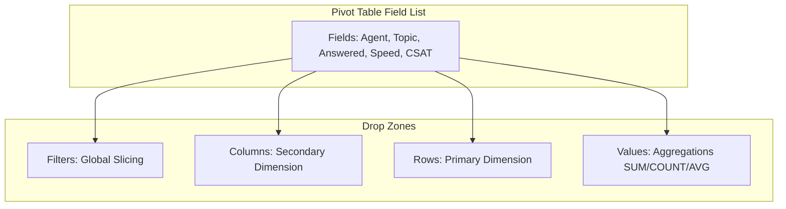

# Lesson 5.1: Pivot Table Architecture & Field Layouts

> [!abstract] Learning Objective
> Create dynamic Pivot Tables from structured tables, configure Row, Column, Value, and Filter drop zones, and execute instant aggregations without writing code.

> 🎥 **Video Chapter**: [Chapter 5 – Pivot Tables (2:58:28)](https://www.youtube.com/watch?v=uv1bxe2gdnU&t=10708s)

## The 4 Quadrants of a Pivot Table

## Step-by-Step Creation
1. Select source table (`CallData`).
2. Go to **Insert > PivotTable** (`Alt + N + V + T`).
3. Choose *New Worksheet*.
4. Drag `Agent` to **Rows**.
5. Drag `Call Id` to **Values** (defaults to `Count of Call Id`).
6. Drag `Satisfaction rating` to **Values** -> change Summarize By to **Average**.

## Related Knowledge
- Concepts: [[Pivot Tables]]
- Projects: [[Hotel Reservation Analysis]], [[Call Center Performance Analysis]]
