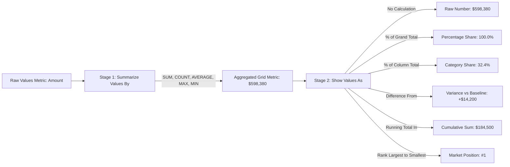
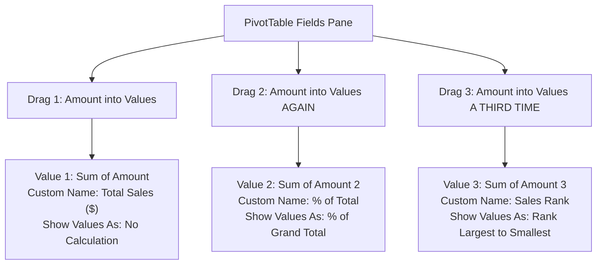

# Lesson 5.2: Advanced Calculations & Show Values As Engine

> [!abstract] Learning Objective
> Transform raw numerical summaries into actionable analytical insights using Excel's built-in **Show Values As** calculation engine. Learn how to construct percentage share distributions (% of Grand Total, % of Column Total, % of Parent Row), running totals over time, benchmark variance comparisons (Difference From, % Difference From), and instant ordinal rankings without writing a single Excel formula or DAX measure.

> 🎥 **Video Chapter**: [Chapter 5 – Pivot Tables (2:58:28)](https://www.youtube.com/watch?v=uv1bxe2gdnU&t=10708s)  
> 📁 **Companion Demo Workbook**: [`Module_5_Demo.xlsx`](file:///d:/courses/Data%20Analysis%2026-27/7-Introducation%20to%20Data%20Fields%20(Excel)/11_Demos_and_Workbooks/05_Pivot_Tables/Module_5_Demo.xlsx) (Sheet: `Sample Data`)  
> 🗺️ **Mindmap Focus**: *5-Pivot Tables > Tips and Tricks > Show values as*

---

## 1. The Two Engines of Value Field Settings

In a standard Excel cell, calculating category percentages or period-over-period differences requires nested formulas with mixed locks (e.g. `=C4/SUM($C$4:$C$10)`). In a Pivot Table, the entire calculation is executed within the **Value Field Settings** dialog.

Every field placed into the **Values** quadrant possesses two distinct computational stages:

### Accessing Value Field Settings
1. Right-click any numerical cell inside the Pivot Table.
2. Select **Value Field Settings...** (`Alt + H + V + S`).
3. The dialog contains two tabs:
   - **Summarize Values By**: Defines the baseline mathematical aggregation (`SUM`, `COUNT`, `AVERAGE`, `MAX`, `MIN`, `PRODUCT`, `DISTINCT COUNT` if in Data Model).
   - **Show Values As**: Defines the secondary transformation applied to the aggregated values.

---

## 2. High-Yield "Show Values As" Calculation Catalog

Excel provides 15 different calculation modes. As highlighted in the course mindmap, eight modes form the foundation of professional business analytics:

| Calculation Mode | Mathematical Logic | Business Analytics Use Case | Required Configuration |
|---|---|---|---|
| **`% of Grand Total`** | $\frac{\text{Cell Value}}{\text{Overall Pivot Grand Total}}$ | Determining company-wide revenue contribution by product or country. | None (Universal). |
| **`% of Column Total`** | $\frac{\text{Cell Value}}{\text{Column Subtotal}}$ | Comparing product mix within individual regions or countries. | None. |
| **`% of Row Total`** | $\frac{\text{Cell Value}}{\text{Row Subtotal}}$ | Evaluating market share distribution across channels. | None. |
| **`% of Parent Total`** | $\frac{\text{Cell Value}}{\text{Immediate Parent Group Total}}$ | Multi-tier hierarchies: Product share within its parent Category (`Fruit` or `Vegetables`). | **Base Field**: Select parent field (e.g. `Category`). |
| **`Difference From`** | $\text{Current Cell} - \text{Base Item Value}$ | Absolute variance against a benchmark period (e.g., variance vs `July 2019` or vs `US`). | **Base Field** & **Base Item** (e.g. `(previous)` or specific item). |
| **`% Difference From`** | $\frac{\text{Current Cell} - \text{Base Item Value}}{\text{Base Item Value}}$ | Percentage growth or decline rate vs baseline / prior period (MoM / YoY). | **Base Field** & **Base Item** (e.g. `(previous)`). |
| **`Running Total In`** | $\sum_{t=1}^{\text{current}} \text{Value}_t$ | Cumulative revenue pacing toward annual quotas. | **Base Field**: Select chronological field (`Month` or `Date`). |
| **`Rank Largest to Smallest`** | Ordinal position ($1, 2, 3, \dots, N$) | League tables, top sales reps, top products by volume. | **Base Field**: Field to rank within (`Country` or `Product`). |

---

## 3. The Multi-Metric Comparison Pattern (Side-by-Side Analysis)

A classic analytical best practice is to drag the **SAME field into the Values zone multiple times** to display the absolute figure and its relative percentage share side-by-side:

### Resulting Dual-Metric Table (`Sample Data`):
| Country | Total Sales ($) | % of Total | Sales Rank |
| :--- | :---: | :---: | :---: |
| **US** | $121,430 | 20.3% | **#1** |
| **Germany** | $94,120 | 15.7% | **#2** |
| **UK** | $92,750 | 15.5% | **#3** |
| **Canada** | $88,550 | 14.8% | **#4** |
| **Australia** | $77,600 | 13.0% | **#5** |
| **New Zealand** | $63,780 | 10.7% | **#6** |
| **France** | $60,150 | 10.1% | **#7** |
| **Grand Total** | **$598,380** | **100.0%** | — |

> [!TIP] Renaming Pivot Value Columns
> Excel names duplicate fields `Sum of Amount 2`. You can overwrite this header directly by typing in the cell or changing **Custom Name** in Value Field Settings.  
> *Gotcha*: Excel will not allow you to name a field with the exact same name as the raw column (`Amount`).  
> *Pro Hack*: Add a trailing space at the end of the name (`"Amount "` or `"Total Sales "`)! Excel treats it as a distinct string while looking clean to stakeholders.

---

## 4. Step-by-Step Walkthrough: Month-over-Month Variance Analysis

Using [`Module_5_Demo.xlsx`](file:///d:/courses/Data%20Analysis%2026-27/7-Introducation%20to%20Data%20Fields%20(Excel)/11_Demos_and_Workbooks/05_Pivot_Tables/Module_5_Demo.xlsx) (*Sheet: `Sample Data`*):

### Objective: Calculate Monthly Sales, Cumulative Running Total, and MoM % Growth
1. **Initialize Pivot Table**:
   - Source: `Table2`.
   - Name: `pt_MonthlyPerformance`.
   - Drag `Month` to **Rows**.
2. **Add Metric 1 (Monthly Revenue)**:
   - Drag `Amount` to **Values**.
   - Custom Name: `Monthly Revenue`.
   - Number Format: Currency (`$#,##0`).
3. **Add Metric 2 (Cumulative Running Total)**:
   - Drag `Amount` to **Values** again.
   - Right-click column > **Value Field Settings**.
   - Custom Name: `Cumulative Revenue`.
   - Go to **Show Values As** tab:
     - Select **Running Total In**.
     - Base Field: `Month`.
   - Number Format: Currency (`$#,##0`).
4. **Add Metric 3 (MoM % Variance)**:
   - Drag `Amount` to **Values** a third time.
   - Right-click column > **Value Field Settings**.
   - Custom Name: `MoM Growth %`.
   - Go to **Show Values As** tab:
     - Select **% Difference From**.
     - Base Field: `Month`.
     - Base Item: **`(previous)`**.
   - Number Format: Percentage (`0.0%`).

### Resulting Monthly Analysis Matrix
| Month | Monthly Revenue | Cumulative Revenue | MoM Growth % | Performance Indicator |
| :--- | :---: | :---: | :---: | :---: |
| **July** | $84,320 | $84,320 | — | Baseline Month |
| **August** | $112,650 | $196,970 | `+33.6%` | 🟢 Strong Expansion |
| **September** | $98,410 | $295,380 | `-12.6%` | 🔴 Seasonal Dip |
| **October** | $145,200 | $440,580 | `+47.5%` | 🟢 Peak Q4 Surge |
| **November** | $157,800 | $598,380 | `+8.7%` | 🟢 Continued Growth |
| **Total** | **$598,380** | **$598,380** | — | **Full Period** |

---

## 5. Important Nuances & Edge Cases

> [!WARNING] The First Item in Difference From Calculations
> When calculating `Difference From` or `% Difference From` with Base Item set to `(previous)`, the first chronological record (`July`) will always be blank (`#N/A` or empty). This is mathematically correct because no preceding baseline exists in the dataset.

> [!IMPORTANT] Number Format Persistence Rule
> If you apply percentage formatting to `% of Grand Total` using the Home ribbon (`Ctrl + Shift + %`), the formatting will break whenever fields are rearranged or refreshed. **Always format inside Value Field Settings > Number Format**.

---

## 6. Knowledge Check & Self-Audit

> [!question] Audit Question 1: What is the difference between `% of Column Total` and `% of Parent Total`?
> **Answer**: `% of Column Total` divides the cell value by the bottom-most column grand total. `% of Parent Total` divides the cell value by the subtotal of its immediate parent row group in a multi-level hierarchy (e.g. dividing Carrot sales by total Vegetable sales, rather than by total store sales).

> [!question] Audit Question 2: Can you sort a Pivot Table by a "Show Values As" metric?
> **Answer**: Yes! You can right-click any value in the `% of Total` or `Rank` column, select **Sort > Sort Largest to Smallest**, and the Pivot Table will instantly reorder the row dimensions according to their percentage share.

---

## 7. Navigation & Next Steps
- **Next Lesson**: [[03_Grouping_and_Calculated_Fields]] — Learn date/number grouping, calculated fields, list formulas, and conditional formatting heatmaps.
- **Previous Lesson**: [[01_Pivot_Table_Foundations]] — Foundations, data cleaning, and 4 drop zones.
- **Companion Workbook**: [`Module_5_Demo.xlsx`](file:///d:/courses/Data%20Analysis%2026-27/7-Introducation%20to%20Data%20Fields%20(Excel)/11_Demos_and_Workbooks/05_Pivot_Tables/Module_5_Demo.xlsx)
