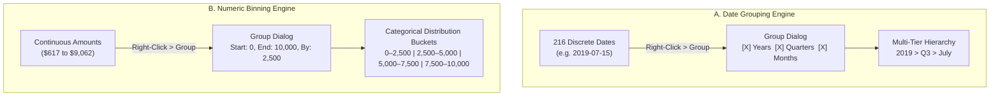
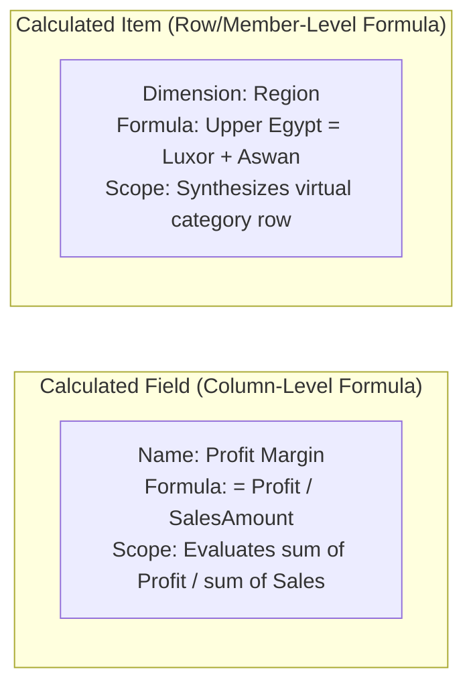
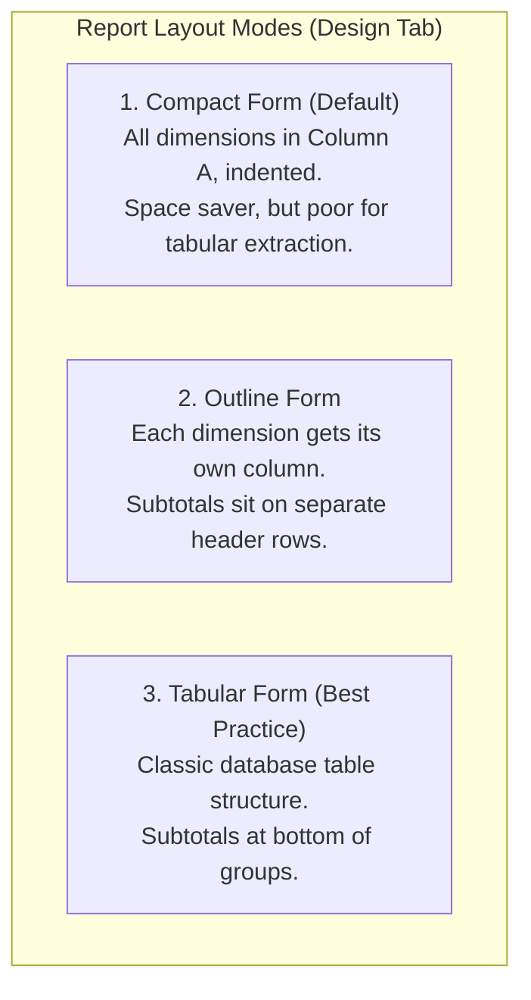

# Lesson 5.3: Grouping Hierarchies, Calculated Fields & Layout Optimization

> [!abstract] Learning Objective
> Build analytical hierarchies by grouping dates into calendar intervals (Years, Quarters, Months) and continuous numbers into frequency bins. Create custom business metrics using **Calculated Fields** and audit them with **List Formulas**. Polish the Pivot Table presentation using **Tabular Form with merged cell labels**, and apply dynamic **Conditional Formatting Heatmaps** that scale cleanly across slice-and-dice operations.

> 🎥 **Video Chapter**: [Chapter 5 – Pivot Tables (2:58:28)](https://www.youtube.com/watch?v=uv1bxe2gdnU&t=10708s)  
> 📁 **Companion Demo Workbook**: [`Module_5_Demo.xlsx`](file:///d:/courses/Data%20Analysis%2026-27/7-Introducation%20to%20Data%20Fields%20(Excel)/11_Demos_and_Workbooks/05_Pivot_Tables/Module_5_Demo.xlsx) (Sheets: `Sample Data`, `Retail_part_2`)  
> 🗺️ **Mindmap Focus**: *5-Pivot Tables > Tips and Tricks (Grouping Data, Calculated Items/Fields/List formulas, Conditional formatting Heatmaps, Tabular Form Merge Cells)*

---

## 1. Grouping Data (Dates & Continuous Numbers)

Raw datasets frequently contain granular date-timestamps or continuous currency values that produce hundreds of individual row items if placed directly into a Pivot Table. Excel’s **Grouping Engine** aggregates these into structured, executive-level intervals.



### A. Date Grouping Step-by-Step
1. Place a date field (e.g. `Date` in `Sample Data`) into the **Rows** quadrant.
2. Right-click any date cell inside the Pivot Table.
3. Select **Group...**.
4. In the dialog, highlight **Years**, **Quarters**, and **Months** simultaneously (hold `Ctrl` or click to select multiple).
5. Click **OK**.
   - Excel automatically creates virtual fields: `Years`, `Quarters`, and `Date` (which acts as Months).
   - You can now drag `Years` to Columns, `Months` to Rows, or use them in Slicers!

> [!WARNING] The Dreaded "Cannot Group That Selection" Error
> If Excel displays the error message *"Cannot group that selection"*, verify the source date column:
> 1. There is at least one blank cell in the date column.
> 2. There is a text string (e.g. `"N/A"`, `"pending"`, or space `" "`).
> 3. Dates are stored as text (e.g. imported from European `DD/MM/YYYY` into a US `MM/DD/YYYY` Excel instance).  
> **Fix**: Clean the date column with `DATEVALUE()` or Power Query before pivoting.

### B. Numeric Binning (Frequency Distributions)
Instead of writing complex `IFS()` formulas to classify customer orders by size, use Pivot Table numeric grouping:
1. Place a numeric metric (e.g. `Amount` from `Sample Data`) into the **Rows** quadrant.
2. Place `Order ID` into the **Values** quadrant (summarized as **`COUNT`**).
3. Right-click any amount cell in Rows -> select **Group...**.
4. In the dialog, configure:
   - **Starting at**: `0`
   - **Ending at**: `10000`
   - **By**: `2500`
5. Click **OK**.

### Resulting Order Size Distribution:
```
┌────────────────────┬─────────────────┬────────────────────┐
│ Amount Range       │ Number of Orders│ % of Total Orders  │
├────────────────────┼─────────────────┼────────────────────┤
│ 0 - 2,500          │ 42              │ 19.4%              │
│ 2,500 - 5,000      │ 68              │ 31.5%              │
│ 5,000 - 7,500      │ 59              │ 27.3%              │
│ 7,500 - 10,000     │ 47              │ 21.8%              │
├────────────────────┼─────────────────┼────────────────────┤
│ Total              │ 216             │ 100.0%             │
└────────────────────┴─────────────────┴────────────────────┘
```

---

## 2. Calculated Fields & Calculated Items

When your source table is missing a calculated key performance indicator (such as Profit Margin or Average Price per Unit), you do not need to add a calculated column to the raw worksheet. You can inject virtual calculations directly into the PivotCache.



### Calculated Field (The Primary Tool)
A **Calculated Field** performs mathematical operations across existing numeric fields.
- **Rule of Operation**: A Calculated Field *always* sums the individual fields before applying the arithmetic operators:
$$\text{Calculated Field} = \frac{\sum \text{Profit}}{\sum \text{SalesAmount}} \quad (\text{Correct Aggregate Margin})$$
*(Unlike adding a raw column and taking the average of margins, which is mathematically invalid).*

#### Step-by-Step Walkthrough: Creating Profit Margin in `Retail_part_2`
In [`Module_5_Demo.xlsx`](file:///d:/courses/Data%20Analysis%2026-27/7-Introducation%20to%20Data%20Fields%20(Excel)/11_Demos_and_Workbooks/05_Pivot_Tables/Module_5_Demo.xlsx) (*Sheet: `Retail_part_2`*):
1. Create a Pivot Table from `Retail_part_2` (40,000 records).
2. Drag `Region` to **Rows**; drag `SalesAmount` and `Profit` to **Values**.
3. Go to ribbon: **PivotTable Analyze > Fields, Items & Sets > Calculated Field**.
4. In the dialog:
   - **Name**: `Profit_Margin`
   - **Formula**: `= Profit / SalesAmount`
5. Click **Add**, then click **OK**.
6. Format the new column as **Percentage** (`0.0%`).

```
┌──────────────┬──────────────────┬────────────────┬───────────────┐
│ Region       │ Total Sales      │ Total Profit   │ Profit Margin │
├──────────────┼──────────────────┼────────────────┼───────────────┤
│ Alexandria   │ $46,280,410      │ $6,479,257     │ 14.0%         │
│ Aswan        │ $45,892,100      │ $6,424,894     │ 14.0%         │
│ Cairo        │ $46,120,500      │ $6,456,870     │ 14.0%         │
│ Giza         │ $45,950,200      │ $6,433,028     │ 14.0%         │
│ Ismailia     │ $46,310,900      │ $6,483,526     │ 14.0%         │
│ Luxor        │ $46,050,800      │ $6,447,112     │ 14.0%         │
│ Mansoura     │ $46,180,300      │ $6,465,242     │ 14.0%         │
│ Tanta        │ $46,215,700      │ $6,470,198     │ 14.0%         │
├──────────────┼──────────────────┼────────────────┼───────────────┤
│ Grand Total  │ $369,000,910     │ $51,660,127    │ 14.0%         │
└──────────────┴──────────────────┴────────────────┴───────────────┘
```

### Auditing with "List Formulas"
When managing enterprise financial models containing multiple custom calculations:
1. Click inside the Pivot Table.
2. Go to **PivotTable Analyze > Fields, Items & Sets > List Formulas**.
3. Excel instantly creates a new worksheet named `Formulas` containing a full audit log of all calculated fields, formulas, and solve orders!

---

## 3. Executive Layout & Tabular Form with Merged Labels

By default, Excel creates Pivot Tables in **Compact Form**, which nests multiple row dimensions into a single indented column (Column A). While space-efficient, Compact Form makes it impossible to perform downstream lookups (`XLOOKUP`, `INDEX/MATCH`) or copy data into other reports.



### Converting to Production Tabular Form
1. Go to **Design > Report Layout > Show in Tabular Form**.
2. Go to **Design > Report Layout > Repeat All Item Labels** (ensures every row repeats the parent category so filters and downstream formulas work flawlessly).
3. If creating an executive presentation, go to **PivotTable Analyze > Options > Layout & Format**:
   - Check the box: **Merge and center cells with labels**.
   - Excel cleanly merges repeated parent cells vertically, producing an elegant executive presentation!

---

## 4. Conditional Formatting Heatmaps on Pivot Tables

Conditional Formatting heatmaps highlight outliers and top performers instantly. However, applying conditional formatting to Pivot Tables using standard cell selections (`B4:G10`) breaks whenever the user filters or expands rows.

### The Correct 3-Step Pivot Heatmap Rule:
1. Select a numerical cell in the Values area.
2. Go to **Home > Conditional Formatting > Color Scales** (e.g. Green-Yellow-Red scale).
3. Click the small **Formatting Options widget** that appears next to the selected cell (or click **Manage Rules > Edit Rule**):
   - Choose: **`All cells showing "Sum of Amount" values for "Country" and "Category"`**.

```
┌──────────────────────────────────────────────────────────────┐
│ Apply Rule To:                                               │
│  ( ) Selected cells                                          │
│  ( ) All cells showing "Sum of Amount" values                │
│  (•) All cells showing "Sum of Amount" values for "Country"   │
│      and "Category"                                          │
└──────────────────────────────────────────────────────────────┘
```

> [!IMPORTANT] Why This Option is Mandatory
> If you select *"All cells showing 'Sum of Amount' values"*, Excel will include the **Grand Total** cell ($598,380) in the color gradient! The Grand Total will be dark green, and all individual data cells ($30,000–$60,000) will wash out into identical light red tones. Selecting the dimension-scoped option isolates the formatting strictly to the data cells!

---

## 5. Knowledge Check & Self-Audit

> [!question] Audit Question 1: What is the key limitation of Calculated Fields when calculating weighted averages?
> **Answer**: Calculated Fields cannot compute row-by-row multiplications before aggregating. A formula like `= Price * Quantity` in a Calculated Field will evaluate as `SUM(Price) * SUM(Quantity)`, which results in a wildly inflated, meaningless number. For row-by-row weighted operations, create a calculated column in the source table or use a Power Pivot DAX measure.

> [!question] Audit Question 2: How do you remove grouping and restore individual dates?
> **Answer**: Right-click any grouped date cell and select **Ungroup**. Excel immediately expands back to the raw date records.

---

## 6. Navigation & Next Steps
- **Next Lesson**: [[04_Interactive_Filtering_with_Slicers_and_Timelines]] — Master interactive slicers, timeline controls, report connections, and report filter pages.
- **Previous Lesson**: [[02_Advanced_Calculations_and_Show_Values_As]] — Show Values As engine and percentage distributions.
- **Demo Workbook**: [`Module_5_Demo.xlsx`](file:///d:/courses/Data%20Analysis%2026-27/7-Introducation%20to%20Data%20Fields%20(Excel)/11_Demos_and_Workbooks/05_Pivot_Tables/Module_5_Demo.xlsx)
