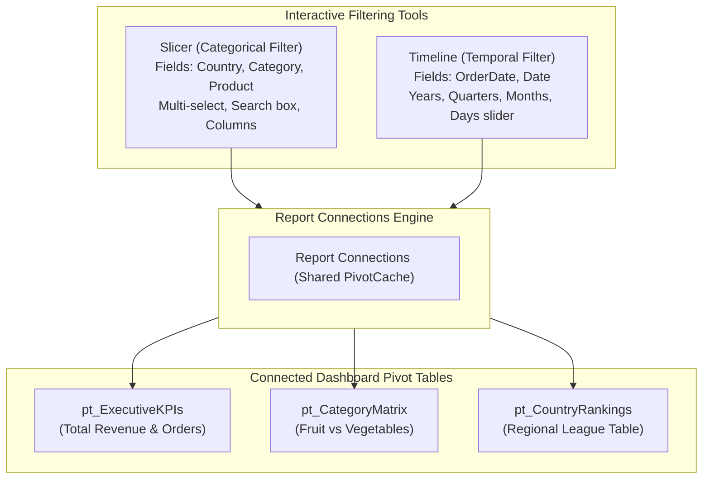
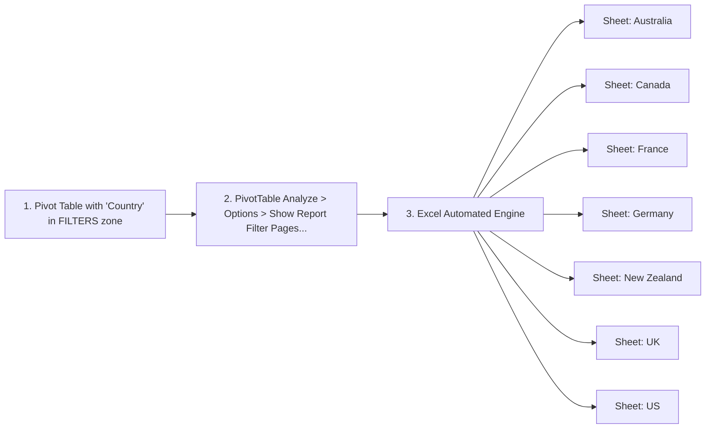
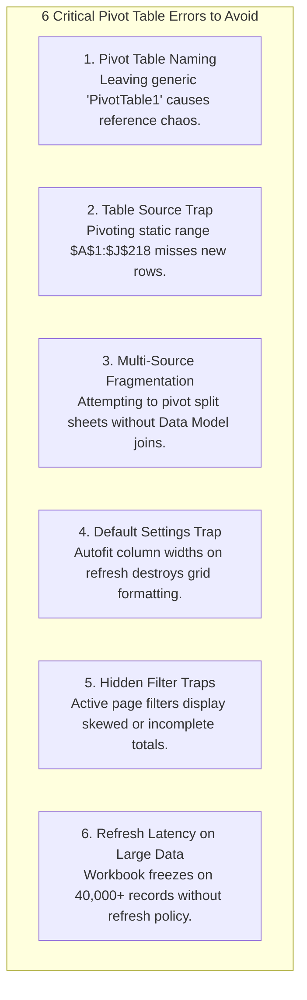

# Lesson 5.4: Slicers, Timelines, Report Filter Pages & Production Pitfalls

> [!abstract] Learning Objective
> Construct interactive analytical dashboards by binding visual Slicers and Timeline controls across multiple Pivot Tables using Report Connections. Discover the automated sheet generation feature **Report Filter Pages**, explore Recommended Pivot Charts, and master the **6 Critical Errors to Avoid** (including source range traps, multi-source fragmentation, default column width overrides, and large data refresh strategies).

> 🎥 **Video Chapter**: [Chapter 5 – Pivot Tables (2:58:28)](https://www.youtube.com/watch?v=uv1bxe2gdnU&t=10708s)  
> 📁 **Companion Demo Workbook**: [`Module_5_Demo.xlsx`](file:///d:/courses/Data%20Analysis%2026-27/7-Introducation%20to%20Data%20Fields%20(Excel)/11_Demos_and_Workbooks/05_Pivot_Tables/Module_5_Demo.xlsx) (Sheets: `Sample Data`, `Retail_part_1 `, `Retail_part_2`)  
> 🗺️ **Mindmap Focus**: *5-Pivot Tables > Tips and Tricks (Slicers & Timelines, Report Filter Pages, Recommended Pivot Charts) & Errors to Avoid*

---

## 1. Visual Filtering Controls (Slicers & Timelines)

Traditional Pivot Table drop-down filters hide what items are selected beneath a collapsed dropdown icon. **Slicers** and **Timelines** provide visible, interactive buttons that allow non-technical business users to filter reports instantly.

### A. Slicers: Features & Keyboard Navigation
- **Inserting a Slicer**:
  1. Select any Pivot Table cell.
  2. Go to **PivotTable Analyze > Insert Slicer**.
  3. Check the desired fields (e.g. `Country` and `Category`) and click **OK**.
- **Multi-Select Mechanics**:
  - Click any button to isolate a single item (e.g. `US`).
  - Hold **`Ctrl`** and click to select multiple non-adjacent items (e.g. `US` + `Germany` + `UK`).
  - Hold **`Shift`** and click to select a contiguous block.
  - Or click the **Multi-Select toggle button** (`Alt + S`) in the top-right header of the slicer.
- **Slicer Search Box**:
  - In modern Excel 365, slicers with dozens of items feature an integrated search box at the top, enabling instant keystroke filtering.
- **Slicer Formatting & Layout**:
  - Select the slicer -> go to the contextual **Slicer** ribbon tab.
  - Set **Columns**: Change from 1 column to 3 or 4 columns to create a horizontal button toolbar across the top of your dashboard!
  - Adjust button height and width for clean touch and mouse interaction.

### B. Timelines (Date-Aware Sliders)
- **Inserting a Timeline**:
  1. Go to **PivotTable Analyze > Insert Timeline**.
  2. Select any valid date field (e.g. `Date` in `Sample Data` or `OrderDate` in `Retail_part_1 `).
  3. Excel displays an interactive time scrubber where you can toggle between **Years**, **Quarters**, **Months**, and **Days** and drag the timeline handles to expand or contract the date window.

---

## 2. Multi-Pivot Dashboard Interactivity via Report Connections

The true power of Slicers emerges when a single slicer controls multiple independent Pivot Tables simultaneously.

### The 4-Step Report Connections Workflow
1. Build multiple Pivot Tables sourced from the same underlying table (`Table2`).
   - `pt_Kpis` (Total Sales & Average Order)
   - `pt_MonthlyTrend` (Sales by Month)
   - `pt_ProductShare` (Sales by Product)
2. Right-click the **Country Slicer** header -> select **Report Connections...**.
3. In the dialog, check the boxes for all three Pivot Tables:
   - `[X] pt_Kpis`
   - `[X] pt_MonthlyTrend`
   - `[X] pt_ProductShare`
4. Click **OK**.
   - Now, clicking `Germany` updates the KPI numbers, monthly trend, and product breakdown simultaneously!

---

## 3. The 1-Click Automation Magic: "Report Filter Pages"

Imagine your executive asks for a separate, fully formatted summary worksheet for every single country in your dataset (`Australia`, `Canada`, `France`, `Germany`, `New Zealand`, `UK`, `US`). Manually copying and filtering seven sheets takes 15 minutes. **Report Filter Pages** does it in **1 second**.

### How to Execute:
1. Build your summary Pivot Table on a clean sheet.
2. Drag the categorical field you wish to split by (e.g. `Country`) into the **FILTERS** quadrant.
3. Click inside the Pivot Table.
4. Go to ribbon: **PivotTable Analyze > Options (small dropdown arrow next to Options on the far left) > Show Report Filter Pages...**.
5. Select `Country` and click **OK**.
6. **Result**: Excel instantly spawns a separate, formatted tab for every unique country, with that country pre-filtered!

---

## 4. Recommended Pivot Charts & Visual Exploration

When exploring a new dataset, you can generate synchronized visual charts instantly:
- **`Alt + F1`**: Creates an instant default Pivot Chart on the active sheet.
- **PivotTable Analyze > PivotChart**: Opens the chart gallery (Clustered Column, Stacked Bar, Line, Treemap, Donut).
- Pivot Charts automatically sync with Pivot Table filters, slicers, and grouping.

---

## 5. The 6 Critical Errors to Avoid in Production

The course mindmap highlights six dangerous traps that cause spreadsheet audits to fail in enterprise environments:

### Detailed Breakdown of the 6 Errors

| # | Error to Avoid | Root Cause & Failure Scenario | Enterprise Best Practice Solution |
|---|---|---|---|
| **1** | **Generic Pivot Names** | Leaving names as `PivotTable1`, `PivotTable2`. In complex workbooks with 10+ tables, Report Connections becomes impossible to manage. | Always rename via **PivotTable Analyze > PivotTable Name** immediately upon creation (e.g. `pt_SalesByCountry`). |
| **2** | **Static Range Source** | Creating a Pivot Table from a raw coordinate range (e.g. `Sheet1!$A$1:$J$218`). When row 219 is added, it is permanently excluded! | Always convert raw data to an official Excel Table (`Ctrl + T`) first. The Pivot Table source will be `Table2`, automatically capturing new records upon refresh. |
| **3** | **Multi Sources in Raw Data** | Having data split across sheets—such as `Retail_part_1 ` (Customer/Category) and `Retail_part_2` (Sales/Profit) in [`Module_5_Demo.xlsx`](file:///d:/courses/Data%20Analysis%2026-27/7-Introducation%20to%20Data%20Fields%20(Excel)/11_Demos_and_Workbooks/05_Pivot_Tables/Module_5_Demo.xlsx). Standard Pivot Tables cannot combine multiple sheets without a join! | Join tables using `XLOOKUP()` on `OrderID`, merge them in **Power Query**, or check **"Add this data to the Data Model"** to create a relational Star Schema in Power Pivot. |
| **4** | **Autofit Column Widths Reset** | By default, every time you refresh a Pivot Table or click a Slicer, Excel auto-resizes column widths, squishing adjacent charts and KPI cards! | Right-click Pivot Table > **PivotTable Options** > Uncheck: **`Autofit column widths on update`**. Now your custom column widths are locked permanently. |
| **5** | **Hidden Active Filters** | An analyst filters for `Year = 2019`, forgets about it, and later reports the Grand Total as the company's full historical revenue. | Look for the funnel filter icon on row/column headers. Use Slicers with clear visible states to ensure active filter transparency. |
| **6** | **Refresh Latency on Large Data** | In large enterprise sheets (like `Retail_part_1 ` with 40,000+ rows), calculating and refreshing multiple Pivot Tables can freeze Excel. | Implement a structured refresh policy: Manual refresh (`Alt + F5` or `Ctrl + Alt + F5` Refresh All), configure **"Refresh data when opening the file"** in PivotTable Options > Data, or utilize Power Pivot in-memory VertiPaq compression. |

---

## 6. Data Refresh Mechanics & Strategies

Unlike formulas, **Pivot Tables do NOT update automatically when you change a cell in the raw data**. Pivot Tables read from an in-memory cache called the **PivotCache**.

### How to Refresh:
1. **Active Pivot Table**: Right-click > **Refresh** or press **`Alt + F5`**.
2. **All Pivot Tables in Entire Workbook**: Press **`Ctrl + Alt + F5`** (Data > Refresh All).
3. **Automated Refresh on Workbook Open**:
   - Right-click Pivot Table > **PivotTable Options**.
   - Go to **Data** tab.
   - Check the box: **`Refresh data when opening the file`**.
   - Check the box: **`Number of items to retain per field: None`** (prevents deleted category names from haunting your slicers as ghost items!).

---

## 7. Knowledge Check & Self-Audit

> [!question] Audit Question 1: Why does a deleted product name still show up in your Slicer?
> **Answer**: By default, Excel's PivotCache retains memory of deleted items. To purge ghost items: Right-click Pivot Table > **PivotTable Options > Data > Retain items deleted from the data source > select `None`**, then refresh (`Alt + F5`).

> [!question] Audit Question 2: In [`Module_5_Demo.xlsx`](file:///d:/courses/Data%20Analysis%2026-27/7-Introducation%20to%20Data%20Fields%20(Excel)/11_Demos_and_Workbooks/05_Pivot_Tables/Module_5_Demo.xlsx), can you build a single standard Pivot Table showing `CustomerName` (from `Retail_part_1 `) and `Profit` (from `Retail_part_2`) directly?
> **Answer**: No! Standard Pivot Tables can only ingest a single flat source range. To combine them, you must either: (1) Bring `CustomerName` into `Retail_part_2` using `=XLOOKUP([@OrderID], Retail_part_1!A:A, Retail_part_1!C:C)`, (2) Merge the queries in Power Query, or (3) Add both tables to the Power Pivot Data Model and establish a 1:1 relationship on `OrderID`.

---

## 8. Navigation & Next Steps
- **Next Module**: [[06_Data_Analysis_Charts/01_Visual_Analytics_and_Chart_Selection]] — Master visual analytics, chart selection, and executive dashboard design.
- **Previous Lesson**: [[03_Grouping_and_Calculated_Fields]] — Grouping, calculated fields, and tabular layout.
- **Reference Guide**: [[Module 5 Dataset Documentation]] — Full schema reference for `Sample Data` and `Retail` tables.
- **Practice Exercises**: [[Ex04_Pivot_Table_Summaries]] — Multi-level practice challenge.
