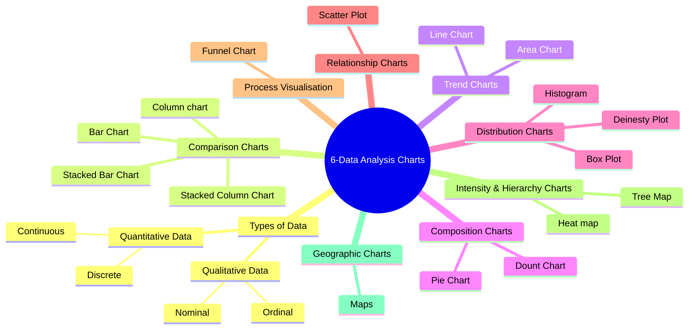
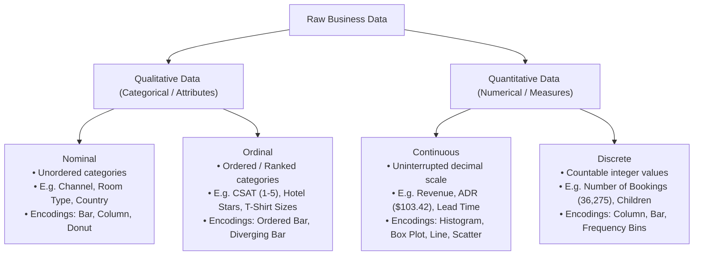
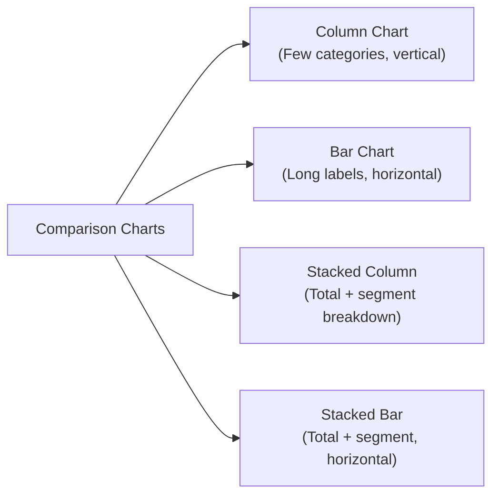
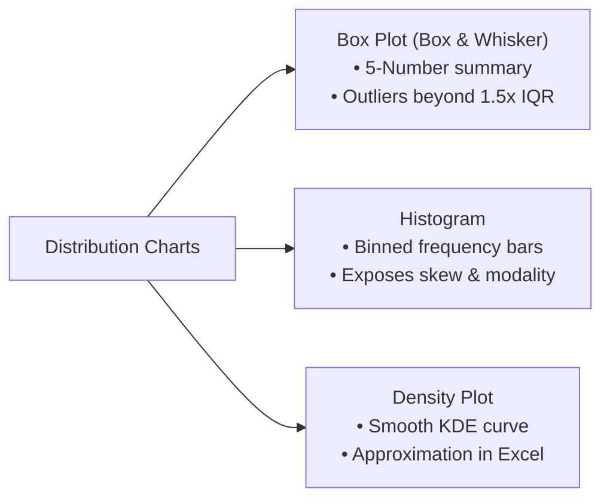

# Lesson 6.1: Visual Analytics, Data Types & The Master Chart Selection Matrix

> [!abstract] Learning Objective
> Master the taxonomy of data visualization in Microsoft Excel. Learn how data types (Qualitative: Nominal vs. Ordinal; Quantitative: Continuous vs. Discrete) dictate chart selection. Navigate all 8 analytical chart families (Comparison, Trend, Composition, Distribution, Relationship, Process, Intensity/Hierarchy, and Geographic) across 17 distinct chart types, understanding their statistical mechanics, perceptual strengths, and step-by-step Excel execution. Ground every visual rule in real-world enterprise datasets from **`Module_6_Demo.xlsx`** (`Sample__Superstore`, 9,994 records) and the Hotel Reservation Dashboard.

> 🎥 **Video Chapter**: [Chapter 6 – Data Analysis Charts (3:26:58)](https://www.youtube.com/watch?v=uv1bxe2gdnU&t=12418s&pp=0gcJCWMAwfN6Pr3D)  
> 📁 **Official Course Demo Workbook**: [`Module_6_Demo.xlsx`](file:///d:/courses/Data%20Analysis%2026-27/7-Introducation%20to%20Data%20Fields%20(Excel)/11_Demos_and_Workbooks/06_Charts_and_Visualizations/Module_6_Demo.xlsx) *(Table: `Sample__Superstore`)*  
> 📁 **Companion Case Study Workbook**: [`4- Hotel Reservation Dashboard.xlsx`](file:///d:/courses/Data%20Analysis%2026-27/7-Introducation%20to%20Data%20Fields%20(Excel)/09_Source_Materials/Module%206/4-%20Hotel%20Reservation%20Dashboard.xlsx)  
> 🗺️ **Visual Taxonomy**: Based on the course mindmap [`assets/module_6_charts_mindmap.png`](file:///d:/courses/Data%20Analysis%2026-27/7-Introducation%20to%20Data%20Fields%20(Excel)/assets/module_6_charts_mindmap.png)

---

## 1. Module 6 Architecture Mindmap

The entire science of visual analytics and chart selection in Excel is structured into data classifications and eight analytical chart families:

```mermaid
flowchart TD
    subgraph MasterRoadmap ["Visual Analytics Master Taxonomy Roadmap"]
        direction TB
        
        subgraph S_Data ["1. Data Classification Layer"]
            direction LR
            D1["<b>Qualitative Data</b><br/>• Nominal (Unordered Groups)<br/>• Ordinal (Ranked Sequence)"]
            D2["<b>Quantitative Data</b><br/>• Continuous (Decimal Scales)<br/>• Discrete (Countable Integers)"]
        end

        subgraph S_Goals ["2. Analytical Purpose Layer"]
            direction LR
            G1["<b>Comparison</b><br/>Magnitude differences"]
            G2["<b>Trends</b><br/>Time evolution"]
            G3["<b>Composition</b><br/>Part-to-whole share"]
            G4["<b>Distribution</b><br/>Spread & outliers"]
            G5["<b>Relationship</b><br/>Bivariate correlation"]
            G6["<b>Process</b><br/>Pipeline conversion"]
            G7["<b>Intensity</b><br/>Matrix & hierarchy"]
            G8["<b>Geographic</b><br/>Spatial distribution"]
        end

        subgraph S_Charts ["3. Production Visual Encodings (Module 6 Demo)"]
            direction LR
            C1["<b>Column & Bar Charts</b><br/>• Clustered Column<br/>• Stacked Column (Sheet1 PivotChart)"]
            C2["<b>Line & Area Charts</b><br/>• Seasonality Trends<br/>• Cumulative Pacing"]
            C3["<b>Donut & Pie Charts</b><br/>• Segment Composition<br/>• Center KPI Scorecard"]
            C4["<b>Box Plot & Histogram</b><br/>• 5-Number Summary<br/>• Frequency Bins"]
            C5["<b>Scatter Plots (XY)</b><br/>• Discount Margin Cliff<br/>• Regression Fit"]
            C6["<b>Funnel Charts</b><br/>• Pipeline Stages"]
            C7["<b>Treemap & Heatmaps</b><br/>• Category Hierarchy<br/>• Regional Matrix"]
            C8["<b>Filled Choropleth Maps</b><br/>• State Sales Density"]
        end

        S_Data ==> S_Goals ==> S_Charts
    end
```

/assets/module_6_charts_mindmap.png)

---

## 2. Foundational Theory: Types of Data

In visual analytics, **data visualization is not an artistic preference—it is cognitive compression grounded in data types**. Choosing the wrong chart produces misleading visual encodings, distorts business realities, and introduces cognitive friction for executive stakeholders.

Every chart selection decision starts by classifying the underlying data:

### A. Qualitative (Categorical) Data
Qualitative data represents labels, descriptions, or classifications rather than measurable numeric amounts.

#### 1. Nominal Data (Names & Unordered Groups)
- **Definition**: Categorical values with **no intrinsic rank, sequence, or quantitative distance**. Changing the order of categories does not alter their meaning.
- **Course Examples (Hotel Reservations)**:
  - `Market Segment`: Online TA, Offline TA/TO, Corporate, Direct, Aviation.
  - `Room Type`: Room_Type_1, Room_Type_4, Room_Type_6.
  - `Country / Origin`: PRT, GBR, FRA, ESP, DEU.
  - `Booking Status`: Canceled vs. Not_Canceled.
- **Allowed Visual Encodings**: Horizontal Bar Charts, Column Charts, Donut Charts, Treemaps.
- **Strict Prohibition**: **Never use a Line Chart for nominal categories**. Connecting "Corporate" to "Online TA" with a line falsely implies a continuous gradient or temporal progression between unrelated groups.

#### 2. Ordinal Data (Ranked Categories)
- **Definition**: Categorical values with a **clear, meaningful sequence or scale**, but where the mathematical distance between steps is unequal or undefined.
- **Course Examples**:
  - `CSAT Survey Rating`: Very Dissatisfied (1) $\rightarrow$ Neutral (3) $\rightarrow$ Very Satisfied (5).
  - `Hotel Property Star Rating`: 1-Star $\rightarrow$ 3-Star $\rightarrow$ 5-Star.
  - `Customer Loyalty Tier`: Bronze $\rightarrow$ Silver $\rightarrow$ Gold $\rightarrow$ Platinum.
  - `Lead Time Buckets`: Same-Day $\rightarrow$ 1–7 Days $\rightarrow$ 8–30 Days $\rightarrow$ 31–90 Days $\rightarrow$ 90+ Days.
- **Allowed Visual Encodings**: Ordered Column/Bar Charts (preserving the intrinsic sequence), Diverging Stacked Bar Charts (for Likert scales).

---

### B. Quantitative (Numerical) Data
Quantitative data represents objective measurements or counts where mathematical arithmetic (addition, averaging, standard deviation) is valid.

#### 1. Continuous Data (Measurements on a Continuum)
- **Definition**: Numeric values that can take on **any fractional or decimal value** within a given range. Between any two continuous numbers, an infinite number of values exist.
- **Course Examples**:
  - `Average Daily Rate (ADR)`: \$103.42, \$89.75, \$245.00.
  - `Total Revenue`: \$14,520.85.
  - `Speed of Answer (ASA)`: 67.5 seconds.
  - `Lead Time Elapsed`: 85.3 days.
- **Allowed Visual Encodings**: Histograms (binned intervals), Box Plots (five-number summary), Density Plots (smooth distribution curves), Scatter Plots (correlation against another continuous variable), Line Charts (plotted against continuous time).

#### 2. Discrete Data (Countable Integers)
- **Definition**: Numeric values that represent **countable, separate units** that cannot be meaningfully subdivided into fractions.
- **Course Examples**:
  - `Total Bookings Count`: 36,275 reservations.
  - `Number of Adults / Children`: 2 adults, 1 child (cannot have 1.37 children).
  - `Total Cancellations`: 11,885 cancellations.
  - `Number of Special Requests`: 0, 1, 2, 3 requests.
- **Allowed Visual Encodings**: Column Charts, Bar Charts, Frequency Distribution Tables.

---

## 3. The 8 Analytical Chart Families (17 Chart Types)

Every business question can be mapped to one of eight analytical objectives. The mindmap organizes the 17 essential chart types under these 8 families:

| Chart Family | Included Chart Types (from Mindmap) | Primary Analytical Question |
| :--- | :--- | :--- |
| **1. Comparison Charts** | `Column`, `Bar`, `Stacked Column`, `Stacked Bar` | *Which category has the highest or lowest value?* |
| **2. Trend Charts** | `Line Chart`, `Area Chart` | *How does this metric evolve over time?* |
| **3. Composition Charts** | `Pie Chart`, `Donut (Doughnut) Chart` | *What is the relative share of each component to the whole?* |
| **4. Distribution Charts** | `Box Plot`, `Histogram`, `Density Plot` | *How are data values spread across the range? Are there outliers?* |
| **5. Relationship Charts** | `Scatter Plot` | *Is there a correlation between these two continuous variables?* |
| **6. Process Visualisation** | `Funnel Chart` | *Where are users dropping off across workflow stages?* |
| **7. Intensity & Hierarchy Charts** | `Tree Map`, `Heat Map` | *How do multi-level categories or 2D matrix densities compare?* |
| **8. Geographic Charts** | `Maps (Choropleth / Filled Maps)` | *How does performance vary across geographic territories?* |

---

### Family 1: Comparison Charts

Comparison charts evaluate differences in quantitative metrics across distinct qualitative categories.

#### 1. Column Chart (Vertical Bars)
- **Best For**: Comparing numeric metrics across 3–7 discrete categories or short temporal intervals (e.g., quarterly sales).
- **Perceptual Strength**: Humans judge vertical length from a common baseline with exceptional precision.
- **Design Rule**: **The vertical Y-axis MUST start at zero (0)**. Truncating the axis (e.g. starting at 80) visually exaggerates small differences and misleads stakeholders.
- **Excel Ribbon**: `Insert` $\rightarrow$ `Charts` $\rightarrow$ `Insert Column or Bar Chart` $\rightarrow$ `Clustered Column`. Shortcut: `Alt + F1` creates an instant clustered column chart.

#### 2. Bar Chart (Horizontal Bars)
- **Best For**: Comparing categories with **long text labels** (e.g., "Online Travel Agency", "Corporate Contracted"), or when comparing a high number of categories (>7 items).
- **Perceptual Strength**: Horizontal text is read naturally from left to right without tilting the head.
- **Design Rule**: Always sort categories in **descending order by metric value** (largest bar at the top), unless an intrinsic ordinal sequence exists.
- **Excel Ribbon**: `Insert` $\rightarrow$ `Charts` $\rightarrow$ `Clustered Bar`.

#### 3. Stacked Column Chart
- **Best For**: Comparing the **total magnitude** of categories while simultaneously displaying the **subgroup composition** across 2–4 sub-segments.
- **Course Implementation (`Module_6_Demo.xlsx`, Sheet1)**:
  - **Pivot Table Structure**: Rows = `Category` & `Sub-Category` (17 items); Columns = `Region` (`Central`, `East`, `South`, `West`); Values = `Sum of Sales`.
  - **Visual Insight**: Shows total sales for each sub-category while revealing geographic contribution. For instance, `Phones` ($330,007) and `Chairs` ($328,449) lead national volume, with the `East` ($100,615) and `West` ($101,781) regions contributing over 60% of volume.
- **Analytical Trade-offs & Limitations**:
  - **Baseline Advantage**: The bottom series (`Central`) and the overall top bar edge share a common zero/total baseline.
  - **Floating Segments Limitation**: Intermediate segments (`East`, `South`) "float" on top of the segments below them, making precise visual comparison of East sales across categories difficult without data labels.
- **Excel Ribbon**: `Insert` $\rightarrow$ `Charts` $\rightarrow$ `Insert Column or Bar Chart` $\rightarrow$ `Stacked Column`.

#### 4. Stacked Bar Chart
- **Best For**: Comparing totals and sub-segments when category names are long.
- **100% Stacked Variant**: When relative market share or percentage contribution is more important than absolute totals, use **100% Stacked Bar / Column Charts**.

---

### Family 2: Trend Charts (Time-Series)

Trend charts illustrate how quantitative values evolve over continuous, chronological time horizons.

#### 1. Line Chart
- **Best For**: Showing continuous time-series data (daily bookings, monthly revenue, hourly call volume).
- **Perceptual Strength**: The angle of slope conveys rate of change, acceleration, momentum, and cyclical seasonality.
- **Design Rule**: Keep line stroke thickness between `2.25pt` and `3pt`. When plotting multiple lines, limit series to a maximum of 3–4 lines to avoid the "spaghetti chart" effect.
- **Excel Ribbon**: `Insert` $\rightarrow$ `Charts` $\rightarrow$ `Insert Line or Area Chart` $\rightarrow$ `Line with Markers`.

#### 2. Area Chart & Stacked Area Chart
- **Best For**: Emphasizing the **cumulative volume, mass, or total capacity** over time, alongside the general trendline (e.g. Total Energy Consumption over 24 hours, Multi-Year Revenue Accumulation).
- **Course Implementation (`Module_6_Demo.xlsx`, Sheet2)**:
  - **Data Source**: Annual Sales PivotTable (2014: \$484.2K $\rightarrow$ 2015: \$470.5K $\rightarrow$ 2016: \$609.2K $\rightarrow$ 2017: \$733.2K, Total: \$2,297,200.86).
  - **Visual Insight**: The **Stacked Area Chart** (`AreaChart`, `grouping="stacked"`) visually communicates the multi-year volume expansion of the enterprise, highlighting the +29.5% growth surge in 2016 and +20.4% in 2017.
- **Watch Out**: Standard non-stacked area charts can obscure underlying data series. Use transparent fills or stick to Stacked Area charts when comparing multiple non-overlapping cumulative streams.

---

### Family 3: Composition Charts (Part-to-Whole)

Composition charts illustrate how individual components contribute to a total whole (100%).

#### 1. Pie Chart
- **Best For**: Displaying proportions of a single whole across **2 to 5 categories maximum** (e.g. Booking Status: Canceled vs. Completed).
- **Strict Visual Rules**:
  1. Never exceed 5–7 slices.
  2. Slices must sum to exactly 100%.
  3. Sort slices in descending order starting at the 12 o'clock position.
  4. Always display direct data labels with percentages; never rely on an executive estimating circle angles.
  5. **Ban 3D Pie Charts**: 3D perspective tilts the circle, making foreground slices appear artificially larger than background slices.

#### 2. Donut (Doughnut) Chart
- **Best For**: Modern executive dashboards comparing 2–4 categorical shares.
- **Advantage Over Pie**: The hollow center removes the ambiguous center vertex, forcing the human eye to evaluate arc length rather than area.
- **Executive Feature**: The empty center is the premier location to place an **embedded KPI Metric Card** (e.g. centering `36,275 Total Bookings` inside the channel donut).

---

### Family 4: Distribution Charts (Spread & Variation)

Distribution charts reveal the shape, central tendency, dispersion, and outliers of continuous numerical data.

#### 1. Box Plot (Box and Whisker)
- **Best For**: Comparing continuous distributions across multiple groups simultaneously (e.g., Lead Time by Customer Segment).
- **Mathematical Framework**:
  - **Lower Whisker**: Minimum value within $Q_1 - 1.5 \times \text{IQR}$.
  - **Box Bottom**: 25th Percentile ($Q_1$).
  - **Box Center Line**: Median (50th Percentile, $Q_2$).
  - **Box Top**: 75th Percentile ($Q_3$).
  - **Upper Whisker**: Maximum value within $Q_3 + 1.5 \times \text{IQR}$.
  - **Individual Points**: Outliers extending beyond $1.5 \times \text{IQR}$.
- **Excel Ribbon**: `Insert` $\rightarrow$ `Insert Statistic Chart` $\rightarrow$ `Box and Whisker`.

#### 2. Histogram
- **Best For**: Analyzing the frequency distribution of a single continuous variable (e.g. Sales Transaction Value, Lead Time).
- **Course Implementation (`Module_6_Demo.xlsx`, Chart1)**:
  - **Standalone Chartsheet Architecture**: Featured on the dedicated `Chart1` full-screen tab created via `F11`.
  - **Mechanics**: Implements Excel's native statistical engine (`chartEx1.xml`) utilizing automatic binning with **Gap Width locked at `0%`** to show frequency density without artificial gaps between adjacent value intervals.
- **Excel Ribbon**: `Insert` $\rightarrow$ `Insert Statistic Chart` $\rightarrow$ `Histogram`. (Configure bin width and bin count by right-clicking the horizontal axis $\rightarrow$ *Format Axis*).

#### 3. Density Plot (Kernel Density Estimation)
- **Best For**: Presenting a smooth, continuous probability distribution curve without bin-edge artifacts.
- **Excel Implementation**: While native desktop Excel lacks a single-click "Density Plot" button, analysts generate them by:
  1. Generating frequency bins using `=FREQUENCY()` or Pivot Table binning.
  2. Plotting as a **Smooth Line Scatter Chart** (`Scatter with Smooth Lines`).
  3. Filling the area under the curve to create a smooth density profile.

---

### Family 5: Relationship Charts (Bivariate Correlation)

#### 1. Scatter Plot (XY Scatter)
- **Best For**: Investigating correlation, clusters, and causal hypotheses between **two continuous quantitative variables** (e.g., Lead Time vs. Cancellation Rate, or Speed of Answer vs. CSAT).
- **Cartesian Architecture**: Variable X is plotted on the horizontal axis (independent variable); Variable Y is plotted on the vertical axis (dependent variable). Each record appears as a single point $(x, y)$.
- **Excel Features**:
  - Right-click data points $\rightarrow$ **Add Trendline** (Linear, Exponential, Polynomial).
  - Check **Display Equation on chart** and **Display R-squared value on chart**.
- **Excel Ribbon**: `Insert` $\rightarrow$ `Charts` $\rightarrow$ `Insert Scatter (X, Y) or Bubble Chart`.

---

### Family 6: Process Visualisation

#### 1. Funnel Chart
- **Best For**: Tracking progressive drop-off and conversion rates across sequential stages of a business pipeline.
- **Course Applications**:
  - *Hotel Booking Funnel*: Search Impressions (100,000) $\rightarrow$ Room Views (45,000) $\rightarrow$ Reservation Inquiries (12,000) $\rightarrow$ Completed Bookings (5,000) $\rightarrow$ Checked-in Guests (3,400).
  - *Call Center Triage*: Incoming Calls $\rightarrow$ IVR Routed $\rightarrow$ Agent Answered $\rightarrow$ First Contact Resolved.
- **Excel Ribbon**: `Insert` $\rightarrow$ `Insert Waterfall, Funnel, Stock, Surface, or Radar Chart` $\rightarrow$ `Funnel`.

---

### Family 7: Intensity & Hierarchy Charts

#### 1. Tree Map
- **Best For**: Displaying hierarchical data and proportional parts-to-whole across high-cardinality categories.
- **Visual Encoding**: Displays nested rectangles where the **area of each rectangle is proportional to its metric value**, and grouping is conveyed by color nesting.
- **Advantage Over Pie Charts**: Can display 20–50 categories without visual overlap or label truncation.
- **Excel Ribbon**: `Insert` $\rightarrow$ `Insert Hierarchy Chart` $\rightarrow$ `Treemap`.

#### 2. Heat Map
- **Best For**: Cross-tabulating two categorical dimensions against a high-density metric matrix (e.g., Booking Volume across Day of Week [Mon–Sun] vs. Month of Year [Jan–Dec]).
- **Excel Implementation**: Created directly inside a Pivot Table or structured summary grid using **Conditional Formatting**:
  - Select values $\rightarrow$ `Home` $\rightarrow$ `Conditional Formatting` $\rightarrow$ `Color Scales` $\rightarrow$ Green-Yellow-Red or 2-Color Sequential Gradient (e.g. Light Blue to Dark Navy).

---

### Family 8: Geographic Charts

#### 1. Maps (Filled Maps / Choropleth)
- **Best For**: Spatial analysis comparing values across geographic territories (Countries, States, Provinces, Postal Codes).
- **Mechanics**: Excel integrates directly with Bing Maps to automatically geocode geographic identifiers and shade polygons with continuous color saturation.
- **Course Example**: In the Hotel Reservations dataset, shading global guest origin by country code (`PRT`, `ESP`, `GBR`, `FRA`, `DEU`).
- **Excel Ribbon**: `Insert` $\rightarrow$ `Charts` $\rightarrow$ `Maps` $\rightarrow$ `Filled Map`.

---

## 4. Master Chart Selection Decision Matrix

Use this reference table to select the scientifically optimal chart for any analytical scenario:

| Analytical Goal | Primary Data Type | Secondary Data Type | Recommended Chart | Charts to Avoid | Excel Ribbon Path |
| :--- | :--- | :--- | :--- | :--- | :--- |
| **Compare few categories** | Qualitative (Nominal/Ordinal) | Quantitative (Discrete/Cont.) | **Clustered Column** | Pie, Line | `Insert > Column > Clustered Column` |
| **Compare categories with long names** | Qualitative (Nominal >7 items) | Quantitative | **Horizontal Bar** | Column (angled labels) | `Insert > Bar > Clustered Bar` |
| **Compare totals + subgroup breakdown** | Qualitative (2+ dimensions) | Quantitative | **Stacked Column / Bar** | Multiple separate pies | `Insert > Column > Stacked Column` |
| **Relative share across categories** | Qualitative (Nominal) | Quantitative (%) | **100% Stacked Bar** | Clustered column | `Insert > Bar > 100% Stacked Bar` |
| **Continuous trend over time** | Date / Time (Continuous) | Quantitative | **Line Chart** | Bar Chart, Scatter | `Insert > Line > Line with Markers` |
| **Cumulative volume over time** | Date / Time | Quantitative (Summable) | **Area Chart** | Line chart | `Insert > Area > Area` |
| **Part-to-whole (2–4 slices)** | Qualitative (Nominal) | Quantitative (%) | **Donut Chart** | 3D Pie, Radar | `Insert > Pie > Doughnut` |
| **Part-to-whole (5–30 categories)** | Qualitative (Hierarchical) | Quantitative | **Treemap** | Pie chart | `Insert > Hierarchy > Treemap` |
| **Spread, Median & Outliers** | Qualitative (Groups) | Quantitative (Continuous) | **Box and Whisker** | Simple Bar with average | `Insert > Statistic > Box and Whisker` |
| **Frequency distribution shape** | Quantitative (Continuous) | Frequency Count | **Histogram** | Column chart | `Insert > Statistic > Histogram` |
| **Smooth probability distribution** | Quantitative (Continuous) | Density Estimate | **Density Curve (Scatter)** | Pie chart | `Insert > Scatter > Smooth Lines` |
| **Correlation between 2 variables** | Quantitative (Variable X) | Quantitative (Variable Y) | **Scatter Plot (XY)** | Line chart | `Insert > Scatter > Scatter` |
| **Pipeline stage drop-off** | Sequential Stage (Ordinal) | Quantitative (Count) | **Funnel Chart** | Pie chart, Donut | `Insert > Waterfall > Funnel` |
| **High-density 2D matrix** | Dimension 1 (Row) | Dimension 2 (Col) + Metric | **Heat Map (Color Scale)**| 3D Bar chart | `Home > Conditional Formatting > Color Scales` |
| **Geographic distribution** | Country / State / Zip code | Quantitative | **Filled Map** | Scatter plot | `Insert > Maps > Filled Map` |

---

## 5. Practical Implementation: Course Datasets

### Case Study A: Enterprise Superstore Sales Analytics (`Module_6_Demo.xlsx`)

Applying the Master Chart Selection Matrix to the official course dataset **`Module_6_Demo.xlsx`** (*Sheet: `Sample_ Superstore`*, Table: `Sample__Superstore`, `9,994 Transactions`, `$2,297,200.86 Sales`, `$286,397.02 Profit`, `37,873 Units Sold`):

| Business Question | Independent Field | Dependent Metric | Selected Chart Type | Design Rationale & Grounded Metrics |
| :--- | :--- | :--- | :--- | :--- |
| **Which Sub-Categories generate top sales?** | `Sub-Category` *(Nominal, 17 items)* | `Sales ($)` | **Horizontal Bar Chart** *(Sorted Descending)* | `Phones` ($330,007) and `Chairs` ($328,449) lead volume. Horizontal orientation comfortably displays all 17 sub-categories without label tilt. |
| **How do Sub-Category sales break down across the 4 commercial regions?** | `Sub-Category` *(Rows)*, `Region` *(Columns)* | `Total Sales ($)` | **Stacked Column PivotChart** *(Sheet1 in `Module_6_Demo.xlsx`)* | Visualizes cumulative sub-category volume while breaking down the regional contributions of `Central`, `East`, `South`, and `West`. Exposes that `West` ($101.8k) and `East` ($96.3k) generate 60.3% of `Chairs` revenue, while `Phones` ($100.6k East, $98.7k West) exhibits similar coastal dominance. |
| **Which Sub-Categories are destroying profits?** | `Sub-Category` | `Profit ($)` / Margin % | **Diverging Bar Chart** *(Green/Red Accent)* | Immediately exposes net loss leaders: `Tables` (-$17,725), `Bookcases` (-$3,473), and `Supplies` (-$1,189) vs top performer `Copiers` (+$55,618, 37.2% margin). |
| **What is our revenue split by Customer Segment?** | `Segment` *(Nominal, 3 groups)* | `% of Total Sales` | **Donut Chart** *(Hole size: 70%)* | Part-to-whole share: `Consumer` (50.6%), `Corporate` (30.7%), `Home Office` (18.7%). Center KPI scorecard card displays `$2.30M`. |
| **How do sales and profits pace over time?** | `Order Date` *(Continuous Time)* | `Monthly Sales` & `Profit` | **Dual-Axis Line Chart** *(Straight lines)* | Exposes severe Q4 holiday surges (Nov–Dec peak) and reveals whether profits track revenue growth or erode during promotion pushes. |
| **Does heavy discounting destroy profitability?** | `Discount` *(0% to 80%)* | `Profit Margin %` | **Scatter Plot (XY)** | Evaluates price elasticity across 9,994 transactions. Confirms margin collapse into severe losses once discount exceeds 20%. |
| **Where are our highest-volume sales territories?** | `State` *(Geographic, 48 states)* | `Sales Volume` | **Filled Map** *(Choropleth)* | California ($457.7k) and New York ($310.9k) visually dominate national geographic distribution. |
| **How does revenue distribute within product hierarchies?** | `Category` $\rightarrow$ `Sub-Category` | `Sales Weight` | **Treemap** *(Hierarchical Rectangles)* | Shows nested weight of `Technology` (36.4%), `Furniture` (32.3%), and `Office Supplies` (31.3%) without chart-junk clutter. |
| **Which Region-Category combinations are most profitable?** | `Region` *(Rows)*, `Category` *(Cols)* | `Sum of Profit` | **Heat Map** *(Pivot Table + 3-Color Scale)* | Matrix cross-tabulation highlights Central Furniture losses (-$2,871) vs West Technology windfalls (+$57,450). |
| **How did multi-year sales volume accumulate over time?** | `Order Year` *(2014–2017)* | `Annual Sales ($)` | **Stacked Area Chart** *(Sheet2 in `Module_6_Demo.xlsx`)* | Emphasizes total revenue volume expansion over time ($484.2k $\rightarrow$ $470.5k $\rightarrow$ $609.2k $\rightarrow$ $733.2k, $2.30M total) while illustrating steady upward pacing momentum. |
| **How do transaction amounts distribute across order frequency?** | `Sales Amount ($)` | `Transaction Frequency` | **Statistical Histogram** *(Chart1 Chartsheet in `Module_6_Demo.xlsx`)* | Dedicated full-screen Chartsheet (`F11`) utilizing Excel native automated binning (`chartEx1.xml`) with zero gap width to expose right-skewed transaction density. |

---

### Case Study B: Hotel Reservation Case Study (`4- Hotel Reservation Dashboard.xlsx`)

Applying the Master Chart Selection Matrix to the companion **Hotel Reservation Dataset** (`36,275 Bookings`, `09_Source_Materials/Module 6/4- Hotel Reservation Dashboard.xlsx`):

| Business Question | Independent Field | Dependent Metric | Selected Chart Type | Design Rationale |
| :--- | :--- | :--- | :--- | :--- |
| **Which channel drives bookings?** | `market_segment_type` | Total Bookings Count | **Horizontal Bar Chart** *(Sorted Descending)* | Long category labels fit horizontally without crowding. |
| **What is our monthly seasonality?** | `arrival_month` | Count of Bookings | **Line Chart** *(with Markers)* | Continuous chronological timeline reveals summer peaks and winter troughs. |
| **Cancellation share by status?** | `booking_status` | % of Total Bookings | **Donut Chart** *(Center KPI: 32.8% Cancel Rate)* | Hollow core accommodates high-impact executive KPI scorecard card. |
| **How does lead time distribute?** | `lead_time` | Booking Frequency | **Box Plot** *(Lead Time by Market Segment)* | Exposes median lead times, IQR variance, and cancellation threshold outliers. |
| **Where do guests travel from?** | `country_code` | Total Guests | **Filled Map** *(Choropleth by Country)* | Direct geographic encoding for global territory density. |
| **Room Type vs Meal Plan volume?** | `room_type`, `meal` | Revenue Contribution | **Treemap** *(Hierarchical Rectangles)* | Displays nested category area weights without multi-level column clutter. |
| **Booking pipeline conversion?** | Booking Stages | Retained Volume | **Funnel Chart** | Visualizes step-by-step retention from inquiry to fulfilled stay. |
| **Peak arrival day vs month?** | `arrival_date`, Month | Total Arrivals | **Heat Map** *(Pivot Table + Color Scale)* | High-density 2D matrix instantly highlights operational rush periods. |

---

## 6. Self-Test & Interview Questions

### Self-Test Questions
1. **Data Types**: Why is it a fundamental analytical error to plot customer country of origin (`PRT`, `FRA`, `DEU`) on a Line Chart?
2. **Comparison Baseline**: Why must standard Clustered Column charts always start at a vertical baseline of zero, whereas Line charts tracking stock price fluctuations may truncate their axis?
3. **Distribution vs Comparison**: What critical information does a Box Plot reveal about Hotel Lead Time that a standard Clustered Bar chart displaying average lead time completely conceals?

### Executive Interview Questions
1. *"Our VP of Sales wants a 3D Pie Chart with 14 slices showing sales by product category. How do you tactfully push back, and what alternative chart do you present?"*
   - **Model Answer**: "I would explain that 3D perspective distorts slice geometry, making foreground categories appear artificially larger than background ones, and that human perception struggles to distinguish 14 distinct angles. I would recommend a **Treemap** or a **Horizontal Bar Chart sorted descending**. A horizontal bar chart allows clear reading of all 14 product names without tilt, establishes a common zero baseline for exact visual comparison, and permits an immediate Pareto 80/20 insight."
2. *"When should you choose a Donut Chart over a standard Column Chart?"*
   - **Model Answer**: "A Donut Chart is preferred when the primary business question is **part-to-whole composition of a single total** involving 2 to 4 categories (e.g. Canceled vs. Checked-in Bookings), and when dashboard real estate benefits from embedding a primary aggregate KPI summary card (e.g. Total Revenue or Overall Conversion Rate) directly in the hollow center."

---

## Related Knowledge
- Concepts: [[Dashboard Design Principles]], [[Chart Selection Matrix]]
- Previous Lesson: [[04_Interactive_Filtering_with_Slicers_and_Timelines]]
- Next Lesson: [[02_Formatting_and_Chart_Design_Rules]]
- Companion Project: [[Hotel Reservation Analysis]]
