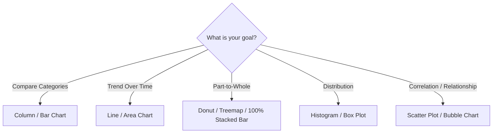

# Lesson 6.1: Visual Analytics & Chart Selection Matrix

> [!abstract] Learning Objective
> Select the scientifically optimal chart type based on the underlying analytical question (Comparison, Composition, Distribution, Relationship, or Trend).

> 🎥 **Video Chapter**: [Chapter 6 – Data Analysis Charts (3:26:58)](https://www.youtube.com/watch?v=uv1bxe2gdnU&t=12418s&pp=0gcJCWMAwfN6Pr3D)

## Why This Matters
Data visualization is not decorative; it is cognitive compression. Choosing the wrong chart leads to visual confusion, misinterpretation, and cognitive overload for business executives.

## Chart Selection Decision Matrix

## Detailed Breakdown
- **Column / Bar Charts**: Best for discrete category comparison (e.g. Total Calls by Agent). Use horizontal bar charts when category labels are long.
- **Line Charts**: Best for continuous temporal trends (e.g. Call volume by hour of day).
- **Donut / Treemap**: Composition. Avoid pie charts with >5 slices; prefer treemaps or horizontal bars.
- **Scatter Plots**: Bivariate correlation (e.g. Speed of Answer vs Customer Satisfaction).

## Related Knowledge
- Concepts: [[Dashboard Design Principles]]
- Projects: [[06_Projects/Call Center Performance Analysis/Findings]]
