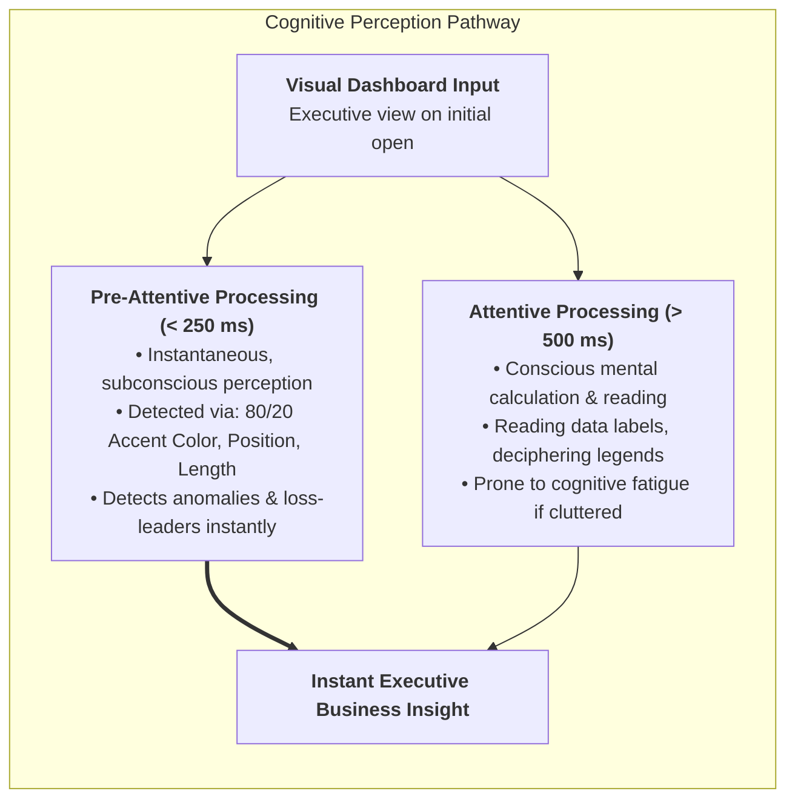
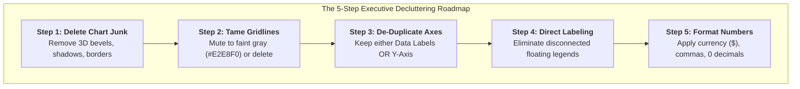
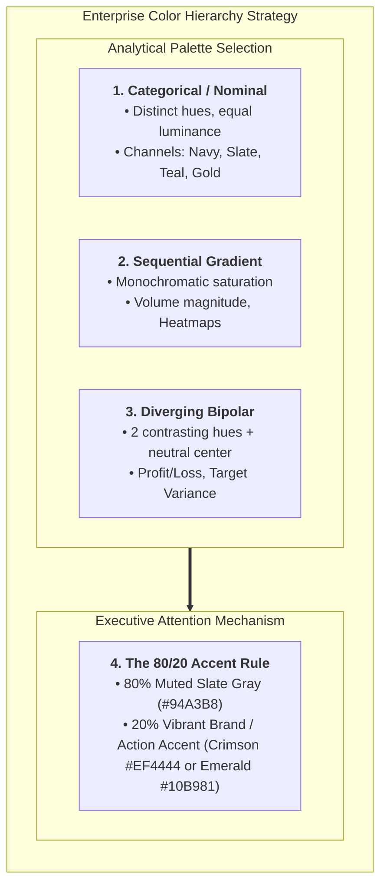
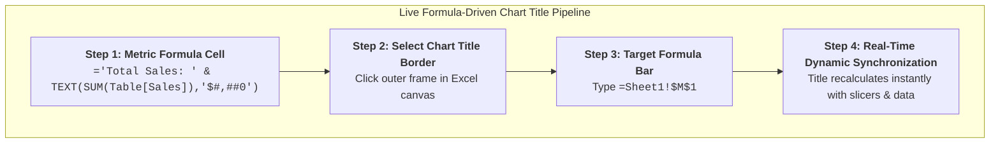

# Lesson 6.2: Executive Formatting, Decluttering & Pre-Attentive Design

> [!abstract] Learning Objective
> Transform raw, cluttered default Excel charts into elegant, publication-grade executive visualizations. Apply Edward Tufte's Data-Ink Ratio, leverage pre-attentive visual attributes to guide executive attention in under 250 milliseconds, configure per-chart formatting geometry (gap width, stroke thickness, donut hole diameter), master professional color palettes (Categorical, Sequential, Diverging, and the 80/20 Accent Rule), and link dynamic formula titles directly to charts using verified datasets from **`Module_6_Demo.xlsx`** (`Sample__Superstore`).

> 🎥 **Video Chapter**: [Chapter 6 – Data Analysis Charts (3:26:58)](https://www.youtube.com/watch?v=uv1bxe2gdnU&t=12418s&pp=0gcJCWMAwfN6Pr3D)  
> 📁 **Official Course Demo Workbook**: [`Module_6_Demo.xlsx`](file:///d:/courses/Data%20Analysis%2026-27/7-Introducation%20to%20Data%20Fields%20(Excel)/11_Demos_and_Workbooks/06_Charts_and_Visualizations/Module_6_Demo.xlsx) *(Table: `Sample__Superstore`)*  
> 📁 **Companion Case Study Workbook**: [`4- Hotel Reservation Dashboard.xlsx`](file:///d:/courses/Data%20Analysis%2026-27/7-Introducation%20to%20Data%20Fields%20(Excel)/09_Source_Materials/Module%206/4-%20Hotel%20Reservation%20Dashboard.xlsx)

---

## 1. The Cognitive Science of Visual Analytics

Data visualization does not exist to decorate spreadsheets; it exists to **reduce cognitive friction**. When an executive opens a reporting dashboard, their visual cortex processes information through two distinct cognitive pathways:



### Pre-Attentive Visual Attributes
Pre-attentive attributes are visual properties our brain perceives **before conscious thought** occurs (< 250 milliseconds). Effective chart design harnesses these attributes to direct the viewer's gaze immediately to the primary business takeaway:
- **Color**: Intensity, Hue, Saturation (e.g. highlighting a 32.8% cancellation spike or Tables -$17.7k loss in vibrant crimson against muted slate bars).
- **Form**: Length, Width, Shape, Enclosure (e.g. bar height representing revenue volume, a dashed line representing a target benchmark).
- **Spatial Position**: Placement at the top-left (the first area read in Western business culture).

---

## 2. Edward Tufte's Data-Ink Ratio

Pioneered by statistician Edward R. Tufte, the **Data-Ink Ratio** states that the vast majority of visual elements (ink) in a graphic should present substantive data rather than decorative ornament:

$$\text{Data-Ink Ratio} = \frac{\text{Data-Ink}}{\text{Total Ink Used to Print the Graphic}} = 1.0 - \text{Proportion of Erasable Chart-Junk}$$

- **Data-Ink**: Non-erasable core elements that represent numerical values (e.g. the bars, data lines, coordinates, or data labels).
- **Non-Data-Ink (Chart-Junk)**: Redundant or decorative pixels that can be deleted without losing an ounce of information (e.g. 3D shading, drop shadows, heavy gridlines, dark backgrounds, repeated axis labels).

### The 5-Step Decluttering Framework
When inserting any chart in Excel, run it through the 5-step decluttering checklist:



1. **Delete Chart Junk**:
   - Right-click the chart background $\rightarrow$ set *Shape Fill* to **No Fill** and *Shape Outline* to **No Outline**.
   - Strip all 3D bevels, perspective rotations, gradient fills, and artificial drop shadows.
2. **Tame Gridlines**:
   - By default, Excel draws harsh gray horizontal gridlines across every major unit.
   - **Action**: Either delete them completely (press `Delete` on selected gridlines) or soften them to an ultra-faint tone (`#E2E8F0` or `#CBD5E1`) at `0.75pt`.
3. **De-Duplicate Vertical Axes vs. Data Labels**:
   - If you display direct data labels above bars (e.g., `42%`, `68%`), **delete the vertical Y-axis**. Displaying both forces the viewer's eyes to bounce back and forth between the bar label and the axis line, doubling cognitive effort.
4. **Eliminate Detached Legends**:
   - For single-series charts, **delete the legend immediately** (the chart title already identifies the metric).
   - For multi-line charts, replace the floating bottom legend with **direct end-of-line data callouts** positioned adjacent to the final data point.
5. **Format Numbers Cleanly**:
   - Never display unformatted raw numbers like `103.419284` or `36275`.
   - Format currencies as `$103` (or `$103.4M`), apply thousands commas (`36,275`), and round percentages to 1 decimal place (`32.8%`).

---

## 3. Formatting Rules by Chart Family

Every chart type in the course mindmap requires specific geometric and formatting adjustments in Excel:

| Chart Type | Key Excel Setting | Best Practice Value | Design Rationale |
| :--- | :--- | :--- | :--- |
| **Clustered Column / Bar** | **Gap Width** | `50%` to `80%` | Eliminates default 219% skinny bars, giving bars proper visual weight. |
| **Overlapping Bars** | **Series Overlap** | `0%` (grouped) or `100%` (target/actual) | Prevents awkward staggered bars; standardizes comparison baselines. |
| **Stacked Column / Bar** | **Series Overlap & Gap Width** | `100%` Overlap; `60%–80%` Gap Width | Clean, unified stacks; prevents unreadable floating middle segments. |
| **Line Chart** | **Line Weight & Smoothing** | `2.25pt` – `3.0pt`; Marker `5pt`; Smoothing: **Off** | Straight segments preserve actual financial and operational precision. |
| **Donut Chart** | **Doughnut Hole Size** | `65%` to `75%` | Leaves ample room for a clean center KPI Scorecard card. |
| **Pie Chart** | **Angle of First Slice** | Rotate to `0°` (12 o'clock) | Largest slice begins at natural top reading position. |
| **Scatter Plot** | **Marker Type & Gridlines** | `50%` opacity circles; faint gridlines | Prevents overplotting occlusion when thousands of records overlap. |
| **Box Plot** | **Outlier & Mean Formatting** | Show Mean as `X`; highlight outliers | Differentiates typical distribution IQR from anomalies. |
| **Heat Map** | **Color Scale Gradient** | Sequential 2-color / 3-color (No rainbow) | Preserves visual proportionality and color-blind accessibility. |

### A. Column & Bar Charts: Taming the Gap Width
- **The Default Flaw**: Excel defaults to a **Gap Width of 219%**, making columns appear like thin, fragile toothpicks with excessive empty space between them.
- **The Professional Fix**:
  1. Right-click any column $\rightarrow$ select **Format Data Series...** (`Ctrl + 1`).
  2. Under *Series Options*, adjust **Gap Width** to between **50% and 80%**. The bars should look substantial, confident, and easy to scan.
  3. Ensure **Series Overlap** is set to `0%` for standard clustered columns.

```text
DEFAULT EXCEL (219% Gap Width)        EXECUTIVE FORMATTED (60% Gap Width)
  │                                     │
  │   █         █         █             │   █████     █████     █████
  │   █         █         █             │   █████     █████     █████
  │   █         █         █             │   █████     █████     █████
  └───┴─────────┴─────────┴─────        └───┴─────────┴─────────┴─────
      A         B         C                 A         B         C
     (Weak, hard to compare)               (Solid, clear visual weight)
```

### B. Stacked Column Charts: Geometry & Regional Contribution (`Module_6_Demo.xlsx`, Sheet1)
- **The Live Demo Implementation**: In `Module_6_Demo.xlsx` (*Sheet1*), the PivotChart displays Sub-Category sales broken down across 4 series (`Central`, `East`, `South`, `West`).
- **Critical Formatting Guidelines**:
  1. **Series Overlap**: Must be locked at **`100%`** to ensure column blocks stack perfectly on top of each other.
  2. **Gap Width**: Set to **`60%–75%`** so the stacked bars feel solid and grounded across all 17 sub-categories.
  3. **Stacking Sequence (Bottom to Top)**: Place the region with the most consistent baseline or largest sales volume at the bottom (`West` or `Central`).
  4. **The Floating Middle Hazard**: Intermediate segments (`East`, `South`) lack a common zero baseline, making cross-category comparison difficult. To mitigate this:
     - Apply distinct, accessible sequential colors across the 4 regions (`West`: Deep Navy `#1E3A8A`, `East`: Royal Blue `#2563EB`, `Central`: Sky Blue `#0284C7`, `South`: Slate `#94A3B8`).
     - Display total aggregated value labels above each column so executives can assess category scale instantly without mental arithmetic.
  5. **Legend Placement**: Relocate the legend from the default right side to the **top-right** (just below the chart title) aligned horizontally.

### C. Line Charts: Stroke, Markers & Scales
- **Stroke Thickness**: Standardize on `2.25pt` or `2.5pt` solid lines. Avoid hairline `0.75pt` lines that disappear on projectors.
- **Data Markers**: Avoid placing giant circular markers on every single day of a 365-day annual timeline (it turns into an unreadable string of pearls). Only enable markers for monthly/quarterly aggregates or highlight the minimum, maximum, and final data points.
- **Smooth Lines Caution**: While "Smoothed Line" creates visually pleasing bezier curves, it can fabricate artificial peaks and troughs that do not exist in the underlying data. Use straight line segments for financial and precision operational reporting.

### D. Donut Charts: Geometry & Placement
- **Donut Hole Size**: Set to **`70%`** (Format Data Series $\rightarrow$ *Doughnut Hole Size*). Default 50% leaves too thick a ring and too cramped a center.
- **Labeling**: Select the series $\rightarrow$ Add Data Labels $\rightarrow$ *Label Options* $\rightarrow$ check **Category Name** and **Percentage**, and uncheck **Value**. Position labels *Outside End*.
- **The Center Metric Card**: Insert a text box into the hollow center:
  - **Hotel Reservation Example**: Top Line: `TOTAL BOOKINGS` (`9pt Slate #64748B`), Bottom Line: `36,275` (`20pt Bold Navy #0F172A`).
  - **Superstore Demo Example (`Module_6_Demo.xlsx`)**: Top Line: `TOTAL SALES` (`9pt Slate`), Bottom Line: `$2,297,201` with sub-caption `12.5% Net Margin` (`20pt Bold Navy #0F172A`). Surround with the 3 Segment ring: Consumer (50.6%), Corporate (30.7%), Home Office (18.7%).

### E. Stacked Area Charts & Dedicated Chartsheet Architecture (`Module_6_Demo.xlsx`)
- **Stacked Area Charts (`Sheet2`)**:
  - **Volume Accumulation**: When visualizing multi-year performance (2014–2017), a Stacked Area Chart emphasizes total sales mass while showing yearly pacing.
  - **Gradient & Transparency**: Set area fill transparency to `20%–30%` or use clean solid tones with a crisp top boundary line (`1.5pt` solid line) so executives can track both total height and the rate of climb.
- **Embedded vs. Dedicated Chartsheet Layout (`Chart1`, `F11`)**:
  - **Embedded Chart (Object in Sheet)**: Best for executive dashboards where multiple charts, slicers, and KPI scorecards must align side-by-side on a single unified canvas.
  - **Dedicated Chartsheet (Standalone Tab)**: Created instantly via keyboard shortcut **`F11`** (or right-click chart $\rightarrow$ *Move Chart* $\rightarrow$ *New sheet*). Best for high-density exploratory charts, detailed statistical **Histograms** with automated binning, or standalone boardroom presentations that require 100% full-screen focus without spreadsheet gridlines.

---

## 4. Executive Color Strategy & Psychology

Unplanned, random color selection transforms a professional spreadsheet into visual chaos ("the fruit salad effect"). Executive visualization requires an intentional color framework:



### The 80/20 Accent Color Rule
The most potent visual hierarchy technique in executive reporting:
1. Format **80% of all data points in neutral, muted tones** (e.g. Slate Gray `#94A3B8` or Cool Gray `#CBD5E1`).
2. Apply **one intentional, vibrant accent color** (e.g. Emerald Green `#10B981` or Crimson Red `#EF4444`) exclusively to the data point that demands executive action.

| Sub-Category (`Module_6_Demo.xlsx`) | Sales Volume | Net Profit | Margin % | Standard Palette (Visual Chaos) | 80/20 Accent Strategy (Executive Focus) |
| :--- | :---: | :---: | :---: | :--- | :--- |
| **Phones** | $330,007 | +$44,516 | 13.5% | Random blue column | Muted Slate (`#94A3B8`) |
| **Chairs** | $328,449 | +$26,590 | 8.1% | Random orange column | Muted Slate (`#94A3B8`) |
| **Storage** | $223,844 | +$21,279 | 9.5% | Random gray column | Muted Slate (`#94A3B8`) |
| **Tables** | $206,966 | **-$17,725** | **-8.6%** | Random yellow column | 🔴 **CRIMSON ACCENT (`#EF4444`)** *(Immediate Intervention)* |
| **Binders** | $203,413 | +$30,222 | 14.9% | Random green column | Muted Slate (`#94A3B8`) |
| **Copiers** | $149,528 | **+$55,618** | **37.2%** | Random cyan column | 🟢 **EMERALD ACCENT (`#10B981`)** *(Top Margin Outlier)* |

### Color-Blind Accessibility (Deuteranopia & Protanopia)
- Approximately 8% of male executives have red-green color deficiency.
- **Rule**: Never rely solely on Red vs. Green to communicate Good vs. Bad.
- **Best Practice**:
  - Pair color with **symbolic shapes** (e.g. Green ▲ up-arrows vs. Red ▼ down-arrows).
  - Use **Blue vs. Orange/Coral** as the primary diverging palette instead of Red vs. Green.

---

## 5. Dynamic Chart Titles Linked to Excel Formulas

Executive charts must never feature hardcoded, static text titles like `Chart 1` or `Bookings 2021`. Titles should be dynamic, self-updating, and formula-driven.



### Step-by-Step Configuration:
1. In a calculation sheet or hidden metadata cell (e.g. cell `M1`), construct a dynamic text formula using string concatenation and number formatting:
   ```excel
   ="Hotel Bookings by Segment — Total Volume: " & TEXT(SUM(Table2[Bookings]), "#,##0") & " (" & TEXT(AVERAGE(Table2[ADR]), "$#,##0.00") & " Avg ADR)"
   ```
2. Click the **Chart Title** box inside your Excel chart so its outer perimeter border is highlighted.
3. Click into the **Excel Formula Bar** at the top of the screen (or press `F2`).
4. Type `=` and click directly on your dynamic formula cell:
   ```excel
   ='4-Pivot Table'!$M$1
   ```
5. Press **Enter**.
6. When slicers are clicked or new data is imported, the chart title **instantly recalculates and updates its displayed text**!

---

## 6. Self-Test & Interview Questions

### Self-Test Questions
1. **Data-Ink Ratio**: State Edward Tufte's Data-Ink formula. If you remove redundant gridlines and a duplicated Y-axis from a chart, does the Data-Ink Ratio increase or decrease? Why?
2. **Gap Width**: What is the default Gap Width percentage in Excel Clustered Column charts, and what range do senior data visualization designers adjust it to?
3. **Color Theory**: When should an analyst use a *Diverging* color palette instead of a *Sequential* color palette?

### Executive Interview Questions
1. *"Walk me through how you would prepare an executive-facing chart presentation comparing our regional branch profits against budget targets."*
   - **Model Answer**: "I would build a Clustered Bar or Bullet Chart with Gap Width tightened to 60%. I would eliminate chart borders and mute gridlines to faint gray. To maximize the Data-Ink ratio, I would delete the horizontal axis and directly label the end of each bar with formatted currency amounts (`+$1.2M`, `-$450K`). I would apply the 80/20 color rule using a diverging palette: neutral cool gray for branches performing within target, subtle navy for overperforming branches, and an intentional coral accent on underperforming branches that require immediate operational intervention. Finally, I would link the chart title to an Excel formula displaying dynamic portfolio variance."
2. *"Why should you avoid 3D charts in Excel under all circumstances?"*
   - **Model Answer**: "3D charts introduce artificial perspective distortion. In 3D column and bar charts, the angled perspective makes it mathematically impossible for the eye to align the top of a bar with the gridlines or axis baseline. In 3D pie charts, the foreground slices appear disproportionately larger than background slices due to perspective vanishing points, violating visual proportionality and misleading executive decision-makers."

---

## Related Knowledge
- Concepts: [[Dashboard Design Principles]], [[Chart Selection Matrix]]
- Previous Lesson: [[01_Visual_Analytics_and_Chart_Selection]]
- Next Lesson: [[03_Dashboard_Visual_Hierarchy]]
- Companion Project: [[Hotel Reservation Analysis]]
