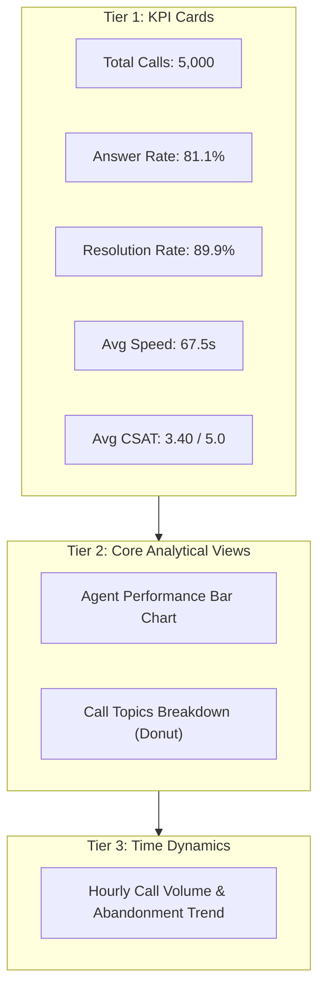

# Lesson 6.3: Executive Dashboard Layout & Visual Hierarchy

> [!abstract] Learning Objective
> Design a cohesive, grid-aligned executive dashboard layout incorporating KPI summary cards, interactive filter panels, and intuitive information flow.

> 🎥 **Video Chapter**: [Chapter 6 – Data Analysis Charts (3:26:58)](https://www.youtube.com/watch?v=uv1bxe2gdnU&t=12418s&pp=0gcJCWMAwfN6Pr3D)

## The "F-Pattern" Dashboard Layout
Executives read dashboards in an F-pattern (top-to-bottom, left-to-right):
1. **Top Header**: Dashboard Title, Date Scope, and Slicer Controls.
2. **Upper Tier**: 4-5 High-Level KPI Summary Cards (Total Calls, Answer Rate %, Resolution Rate %, ASA, CSAT).
3. **Middle Tier**: Primary comparative and distribution charts (Agent Performance, Topic Breakdown).
4. **Bottom Tier**: Detailed time-series trends and granular tabular summaries.

## Related Knowledge
- Concepts: [[Dashboard Design Principles]]
- Projects: [[06_Projects/Call Center Performance Analysis/Project Overview]]
