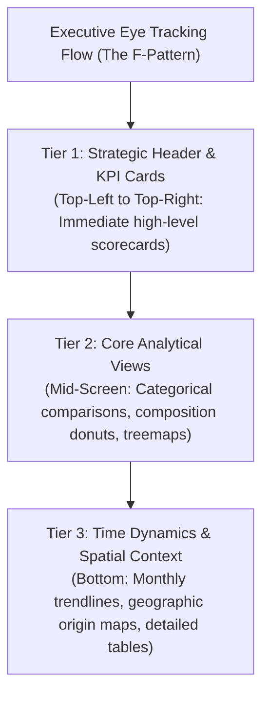
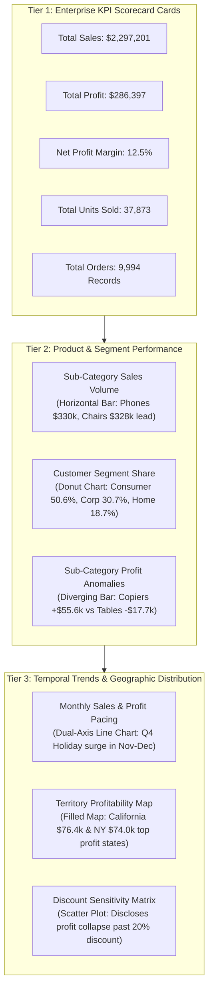
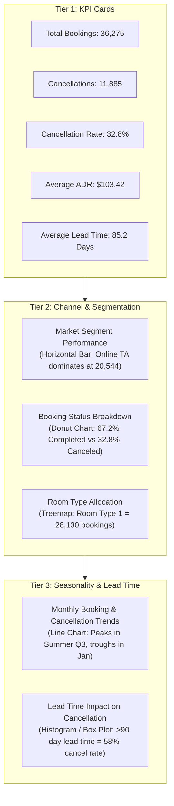
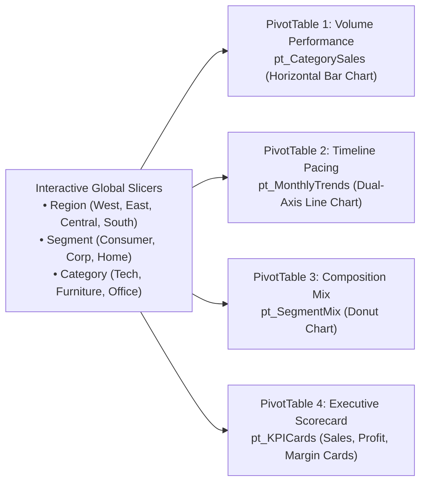

# Lesson 6.3: Executive Dashboard Architecture, Layout & Visual Hierarchy

> [!abstract] Learning Objective
> Design and construct enterprise-grade, single-screen executive dashboards in Microsoft Excel. Structure information flow using the F-Pattern visual hierarchy, engineer high-impact KPI summary cards, coordinate multiple analytical chart families (Comparison, Trend, Composition, Distribution, and Maps), orchestrate multi-PivotChart filtering via Slicer Report Connections, and align components flawlessly with Excel's grid-snapping architecture. Ground every design pattern in real enterprise data from **`Module_6_Demo.xlsx`** (`Sample__Superstore`, 9,994 orders).

> 🎥 **Video Chapter**: [Chapter 6 – Data Analysis Charts (3:26:58)](https://www.youtube.com/watch?v=uv1bxe2gdnU&t=12418s&pp=0gcJCWMAwfN6Pr3D)  
> 📁 **Official Course Demo Workbook**: [`Module_6_Demo.xlsx`](file:///d:/courses/Data%20Analysis%2026-27/7-Introducation%20to%20Data%20Fields%20(Excel)/11_Demos_and_Workbooks/06_Charts_and_Visualizations/Module_6_Demo.xlsx) *(Table: `Sample__Superstore`)*  
> 📁 **Companion Case Study Workbook**: [`4- Hotel Reservation Dashboard.xlsx`](file:///d:/courses/Data%20Analysis%2026-27/7-Introducation%20to%20Data%20Fields%20(Excel)/09_Source_Materials/Module%206/4-%20Hotel%20Reservation%20Dashboard.xlsx)

---

## 1. The Psychology of Executive Dashboards

An executive dashboard is **not a collection of random charts glued onto a worksheet**; it is an orchestrated visual narrative designed to answer the core business question: *"How is our business performing right now, and where is intervention required?"*

### The "5-Second Rule"
A senior executive (CFO, COO, VP) should be able to scan your dashboard and understand the fundamental health of the organization **within 5 seconds**. If they have to hunt through complex menus, decode unformatted numbers, or scroll horizontally, the dashboard has failed its cognitive mission.

### The F-Pattern Reading Flow
Extensive eye-tracking research (Nielsen Norman Group) proves that Western business readers scan digital dashboards in an **F-shaped pattern**:
1. **Top Horizontal Sweep**: The eye reads the title, timeframe, active slicers, and sweeps across the primary KPI summary cards.
2. **Second Horizontal Sweep**: The eye drops down to read the primary comparative and compositional breakdowns (e.g. Sales by Channel or Cancellation by Segment).
3. **Left Vertical Stem**: The eye scans the left edge for trend lines, geographic distributions, or outlier tables before concluding.

---

## 2. The 3-Tier Executive Dashboard Framework

To implement the F-Pattern in Microsoft Excel, organize your worksheet into three distinct architectural tiers:

| Dashboard Tier | Architecture Layer | Components & Metrics | Target Analytical Question |
| :--- | :--- | :--- | :--- |
| **Tier 1: North** | **Strategic Header & KPI Scorecards** | • **Total Bookings**: 36,275 • **Cancellations**: 11,885 • **Cancel Rate**: 32.8% • **Avg ADR**: $103.42 • **Avg Lead Time**: 85 Days • **Global Slicers**: Year, Channel, Room Type | *What is our macro operational health right now? (Top 5-second pulse check)* |
| **Tier 2: Center** | **Core Categorical & Compositional Views** | • **Market Segment**: Horizontal Bar Chart *(Online TA: 56.7%, Offline TO: 29.0%)* • **Booking Status**: Donut Chart *(Confirmed: 67.2%, Canceled: 32.8%)* • **Room Allocation**: Treemap *(Room 1: 77.5%, Room 4: 16.7%)* | *Which channels, segments, and inventory tiers are driving these numbers?* |
| **Tier 3: South** | **Temporal Dynamics & Granular Drill-Down** | • **Seasonality Dynamics**: Dual-Series Line Chart *(Monthly Bookings vs Cancellations)* • **Spatial Origin**: Filled Choropleth Map *(Global Guest Distribution by Country)* • **Lead Time Impact**: Box Plot / Histogram *(Risk assessment)* | *When do these dynamics surge, where do guests come from, and where do we intervene?* |

### Tier 1: Strategic Header & KPI Scorecards
- **Header**: High-contrast title (`Hotel Reservation Analytics Dashboard`), subtitle with data scope (`36,275 Historical Bookings | 2017–2018`), and global filter slicers.
- **KPI Summary Cards (4–5 Maximum)**:
  - Large, bold metric value (20–24pt Segoe UI / Aptos Display).
  - Clear label (9–10pt, uppercase, muted slate gray `#64748B`).
  - Subtle trend indicator or variance delta (e.g. `▲ +4.2% vs Prior Year`).

### Tier 2: Core Analytical Views
- **Comparison (Bar / Column)**: Answers *"Which category or channel is driving our volume?"* (e.g. Market Segment volume).
- **Composition (Donut / Treemap)**: Answers *"What is the split of confirmed vs. canceled stays?"*

### Tier 3: Time Dynamics & Granular Context
- **Trends (Line Chart)**: Exposes seasonal surges, holiday peaks, and month-over-month booking patterns.
- **Spatial / Geographic (Filled Map)**: Identifies top guest origin countries to steer international marketing spend.
- **Operational Matrix (Heat Map)**: Highlights peak check-in days of week across the year.

---

## 3. Case Studies: Executive Dashboards

### Case Study A: The Enterprise Superstore Executive Cockpit (`Module_6_Demo.xlsx`)

Applying the 3-Tier Dashboard Framework to the official course dataset **`Module_6_Demo.xlsx`** (*Sheet: `Sample_ Superstore`*, Table: `Sample__Superstore`, 9,994 transactions, $2,297,200.86 Sales, $286,397.02 Profit, 37,873 units sold):

#### Key Superstore Business Insights Derived:
1. **The Discount Margin Cliff**: Discounts below 20% maintain healthy 20%+ margins, but discounts exceeding 20% produce consistent negative profit margins across all four regions.
2. **Loss-Leader Product Traps**: While `Tables` generates $206,966 in gross sales, it generates a **net loss of -$17,725 (-8.6% margin)** due to high shipping allowances and heavy promotional discounting.
3. **Regional Technology Windfall**: The **West Region** accounts for $725,458 in sales and generates over **$108,418 in net profit**, driven primarily by high-margin Technology sales (`Copiers` and `Accessories`).

---

### Case Study B: The Hotel Reservation Dashboard (`4- Hotel Reservation Dashboard.xlsx`)

Based directly on the companion course workbook [`4- Hotel Reservation Dashboard.xlsx`](file:///d:/courses/Data%20Analysis%2026-27/7-Introducation%20to%20Data%20Fields%20(Excel)/09_Source_Materials/Module%206/4-%20Hotel%20Reservation%20Dashboard.xlsx) and dataset [`2- Hotel Reservations.csv`](file:///d:/courses/Data%20Analysis%2026-27/7-Introducation%20to%20Data%20Fields%20(Excel)/09_Source_Materials/Module%206/2-%20Hotel%20Reservations.csv):

### Key Business Insights Derived:
1. **The Lead Time Driver**: Guests booking more than 90 days in advance cancel at a **58% rate**, whereas guests booking under 14 days cancel at only **11%**. *Recommendation*: Implement non-refundable deposit policies for long lead-time bookings.
2. **Channel Concentration**: The **Online Travel Agency (Online TA)** channel accounts for over **56% of total revenue**, making the hotel vulnerable to OTA commission rate hikes.
3. **Room Type Dominance**: **Room_Type_1** accounts for 77.5% of total bookings, indicating that premium suite tiers (Room Types 4, 6, 7) are under-promoted.

---

## 4. Interactive Dashboard Engineering in Excel

To transform static charts into an interactive business application, execute these technical steps:

### A. Grid Alignment: Snapping to Cells (`Alt + Drag`)
Never place charts or KPI cards by freehand eyeballing:
1. Hold down the **`Alt` key** while dragging or resizing any chart, slicer, or card container.
2. The perimeter of the object will **snap magnetically to the nearest worksheet cell border**.
3. Align all cards to uniform row heights and column widths to establish a clean, structural layout grid.

### B. Standardizing Card Containers
1. Go to `Insert` $\rightarrow$ `Illustrations` $\rightarrow$ `Shapes` $\rightarrow$ `Rounded Rectangle`.
2. Format:
   - **Fill**: Solid White (`#FFFFFF`).
   - **Line**: Solid subtle border (`#E2E8F0`, 1pt thickness).
   - **Shadow**: Optional faint preset (*Offset: Bottom* at 4pt blur, 10% opacity).
3. Insert text boxes inside each shape: one for the uppercase title, one linked to the dynamic calculation cell for the large number.

### C. Multi-Chart Interactivity via Slicer Report Connections
When you create a Slicer for a PivotChart, it defaults to controlling *only that single PivotTable*:
1. Right-click the Slicer $\rightarrow$ select **Report Connections...**.
2. A dialog listing all PivotTables in the workbook will appear.
3. **Check every PivotTable** that powers your dashboard charts (`pt_Channel`, `pt_Seasonality`, `pt_RoomType`, `pt_KPIs`).
4. Click **OK**.
5. Clicking a single button on your Slicer (e.g. selecting `Online TA`) now **dynamically filters and animates every chart across the entire dashboard simultaneously**!

### D. Preparing for Executive Presentation
Before delivering the workbook to stakeholders:
1. Go to the **View** tab on the ribbon.
2. Uncheck **Gridlines** (creates a pristine white or light-canvas backdrop).
3. Uncheck **Headings** (hides row numbers `1, 2, 3...` and column letters `A, B, C...`).
4. Uncheck **Formula Bar** (eliminates spreadsheet distraction, transforming Excel into a dedicated executive software interface).

---

## 5. Self-Test & Interview Questions

### Self-Test Questions
1. **Visual Hierarchy**: Explain why high-level KPI cards belong at the top of an executive dashboard rather than at the bottom.
2. **Interactivity**: What Excel command links a single Slicer to five different PivotCharts across a multi-tab workbook?
3. **Layout Discipline**: What keyboard shortcut enables magnetic snapping of dashboard shapes and charts to underlying worksheet cell borders?

### Executive Interview Questions
1. *"How do you design a dashboard that serves both a high-level CFO and an operational hotel revenue manager without overwhelming either?"*
   - **Model Answer**: "I employ a **3-tier visual hierarchy paired with interactive progressive disclosure**. Tier 1 presents high-level aggregate scorecards (Total Bookings, Cancellation Rate %, ADR, Net Revenue) that allow the CFO to assess organizational health in under 5 seconds. Tier 2 and Tier 3 provide categorical and monthly trend PivotCharts with integrated Slicers (Channel, Room Type, Customer Segment). When the operational manager needs to drill into anomalies, they can filter by segment or switch to a connected granular drill-down tab, keeping the executive landing page clean and focused."
2. *"What are the most common mistakes you observe in amateur Excel dashboards, and how do you eliminate them?"*
   - **Model Answer**: "The top three mistakes are: (1) **Lack of grid alignment**, where floating charts are placed at random heights and widths without snapping to cell borders; (2) **Visual noise and the 'fruit salad' palette**, using 10 different vibrant colors instead of an intentional 80/20 neutral gray with a single accent color; and (3) **Absence of narrative hierarchy**, forcing the executive to search through unranked charts rather than guiding their eye from high-level KPIs down to operational root causes."

---

## Related Knowledge
- Concepts: [[Dashboard Design Principles]], [[Chart Selection Matrix]], [[Pivot Tables]], [[Slicers and Timelines]]
- Previous Lessons: [[01_Visual_Analytics_and_Chart_Selection]], [[02_Formatting_and_Chart_Design_Rules]]
- Companion Capstone Project: [[Hotel Reservation Analysis]]
