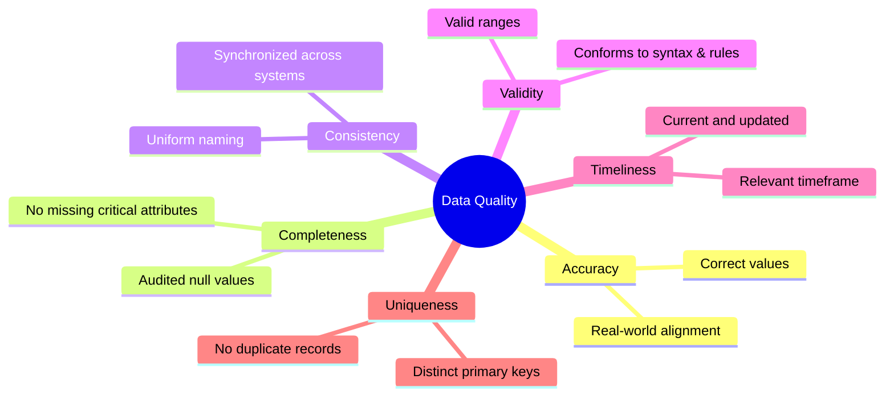

# Lesson 7.1: The Six Dimensions of Data Quality & Pre-Analysis Auditing

> [!abstract] Learning Objective
> Systematically evaluate datasets against the six formal dimensions of data quality to identify data anomalies before initiating analytical modeling.

> 🎥 **Video Chapter**: [Chapter 7 – Importing Data & Data Cleaning (3:54:03)](https://www.youtube.com/watch?v=uv1bxe2gdnU&t=14043s)

## The 6 Dimensions of Data Quality

## PwC Call Center Quality Audit Application
In the course's 5,000-row Call Center dataset:
- **Completeness**: 946 null values in `Speed of answer`, `AvgTalkDuration`, and `Satisfaction rating`.
  *Audit finding*: These 946 nulls are 100% correlated with `Answered (Y/N) == "N"`. They are **valid missing values** (abandoned calls), not data corruption!
- **Validity**: `Satisfaction rating` values strictly conform to integers 1 through 5.
- **Uniqueness**: `Call Id` contains 5,000 distinct records (`ID0001` through `ID5000`) with zero duplicate primary keys.

## Related Knowledge
- Concepts: [[Six Dimensions of Data Quality]], [[Data Cleaning]]
- Projects: [[06_Projects/Call Center Performance Analysis/Data Quality Assessment]]
