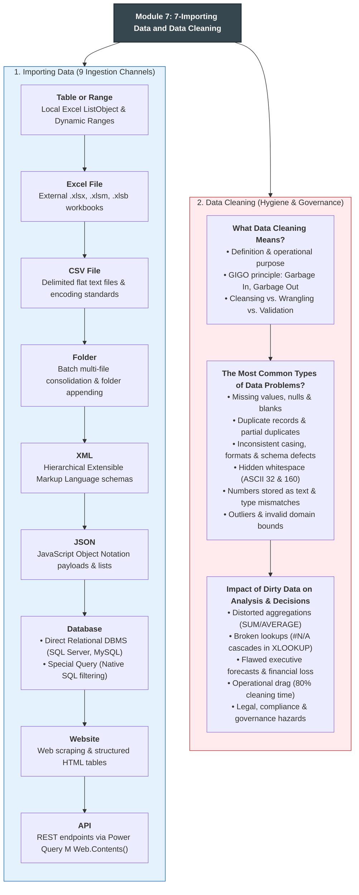
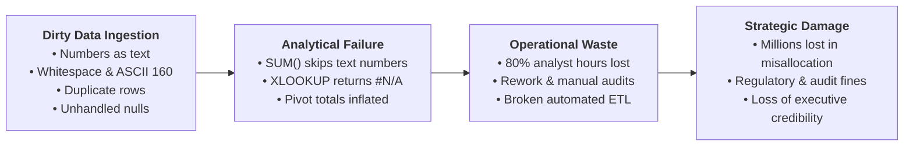
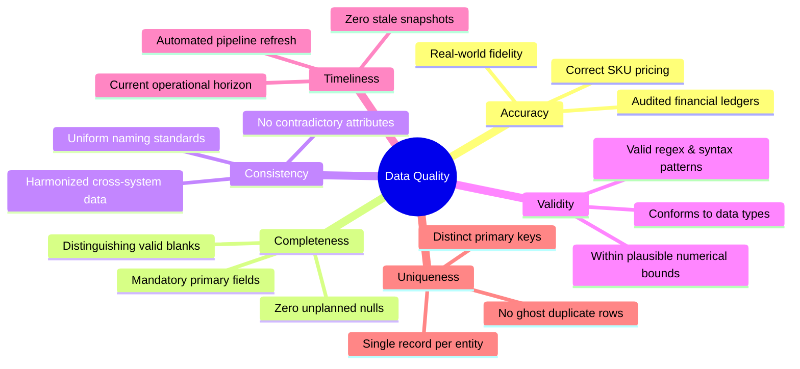
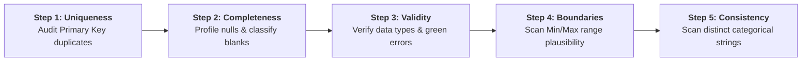

# Lesson 7.1: Data Quality Foundations, Pre-Analysis Auditing & The Six Dimensions

> [!abstract] Learning Objective
> Understand the fundamental meaning, economic necessity, and operational lifecycle of **Data Cleaning**. Quantify the catastrophic business impacts of dirty data on executive decision-making, and systematically evaluate datasets against the **Six Formal Dimensions of Data Quality** (DAMA Framework) using a repeatable pre-analysis audit workflow.

> 🎥 **Video Chapter**: [Chapter 7 – Importing Data & Data Cleaning (3:54:03)](https://www.youtube.com/watch?v=uv1bxe2gdnU&t=14043s)

---

## 1. Visual Curriculum Architecture: Importing & Data Cleaning

The entire landscape of **Module 7: Importing Data and Data Cleaning** is structured across two foundational pillars: **Data Ingestion** (the 9 external acquisition pipelines) and **Data Cleaning** (governance, defect remediation, and quality auditing):



---

## 2. What Data Cleaning Means: Principles & Philosophy

### A. Formal Definition
**Data Cleaning** (also termed *Data Cleansing*, *Data Scrubbing*, or *Data Sanitization*) is the systematic operational discipline of detecting, diagnosing, and correcting (or removing) corrupt, inaccurate, incomplete, incorrectly formatted, or duplicated records from a raw dataset before performing analytical modeling, formula computation, or dashboard visualization.

```mermaid
flowchart LR
    subgraph RawStage ["1. RAW INGESTION"]
        direction TB
        R1["• Trailing & leading spaces"]
        R2["• '#N/A' & corrupt strings"]
        R3["• Green triangle type errors"]
        R4["• Duplicate transaction rows"]
    end

    subgraph EngineStage ["2. DATA CLEANING ENGINE"]
        direction TB
        E1["1. Audit & Profile completeness"]
        E2["2. Standardize casing & formats"]
        E3["3. Trim ASCII 32 & CHAR(160)"]
        E4["4. Impute or flag operational nulls"]
    end

    subgraph AssetStage ["3. ANALYSIS-READY ASSET"]
        direction TB
        A1["• Strict numeric & date types"]
        A2["• 100% unique primary keys"]
        A3["• Validated business bounds"]
        A4["• High-confidence analytical model"]
    end

    RawStage ==> EngineStage
    EngineStage ==> AssetStage

    style RawStage fill:#ffebee,stroke:#c62828,stroke-width:2px
    style EngineStage fill:#fff3e0,stroke:#ef6c00,stroke-width:2px
    style AssetStage fill:#e8f5e9,stroke:#2e7d32,stroke-width:2px
```



| Pipeline Stage | Operational State | Typical Manifestations | Business & Analytical Impact |
| :--- | :--- | :--- | :--- |
| **1. Raw Ingestion** | Untamed transactional exports directly from source systems (POS, ERP, CRM, web). | Trailing spaces, numbers stored as text, duplicate rows, unhandled `#N/A` strings. | High risk of distorted calculations, broken lookups, and false executive metrics. |
| **2. Cleaning Engine** | Systematic, audited transformation protocol (Excel formulas or Power Query steps). | Standardized text casing, stripped whitespace (ASCII 32 & 160), imputed/tagged nulls. | Transforms chaotic, unverified records into reproducible, audited data. |
| **3. Analysis-Ready Asset** | Sanitized, validated tabular asset ready for modeling and visual dashboards. | Strict data types, 100% unique primary keys, bounded ranges, complete audit trail. | Reliable formulas, accurate PivotTables, and executive trust in decision-making. |

### B. Core Distinctions: Cleaning vs. Wrangling vs. Validation
Analysts frequently confuse related terminology. In professional practice, these three concepts operate at distinct stages of the pipeline:

| Pipeline Stage | Technical Term | Primary Objective | Example Operations |
| :--- | :--- | :--- | :--- |
| **Pre-Entry** | **Data Validation** | Preventing corrupt data from entering the spreadsheet at the point of input. | Setting Excel Data Validation rules to restrict inputs to positive numbers or dropdown lists. |
| **Post-Ingestion** | **Data Cleaning** | Eliminating defects, inconsistencies, and errors in existing data. | Removing duplicate IDs, trimming whitespace with `=TRIM()`, fixing numbers stored as text. |
| **Pre-Analysis** | **Data Wrangling** | Restructuring, reshaping, and enriching clean data into an analytical schema. | Unpivoting columns, merging customer profiles with transactions, calculating calculated columns. |

### C. The Fundamental Axiom: Garbage In, Garbage Out (GIGO)
No analytical algorithm, PivotTable calculation, or DAX measure can compensate for flawed input data. If raw transactional inputs contain unaddressed defects:
1. Mathematical calculations will produce mathematically precise but fundamentally incorrect numbers.
2. Machine learning models and regression curves will learn noise rather than commercial signal.
3. Executive stakeholders acting on flawed reports will execute damaging strategic decisions.

> [!IMPORTANT]
> **The Data Cleansing Golden Rule**: Never perform analytical calculations or construct dashboards directly on raw, uninspected data. Always duplicate the raw layer into an immutable backup, apply an audited cleaning protocol, and document every transformation step.

---

## 3. The Impact of Dirty Data on Analysis & Decision-Making

Dirty data is not merely an aesthetic annoyance; it is a direct driver of corporate financial loss, operational paralysis, and analytical failure:



### 1. Distorted Financial Metrics & False Aggregations
Excel functions behave unpredictably when data types are corrupted:
- **Numbers Stored as Text**: Excel's `=SUM()` and `=AVERAGE()` functions **silently ignore text strings**. If 50 sales transactions totaling $250,000 contain leading apostrophes (`'5000`) or are formatted as text, `=SUM(Sales)` will compute `$0` or report only the remaining numeric cells without warning!
- **Duplicate Records**: Unchecked duplicate rows in transaction ledgers artificially double-count revenue and inventory, causing supply chain managers to order phantom stock.

### 2. Broken Relational Lookups & `#N/A` Cascades
Relational lookups (`XLOOKUP`, `VLOOKUP`, `INDEX/MATCH`) perform exact character-by-character string matching:
- **The Invisible Space Hazard**: If cell `A2` contains `"US-1020 "` (with a trailing space, ASCII 32) and the lookup table contains `"US-1020"`, the lookup will evaluate as `FALSE` and return `#N/A`.
- **The Web Scrape Trap (ASCII 160)**: Web-scraped HTML tables often contain non-breaking spaces (`&nbsp;` / ASCII 160). Standard `=TRIM()` cannot remove ASCII 160, causing every downstream lookup formula to fail inexplicably until `=SUBSTITUTE(A2, CHAR(160), " ")` is executed.

### 3. The 80/20 Analyst Productivity Dilemma
Multiple enterprise surveys (including Harvard Business Review and Anaconda Data Science Reports) reveal that data professionals spend **60% to 80% of their total project time** manually cleaning, formatting, and wrangling dirty data, leaving only 20% for exploratory analysis, predictive modeling, and strategic insight delivery.

### 4. Severe Financial & Strategic Misallocations
When senior leadership receives reports generated from dirty data:
- Marketing teams overspend millions advertising to inactive customer segments due to unmerged duplicate CRM profiles.
- Logistics teams face stockouts because inventory tracking records failed to register returns due to inconsistent SKU casing (`sku-101` vs `SKU-101`).

### 5. Legal, Regulatory & Customer Trust Hazards
- **GDPR & Privacy Violations**: Inability to identify and delete customer records upon request because customer names are duplicated across contradictory variations.
- **Inaccurate Invoicing**: Customers receiving duplicate bills or incorrect sales tax rates due to unstandardized state/zip codes.

---

## 4. The Six Dimensions of Data Quality (DAMA Framework)

To audit data systematically rather than relying on subjective intuition, enterprise data governance adopts the **Six Dimensions of Data Quality** established by DAMA International (*Data Management Association*):

| # | Dimension | Formal Governance Definition | How It Fails in Excel | Excel Detection / Audit Formula |
| :-: | :--- | :--- | :--- | :--- |
| **1** | **Accuracy** | The degree to which recorded data values correctly mirror the real-world event or object. | A product price is typed as `$10.00` instead of `$100.00`, or a customer's address is listed in the wrong city. | Cross-referencing against primary transactional ledgers or external master data. |
| **2** | **Completeness** | The proportion of expected data values that are populated vs. unexpectedly null, blank, or missing. | Customer records missing critical `EmailAddress`, `Phone`, or `OrderDate` values. | `=COUNTBLANK(Range)`<br/>`=COUNTIF(Range, "")` |
| **3** | **Consistency** | The absence of contradiction between different data representations across systems or within the same table. | A customer is marked as `Status = "Active"` but has a `TerminationDate` from 2023; or city is `"London"` with country `"USA"`. | Multi-condition logic:<br/>`=IF(AND(Status="Active", TermDate<>""), "Contradiction", "OK")` |
| **4** | **Validity** | The conformance of data values to strict business syntax rules, data types, lengths, and valid ranges. | A postal code entered as text letters, a discount recorded as `150%`, or a customer age of `240`. | Range validation:<br/>`=IF(OR(Age<0, Age>120), "Invalid Age", "Valid")`<br/>`=ISNUMBER(Value)` |
| **5** | **Timeliness** | The extent to which data values represent the required, current operational time horizon without staleness. | Generating Q4 2026 executive bonuses using an unrefreshed dataset containing transactions only through July 2025. | `=MAX(OrderDate) >= EDATE(TODAY(), -1)` |
| **6** | **Uniqueness** | The guarantee that each individual entity, transaction, or customer is represented exactly once with zero duplicates. | The same transaction `CA-2016-152156` appears three times in the ledger with identical sales values. | Duplication check:<br/>`=IF(COUNTIF(ID_Range, A2) > 1, "Duplicate", "Unique")` |



---

## 5. Applied Pre-Analysis Audit Protocol: The 5-Step Health Check

Before applying formulas, PivotTables, or charts, every professional analyst executes this 5-minute pre-analysis audit protocol:



### Step 1: Uniqueness Audit (Primary Key Deduplication)
Verify that the entity primary key has zero duplicate entries:
```excel
=IF(COUNTIF(A$2:A$10000, A2) > 1, "DUPLICATE", "OK")
```
- Select column $\rightarrow$ `Conditional Formatting` $\rightarrow$ `Highlight Cells Rules` $\rightarrow$ `Duplicate Values...` (instantly visualizes duplicate keys).

### Step 2: Completeness Audit (Null Profiling)
Measure the total count and percentage of missing values per column:
```excel
=COUNTBLANK(B2:B10000) / ROWS(B2:B10000)
```
- *Crucial Judgment*: Determine if blanks represent **data corruption** or **valid operational missingness** (see Case Study B below).

### Step 3: Validity & Data Type Audit (Catching Numbers Stored as Text)
Verify that numeric columns actually store numbers rather than string text:
```excel
=IF(ISNUMBER(SalesCell), "Numeric", "CORRUPT: TEXT NUMBER")
```
- Check for green error indicator triangles in cell upper-left corners ("Number Stored as Text").

### Step 4: Boundary & Outlier Audit
Inspect minimum, maximum, and average values for impossible domain violations:
```excel
=MIN(UnitDiscount)     'Must be >= 0.00
=MAX(UnitDiscount)     'Alert if > 0.80 or > 1.00
=MIN(CustomerAge)      'Alert if < 16 or < 0
=MAX(CustomerAge)      'Alert if > 115
```

### Step 5: Consistency & Casing Audit
Generate a distinct list of categorical dimension values to expose typos:
```excel
=SORT(UNIQUE(CategoryColumn))
```
- If output returns `{"Office Supplies", "office supplies", "Office  Supplies"}`, data cleaning is required before pivot aggregation!

---

## 6. Real-World Case Studies

### Case Study A: The 46MB Supermarket Retail Dataset (`Supermarket data.csv`)
In the companion course dataset (`09_Source_Materials/Module 7/2-Importing Data/Supermarket data.csv`):
- **Raw File Size**: 46.08 MB containing over 1 million retail transaction lines across multiple branch locations.
- **Audit Findings**:
  1. *Date Inconsistencies*: Mixed date formats (`YYYY-MM-DD` vs `DD/MM/YYYY`) from regional branch POS software.
  2. *Hidden Whitespace*: Leading spaces in `Branch_Name` causing `=SUMIF()` to fail when aggregating branch profitability.
  3. *Zero Baseline Validation*: `Unit_Price` values containing occasional negative entries (`-$14.50`) caused by unflagged merchandise refund entries.

### Case Study B: The PwC Call Center Audit (Distinguishing Operational Nulls)
In the 5,000-row Call Center dataset (`Module 7` & `Module 8`):
- **Initial Profile**: 946 blank cells were detected in `Speed of answer in seconds`, `AvgTalkDuration`, and `Satisfaction rating`.
- **Amateur Reaction**: "Delete all 946 rows because they contain missing values!"
- **Professional Governance Audit**:
  - The analyst audited column `Answered (Y/N)` against the 946 null records.
  - Correlation was **100.0%**: All 946 nulls occurred exclusively when `Answered == "N"` (abandoned customer calls).
  - *Conclusion*: These 946 nulls were **valid operational missing values**, not corrupt data! Deleting them would have deleted all customer abandonment records, artificially skewing the call resolution rate from 81.1% to a false 100%!

---

## 7. Self-Test & Interview Questions

### Self-Test Questions
1. **GIGO Concept**: If an analyst builds a sophisticated statistical regression model using raw data that contains numbers stored as text and duplicate IDs, what happens to the output?
2. **Dimension Contrast**: Differentiate between **Accuracy** and **Validity**. Can a data value be completely valid yet totally inaccurate? Explain with an example.
3. **Audit Workflow**: Explain why `=TRIM()` cannot remove non-breaking spaces imported from websites (`&nbsp;` / ASCII 160), and state the exact formula required to eliminate them.

### Executive Interview Questions
1. *"You discover that 15% of records in our customer database have missing email addresses. How do you decide whether to delete the rows, impute the values, or retain them?"*
   - **Model Answer**: "I would evaluate the dataset against the DAMA Completeness and Validity dimensions in the context of the analytical objective. If the project objective is Email Marketing Campaign ROI, records without emails cannot be contacted, so they should be filtered out from that specific campaign audience. However, if the project objective is Total Revenue Reconciliation or Lifetime Customer Value (LTV), deleting those rows would understate total company revenues. I would retain the rows, flag `EmailAddress` as `'[Unprovided]'`, and use the valid transaction amounts for revenue modeling."
2. *"What is the difference between data cleaning in native Excel formulas versus cleaning in Power Query, and when would you choose each?"*
   - **Model Answer**: "Native Excel formulas (such as `TRIM`, `CLEAN`, `PROPER`, and `SUBSTITUTE`) are ideal for lightweight, ad-hoc cleaning directly on active worksheet cells. However, formula-based cleaning does not scale to large datasets, bloats workbook file size, and requires manual re-application when new data arrives. **Power Query** is an automated, repeatable ETL engine that records transformation steps in M code. It handles millions of rows, offloads processing from Excel's calculation engine, and automatically repeats all cleaning operations upon clicking 'Refresh', making it the enterprise standard for production analytics."

---

## Related Knowledge
- Next Lesson: [[02_Data_Cleaning_Techniques_in_Excel]] — The Excel Data Cleaning Toolkit (Formulas, Flash Fill, Text to Columns).
- Advanced Ingestion: [[03_Importing_Data_from_Enterprise_Sources]] — Ingesting data via SQL, CSV, Folder, XML, JSON, and APIs.
- Enterprise Context: [[04_Business_Systems_for_Analysts]] — Connecting ERP, CRM, and HRIS data flows.
- Concepts: [[Six Dimensions of Data Quality]], [[Data Cleaning]], [[ETL Process]]
- Project: [[Call Center Performance Analysis]]
