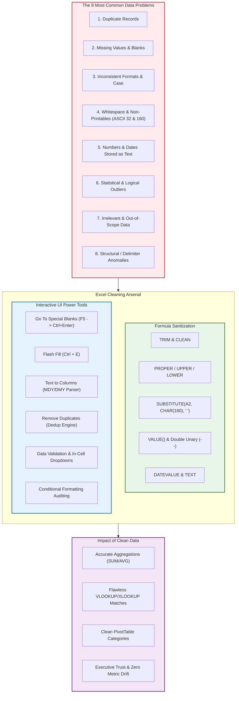
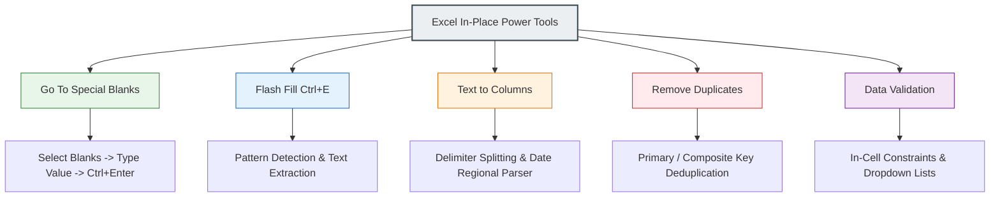
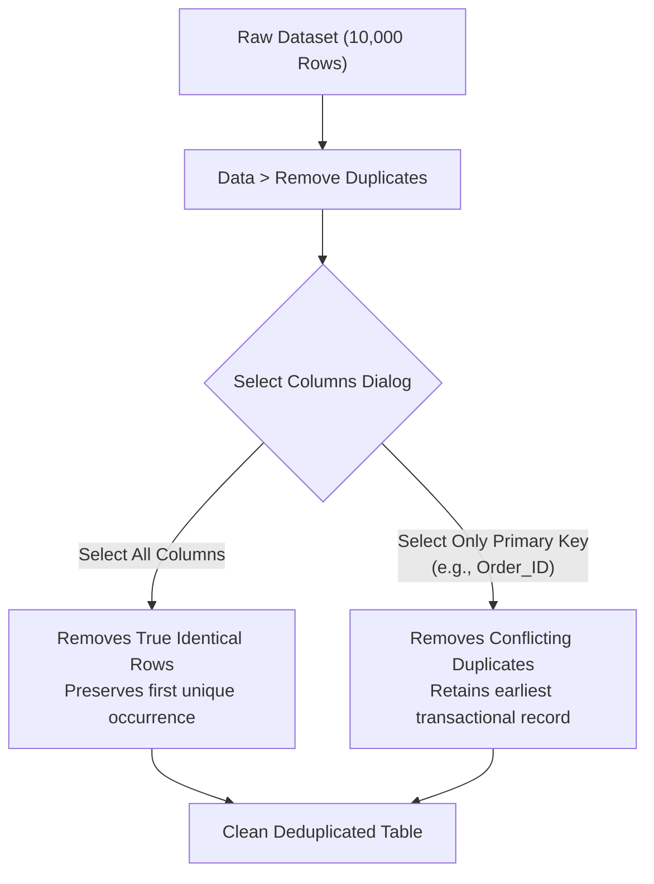
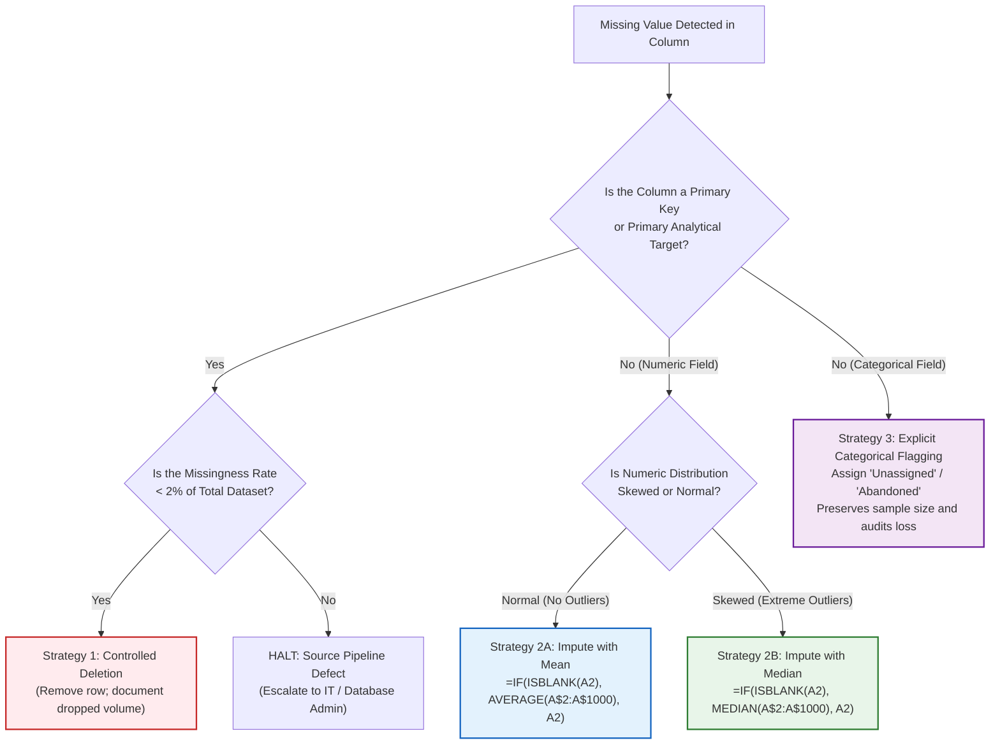
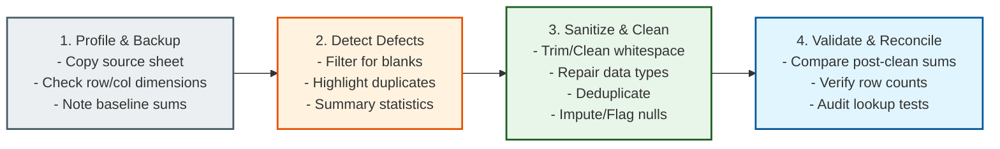

# Lesson 7.2: Systematic Data Cleaning Techniques in Excel

> [!abstract] Learning Objective
> Master Excel's formula-based and interactive data cleaning arsenal to detect, isolate, and remediate the 8 most common data problems—transforming messy, raw operational extracts into pristine, analysis-ready datasets without corrupting source integrity.

> 🎥 **Video Chapter**: [Chapter 7 – Importing Data & Data Cleaning (3:54:03)](https://www.youtube.com/watch?v=uv1bxe2gdnU&t=14043s)

---

## 1. Visual Roadmap: Data Cleaning in the Analysis Pipeline

Based on the course curriculum and architectural mindmap, **Data Cleaning** directly addresses the flaws inherent in raw data extracts before any formula modeling, pivot tables, or dashboard visualizations are attempted:



---

## 2. The 8 Most Common Types of Data Problems

Operational databases (ERPs, CRMs, POS terminals) prioritize fast transactional writes over analytical cleanliness. When analysts extract raw reports, they inevitably inherit systemic data defects.

| # | Data Problem | Real-World Symptom | Analytical Failure Mode |
| :---: | :--- | :--- | :--- |
| **1** | **Duplicate Records** | The same customer invoice or order appears twice due to network retries, bulk re-imports, or manual double-entry. | Overstates revenue and sales volume; distorts unique customer counts; skews average order value. |
| **2** | **Missing Values & Blanks** | Empty cells in numeric columns (e.g., `Resolution_Time`) or categorical columns (e.g., `Department`). | Breaks mathematical models; causes `AVERAGE()` to ignore rows; triggers `#N/A` errors in relational joins. |
| **3** | **Inconsistent Formats & Text Case** | Same entity entered as `"cairo"`, `"Cairo"`, `"CAIRO"`, or `" Egypt "` vs `"Egypt"`. | PivotTables generate multiple redundant rows for the exact same category, fragmenting grouped insights. |
| **4** | **Hidden Whitespace & Non-Printables** | Trailing spaces (`"P-101 "`) or non-breaking web spaces (`CHAR(160)` copied from web portals/dashboards). | Exact match lookups (`XLOOKUP`, `VLOOKUP`, `INDEX/MATCH`) return `#N/A` despite values appearing identical to the human eye. |
| **5** | **Numbers & Dates as Text** | Numbers aligned to the left with green error triangles; dates stored as un-parseable strings (`"2024.05.12"`). | `SUM()` treats them as `0`; sorting sorts alphabetically (`"10"` before `"2"`); timeline grouping in PivotTables is disabled. |
| **6** | **Statistical & Logical Outliers** | Age recorded as `215`; transaction price recorded as `-450.00`; an executive salary 100x above median. | Heavily distorts parametric metrics (Mean, Standard Deviation); skews regression lines; falsifies KPI targets. |
| **7** | **Irrelevant & Out-of-Scope Data** | Legacy tracking IDs, system debug logs, test accounts (`test@domain.com`), records outside the fiscal year. | Bloats workbook file size, degrades calculation speed, and introduces noise that misleads stakeholders. |
| **8** | **Structural / Delimiter Defects** | Embedded commas inside addresses in CSVs without quotation marks, causing column shifting. | Data spills across incorrect columns; header misalignments break automated ingestion pipelines. |

---

## 3. The Excel Data Cleaning Arsenal: Formula-Based Sanitization

Formula-based cleaning is **non-destructive**: it preserves raw input columns while producing cleaned outputs in calculated helper columns.

### A. Whitespace Elimination: `TRIM` vs `CLEAN` vs `CHAR(160)`

Standard Excel `TRIM()` removes leading spaces, trailing spaces, and collapses multiple consecutive spaces into a single space. However, `TRIM()` **only recognizes standard ASCII space (`CHAR(32)`)**.

When data is copied or exported from web systems, ERP portals, or HTML reports, spaces are frequently encoded as **Non-Breaking Spaces (`&nbsp;` / ASCII 160)**. `TRIM()` completely ignores `CHAR(160)`!

#### The Bulletproof Universal Text Sanitizer:
```excel
=TRIM(CLEAN(SUBSTITUTE(A2, CHAR(160), " ")))
```


- **`SUBSTITUTE(A2, CHAR(160), " ")`**: Converts hardcoded non-breaking web spaces into regular ASCII 32 spaces.
- **`CLEAN(...)`**: Removes the first 32 non-printing characters in the 7-bit ASCII code (values 0 through 31, such as line breaks `CHAR(10)` or tabs `CHAR(9)`).
- **`TRIM(...)`**: Cleans the resulting string of all outer and duplicate spaces.

---

### B. Standardizing Text Casing: `PROPER`, `UPPER`, `LOWER`

Inconsistent text casing causes visual disarray and duplicate groupings in case-sensitive reporting environments:

```excel
=PROPER(TRIM(A2))   // "alexandria" -> "Alexandria", "NORTH REGION" -> "North Region"
=UPPER(TRIM(A2))    // "egypt" -> "EGYPT" (Standard for Country/Currency ISO codes)
=LOWER(TRIM(A2))    // "John.Doe@Company.Com" -> "john.doe@company.com" (Standard for email keys)
```

> [!TIP]
> Always nest `TRIM()` inside `PROPER()`, `UPPER()`, or `LOWER()`. This guarantees that stray whitespace is stripped before casing rules are applied.

---

### C. Repairing Numbers Stored as Text: `VALUE()` & Double Unary (`--`)

When operational systems export numbers with leading single quotes (`'1500`), explicit string tags, or when imported via text files, Excel treats them as text strings.
- **Symptom**: `=SUM(B2:B100)` returns `0` or excludes the text values, while `=COUNT(B2:B100)` ignores them.
- **Visual cue**: The values align to the left side of the cell by default, often accompanied by a small green triangle in the upper-left corner.

#### Method 1: The `VALUE()` Function
```excel
=VALUE(TRIM(A2))
```
Converts text strings that represent numbers into true floating-point numeric values.

#### Method 2: The Double Unary Operator (`--`)
```excel
=--TRIM(A2)
```
The first `-` coerces the text to a negative number (`"500"` $\rightarrow$ `-500`), and the second `-` negates it back to positive (`-500` $\rightarrow$ `500`). It is computationally faster than `VALUE()` across large datasets (100k+ rows).

#### Method 3: In-Place Conversion via Paste Special (Zero-Formula)
1. Type `1` in any blank cell and press `Ctrl + C` (Copy).
2. Select the entire column of text numbers.
3. Press `Ctrl + Alt + V` (Paste Special).
4. Select **Multiply** under Operation and click **OK**.
5. Excel forces an arithmetic evaluation on every cell, instantly converting text strings to real numbers in place!

---

### D. Repairing Corrupted Dates: `DATEVALUE` & Text Decomposition

Dates are stored in Excel as serial integers (e.g., `45678` represents 15-Jan-2025). When dates arrive as text strings formatted in foreign regional syntax (e.g., `"2024.12.31"` or `"31/01/2024"` on a US system):

```excel
// If date is standard text:
=DATEVALUE(A2)

// If date is stored as custom string YYYYMMDD (e.g., "20240518"):
=DATE(LEFT(A2, 4), MID(A2, 5, 2), RIGHT(A2, 2))

// If date is separated by dots "2024.05.18":
=DATEVALUE(SUBSTITUTE(A2, ".", "/"))
```

---

## 4. Interactive UI Power Tools: Fast In-Place Cleaning

When creating calculated helper columns is inefficient or unwanted, Excel provides high-speed native UI tools to clean datasets directly.



### 1. Go To Special Blanks (`F5` $\rightarrow$ `Ctrl + Enter`)
The fastest method in Excel to mass-populate thousands of scattered empty cells with a default value or fill-down formula.

**Step-by-Step Execution**:
1. Select the target column or data range containing blanks.
2. Press `F5` (or `Ctrl + G`) to open the **Go To** dialog.
3. Click the **Special...** button in the lower-left corner.
4. Select the radio button for **Blanks** and click **OK**. Excel deselects all populated cells, leaving *only* the blank cells highlighted, with the active cell cursor on the first blank (e.g., `B5`).
5. **DO NOT CLICK YOUR MOUSE!**
6. *Option A (Imputation)*: Type `0` or `"Unassigned"`.
7. *Option B (Fill Down)*: Type `=B4` (referencing the populated cell immediately above the active blank).
8. **Press `Ctrl + Enter`** (Holding `Ctrl` while pressing `Enter`).
9. Every selected blank cell in the entire range instantly receives the value or formula simultaneously!
10. *Critical Final Step*: If using `=B4`, select the range, copy (`Ctrl + C`), and **Paste as Values** (`Ctrl + Alt + V` $\rightarrow$ `V`) to freeze the entries.

---

### 2. Flash Fill (`Ctrl + E`): Pattern-Based Extraction
Introduced as an AI-like pattern recognition engine, Flash Fill analyzes user examples and instantly executes complex string splits, joins, and re-formatting across hundreds of thousands of rows.

**Top Use Cases**:
- **Splitting Full Names**: Given `"Sohila Khaled Abbas"`, type `"Sohila"` in column B, press `Ctrl + E`, and Excel fills all first names down the column.
- **Extracting Domain Names from Emails**: Given `"mostafa.hamed@pwc.com"`, type `"pwc.com"`, press `Ctrl + E`.
- **Standardizing Phone Formats**: Convert `"01012345678"` to `"+20 (101) 234-5678"`.
- **Combining Code and Description**: Concatenate `[SKU]` and `[Product_Name]` with custom brackets and hyphens without writing complex `TEXTJOIN` formulas.

> [!CAUTION]
> Flash Fill is **static**: if source data changes, Flash Fill outputs will NOT automatically update. Use formulas or Power Query for dynamic, refreshable pipelines.

---

### 3. Text to Columns: The Swiss Army Knife
Accessible via **Data > Text to Columns**, this tool serves two vital data cleaning functions:

#### A. Splitting Delimited Strings
Splits compound fields (e.g., `"Cairo, Egypt, 11511"`) into distinct columns based on standard delimiters (Comma, Tab, Semicolon, Space) or custom characters (e.g., `|`, `-`, `/`).

#### B. The Hidden Superpower: Regional Date Conversion
If you inherit dates formatted as `DD/MM/YYYY` on a machine configured for US `MM/DD/YYYY`, Excel views them as invalid text.
1. Select the corrupted date column.
2. Open **Data > Text to Columns**.
3. Choose **Delimited** $\rightarrow$ Click **Next** $\rightarrow$ Uncheck all delimiters $\rightarrow$ Click **Next**.
4. In Step 3 ("Column data format"), select the **Date** radio button.
5. In the dropdown, pick the **incoming format** of your raw text (e.g., choose `DMY` if the raw text is `"28/09/2024"`).
6. Click **Finish**.
7. Excel internally translates every single string into native serial numbers matching your local system!

---

### 4. Remove Duplicates: Exact vs Composite Deduplication
Accessible via **Data > Remove Duplicates**.

- **Exact Duplicate**: Every single column in row A matches every single column in row B.
- **Business Key / Partial Duplicate**: Two rows share the same `Invoice_ID` or `Customer_ID`, but timestamps or minor fields differ due to duplicate system polling.



> [!WARNING]
> When deduplicating by a single primary key, Excel **always retains the first occurrence** and permanently deletes all subsequent rows without prompting. Always sort your dataset beforehand (e.g., descending by `Last_Modified_Date`) if you wish to retain the most recent record!

---

### 5. Data Validation: Preventing Dirty Data at Ingestion
The best data cleaning strategy is preventing dirty data from ever entering the spreadsheet.
Accessible via **Data > Data Validation**.

| Validation Type | Configuration Rule | Business Protection |
| :--- | :--- | :--- |
| **Dropdown List** | `List` $\rightarrow$ `=Regions!$A$2:$A$5` | Eliminates typos; forces standardized entries (`"North"`, `"South"`, `"East"`, `"West"`). |
| **Numeric Boundaries** | `Whole number` $\rightarrow$ `between 18 and 65` | Prevents impossible ages, negative prices, or absurd discount percentages. |
| **Date Horizons** | `Date` $\rightarrow$ `less than or equal to =TODAY()` | Blocks future hire dates or future transaction stamps from polluting historical reports. |
| **Custom Formula** | `Custom` $\rightarrow$ `=ISNUMBER(A2)` | Ensures user inputs strictly numeric data without alphabetical characters or symbols. |

---

## 5. Handling Missing Values: The 3 Analytical Strategies

When confronting missing data (`NULL`, blank, or empty strings), an analyst must never apply a single blind rule. Choose between three distinct strategies:



### Strategy Comparison Matrix
1. **Deletion**:
   - *When to use*: Missing primary key (`Customer_ID`, `Transaction_ID`), corrupted records where $>50\%$ of attributes are missing, or when missing rows represent $<2\%$ of an enormous dataset.
   - *Hazard*: Discarding rows reduces statistical power and can introduce selection bias if missingness is non-random.
2. **Imputation (Mean vs Median)**:
   - *Mean Imputation*: Appropriate for symmetric distributions without outliers. Keeps the sample mean intact.
   - *Median Imputation*: Highly recommended when data contains extreme values (e.g., income, house prices, delivery duration). The median represents robust central tendency resistant to extreme distortion.
3. **Explicit Categorical Flagging (The Analyst Standard)**:
   - Replace blank customer segments or departments with `"Unassigned"` or `"Unknown"`.
   - *Example from PwC Call Center Project*: Replacing 946 blank `Speed of Answer` cells with `"Abandoned"` preserves all 5,000 call records while accurately reflecting operational call drops.

---

## 6. Detecting and Handling Outliers

An outlier is a data point that deviates drastically from the general pattern of the data.

```
       Normal Range: [Q1 - 1.5*IQR  <----->  Q3 + 1.5*IQR]
       -----------------------------------------------------
... --- [Lower Bound] ------ Q1 ----- Median ----- Q3 ------ [Upper Bound] --- [OUTLIER!] --->
```

### A. The Interquartile Range (IQR) Formula in Excel
```excel
// 1. Calculate First Quartile (Q1)
=QUARTILE.INC(B2:B1000, 1)

// 2. Calculate Third Quartile (Q3)
=QUARTILE.INC(B2:B1000, 3)

// 3. Calculate Interquartile Range (IQR)
=Q3 - Q1

// 4. Calculate Upper Boundary Threshold
=Q3 + (1.5 * IQR)

// 5. Flag Outliers via Boolean Logic:
=IF(OR(B2 < (Q1 - 1.5*IQR), B2 > (Q3 + 1.5*IQR)), "OUTLIER", "NORMAL")
```

### B. Outlier Action Protocol: The 3 Rules
1. **Never delete an outlier blindly**: Outliers can represent the most important events in the business (fraudulent transactions, high-net-worth VIP clients, black swan market shocks).
2. **Investigate the root cause**: Is it an input error (typing `1000` instead of `10.00`)? If confirmed as an error, correct it using source logs.
3. **Winsorization (Capping)**: Replace values that exceed the 99th percentile with the 99th percentile threshold to preserve statistical stability without dropping observations.

---

## 7. The Systematic 4-Stage Cleaning Workflow

To maintain auditing integrity and prevent accidental data loss, every professional analyst adheres to this repeatable 4-stage pipeline:



1. **Profile & Backup**:
   - **Rule Zero**: Never touch the raw original data. Right-click the worksheet tab $\rightarrow$ **Move or Copy...** $\rightarrow$ Create a copy named `Data_Cleaned`.
   - Record baseline metrics: Total row count, total column count, baseline sum of financial metrics (`SUM(Sales)`).
2. **Detect Defects**:
   - Run `=COUNTA()`, `=COUNTBLANK()`, and apply Conditional Formatting (`Duplicate Values`) to scan for structural red flags.
3. **Sanitize & Clean**:
   - Work from left to right: Strip whitespace (`TRIM/CLEAN`), repair date/number formats (`VALUE/DATEVALUE`), split compound columns (`Text to Columns` / `Ctrl+E`), handle blanks, and remove duplicate rows.
4. **Validate & Reconcile**:
   - Confirm that the cleaned row count equals `Original Rows - Dropped Duplicates - Dropped Corrupt Records`.
   - Ensure `SUM(Clean_Sales)` equals the known financial control total.

---

## 8. Summary Checklist & Formula Reference

| Cleaning Objective | Formula / Shortcut | Primary Benefit |
| :--- | :--- | :--- |
| Strip all whitespace & web spaces | `=TRIM(CLEAN(SUBSTITUTE(A2, CHAR(160), " ")))` | Fixes broken `#N/A` lookups and unifies text keys. |
| Title Case Formatting | `=PROPER(TRIM(A2))` | Eliminates redundant PivotTable category rows. |
| Force text numbers to numeric | `=--TRIM(A2)` or `=VALUE(TRIM(A2))` | Enables mathematical `SUM()`, `AVERAGE()`, and sorting. |
| Mass populate blank cells | `F5` $\rightarrow$ Special $\rightarrow$ Blanks $\rightarrow$ Type $\rightarrow$ `Ctrl + Enter` | Fast batch imputation without writing row-by-row formulas. |
| AI pattern text extraction | `Ctrl + E` (Flash Fill) | Instant parsing of names, codes, emails, and strings. |
| Fix reversed/foreign dates | **Data > Text to Columns** $\rightarrow$ Step 3 Date Parser | Converts any text date syntax into native Excel serial dates. |
| Drop identical entries | **Data > Remove Duplicates** | Prevents double-counting revenue and metrics. |
| Enforce data entry hygiene | **Data > Data Validation** | Restricts erroneous entries at point of capture. |

---

## Related Knowledge
- Notes: [[01_Data_Quality_Dimensions_and_Audit]], [[03_Importing_Data_from_Enterprise_Sources]], [[04_Business_Systems_for_Analysts]]
- Concepts: [[Data Cleaning]], [[Six Dimensions of Data Quality]], [[ETL Process]]
- Formulas: [[TRIM]], [[PROPER]], [[VALUE]], [[SUBSTITUTE]], [[CLEAN]], [[DATEVALUE]]
- Course Demos: `09_Source_Materials/Module 7/2-Data Cleaning Techniques and Tools.pptx`
