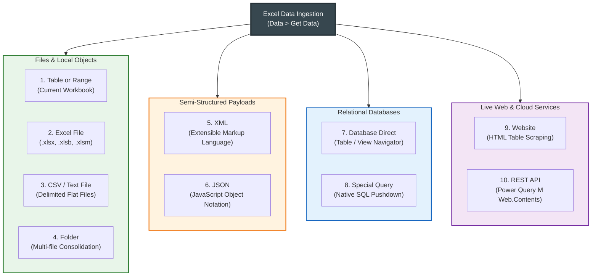
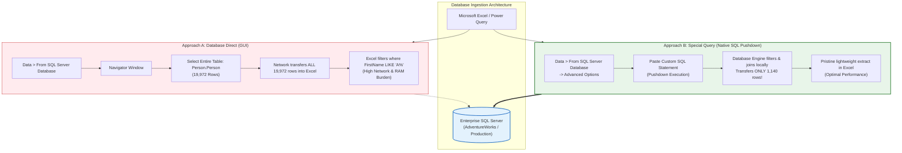

# Lesson 7.3: Ingesting Data from Enterprise Sources (The 9 Channels)

> [!abstract] Learning Objective
> Master Excel's modern data ingestion engine (Power Query / Get & Transform) across all **9 enterprise channels** defined in the course curriculum—from local tables and CSVs to semi-structured JSON/XML, native SQL pushdown queries, live web tables, and programmatic REST APIs.

> 🎥 **Video Chapter**: [Chapter 7 – Importing Data & Data Cleaning (3:54:03)](https://www.youtube.com/watch?v=uv1bxe2gdnU&t=14043s)

---

## 1. Visual Roadmap: The 9 Ingestion Channels

Modern Excel is not just a spreadsheet; it is an enterprise data orchestration client. Via the Power Query ETL engine (**Data > Get Data**), analysts connect directly to transactional systems, cloud lakes, and web services:



---

## 2. Ingestion Channels 1 to 4: Files and Local Objects

### Channel 1: From Table or Range (Local Workbook)
- **Path**: **Data > From Sheet** or **Data > Get Data > From Other Sources > From Table/Range**.
- **Mechanism**: Converts a standard worksheet range into an official Excel Table (`ListObject`, shortcut `Ctrl + T`) and loads it into the Power Query Editor.
- **Use Case**: Cleaning data already pasted into Excel before feeding it into Data Models or PivotTables.
- **Key Advantage**: Dynamic range expansion. When new rows are typed beneath the Excel Table, Power Query automatically incorporates them upon **Refresh** (`Alt + F5`).

---

### Channel 2: From External Excel File (`.xlsx`, `.xlsm`, `.xlsb`)
- **Path**: **Data > Get Data > From File > From Excel Workbook**.
- **Mechanism**: Reads metadata from an unopened external workbook. The **Navigator** dialog presents two object types:
  - 📋 **Table Objects** (Blue header icon): Represents formatted Excel Tables (`Ctrl + T`). **Recommended!** Tables automatically handle variable row counts without capturing empty trailing rows.
  - 📄 **Sheet Objects** (Sheet icon): Represents the raw grid. May contain blank header rows, titles, and empty cells outside the used range that require manual trimming.

---

### Channel 3: From CSV / Text File (Delimited Flat Files)
- **Path**: **Data > Get Data > From File > From Text/CSV**.
- **Course Dataset**: `Supermarket data.csv` (46 MB retail transaction log).
- **Core Parameters**:
  - **File Origin (Encoding)**: Default is `65001: Unicode (UTF-8)`. If Arabic characters appear garbled (e.g. `???` or `عميل`), switch encoding to `1256: Arabic (Windows)` or `UTF-8 with BOM`.
  - **Delimiter**: Auto-detected (Comma `,`, Semicolon `;`, Tab `\t`, Pipe `|`). European regional exports commonly use semicolons.
  - **Data Type Detection**: Based on first 200 rows or entire dataset.


---

### Channel 4: From Folder (Batch Multi-File Consolidation)
- **Path**: **Data > Get Data > From File > From Folder**.
- **The Problem**: A retail business generates 12 monthly sales files (`Sales_Jan.xlsx`, `Sales_Feb.xlsx`, ...). Manually copying and pasting each into a master file is error-prone and time-consuming.
- **The Power Query Solution**:
  1. Point Power Query to the folder path.
  2. Click **Transform Data** (Do NOT click Combine immediately!).
  3. Filter the `Extension` column to `.csv` or `.xlsx` (eliminates temporary files like `~$Sales_Jan.xlsx`).
  4. Click the **Combine Files** icon (double down-arrow) in the `Content` column.
  5. Power Query builds an automated looping function, extracts rows from all 12 files, appends them vertically, and adds a `Source.Name` column tracking the origin file!

---

## 3. Ingestion Channels 5 & 6: Semi-Structured Formats (XML & JSON)

Enterprise web services, microservices, and modern database exports frequently deliver data in hierarchical, semi-structured schemas rather than flat tables.

### Channel 5: From XML (Extensible Markup Language)
- **Path**: **Data > Get Data > From File > From XML**.
- **Source Material Origin**: Generated via SQL Server relational database query from `Quries.sql`:
  ```sql
  SELECT ProductID, Name, ProductNumber, ListPrice
  FROM Production.Product
  FOR XML PATH('Product'), ROOT('Products');
  ```
- **File Structure (`XML_F52E2B61-18A1-11d1-B105-00805F49916B1.xml`)**:
  ```xml
  <Products>
    <Product>
      <ProductID>1</ProductID>
      <Name>Adjustable Race</Name>
      <ProductNumber>AR-5381</ProductNumber>
      <ListPrice>0.0000</ListPrice>
    </Product>
    <Product>
      <ProductID>2</ProductID>
      <Name>Bearing Ball</Name>
      <ProductNumber>BA-8327</ProductNumber>
      <ListPrice>0.0000</ListPrice>
    </Product>
  </Products>
  ```
- **Power Query Parsing Workflow**:
  - Power Query recognizes the `<Products>` root element.
  - Automatically identifies nested `<Product>` records.
  - Flattens hierarchical XML nodes into tabular columns: `ProductID`, `Name`, `ProductNumber`, and `ListPrice`.

---

### Channel 6: From JSON (JavaScript Object Notation)
- **Path**: **Data > Get Data > From File > From JSON**.
- **Source Material Origin**: Exported from SQL Server via `Quries.sql`:
  ```sql
  SELECT BusinessEntityID, FirstName, LastName
  FROM Person.Person
  FOR JSON PATH, ROOT('People');
  ```
- **File Structure (`JSON_F52E2B61-18A1-11d1-B105-00805F49916B3.xml`)**:
  ```json
  {
    "People": [
      {
        "Id": 285,
        "FirstName": "Syed",
        "LastName": "Abbas",
        "EmailAddress": "syed0@adventure-works.com",
        "PhoneNumber": "926-555-0182"
      },
      {
        "Id": 293,
        "FirstName": "Catherine",
        "LastName": "Abel",
        "EmailAddress": "catherine0@adventure-works.com",
        "PhoneNumber": "747-555-0171"
      }
    ]
  }
  ```
- **Power Query Record Expansion Workflow**:
  1. In Power Query, JSON loads as a `Record`.
  2. Click on the yellow hyperlinked `List` adjacent to `"People"`.
  3. Power Query converts the list into rows of `Record` objects.
  4. Click the **Expand Column** icon (`[>]<[<]`) in the upper-right corner of the column header.
  5. Select the target keys (`Id`, `FirstName`, `LastName`, `EmailAddress`, `PhoneNumber`).
  6. Uncheck *"Use original column name as prefix"*.
  7. Instantly converts deeply nested JSON arrays into a pristine 20,000-row tabular dataset!

---

## 4. Ingestion Channel 7: Relational Databases (Direct vs Special Query)

Enterprise reporting relies on relational Database Management Systems (RDBMS) such as **Microsoft SQL Server**, **Oracle**, **PostgreSQL**, **MySQL**, and **Microsoft Access**.



### Approach A: Database (Standard Navigator Navigation)
- **Path**: **Data > Get Data > From Database > From SQL Server Database**.
- **Inputs**: Server Name (e.g., `localhost` or `sql-prod.corp.local`), Database Name (e.g., `AdventureWorks2022`).
- **Data Connectivity Mode**: **Import** (caches data into Excel) vs **DirectQuery** (in Power BI).
- **Execution**: The user selects pre-existing tables or views from the Navigator tree view.

---

### Approach B: Special Query (Native SQL Query Pushdown)
In enterprise environments, tables contain millions of rows. Pulling an entire table across the corporate VPN just to filter for a single region is an anti-pattern.
Instead, analysts utilize **Special Queries** under **Advanced Options > SQL statement**.

#### Grounded Course Example from `Quries.sql`:
```sql
SELECT 
    p.BusinessEntityID, 
    p.FirstName, 
    p.LastName, 
    e.EmailAddress
FROM Person.Person AS p
LEFT JOIN Person.EmailAddress AS e 
    ON p.BusinessEntityID = e.BusinessEntityID
WHERE p.FirstName LIKE 'A%';
```

#### Why "Special Query" is Superior for Analysts:
1. **Query Pushdown / Query Folding**: The SQL Server hardware executes the `LEFT JOIN` and `WHERE` filter across high-speed NVMe storage and dedicated server RAM.
2. **Minimal Network Overhead**: Instead of transferring 19,972 rows of `Person` and 19,972 rows of `EmailAddress` across the network, the database returns *only* the ~1,140 matching records starting with the letter `'A'`.
3. **Column Projection**: Excludes unneeded binary images, password hashes, and GUIDs at the source level.

---

## 5. Ingestion Channels 8 & 9: Website Scraping and REST APIs

### Channel 8: From Website (HTML Table Scraping)
- **Path**: **Data > Get Data > From Other Sources > From Web**.
- **Inputs**: Enter the web URL (e.g., Wikipedia demographics, financial market rate tables, IMF economic indicators).
- **Engine Logic**: Power Query navigates the DOM (Document Object Model) of the target web page, detects HTML `<table>` elements, and lists them as selectable tabular objects in the Navigator preview.
- **Auto-Refresh**: If the web page publishes updated stock prices or currency data, clicking **Refresh** in Excel fetches the live web tables instantly without manual copying.

---

### Channel 9: From REST API (Programmatic Web.Contents & JSON)
When services do not expose HTML tables or direct SQL connections, they provide **REST APIs** returning live JSON data.

#### Grounded Course Script: `M language to Deal with API.txt`
In this lesson demo, students connect Excel to a live currency exchange rate API (`https://api.exchangerate-api.com/v4/latest/USD`) using native Power Query M code:

```powerquery
let
    // 1. Declare base API endpoint and dynamic currency parameter
    baseUrl = "https://api.exchangerate-api.com/v4/latest/",
    currency = "USD",
    fullUrl = baseUrl & currency,

    // 2. Transmit HTTP GET Request via Web.Contents
    response = Web.Contents(fullUrl),

    // 3. Parse JSON stream into an M record object
    json = Json.Document(response),

    // 4. Navigate into the nested 'rates' record
    rates = json[rates],

    // 5. Convert JSON key-value pairs into a two-column Tabular Dataset
    table = Record.ToTable(rates)
in
    table
```



```mermaid
flowchart LR
    API["https://api.exchangerate-api.com\n(REST API Endpoint)"] --> WebC["Web.Contents(fullUrl)\nHTTP GET Request"]
    WebC --> JsonDoc["Json.Document(response)\nDeserializes JSON Stream"]
    JsonDoc --> Extract["json[rates]\nNavigates to Rates Dictionary"]
    Extract --> RecToTab["Record.ToTable(rates)\nConverts Key-Value Pairs to Table"]
    RecToTab --> ExcelGrid["Clean Excel Columns:\n[Name = Currency, Value = Rate]"]

    style API fill:#ffebee,stroke:#c62828
    style WebC fill:#fff3e0,stroke:#ef6c00
    style JsonDoc fill:#e1f5fe,stroke:#0288d1
    style Extract fill:#e8f5e9,stroke:#2e7d32
    style RecToTab fill:#d1c4e9,stroke:#512da8
    style ExcelGrid fill:#f3e5f5,stroke:#6a1b9a
```

#### How to Implement in Excel:
1. Open **Data > Get Data > From Other Sources > Blank Query**.
2. Click **Advanced Editor** in the Query tab.
3. Paste the M code snippet above and click **Done**.
4. Rename column `Name` to `Target_Currency` and `Value` to `Exchange_Rate`.
5. Click **Close & Load**. Your workbook now has live, real-time FX rates updated on demand!

---

## 6. Refresh Mechanics and Enterprise Pipeline Governance

Once an ingestion pipeline is established, analysts configure refresh rules to automate ongoing updates:

| Refresh Mechanism | Shortcut / Setting | Behavioral Details |
| :--- | :--- | :--- |
| **Active Query Refresh** | `Alt + F5` | Refreshes *only* the table connected to the currently selected active cell. |
| **Workbook Master Refresh** | `Ctrl + Alt + F5` | Simultaneously triggers background execution for every database, web, CSV, and API query in the workbook. |
| **Periodic Background Refresh** | **Query Properties > Refresh every X minutes** | Excel polls the underlying database/API at configured intervals (e.g., every 60 minutes) in the background. |
| **Refresh on File Open** | **Query Properties > Refresh data when opening the file** | Ensures decision-makers always view current production figures upon launching the file. |
| **Background vs Synchronous** | **Uncheck "Enable background refresh"** | Essential when writing downstream VBA macros that depend on query completion before executing subsequent code. |

---

## 7. Comparative Architecture Matrix

| Ingestion Channel | Complexity | Performance | Best Used For |
| :--- | :---: | :---: | :--- |
| **Table or Range** | Very Low | High | Local data cleaning, helper tables, manual entry staging. |
| **Excel File** | Low | Moderate | Consolidating external model outputs, legacy workbooks. |
| **CSV / Text** | Low | Very High | Large batch transactional exports (e.g., `Supermarket data.csv`). |
| **Folder** | Medium | High | Automated periodic consolidation (12 monthly sheets, weekly logs). |
| **XML** | Medium | Moderate | Legacy B2B feeds, government data schemas, SQL `FOR XML` exports. |
| **JSON** | Medium | High | Modern cloud services, document databases, SQL `FOR JSON` exports. |
| **Database Direct** | Low | High | Direct exploration of operational tables and views via GUI Navigator. |
| **Special Query (SQL)**| Advanced | Maximum | Enterprise-scale datasets requiring joins, aggregation, and filtering at source. |
| **Website** | Low | Low | Public reference tables, Wikipedia statistics, central bank indices. |
| **REST API (M Code)** | Advanced | High | Dynamic live exchange rates, weather telemetry, cloud SaaS data. |

---

## Related Knowledge
- Notes: [[01_Data_Quality_Dimensions_and_Audit]], [[02_Data_Cleaning_Techniques_in_Excel]], [[04_Business_Systems_for_Analysts]]
- Concepts: [[Power Query]], [[ETL Process]], [[M Language]], [[Data Cleaning]]
- Course Demos & Scripts:
  - SQL: `09_Source_Materials/Module 7/2-Importing Data/Quries.sql`
  - Power Query M: `09_Source_Materials/Module 7/2-Importing Data/M language to Deal with API.txt`
  - Datasets: `Supermarket data.csv`, `Sales.xlsx`, `XML_F52E2B61-18A1-11d1-B105-00805F49916B1.xml`
