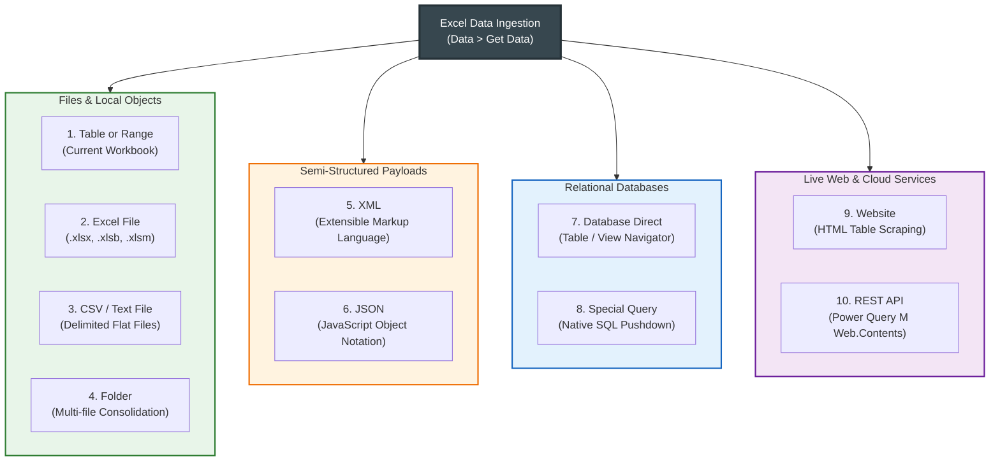
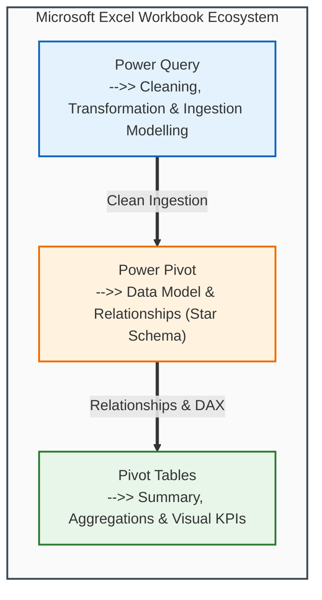
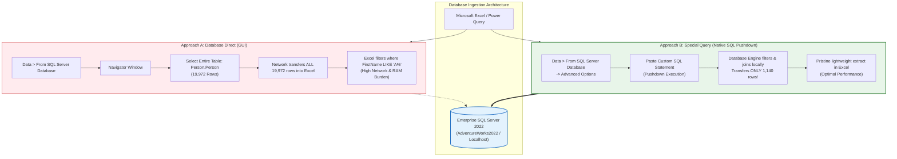
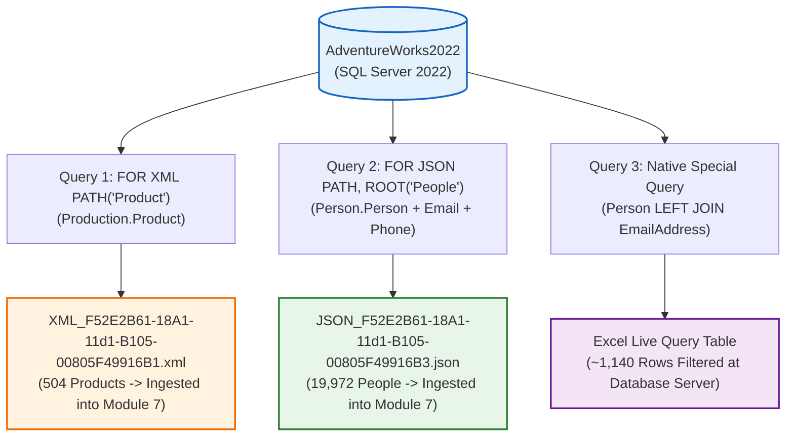

# Lesson 7.3: Ingesting Data from Enterprise Sources (The 9 Channels)

> [!abstract] Learning Objective
> Master Excel's modern data ingestion engine (Power Query / Get & Transform) across all **9 enterprise channels** defined in the course curriculum—from local tables and CSVs to semi-structured JSON/XML, native SQL pushdown queries, live web tables, and programmatic REST APIs.

> 🎥 **Video Chapter**: [Chapter 7 – Importing Data & Data Cleaning (3:54:03)](https://www.youtube.com/watch?v=uv1bxe2gdnU&t=14043s)

---

## 1. Visual Roadmap: The 9 Ingestion Channels

Modern Excel is not just a spreadsheet; it is an enterprise data orchestration client. Via the Power Query ETL engine (**Data > Get Data**), analysts connect directly to transactional systems, cloud lakes, and web services:



---

## 2. Ingestion Channels 1 to 4: Files and Local Objects

### Channel 1: From Table or Range (Local Workbook)
- **Path**: **Data > From Sheet** or **Data > Get Data > From Other Sources > From Table/Range**.
- **Live Demo Implementation (`Module_7_Demo.xlsx`)**: Connects directly to the existing table `Hotel_Reservations` (36,275 rows) within the active workbook.
- **Power Query M Script (Live from `Module_7_Demo.xlsx`)**:
  ```powerquery
  shared Hotel_Reservations = let
      Source = Excel.CurrentWorkbook(){[Name="Hotel_Reservations"]}[Content],
      #"Changed Type" = Table.TransformColumnTypes(Source,{
          {"Booking_ID", type text}, {"no_of_adults", Int64.Type}, {"no_of_children", Int64.Type}, 
          {"no_of_weekend_nights", Int64.Type}, {"no_of_week_nights", Int64.Type}, 
          {"type_of_meal_plan", type text}, {"required_car_parking_space", Int64.Type}, 
          {"room_type_reserved", type text}, {"lead_time", Int64.Type}, 
          {"arrival_year", Int64.Type}, {"arrival_month", Int64.Type}, {"arrival_date", Int64.Type}, 
          {"market_segment_type", type text}, {"repeated_guest", Int64.Type}, 
          {"no_of_previous_cancellations", Int64.Type}, {"no_of_previous_bookings_not_canceled", Int64.Type}, 
          {"avg_price_per_room", type number}, {"no_of_special_requests", Int64.Type}, 
          {"booking_status", type text}
      })
  in
      #"Changed Type";
  ```
- **Mechanism**: Reads the local table via `Excel.CurrentWorkbook(){[Name="..."]}[Content]`.
- **Key Advantage**: Dynamic range expansion. When new rows are typed beneath the Excel Table, Power Query automatically incorporates them upon **Refresh** (`Alt + F5`).

---

### Channel 2: From External Excel File (`.xlsx`, `.xlsm`, `.xlsb`)
- **Path**: **Data > Get Data > From File > From Excel Workbook**.
- **Live Demo Implementation (`Module_7_Demo.xlsx`)**: Ingesting the authentic PwC Forage dataset `01 Call-Center-Dataset.xlsx` (Sheet: `Sheet1`) into table `ExternalData_2` (5,000 call interaction records, 10 canonical columns).
- **Mechanism**: Reads metadata from an unopened external workbook. The **Navigator** dialog presents two object types:
  - 📋 **Table Objects** (Blue header icon): Represents formatted Excel Tables (`Ctrl + T`). **Recommended!** Tables automatically handle variable row counts without capturing empty trailing rows.
  - 📄 **Sheet Objects** (Sheet icon): Represents the raw grid. May contain blank header rows, titles, and empty cells outside the used range that require manual trimming.
- **Power Query M Script (Authentic Forage Dataset)**:
  ```powerquery
  shared #"Source Data" = let
      Source = Excel.Workbook(File.Contents("D:\courses\Data Analysis 26-27\01 Call-Center-Dataset.xlsx"), null, true),
      Sheet1_Sheet = Source{[Item="Sheet1", Kind="Sheet"]}[Data],
      #"Promoted Headers" = Table.PromoteHeaders(Sheet1_Sheet, [PromoteAllScalars=true]),
      #"Changed Type" = Table.TransformColumnTypes(#"Promoted Headers",{
          {"Call Id", type text}, {"Agent", type text}, {"Date", type date}, {"Time", type datetime}, 
          {"Topic", type text}, {"Answered (Y/N)", type text}, {"Resolved", type text}, 
          {"Speed of answer in seconds", Int64.Type}, {"AvgTalkDuration", type datetime}, {"Satisfaction rating", Int64.Type}
      })
  in
      #"Changed Type";
  ```

> [!TIP]
> **Clean Ingestion vs Legacy Phantom Columns:**
> Ingesting the authentic source file (`01 Call-Center-Dataset.xlsx`) maps directly to `Sheet1` with **10 clean columns**. If ingesting an uncleaned legacy workbook (such as `PWC Dataset.xlsx`), trailing cell formats create 4 empty ghost columns (`Column11`–`Column14`), which an analyst purges in Power Query using `Table.RemoveColumns(#"Changed Type", {"Column11", "Column12", "Column13", "Column14"})`.

---

### Channel 3: From CSV / Text File (Delimited Flat Files)
- **Path**: **Data > Get Data > From File > From Text/CSV**.
- **Course Datasets**:
  - `Sample_ Superstore.csv` (9,994 rows, Table: `Sample__Superstore` in `Module_7_Demo.xlsx`).
  - `Hotel Reservations.csv` (36,275 rows).
  - `Supermarket data.csv` (46.08 MB retail transaction log).
- **Core Parameters**:
  - **File Origin (Encoding)**: Default is `65001: Unicode (UTF-8)`. If Arabic characters appear garbled (e.g. `???` or `عميل`), switch encoding to `1256: Arabic (Windows)` or `UTF-8 with BOM`.
  - **Delimiter**: Auto-detected (Comma `,`, Semicolon `;`, Tab `\t`, Pipe `|`). European regional exports commonly use semicolons.
  - **Data Type Detection**: Based on first 200 rows or entire dataset.
- **Power Query M Script (Live from `Module_7_Demo.xlsx` — `Sample_ Superstore`)**:
  ```powerquery
  shared #"Sample_ Superstore" = let
      Source = Csv.Document(
          File.Contents("D:\courses\Data Analysis 26-27\Sample_ Superstore.csv"),
          [Delimiter=",", Columns=19, Encoding=65001, QuoteStyle=QuoteStyle.None]
      ),
      #"Promoted Headers" = Table.PromoteHeaders(Source, [PromoteAllScalars=true]),
      #"Changed Type" = Table.TransformColumnTypes(#"Promoted Headers",{
          {"Row ID", Int64.Type}, {"Order ID", type text}, {"Order Date", type text}, 
          {"Ship Date", type text}, {"Ship Mode", type text}, {"Customer ID", type text}, 
          {"Segment", type text}, {"Country", type text}, {"City", type text}, 
          {"State", type text}, {"Region", type text}, {"Product ID", type text}, 
          {"Category", type text}, {"Sub-Category", type text}, {"Product Name", type text}, 
          {"Sales", type number}, {"Quantity", Int64.Type}, {"Discount", type number}, 
          {"Profit", type number}
      })
  in
      #"Changed Type";
  ```


```text
36  ETL:
37
38  E -: Extract Data   -->> (Done)
39                      |
40  T -: Transform Data -->> (In-Progress Practice in Module_7_Demo.xlsx)
41  L -: Load Data      -->> (Done)
```



```text
Excel Workbook
Pivot Tables    -->> Summary
Power Query     -->> Cleaning and transformation and modelling
Power Pivot     -->> Data Model -- Relationships
```

---

### Channel 4: From Folder (Batch Multi-File Consolidation)
- **Path**: **Data > Get Data > From File > From Folder**.
- **The Problem**: A retail business generates 12 monthly sales files (`Sales_Jan.xlsx`, `Sales_Feb.xlsx`, ...). Manually copying and pasting each into a master file is error-prone and time-consuming.
- **The Power Query Solution**:
  1. Point Power Query to the folder path.
  2. Click **Transform Data** (Do NOT click Combine immediately!).
  3. Filter the `Extension` column to `.csv` or `.xlsx` (eliminates temporary files like `~$Sales_Jan.xlsx`).
  4. Click the **Combine Files** icon (double down-arrow) in the `Content` column.
  5. Power Query builds an automated looping function, extracts rows from all 12 files, appends them vertically, and adds a `Source.Name` column tracking the origin file!

---

## 3. Ingestion Channels 5 & 6: Semi-Structured Formats (XML & JSON)

Enterprise web services, microservices, and modern database exports frequently deliver data in hierarchical, semi-structured schemas rather than flat tables.

### Channel 5: From XML (Extensible Markup Language)
- **Path**: **Data > Get Data > From File > From XML**.
- **Source Material Origin**: Generated via SQL Server relational database query from `Quries.sql`:
  ```sql
  SELECT ProductID, Name, ProductNumber, ListPrice
  FROM Production.Product
  FOR XML PATH('Product'), ROOT('Products');
  ```
- **File Structure (`XML_F52E2B61-18A1-11d1-B105-00805F49916B1.xml`)**:
  ```xml
  <Products>
    <Product>
      <ProductID>1</ProductID>
      <Name>Adjustable Race</Name>
      <ProductNumber>AR-5381</ProductNumber>
      <ListPrice>0.0000</ListPrice>
    </Product>
    <Product>
      <ProductID>2</ProductID>
      <Name>Bearing Ball</Name>
      <ProductNumber>BA-8327</ProductNumber>
      <ListPrice>0.0000</ListPrice>
    </Product>
  </Products>
  ```
- **Power Query Parsing Workflow**:
  - Power Query recognizes the `<Products>` root element.
  - Automatically identifies nested `<Product>` records.
  - Flattens hierarchical XML nodes into tabular columns: `ProductID`, `Name`, `ProductNumber`, and `ListPrice`.

> [!CAUTION]
> **Real-World Error Audit: Multiple Root Elements (`Line 3027, position 2`)**
> When importing the raw course file `XML_F52E2B61-18A1-11d1-B105-00805F49916B1.xml`, Power Query crashes with:
> ```text
> Unable to connect
> Details: "Xml processing failed. Either the input is invalid or it isn't supported. 
> (Internal error: There are multiple root elements. Line 3027, position 2.)"
> ```
> - **Forensic Cause**: W3C XML standard demands strictly **one single root node**. In this raw export, a second `<Products>` tree was accidentally duplicated starting at line 3027 (ending in `</Products_2>`).
> - **The Fix**: Open the file in VS Code or Notepad, navigate to line 3026 (`</Products>`), delete the extraneous second block (lines 3027 to 6052), and save as UTF-8. The repaired file contains 504 clean product records and imports seamlessly.

---

### Channel 6: From JSON (JavaScript Object Notation)
- **Path**: **Data > Get Data > From File > From JSON**.
- **Source Material Origin**: Exported from SQL Server via `Quries.sql`:
  ```sql
  SELECT BusinessEntityID, FirstName, LastName
  FROM Person.Person
  FOR JSON PATH, ROOT('People');
  ```
- **File Structure (`JSON_F52E2B61-18A1-11d1-B105-00805F49916B3.json`)**:
  ```json
  {
    "People": [
      {
        "Id": 285,
        "FirstName": "Syed",
        "LastName": "Abbas",
        "EmailAddress": "syed0@adventure-works.com",
        "PhoneNumber": "926-555-0182"
      },
      {
        "Id": 293,
        "FirstName": "Catherine",
        "LastName": "Abel",
        "EmailAddress": "catherine0@adventure-works.com",
        "PhoneNumber": "747-555-0171"
      }
    ]
  }
  ```

> [!WARNING]
> **Real-World Error Audit: JSON Trapped in an `.xml` File Extension**
> In the source materials, the file was originally named `JSON_F52E2B61-18A1-11d1-B105-00805F49916B3.xml`.
> 1. **Why "From XML" Fails**: If you attempt to import it via **Data > From XML**, the XML parser chokes on `{` at line 1, column 1 because curly braces are illegal in XML syntax!
> 2. **Why "From JSON" Fails**: The Windows File Explorer file picker filters specifically for `*.json`, hiding the file from view.
> 3. **The Fix**: 
>    - **Option A (GUI)**: Rename the file extension from `.xml` to `.json` (`JSON_F52E2B61-18A1-11d1-B105-00805F49916B3.json`). It will immediately appear in **Data > From JSON**!
>    - **Option B (Power Query M Code)**: Force Power Query to interpret the file as JSON regardless of its extension:
>      ```powerquery
>      let
>          Source = Json.Document(File.Contents("D:\courses\Data Analysis 26-27\7-Introducation to Data Fields (Excel)\09_Source_Materials\Module 7\2-Importing Data\JSON_F52E2B61-18A1-11d1-B105-00805F49916B3.json")),
>          PeopleList = Source[People],
>          TableFromList = Table.FromList(PeopleList, Splitter.SplitByNothing(), null, null, ExtraValues.Error),
>          ExpandedColumn = Table.ExpandRecordColumn(TableFromList, "Column1", {"Id", "FirstName", "LastName", "EmailAddress", "PhoneNumber"})
>      in
>          ExpandedColumn
>      ```

- **Power Query Record Expansion Workflow**:
  1. In Power Query, JSON loads as a `Record`.
  2. Click on the yellow hyperlinked `List` adjacent to `"People"`.
  3. Power Query converts the list into rows of `Record` objects.
  4. Click the **Expand Column** icon (`[>]<[<]`) in the upper-right corner of the column header.
  5. Select the target keys (`Id`, `FirstName`, `LastName`, `EmailAddress`, `PhoneNumber`).
  6. Uncheck *"Use original column name as prefix"*.
  7. Instantly converts deeply nested JSON arrays into a pristine 19,972-row tabular dataset!

---

## 4. Ingestion Channel 7: Relational Databases (Direct vs Special Query)

Enterprise reporting relies on relational Database Management Systems (RDBMS) such as **Microsoft SQL Server**, **Oracle**, **PostgreSQL**, **MySQL**, and **Microsoft Access**.



### Approach A: Database (Standard Navigator Navigation)
- **Path**: **Data > Get Data > From Database > From SQL Server Database**.
- **Inputs**: Server Name (`localhost` or `.`), Database Name (`AdventureWorks2022`).
- **Data Connectivity Mode**: **Import** (caches data into Excel memory) vs **DirectQuery** (in Power BI).
- **Execution**: The user selects pre-existing tables or views from the Navigator tree view.

---

### Approach B: Special Query (Native SQL Query Pushdown)
In enterprise environments, tables contain millions of rows. Pulling an entire table across the corporate network just to filter for a single region is a performance anti-pattern.
Instead, analysts utilize **Special Queries** under **Data > From SQL Server Database > Advanced Options > SQL statement**.

#### Grounded Course Example from `Quries.sql`:
```sql
SELECT 
    p.BusinessEntityID, 
    p.FirstName, 
    p.LastName, 
    e.EmailAddress
FROM Person.Person AS p
LEFT JOIN Person.EmailAddress AS e 
    ON p.BusinessEntityID = e.BusinessEntityID
WHERE p.FirstName LIKE 'A%';
```

#### Why "Special Query" is Superior for Analysts:
1. **Query Pushdown / Query Folding**: The SQL Server engine executes the `LEFT JOIN` and `WHERE` filter across high-speed NVMe storage and dedicated server RAM.
2. **Minimal Network Overhead**: Instead of transferring 19,972 rows of `Person` and 19,972 rows of `EmailAddress` across the network, the database returns *only* the ~1,140 matching records starting with `'A'`.
3. **Column Projection**: Excludes unneeded binary images, password hashes, and row GUIDs at the database level.

---

### 🛠️ Hands-on Guide: Restoring `AdventureWorks2022.bak` in SQL Server

To practice enterprise SQL ingestion locally, Microsoft provides the premier OLTP benchmark database: **`AdventureWorks2022`**.

* **Backup File Location**: `D:\SQL Server\MSSQL16.MSSQLSERVER\MSSQL\Backup\AdventureWorks2022.bak`
* **Target Instance**: `Microsoft SQL Server 2022 (Developer Edition)` running on `localhost` (Service: `MSSQLSERVER`)
* **Default Data Directory**: `D:\SQL Server\MSSQL16.MSSQLSERVER\MSSQL\DATA\`

#### Method 1: T-SQL Script (SSMS / Azure Data Studio / sqlcmd)
Run the following script to inspect the logical file names and restore the database to your local data folder:

```sql
-- Step 1: Inspect backup metadata and logical file names
RESTORE FILELISTONLY 
FROM DISK = N'D:\SQL Server\MSSQL16.MSSQLSERVER\MSSQL\Backup\AdventureWorks2022.bak';
GO

-- Step 2: Restore database with MOVE to local instance DATA directory
USE master;
GO

-- Release any active locks if database already exists
IF DB_ID('AdventureWorks2022') IS NOT NULL
BEGIN
    ALTER DATABASE AdventureWorks2022 SET SINGLE_USER WITH ROLLBACK IMMEDIATE;
END
GO

RESTORE DATABASE AdventureWorks2022
FROM DISK = N'D:\SQL Server\MSSQL16.MSSQLSERVER\MSSQL\Backup\AdventureWorks2022.bak'
WITH 
    MOVE N'AdventureWorks2022' TO N'D:\SQL Server\MSSQL16.MSSQLSERVER\MSSQL\DATA\AdventureWorks2022.mdf',
    MOVE N'AdventureWorks2022_log' TO N'D:\SQL Server\MSSQL16.MSSQLSERVER\MSSQL\DATA\AdventureWorks2022_log.ldf',
    REPLACE,
    STATS = 10;
GO

-- Set back to multi-user mode
ALTER DATABASE AdventureWorks2022 SET MULTI_USER;
GO

-- Step 3: Verify restoration
USE AdventureWorks2022;
GO
SELECT COUNT(*) AS [Total Persons] FROM Person.Person;        -- Returns 19,972
SELECT COUNT(*) AS [Total Products] FROM Production.Product;    -- Returns 504
GO
```

#### Method 2: Graphical User Interface (SSMS)
1. Open **SQL Server Management Studio (SSMS)** and connect to Server Name: `.` or `localhost`.
2. In Object Explorer, right-click **Databases** $\rightarrow$ select **Restore Database...**.
3. Under **Source**, select the **Device** radio button $\rightarrow$ click the `...` button.
4. In the dialog, verify Backup media is set to *File* $\rightarrow$ click **Add** $\rightarrow$ navigate to `D:\SQL Server\MSSQL16.MSSQLSERVER\MSSQL\Backup\AdventureWorks2022.bak` $\rightarrow$ click **OK**.
5. In the left navigation pane:
   - Click **Files**: Check the checkbox for **Relocate all files to folder** (or confirm files point to `D:\SQL Server\MSSQL16.MSSQLSERVER\MSSQL\DATA\`).
   - Click **Options**: Check **Overwrite the existing database (WITH REPLACE)**.
6. Click **OK**. A message will confirm: *"Database 'AdventureWorks2022' restored successfully."*

#### Method 3: Instant PowerShell / Terminal Execution
You can restore the database directly from your command line using `sqlcmd`:
```powershell
sqlcmd -S . -E -Q "RESTORE DATABASE AdventureWorks2022 FROM DISK = N'D:\SQL Server\MSSQL16.MSSQLSERVER\MSSQL\Backup\AdventureWorks2022.bak' WITH MOVE N'AdventureWorks2022' TO N'D:\SQL Server\MSSQL16.MSSQLSERVER\MSSQL\DATA\AdventureWorks2022.mdf', MOVE N'AdventureWorks2022_log' TO N'D:\SQL Server\MSSQL16.MSSQLSERVER\MSSQL\DATA\AdventureWorks2022_log.ldf', REPLACE, STATS = 10;"
```

---

### 🧠 Bridging Excel to SQL & Relational Database Concepts

Transitioning from spreadsheet thinking to relational database thinking is the defining leap in a data analyst's career. Here is how core Excel operations translate to enterprise SQL concepts:

#### 1. Spreadsheets vs Relational Databases (RDBMS)

| Architectural Dimension | Microsoft Excel Workbooks | Relational Databases (SQL Server / PostgreSQL) |
| :--- | :--- | :--- |
| **Data Storage Paradigm** | Flat 2D grid of rows and columns; cells can hold mixed formats and formulas. | Strictly typed, normalized tables governed by declarative schemas. |
| **Data Normalization** | Often denormalized into wide flat files; redundant text repeated on every row. | Normalized (3NF) to eliminate update anomalies and duplication. |
| **Referential Integrity** | None by default; accidental typos in IDs create broken lookup formulas. | Enforced Primary Keys (`PK`) and Foreign Keys (`FK`) that reject invalid entries. |
| **Row Scalability** | Hard limit of 1,048,576 rows per worksheet. Calculation engine slows down past 200K rows. | Scales to hundreds of millions or billions of rows across distributed storage engines. |
| **Concurrency & ACID** | Single active writer (or shared cloud editing prone to formula sync conflicts). | Full ACID compliance (Atomicity, Consistency, Isolation, Durability) supporting thousands of concurrent transactions. |

#### 2. How `Quries.sql` Bridges SQL to XML, JSON, and Excel

Notice how the script `Quries.sql` in our course materials demonstrates that SQL Server is the foundational source for multiple data formats:



1. **`FOR XML PATH`**: Translates tabular relational rows into hierarchical XML nodes with elements and attributes.
2. **`FOR JSON PATH`**: Formats rows into JSON arrays and objects, making database payloads ready for web APIs and microservices.
3. **Pushdown SQL**: Ingests filtered relational rows directly into Excel without converting to intermediate files.

#### 3. Excel Formulas vs SQL Equivalents

| Analytical Operation | Excel Function / Feature | SQL Server Equivalent |
| :--- | :--- | :--- |
| **Lookup / Merge** | `=XLOOKUP(A2, Products!A:A, Products!B:B)` | `SELECT ... FROM Orders o LEFT JOIN Products p ON o.ProductID = p.ProductID` |
| **Filtering** | AutoFilter (`Ctrl + Shift + L`) or `=FILTER()` | `WHERE o.OrderDate >= '2024-01-01' AND o.Status = 'Shipped'` |
| **Aggregation** | `=SUMIFS(Revenue, Region, "North")` | `SELECT SUM(Revenue) FROM Sales WHERE Region = 'North'` |
| **Cross-Tabulation** | PivotTable (Rows: Category, Values: Sum of Sales) | `SELECT Category, SUM(Sales) FROM Orders GROUP BY Category` |
| **Conditional Categorization** | `=IF(A2>1000, "High", "Standard")` | `CASE WHEN Amount > 1000 THEN 'High' ELSE 'Standard' END` |
| **String Cleaning** | `=TRIM(A2)` | `LTRIM(RTRIM(A2))` |
| **Ranking** | `=RANK(C2, C$2:C$100)` | `RANK() OVER (ORDER BY Sales DESC)` |

#### 4. Data Type Alignment Matrix

Understanding how SQL Server data types translate to Power Query M types and Excel worksheet formatting prevents truncation and type mismatch errors:

| SQL Server Data Type | Power Query M Data Type | Excel Worksheet Cell Display | Storage & Precision Considerations |
| :--- | :--- | :--- | :--- |
| `INT` / `SMALLINT` / `TINYINT` | `Int64.Type` | Number (0 decimals) | Whole integer values; no fractional decimal component. |
| `BIGINT` | `Int64.Type` (or `type text` for large IDs) | Number or Text | Excel loses precision past 15 digits! High-cardinality IDs (e.g. credit cards, 64-bit snowflakes) must be cast to `type text`. |
| `VARCHAR(n)` / `NVARCHAR(n)` | `type text` | General / Text | Text strings. `NVARCHAR` supports full international Unicode (UTF-16). |
| `DECIMAL(p, s)` / `NUMERIC` | `type number` | Number with fixed decimals | Exact decimal arithmetic; preserves financial rounding precision. |
| `MONEY` / `SMALLMONEY` | `Currency.Type` | Currency (`$#,##0.00`) | High-speed fixed-point currency representation ($4$ decimal places). |
| `DATE` | `type date` | Date (`YYYY-MM-DD`) | Stored as whole serial integer in Excel; displays formatted date. |
| `DATETIME` / `DATETIME2` | `type datetime` | Custom (`YYYY-MM-DD HH:MM:SS`) | Fractional serial number (integer = date, decimal = elapsed time). |
| `BIT` | `type logical` | Boolean (`TRUE` / `FALSE`) | Binary flags (`0` = `FALSE`, `1` = `TRUE`). |

#### 5. Star Schemas & The Power Pivot Connection
When you build a data model in Excel's **Power Pivot**, you are applying relational database principles directly inside the workbook:
- In relational databases, normalized tables are linked via **Foreign Key constraints**.
- In Power Pivot, those same foreign keys define **1-to-Many Relationships** between Dimension Tables (e.g. `Dim_Customer`, `Dim_Product`, `Dim_Date`) and Fact Tables (e.g. `Fact_Sales`, `Fact_Calls`).
- This eliminates the need for thousands of `=VLOOKUP()` formulas that bloat file size and drag recalculation speeds to a crawl.

---

## 5. Ingestion Channels 8 & 9: Website Scraping and REST APIs

### Channel 8: From Website (HTML Table Scraping)
- **Path**: **Data > Get Data > From Other Sources > From Web**.
- **Inputs**: Enter the web URL (e.g., Wikipedia demographics, financial market rate tables, IMF economic indicators).
- **Engine Logic**: Power Query navigates the DOM (Document Object Model) of the target web page, detects HTML `<table>` elements, and lists them as selectable tabular objects in the Navigator preview.
- **Auto-Refresh**: If the web page publishes updated stock prices or currency data, clicking **Refresh** in Excel fetches the live web tables instantly without manual copying.

---

### Channel 9: From REST API (Programmatic Web.Contents & JSON)
When services do not expose HTML tables or direct SQL connections, they provide **REST APIs** returning live JSON data.

#### Grounded Course Script: `M language to Deal with API.txt`
In this lesson demo, students connect Excel to a live currency exchange rate API (`https://api.exchangerate-api.com/v4/latest/USD`) using native Power Query M code:

```powerquery
let
    // 1. Declare base API endpoint and dynamic currency parameter
    baseUrl = "https://api.exchangerate-api.com/v4/latest/",
    currency = "USD",
    fullUrl = baseUrl & currency,

    // 2. Transmit HTTP GET Request via Web.Contents
    response = Web.Contents(fullUrl),

    // 3. Parse JSON stream into an M record object
    json = Json.Document(response),

    // 4. Navigate into the nested 'rates' record
    rates = json[rates],

    // 5. Convert JSON key-value pairs into a two-column Tabular Dataset
    table = Record.ToTable(rates)
in
    table
```



```mermaid
flowchart LR
    API["https://api.exchangerate-api.com\n(REST API Endpoint)"] --> WebC["Web.Contents(fullUrl)\nHTTP GET Request"]
    WebC --> JsonDoc["Json.Document(response)\nDeserializes JSON Stream"]
    JsonDoc --> Extract["json[rates]\nNavigates to Rates Dictionary"]
    Extract --> RecToTab["Record.ToTable(rates)\nConverts Key-Value Pairs to Table"]
    RecToTab --> ExcelGrid["Clean Excel Columns:\n[Name = Currency, Value = Rate]"]

    style API fill:#ffebee,stroke:#c62828
    style WebC fill:#fff3e0,stroke:#ef6c00
    style JsonDoc fill:#e1f5fe,stroke:#0288d1
    style Extract fill:#e8f5e9,stroke:#2e7d32
    style RecToTab fill:#d1c4e9,stroke:#512da8
    style ExcelGrid fill:#f3e5f5,stroke:#6a1b9a
```

#### How to Implement in Excel:
1. Open **Data > Get Data > From Other Sources > Blank Query**.
2. Click **Advanced Editor** in the Query tab.
3. Paste the M code snippet above and click **Done**.
4. Rename column `Name` to `Target_Currency` and `Value` to `Exchange_Rate`.
5. Click **Close & Load**. Your workbook now has live, real-time FX rates updated on demand!

---

## 6. Refresh Mechanics and Enterprise Pipeline Governance

Once an ingestion pipeline is established, analysts configure refresh rules to automate ongoing updates:

| Refresh Mechanism | Shortcut / Setting | Behavioral Details |
| :--- | :--- | :--- |
| **Active Query Refresh** | `Alt + F5` | Refreshes *only* the table connected to the currently selected active cell. |
| **Workbook Master Refresh** | `Ctrl + Alt + F5` | Simultaneously triggers background execution for every database, web, CSV, and API query in the workbook. |
| **Periodic Background Refresh** | **Query Properties > Refresh every X minutes** | Excel polls the underlying database/API at configured intervals (e.g., every 60 minutes) in the background. |
| **Refresh on File Open** | **Query Properties > Refresh data when opening the file** | Ensures decision-makers always view current production figures upon launching the file. |
| **Background vs Synchronous** | **Uncheck "Enable background refresh"** | Essential when writing downstream VBA macros that depend on query completion before executing subsequent code. |

---

## 7. Comparative Architecture Matrix

| Ingestion Channel | Complexity | Performance | Best Used For |
| :--- | :---: | :---: | :--- |
| **Table or Range** | Very Low | High | Local data cleaning, helper tables, manual entry staging. |
| **Excel File** | Low | Moderate | Consolidating external model outputs, legacy workbooks. |
| **CSV / Text** | Low | Very High | Large batch transactional exports (e.g., `Supermarket data.csv`). |
| **Folder** | Medium | High | Automated periodic consolidation (12 monthly sheets, weekly logs). |
| **XML** | Medium | Moderate | Legacy B2B feeds, government data schemas, SQL `FOR XML` exports. |
| **JSON** | Medium | High | Modern cloud services, document databases, SQL `FOR JSON` exports. |
| **Database Direct** | Low | High | Direct exploration of operational tables and views via GUI Navigator. |
| **Special Query (SQL)**| Advanced | Maximum | Enterprise-scale datasets requiring joins, aggregation, and filtering at source. |
| **Website** | Low | Low | Public reference tables, Wikipedia statistics, central bank indices. |
| **REST API (M Code)** | Advanced | High | Dynamic live exchange rates, weather telemetry, cloud SaaS data. |

---

## Related Knowledge
- Notes: [[01_Data_Quality_Dimensions_and_Audit]], [[02_Data_Cleaning_Techniques_in_Excel]], [[04_Business_Systems_for_Analysts]]
- Concepts: [[Power Query]], [[ETL Process]], [[M Language]], [[Data Cleaning]]
- Course Demos & Scripts:
  - SQL: `09_Source_Materials/Module 7/2-Importing Data/Quries.sql`
  - Power Query M: `09_Source_Materials/Module 7/2-Importing Data/M language to Deal with API.txt`
  - Datasets: `Supermarket data.csv`, `Sales.xlsx`, `XML_F52E2B61-18A1-11d1-B105-00805F49916B1.xml`
