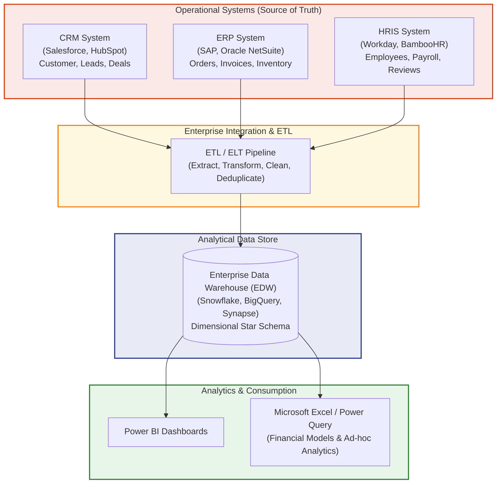
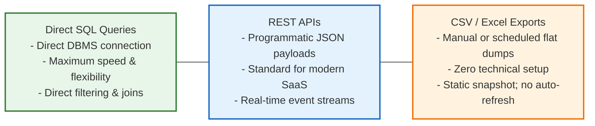
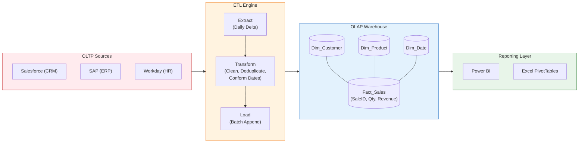

# Lesson 7.4: Enterprise Business Systems Architecture (ERP, CRM, HRIS)

> [!abstract] Learning Objective
> Trace operational data back to its corporate origins across CRM, ERP, and HR systems. Understand their relational data models, explore how data flows through enterprise ETL pipelines into Data Warehouses, and write domain-informed SQL and Excel queries that reflect authentic business processes.

> 🎥 **Video Chapter**: [Chapter 7 – Importing Data & Data Cleaning (3:54:03)](https://www.youtube.com/watch?v=uv1bxe2gdnU&t=14043s)

---

## 1. Visual Roadmap: Where Business Data Comes From

In enterprise organizations, data does not originate inside Excel spreadsheets. It is generated 24/7 across specialized transactional business systems that capture customer interactions, supply chain movements, and human capital activities:



---

## 2. The Big Three Operational Business Systems

### 1. CRM Systems (Customer Relationship Management)
- **Primary Market Platforms**: **Salesforce**, **HubSpot**, **Microsoft Dynamics 365**.
- **Core Purpose**: Manages the end-to-end customer lifecycle—tracking marketing leads, sales pipeline opportunities, account contracts, customer service tickets, and communication history.
- **Relational Data Model**:
  ```mermaid
  erDiagram
      CUSTOMERS ||--o{ LEADS : "converted_from"
      CUSTOMERS ||--o{ OPPORTUNITIES : "owns"
      OPPORTUNITIES ||--o{ SALES : "closes_into"
      SALES ||--|{ PRODUCTS : "contains"

      CUSTOMERS {
          int CustomerID PK
          string Name
          string Email
          string Phone
      }
      LEADS {
          int LeadID PK
          int CustomerID FK
          string Source
          string Status
      }
      OPPORTUNITIES {
          int OpportunityID PK
          int LeadID FK
          decimal EstimatedValue
          string Stage
      }
      SALES {
          int SaleID PK
          int OpportunityID FK
          date SaleDate
          decimal Amount
      }
      PRODUCTS {
          int ProductID PK
          string Name
          decimal Price
      }
  ```
- **Primary Analyst Use Cases & KPIs**:
  - **Pipeline Conversion Rate**: $\frac{\text{Closed Won Deals}}{\text{Total Qualified Leads}} \times 100\%$
  - **Sales Performance Tracking**: Tracking monthly rep quotas against closed billings.
  - **Customer Churn & Retention**: Measuring repeat purchase frequency and customer attrition.
  - **Call Center Analytics**: Call duration, resolution rates, and SLA compliance (e.g., [[Call Center Performance Analysis]]).

---

### 2. ERP Systems (Enterprise Resource Planning)
- **Primary Market Platforms**: **SAP S/4HANA**, **Oracle NetSuite**, **Microsoft Dynamics NAV/Business Central**.
- **Core Purpose**: The operational and financial backbone of the enterprise. Manages the General Ledger (GL), procurement, vendor payables, customer billings, warehouse inventory, manufacturing schedules, and order fulfillment.
- **Relational Data Model**:
  ```mermaid
  erDiagram
      CUSTOMERS ||--o{ ORDERS : "places"
      ORDERS ||--o{ INVOICES : "billed_by"
      INVOICES ||--o{ PAYMENTS : "settled_by"
      ORDERS ||--|{ ORDER_ITEMS : "contains"
      PRODUCTS ||--o{ ORDER_ITEMS : "referenced_in"
      SUPPLIERS ||--o{ INVENTORY : "supplies"

      ORDERS {
          int OrderID PK
          int CustomerID FK
          date OrderDate
          string Status
      }
      INVOICES {
          int InvoiceID PK
          int OrderID FK
          decimal BilledAmount
          date DueDate
      }
      PAYMENTS {
          int PaymentID PK
          int InvoiceID FK
          date PaymentDate
          decimal PaidAmount
      }
      INVENTORY {
          int ItemID PK
          int ProductID FK
          int QuantityOnHand
          decimal UnitCost
      }
  ```
- **Primary Analyst Use Cases & KPIs**:
  - **Revenue Reconciliation**: Auditing billed invoices against collected payments and deferred revenue.
  - **Inventory Optimization**: Days Sales of Inventory (DSI), stockout risks, safety stock buffers.
  - **Cost of Goods Sold (COGS) & Margins**: $\text{Gross Margin} = \frac{\text{Revenue} - \text{COGS}}{\text{Revenue}} \times 100\%$
  - **Procurement & Supply Chain**: Supplier lead times, on-time delivery rates, and vendor spend volume.

---

### 3. HRIS Systems (Human Resources Information Systems)
- **Primary Market Platforms**: **Workday**, **BambooHR**, **SAP SuccessFactors**, **ADP**.
- **Core Purpose**: Manages organizational workforce data, recruitment requisitions, employee contracts, compensation/payroll schedules, timesheets, and performance appraisals.
- **Relational Data Model**:
  ```mermaid
  erDiagram
      DEPARTMENTS ||--o{ EMPLOYEES : "employs"
      EMPLOYEES ||--o{ ATTENDANCE : "logs"
      EMPLOYEES ||--o{ PAYROLL : "receives"
      EMPLOYEES ||--o{ REVIEWS : "evaluated_in"

      EMPLOYEES {
          int EmpID PK
          string FullName
          int DeptID FK
          date HireDate
          string Status
      }
      DEPARTMENTS {
          int DeptID PK
          string DeptName
          int ManagerEmpID FK
      }
      ATTENDANCE {
          int RecordID PK
          int EmpID FK
          date WorkDate
          string StatusCode
      }
      PAYROLL {
          int PayID PK
          int EmpID FK
          string MonthYear
          decimal GrossSalary
          decimal NetSalary
      }
      REVIEWS {
          int ReviewID PK
          int EmpID FK
          decimal Score
          date ReviewDate
      }
  ```
- **Primary Analyst Use Cases & KPIs**:
  - **Employee Turnover Rate**: $\approx 15\%$ annual corporate baseline.
  - **Attendance & Absenteeism Rate**: Target $\ge 92\%$ for optimal frontline workforce productivity.
  - **Performance Score Distribution**: Average scorecard rating (e.g., $4.2 / 5.0$) mapped across compensation tiers.
  - **Headcount Cost & Salary Benchmarking**: Departmental run-rate modeling ($62k average employee base).

---

## 3. System Architecture: Is CRM Part of ERP?

A classic interview question for data analysts: **"Is CRM part of ERP?"**
The answer depends on company scale and software architecture:

| Architecture Model | Implementation | Trade-offs | Typical Adoption |
| :--- | :--- | :--- | :--- |
| **All-in-One ERP Suite** | CRM exists as a module *inside* the ERP (e.g., SAP CRM module or Oracle ERP Cloud). | **Pros**: Single shared database; zero integration latency.<br>**Cons**: Less flexible; CRM features may lag behind best-of-breed tools. | Mid-market companies, manufacturing firms with integrated supply chains. |
| **Best-of-Breed Decoupled** | Dedicated standalone CRM (Salesforce) integrated with standalone ERP (SAP) and HRIS (Workday). | **Pros**: Maximum feature power for each department.<br>**Cons**: Requires sophisticated API integrations and middleware (MuleSoft/Boomi); risk of data silos. | Large enterprises, tech companies, multinational conglomerates. |

---

## 4. How Analysts Extract Data from Business Systems

Data analysts access transactional systems through three primary extraction mechanisms:



### Practical SQL Extraction Example (from Course Demo):
When querying operational CRM/ERP tables, analysts write targeted SQL to aggregate transactional lines before loading them into Excel:

```sql
-- Practical Query: Monthly Sales Performance by Representative
SELECT 
    r.rep_name                        AS "Sales Rep",
    DATE_TRUNC('month', s.sale_date)  AS "Sales Month",
    COUNT(s.sale_id)                  AS "Total Deals",
    SUM(s.amount)                     AS "Total Revenue",
    AVG(s.amount)                     AS "Avg Deal Size"
FROM Sales AS s
JOIN SalesReps AS r 
    ON s.rep_id = r.rep_id
WHERE s.sale_date >= '2024-01-01'
GROUP BY 
    r.rep_name, 
    DATE_TRUNC('month', s.sale_date)
ORDER BY 
    "Total Revenue" DESC;
```

---

## 5. Enterprise Data Warehouse (EDW) Architecture

Operational systems are tuned for **OLTP (Online Transaction Processing)**: rapid, single-row inserts and updates. Running massive analytical aggregations across 10 years of transactions directly against live ERP databases can lock production tables and crash billing operations!

To prevent this, organizations build an **Enterprise Data Warehouse (EDW)** tuned for **OLAP (Online Analytical Processing)**:



1. **Extract**: Nightly batch jobs extract new/modified records from CRM, ERP, and HRIS databases.
2. **Transform**: Business logic is applied:
   - Currency rates from international subsidiaries are converted to USD.
   - Text strings are sanitized (`TRIM`, `PROPER`).
   - Customer IDs from CRM and ERP are resolved into a single **Golden Customer Record**.
3. **Load**: Cleaned data is loaded into Star Schema tables: **Fact Tables** (numerical measurements like sales revenue) connected to **Dimension Tables** (descriptive context like customer name, product category, store location).
4. **Analyze**: Analysts connect Excel via **Data > Get Data > From Database** to query the clean, pre-modeled warehouse tables safely without impacting live operations.

---

## 6. Why Data Analysts Must Understand Business Systems

Understanding where data comes from is the defining differentiator between a junior spreadsheet operator and a high-impact senior data analyst:

1. **Prevents Costly Interpretation Errors**:
   - Knowing that a "Cancelled" status in CRM means an unsaved quote, while in ERP it represents a dispatched order returned to inventory.
2. **Superior, Optimized SQL**:
   - Understanding table relationships enables you to write performant `INNER JOIN` vs `LEFT JOIN` queries that avoid Cartesian explosions.
3. **Faithful Data Modeling**:
   - Designing Excel and Power BI models that accurately mirror real-world corporate operational workflows.
4. **Earning Stakeholder Trust**:
   - Speaking the native language of Sales Directors (leads, stages, ARR), CFOs (invoices, GL reconciliation, DSO), and HR Leaders (attrition, headcount cost).

---

## 7. Connecting Course Datasets to Enterprise Systems

Every dataset explored across this course directly corresponds to an authentic enterprise business system, demonstrating how raw operational databases translate into executive intelligence through the Modern Excel Analytics Stack:

```text
Excel Workbook
Pivot Tables    -->> Summary
Power Query     -->> Cleaning and transformation and modelling
Power Pivot     -->> Data Model -- Relationships
```

| Course Dataset | Origin System Category | Underlying Operational Engine | Real-World System Analogs | Primary Analyst Questions |
| :--- | :--- | :--- | :--- | :--- |
| **`01 Call-Center-Dataset.xlsx`**<br/>([`Module_7_Demo.xlsx`](file:///d:/courses/Data%20Analysis%2026-27/7-Introducation%20to%20Data%20Fields%20(Excel)/11_Demos_and_Workbooks/07_Data_Cleaning/Module_7_Demo.xlsx)) | **CRM / Support Desk** (PwC Task 1) | Customer inquiry tickets, agent queue speeds, call durations, CSAT ratings. | Salesforce Service Cloud, Zendesk, Genesys Cloud | Which agents resolve inquiries fastest? What topics cause customer abandonment? |
| **`02 Churn-Dataset.xlsx`**<br/>(PwC Switzerland Forage) | **Subscription ERP & Billing** (PwC Task 2) | Customer subscriptions, payment methods, contract durations, monthly charges, churn flags. | Zuora, Stripe Billing, SAP BRIM, Amdocs | What contract terms drive customer churn? Which payment methods correlate with attrition? |
| **`03 Diversity-Inclusion-Dataset.xlsx`**<br/>(PwC Switzerland Forage) | **Enterprise HRIS / HCM** (PwC Task 3) | Employee hiring cohorts, promotion rates (FY20/FY21), performance scores, executive gender parity. | Workday HCM, SAP SuccessFactors, BambooHR | What is the promotion velocity across gender grades? What causes executive turnover? |
| **`Hotel Reservations`**<br/>([`Module_7_Demo.xlsx`](file:///d:/courses/Data%20Analysis%2026-27/7-Introducation%20to%20Data%20Fields%20(Excel)/11_Demos_and_Workbooks/07_Data_Cleaning/Module_7_Demo.xlsx)) | **Hospitality ERP / PMS** | Guest bookings, room inventory, ADR pricing, meal packages, cancellation flags. | Oracle Opera PMS, SAP Hospitality, Amadeus | What lead time predicts cancellation? Which market segments generate highest ADR? |
| **`Supermarket data.csv`**<br/>(`09_Source_Materials/Module 7`) | **Retail ERP / POS** | High-volume cashier transaction lines, branch revenues, payment methods. | SAP Retail, NCR Counterpoint, Dynamics Commerce | Which product lines drive profitability across regional branches? |
| **`AdventureWorks2022`**<br/>(`AdventureWorks2022.bak` & `Quries.sql`) | **Manufacturing ERP** | Production catalog (504 products), Bill of Materials (BOM), employee contact registers (19,972 people). Restored via T-SQL `RESTORE DATABASE` to local SQL Server instance. | SAP S/4HANA Manufacturing, Oracle E-Business Suite | How do product numbers map to sales orders and employee directories? How do we push down SQL queries to SQL Server from Excel? |

---

## Related Knowledge
- Notes: [[01_Data_Quality_Dimensions_and_Audit]], [[02_Data_Cleaning_Techniques_in_Excel]], [[03_Importing_Data_from_Enterprise_Sources]]
- Concepts: [[ETL Process]], [[Dimensional Modeling]], [[Power Query]], [[Data Cleaning]]
- Course Demos & Reference:
  - Reference: [[Module 7 Dataset Documentation]]
  - Demo Workbook: [`Module_7_Demo.xlsx`](file:///d:/courses/Data%20Analysis%2026-27/7-Introducation%20to%20Data%20Fields%20(Excel)/11_Demos_and_Workbooks/07_Data_Cleaning/Module_7_Demo.xlsx)
  - Slide Decks:
    - `09_Source_Materials/Module 7/3-ERP - CRM - HR Systems/1-Introduction to Business Systems.pptx`
    - `09_Source_Materials/Module 7/3-ERP - CRM - HR Systems/2-Business Systems for Data Analysts.pptx`
