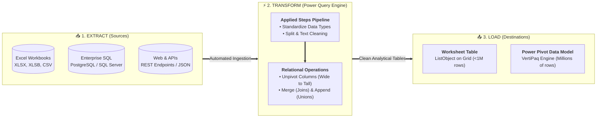

# Lesson 8.1: Power Query Fundamentals & The Automated ETL Pipeline

> [!abstract] Learning Objective
> Master the Power Query interface, understand the Extract-Transform-Load (ETL) pipeline, and utilize the Applied Steps engine to create repeatable data transformations.

> 🎥 **Video Chapter**: [Chapter 8 – Power Query & M Language (4:20:30)](https://www.youtube.com/watch?v=uv1bxe2gdnU&t=15630s)

## The ETL Architecture

## Why Power Query is a Game Changer
- **Non-Destructive**: Original source files remain untouched.
- **Repeatable & Automated**: All cleaning actions are recorded in **Applied Steps**. When next month's data arrives, clicking **Refresh** re-runs the entire pipeline in seconds.
- **Handles Massive Datasets**: Can load millions of rows directly into the Power Pivot Data Model, bypassing Excel's 1,048,576 row worksheet limit!

## Related Knowledge
- Concepts: [[Power Query]], [[ETL Process]], [[M Language]]

## Additional Learning Resources
### Recommended
- ⚡ [[Power Query ETL Transformations|Gemini Notebook: Power Query ETL Transformations]]
- 📊 [[Analytics Pipeline Comparison|Analytics Pipeline & Enterprise Stack Comparison]]
### External
- 🌐 [Gemini Notebook Source](https://notebook.google.com/notebook/bcdef821-08bc-4186-9221-2c747d5a2b15?authuser=1)

