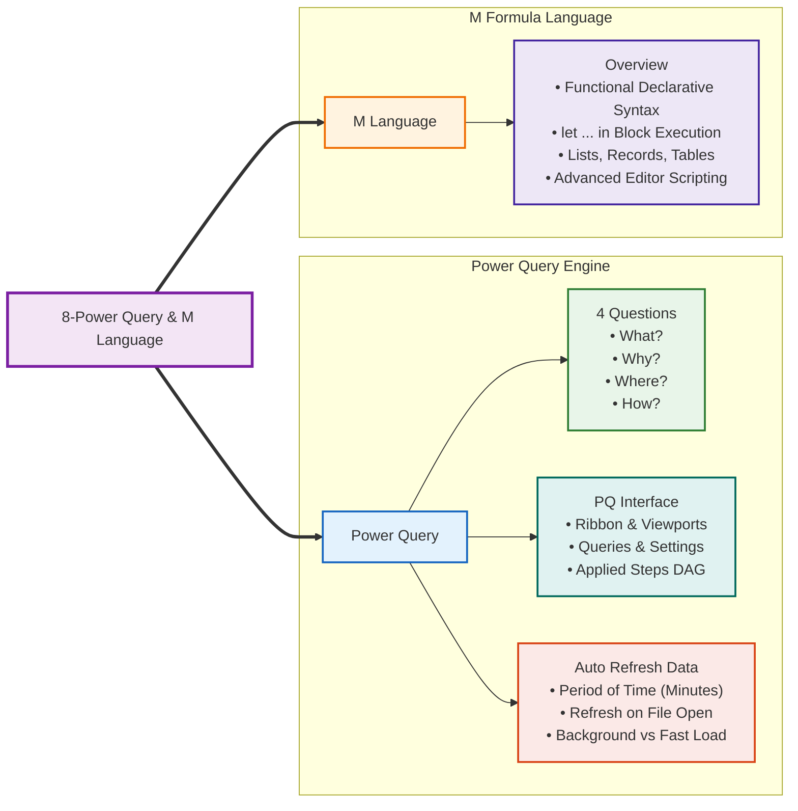
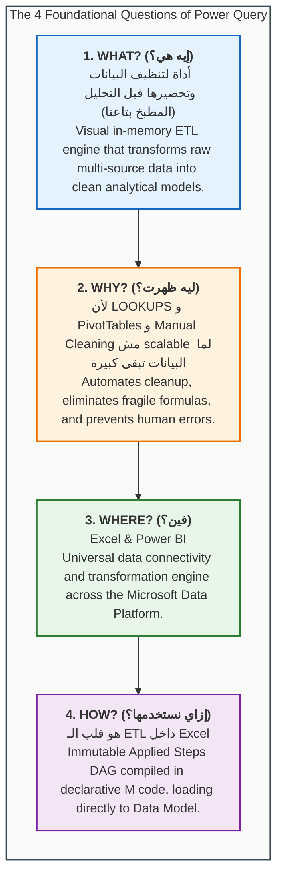
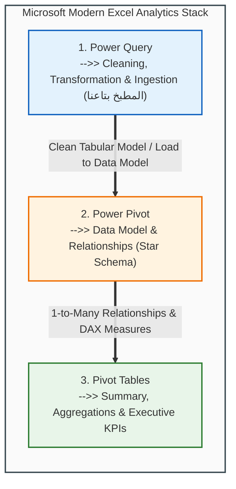
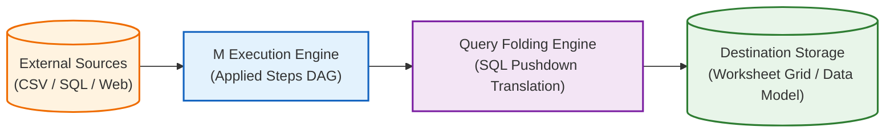
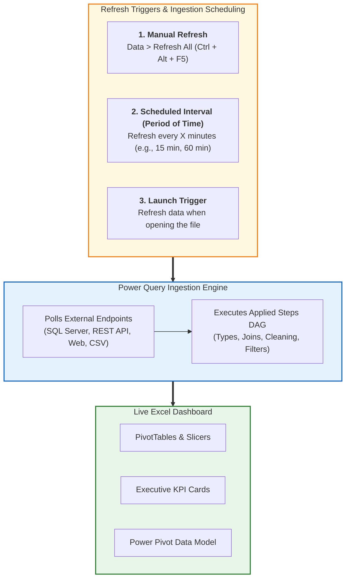
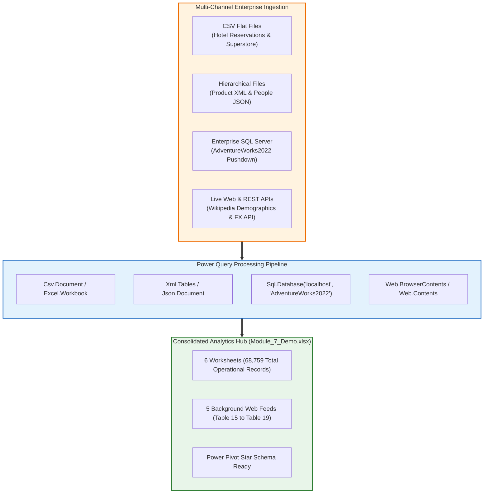
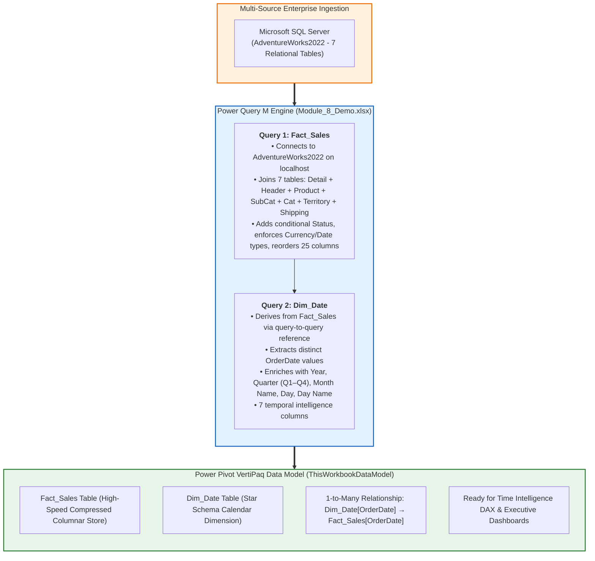

# Lesson 8.1: Power Query Fundamentals, Interface & Automated ETL Architecture

> [!abstract] Learning Objective
> Master the pedagogical foundations of Power Query through the **4 Essential Questions (What, Why, Where, How)**, navigate every component of the **Power Query Interface (PQ Interface)**, configure automated periodic background polling (**Auto Refresh Data & Period of Time**), and understand the structural foundation of the **M Language**.

> 🎥 **Video Chapter**: [Chapter 8 – Power Query & M Language (4:20:30)](https://www.youtube.com/watch?v=uv1bxe2gdnU&t=15630s)

---

## 🧠 Curriculum Mindmap Architecture

This lesson directly operationalizes the official course curriculum mindmap for **Module 8: Power Query & M Language**:



```text
8-Power Query & M Language
├── Power Query
│   ├── 4 Questions
│   │   ├── What?
│   │   ├── Why?
│   │   ├── where?
│   │   └── How?
│   ├── PQ Interface
│   └── Auto Refresh Data
│       └── Period of time
└── M Language
    └── Overview
```

---

## ❓ 1. The 4 Essential Questions (4 Questions)

Before clicking buttons inside the tool, every professional data analyst must master the four conceptual pillars that govern modern data mashup architecture, as structured in our official lab workbook ([`Module_8_Demo.xlsx`](file:///d:/courses/Data%20Analysis%2026-27/7-Introducation%20to%20Data%20Fields%20(Excel)/11_Demos_and_Workbooks/08_Power_Query/Module_8_Demo.xlsx)):



---

### 1. What is Power Query? (`What?` / إيه هي؟)

> [!tip] The Core Conceptual Metaphor: **"المطبخ بتاعنا" (The Data Kitchen)**
> **«أداة لتنظيف البيانات وتحضيرها قبل التحليل (المطبخ بتاعنا)»**  
> Think of Power Query as a high-end restaurant's **prep kitchen**. Raw ingredients (messy CSVs, SQL dumps, unformatted Excel tables, and web feeds) never go directly to the customer's dining table. In the kitchen, chefs wash vegetables, trim meats, peel potatoes, and measure ingredients. Customers in the dining room only see the finished, beautifully plated dish—represented in Excel by the **Power Pivot Data Model**, clean **PivotTables**, and interactive **Executive Dashboards**.

- **Core Definition**: Power Query is Microsoft's native **visual ETL (Extract, Transform, Load)** and data connectivity technology.
- **The Analytical Middleware**: It functions as the intermediate pipeline that sits between raw, messy enterprise data sources (CSV files, ERP dumps, databases, web pages, APIs) and downstream analytical consumers (Excel worksheets, PivotTables, and Power Pivot Data Models).
- **Declarative Recipe Model**: When you work in Power Query, you are not editing cell contents; you are building an immutable, step-by-step transformation script written in the **M Formula Language**.

---

### 2. Why Did Power Query Emerge? (`Why?` / ليه ظهرت؟)

> [!important] The Scalability Imperative
> **«لأن الـ LOOKUPS و PivotTables و Manual Cleaning مش scalable لما البيانات تبقى كبيرة.»**  
> **«Power Query اتعمل علشان يحل مشكلة البيانات الـ messy اللي تنظيفها يدوي بيضيع وقت وبيعمل أخطاء.»**

Traditional spreadsheet workflows rely on manual cutting, pasting, text splitting, and thousands of `=VLOOKUP` or `=IF` formulas. As organizations scale into tens of thousands or millions of records, this manual approach collapses:

| Operational Limitation of Standard Excel | Power Query Enterprise Solution | Business & Engineering Impact |
| :--- | :--- | :--- |
| **Destructive Editing**<br/>Manual edits alter or corrupt source files permanently. | **100% Non-Destructive Ingestion**<br/>Source files remain strictly read-only and unedited. | Zero risk of overwriting raw production archives. |
| **Repetitive Monthly Overhead**<br/>Analysts spend 15 hours each month re-cleaning the same recurring reports. | **"Build Once, Refresh Forever"**<br/>All transformation steps are recorded into an automated pipeline. | Monthly reporting cycle drops from 15 hours to a single click of **Refresh All**. |
| **Recalculation Lag & File Bloat**<br/>100,000 rows with 15 lookup formulas freeze the workbook. | **High-Speed In-Memory Pipeline**<br/>Calculations are compiled during ingestion; worksheets store static, clean tabular rows. | Instant workbook calculation and dramatic reduction in file size. |
| **The 1,048,576 Row Ceiling**<br/>Worksheets crash when datasets exceed 1 million rows. | **VertiPaq Engine Bypass**<br/>Queries can load directly into the Power Pivot Data Model without populating worksheet cells. | Effortlessly handles 5M to 50M rows directly inside Microsoft Excel. |
| **Multi-Source Fragmentation**<br/>Data resides across CSVs, SQL Server, and REST APIs. | **Unified Mashup Engine**<br/>Seamlessly joins and unions relational databases with web tables and flat files. | Eliminates data silos across departments. |

---

### 3. Where is Power Query Located & Where Does It Live? (`where?` / فين؟)

> [!note] Cross-Platform Presence
> **«Excel & Power BI»**  
> Power Query is not an isolated Excel plugin; it is the universal data ingestion and preparation engine underpinning the entire Microsoft Data Platform.

#### A. Location Inside Microsoft Excel:
- Located directly on the Excel Ribbon under **Data > Get & Transform Data**.
- Clicking **Get Data** opens connection dialogs for Files (Excel, CSV, XML, JSON, Folders), Databases (SQL Server, Access, Oracle), Azure, Online Services, and Other Sources (Web, OData, Blank Query).
- Double-clicking any existing query in the **Queries & Connections** task pane launches the dedicated, modal **Power Query Editor** environment.

#### B. Location in the Modern Excel Analytics Stack:
Power Query serves as Layer 1 of the canonical three-tier analytics ecosystem:



```text
Excel Workbook
Pivot Tables    -->> Summary (Executive Plating)
Power Pivot     -->> Data Model -- Relationships (Structured Pantry)
Power Query     -->> Cleaning and transformation and modelling (المطبخ بتاعنا)
```

#### C. Cross-Platform Ecosystem Presence:
Because Microsoft built Power Query as a standardized data connectivity engine, your skills transfer 100% across the Microsoft Data stack:
- **Microsoft Excel** (Desktop & Web)
- **Microsoft Power BI Desktop** (Power Query Editor)
- **Power BI Service** (Power Query Dataflows)
- **Microsoft Fabric / Azure Data Factory** (Dataflows Gen2)

---

### 4. How Does Power Query Work? (`How?` / إزاي نستخدمها؟)

> [!abstract] Master Operational Summary (ملخص الاستخدام)
> 1. **هو عبارة عن أداة ETL داخل Excel**: يقوم بسحب البيانات (Extract)، تنظيفها وتحويلها (Transform)، ثم تحميلها (Load) إلى الـ Data Model أو ورقة العمل.
> 2. **كل خطوة بتعملها جواه بتتسجل تلقائيًا كـ Applied Steps وكود M تقدر تعيده على أي بيانات جديدة**: كل مرحلة يتم توثيقها كخطوة رياضية برمجية غير قابلة للتلف.
> 3. **Power Query بيئة مستقلة عن Excel، مش فورمولا ومش Pivot—هو Tool مخصصة لتنظيف وتجهيز البيانات**: يعمل في الذاكرة الخلفية دون إثقال خلايا الإكسيل، ويغذي الـ Data Model والـ PivotTables مباشرة.
> 4. **بتستخدمه لما يكون عندك شغل متكرر، دمج ملفات، تنظيف تقيل، أو تجهيز Data للـ dashboards والتحليل**: هو العمود الفقري لبناء خطوط أنابيب بيانات (Data Pipelines) محترفة ومستدامة.

Under the hood, Power Query operates via three fundamental technical mechanisms:



1. **The Step-by-Step Immutable DAG (Directed Acyclic Graph)**:
   - Each action recorded in the **Applied Steps** list generates a new immutable variable in M code.
   - Step $N$ takes the output table of Step $N-1$, applies a pure functional transformation, and outputs Table $N$.
2. **Query Folding (Pushdown Server Optimization)**:
   - When connecting to relational databases (e.g. SQL Server, Oracle, PostgreSQL), Power Query translates M transformations (filtering rows, selecting columns, joining tables) directly into **native SQL** (`WHERE`, `SELECT`, `JOIN`).
   - The query executes on the powerful database server hardware, streaming *only* the filtered result set across the network into Excel.
3. **Lazy In-Memory Evaluation**:
   - Power Query does not process millions of records while you are designing transformations; it generates an instantaneous **1,000-row preview cache** in memory, guaranteeing rapid UI responsiveness.

---

## 🖥️ 2. The Power Query Interface (`PQ Interface`)

When you open Power Query Editor, you enter a specialized, self-contained workspace engineered specifically for data preparation. The interface is composed of six distinct functional viewports:

| UI Viewport / Zone | Screen Location | Active Elements & Controls | Operational Purpose & Key Capabilities |
| :--- | :--- | :--- | :--- |
| **Ribbon Toolbar** | Top Header Dock | `Home` \| `Transform` \| `Add Column` \| `View` \| `Tools` \| `Help` | Command center housing ETL operations, row filtering, column splitting, merging, and loading destinations. |
| **Formula Bar** | Upper-Center Dock | `= Table.TransformColumnTypes(#"Promoted Headers", {{"Customer", type text}, {"OrderID", Int64.Type}})` | Displays and allows direct modification of the active step's underlying declarative **M code** expression. |
| **Queries Pane** | Left Sidebar Dock | • `Hotel_Res`<br/>• `People`<br/>• `Product`<br/>• `Query1`<br/>• `Table 15 (Web)` | Hierarchical navigation tree of all workbook queries, staging tables, parameters, and custom functions. |
| **Data Preview Grid** | Central Main Stage | Live 1,000-row preview grid with column header data type icons (`ABC`, `123`, `$`, `📅`) and data profiling bars | Interactive, lazy-evaluated preview showing instant results of the currently selected transformation step. |
| **Query Settings Pane** | Right Sidebar Dock | • **Properties**: Query Name (`Orders`), Description<br/>• **Applied Steps**: `Source` $\to$ `Promoted Headers` $\to$ `Changed Type` $\to$ `Filtered Rows` | Sequential dependency DAG (Directed Acyclic Graph) recording every transformation with time-travel inspection. |
| **Status Bar** | Bottom Footer Dock | `4 Columns, 1000 Rows` \| `Column profiling based on top 1000 rows` | Telemetry bar displaying dataset metrics, execution status, and column profiling sample boundaries. |

#### Data Preview Grid (Active Step: `Changed Type`)

| Customer (`ABC` / `type text`) | OrderID (`123` / `Int64.Type`) | Total (`$` / `Currency.Type`) | Date (`📅` / `type date`) |
| :--- | :---: | :---: | :---: |
| **John Doe** | 1001 | $250.00 | 2024-01-15 |
| **Jane Smith** | 1002 | $85.50 | 2024-01-16 |
| **Acme Corp** | 1003 | $1,200.00 | 2024-01-16 |
| **Global Ltd** | 1004 | $430.20 | 2024-01-17 |

### Component Breakdown:

#### 1. The Ribbon
Organized into four primary operational tabs:
- **Home Tab**:
  - **Close & Load**: Commits transformations and loads data to a Worksheet Table or the Power Pivot Data Model.
  - **Reduce Rows**: `Keep Top Rows`, `Keep Range of Rows`, `Remove Duplicates`, `Remove Blank Rows`, `Remove Errors`.
  - **Transformations**: `Split Column` (by delimiter, character count, positions), `Group By` (aggregation), `Data Type` selector.
  - **Combine**: `Merge Queries` (relational joins) and `Append Queries` (vertical union stacking).
- **Transform Tab (In-Place Modifications)**:
  - Operates directly on the selected column without creating new columns.
  - `Unpivot Columns` (converts wide cross-tab reports into tall normalized tables).
  - `Transpose` (swaps rows and columns), `Reverse Rows`, `Count Rows`.
  - Text: `Format` (`UPPERCASE`, `lowercase`, `Capitalize Each Word`, `Trim`, `Clean`), `Extract` (length, delimiter text).
  - Number: Rounding, standard math (`Add`, `Multiply`, `Divide`), statistics.
  - Date & Time: Extract Year, Month, Day, Quarter, Age, Earliest/Latest date.
- **Add Column Tab (Derived Columns)**:
  - Preserves original columns and appends a *new* calculated column to the right.
  - `Column From Examples`: Generates transformation logic automatically based on user-typed output patterns.
  - `Custom Column`: Opens the M formula editor to write expressions (e.g., `[Sales] * (1 - [Discount])`).
  - `Conditional Column`: Visual IF-THEN-ELSE rule builder.
  - `Index Column`: Generates 0-based or 1-based sequential row identifiers.
- **View Tab (Data Profiling & Diagnostic Tools)**:
  - **Formula Bar**: Toggles display of the M formula bar.
  - **Column Quality**: Shows percentage bars of Valid, Error, and Empty records across each column.
  - **Column Distribution**: Displays unique and distinct value counts.
  - **Column Profile**: Displays statistical distribution histograms, min/max values, averages, and standard deviations.

#### 2. The Queries Pane (Left)
- Displays all data queries currently defined in the workbook.
- Supports organizing queries into structured folders (e.g., `Staging Sources`, `Dimensions`, `Fact Tables`).
- Distinguishes between **Loaded Tables** (loaded into Excel grid or Data Model) and **Connection Only Queries** (intermediate staging queries that do not consume workbook memory).

#### 3. The Data Preview Grid (Center)
- Displays the live, interactive tabular preview corresponding to the currently selected step in the Applied Steps list.
- **Header Badges**: Every column header displays an icon indicating its enforced data type:
  - `123`: Whole Number (`Int64.Type`)
  - `1.2`: Decimal Number (`type number`)
  - `$`: Fixed Decimal / Currency (`Currency.Type`)
  - `ABC`: Text String (`type text`)
  - `📅`: Date (`type date`)
  - `🕒`: Time (`type time`)
  - `📅🕒`: Date/Time (`type datetime`)
  - `T/F`: Logical / Boolean (`type logical`)
- Right-clicking any column header reveals context menus for sorting, filtering, duplicating, and removing columns.

#### 4. The Formula Bar (Top)
- Displays the single line of Power Query M code generated by the active step.
- Allows direct in-line editing of function parameters, column names, and delimiters without opening dialogs.

#### 5. The Query Settings Pane (Right)
- **Properties**: Allows naming queries with descriptive enterprise conventions (e.g., `Fact_CallCenter_Calls`, `Dim_Products`).
- **Applied Steps (The Audit Trail)**:
  - Displays every transformation step in chronological execution order (`Source` $\to$ `Promoted Headers` $\to$ `Changed Type`).
  - **Time Travel**: Clicking an earlier step instantly renders the table's state *at that specific point in time*.
  - **Reordering & Deletion**: Steps can be dragged to reorder or deleted by clicking the red `X`.
  - **Gear Icon (`⚙️`)**: Clicking the gear opens the visual dialog to modify parameters (e.g., changing delimiter or filter value).

#### 6. The Status Bar (Bottom)
- Displays current column count and row count indicators.
- Displays profiling scope: *"Column profiling based on top 1000 rows"* (can be toggled to *"Column profiling based on entire data set"*).

---

## 🔄 3. Auto Refresh Data & Periodic Interval Scheduling (`Auto Refresh Data`)

One of the greatest competitive advantages of Power Query over static spreadsheets is its capability to establish automated, recurring ingestion loops that continuously update dashboards with live enterprise data:



### Configuring Scheduled Periodic Refresh in Excel (`Period of time`):
To configure a query to poll its source on a scheduled cadence:
1. Open the workbook and navigate to the **Data** tab on the Ribbon.
2. Click **Queries & Connections** to open the side panel.
3. Right-click the target query (e.g., `Table 15` from Wikipedia or `Query1` from SQL Server) $\to$ select **Properties...**.
4. In the **Query Properties** dialog under the **Usage** tab, configure the automated refresh settings:

| Setting Name | Configuration Options | Operational Purpose & Real-World Use Case |
| :--- | :--- | :--- |
| **Refresh every [ X ] minutes** | Check box & specify interval (e.g., `15`, `30`, `60`) | **Scheduled Periodic Polling ("Period of Time")**.<br/>Excel automatically re-queries the data source every $X$ minutes in the background. Ideal for live operational monitoring: tracking call center queue volumes, inbound hotel reservations, or real-time currency FX rates. |
| **Refresh data when opening the file** | Check box | Guarantees that managers and executives always view current data when launching the workbook, without needing to know where the **Refresh** button is. |
| **Enable background refresh** | Check box (Enabled by default) | **Asynchronous Execution**.<br/>Allows users to continue scrolling, typing, and analyzing spreadsheets while Power Query extracts and transforms massive data payloads on a separate background thread. (Disable if VBA macros must wait for data to finish loading before executing subsequent calculations). |
| **Fast Data Load** | Check box under Data Load Options | Accelerates ingestion by disabling visual preview generation during large batch loads. Highly recommended for multi-million row tables. |

---

## 💻 4. M Language: Foundational Overview (`M Language -> Overview`)

Every visual mouse-click made inside the Power Query Editor automatically generates underlying code in Microsoft's functional programming language: **M (Power Query Formula Language)**.

### 1. Architectural Characteristics of M:
- **Purely Functional**: Everything is evaluated as functions returning values. There are no stateful loops (`for`, `while`) or global variable mutations.
- **Declarative & Lazy**: Expressions are evaluated *only when needed* by downstream steps.
- **Strictly Case-Sensitive**: M distinguishes between lowercase and uppercase characters (`Table.SelectRows` is valid; `table.selectrows` will fail).
- **Immutability**: Every step creates a new transformed object rather than altering the input object in place.

---

### 2. The Canonical `let ... in` Execution Block:
Every standard query follows the universal `let ... in` structure:

```powerquery
let
    // Step 1: Ingest source payload
    Source = Csv.Document(File.Contents("D:\Data\Sales.csv"), [Delimiter=",", Columns=4]),
    
    // Step 2: Promote first row of text to column headers
    #"Promoted Headers" = Table.PromoteHeaders(Source, [PromoteAllScalars=true]),
    
    // Step 3: Enforce strict typed data contracts
    #"Changed Type" = Table.TransformColumnTypes(#"Promoted Headers",{
        {"OrderID", Int64.Type}, 
        {"Customer", type text}, 
        {"Amount", type number}, 
        {"Date", type date}
    }),
    
    // Step 4: Apply row predicate filter
    #"Filtered Rows" = Table.SelectRows(#"Changed Type", each [Amount] > 100)
in
    // Return final step output to the Excel environment
    #"Filtered Rows"
```

#### Syntax Rules to Master:
1. **The `let` Block**: Declares a sequence of named expressions separated by **commas (`,`)**. The last step before `in` must **NOT** have a trailing comma!
2. **The `in` Block**: Declares which named step represents the final output delivered to the worksheet or Data Model.
3. **Quoted Identifiers (`#"Step Name"`)**: If a step name contains spaces or special characters (e.g. `Promoted Headers`), M wraps it in `#"..."`. Identifiers without spaces (e.g. `Source`) require no quotes.

---

### 3. The Three Foundational Data Structures in M:

| Data Structure | Syntax & Delimiters | Description & Code Example |
| :--- | :--- | :--- |
| **List** | Enclosed in curly braces: `{ ... }` | An ordered, 0-indexed sequence of values.<br>`Numbers = {1, 2, 3, 4, 5}`<br>`FirstItem = Numbers{0}` (Returns `1`) |
| **Record** | Enclosed in square brackets: `[ ... ]` | A set of named fields (key-value dictionary).<br>`Customer = [ID = 101, Name = "Sarah", City = "Cairo"]`<br>`CustomerName = Customer[Name]` (Returns `"Sarah"`) |
| **Table** | Grid of typed columns and rows: `#table()` | A two-dimensional structured dataset consisting of ordered columns and rows.<br>`#table({"ID", "Score"}, {{1, 95}, {2, 88}})` |

---

## 🔬 5. Real-World Lab Implementations from Course Workbooks

### A. Laboratory 1: Multi-Channel Enterprise Ingestion ([`Module_7_Demo.xlsx`](file:///d:/courses/Data%20Analysis%2026-27/7-Introducation%20to%20Data%20Fields%20(Excel)/11_Demos_and_Workbooks/07_Data_Cleaning/Module_7_Demo.xlsx))

In our Module 7 laboratory, Power Query operationalizes all four ingestion paradigms side-by-side:



1. **Delimited File Ingestion**: Ingests `Hotel Reservations.csv` ($36,275$ rows) and `Sample_ Superstore.csv` ($9,994$ rows) using comma separation and UTF-8 encoding.
2. **Semi-Structured Ingestion**: Ingests `XML_F52E2B61...xml` ($504$ products) and `JSON_F52E2B61...json` ($19,972$ contacts) using single-root node flattening and record key expansion.
3. **Direct SQL Pushdown Querying**: Query `Query1` connects to local SQL Server `AdventureWorks2022`, executing `WHERE p.FirstName LIKE 'A%'` on the database engine to stream 2,014 records into Excel.
4. **Live Web Scraping & REST APIs**: Ingests five demographic tables from Arabic Wikipedia (`Table 15`–`Table 19`) via `Web.BrowserContents` and `Html.Table`, alongside real-time currency rates via `Web.Contents` and `Json.Document`.

---

### B. Laboratory 2: The Data Kitchen & Enterprise Star Schema Model ([`Module_8_Demo.xlsx`](file:///d:/courses/Data%20Analysis%2026-27/7-Introducation%20to%20Data%20Fields%20(Excel)/11_Demos_and_Workbooks/08_Power_Query/Module_8_Demo.xlsx))

In our official Module 8 practice workbook, Power Query demonstrates the **Data Kitchen architecture** (`المطبخ بتاعنا`) by ingesting multi-source enterprise data directly into the **Power Pivot Data Model** (`ThisWorkbookDataModel`), completely bypassing physical worksheet row limits, and building a proper **Star Schema** with a derived calendar dimension:



#### Workbook Structural Layout & Live Pipelines:
- **Sheet `Intro`**: Serves as the pedagogical blueprint, anchoring the **4 Questions Framework** and documenting why manual cleaning and standard lookups fail at scale.
- **Embedded Pipeline 1 (`Fact_Sales`)**: A 13-step enterprise SQL Server mashup that performs nested relational joins (`Table.NestedJoin`), expands dimensional attributes (`Table.ExpandTableColumn`), computes dynamic conditional business logic (`Table.AddColumn`), enforces strict currency and date types (`Table.TransformColumnTypes`), and outputs 25 clean, analysis-ready fields.
- **Embedded Pipeline 2 (`Dim_Date`)**: A derived calendar dimension that references `Fact_Sales` via query-to-query chaining (`Source = Fact_Sales`), extracts distinct `OrderDate` values via `Table.Distinct`, and enriches each date with 6 temporal intelligence columns using `Date.Year`, `Date.Month`, `Date.MonthName`, `Date.Day`, `Date.DayOfWeekName`, and `Date.QuarterOfYear`. Quarters are formatted as Slicer-friendly labels (`Q1`–`Q4`) via `Text.From` concatenation.
- **Data Model Destination (`ThisWorkbookDataModel`)**:
  - Both `Fact_Sales` and `Dim_Date` configured as **Only Create Connection** + **Add this data to the Data Model**.
  - `Dim_Date` connects to `Fact_Sales` via `OrderDate` in a **1-to-Many relationship**, forming a proper **Star Schema**.
  - This demonstrates the lesson's advanced mantra: *Power Query is the kitchen that prepares both fact and dimension tables, enabling Time Intelligence DAX measures without bloating the worksheet.*

---

## Related Knowledge
- Notes:
  - [[02_Core_Data_Transformations]]
  - [[03_Combining_Data_Append_and_Merge]]
  - [[04_Introduction_to_M_Language_and_APIs]]
  - [[03_Importing_Data_from_Enterprise_Sources]]
- Concepts: [[Power Query]], [[ETL Process]], [[M Language]], [[Data Cleaning]]
- Course Datasets & References:
  - Reference: [[Module 7 Dataset Documentation]]
  - Reference: [[Module 8 Dataset Documentation]]
  - Course Roadmap: [[Course Map]]
  - Interactive Web Mind Map: [Course Mind Map](https://sohila-khaled-abbas.github.io/COURSE-EXCEL-ZERO-TO-HERO/mindmap/)
