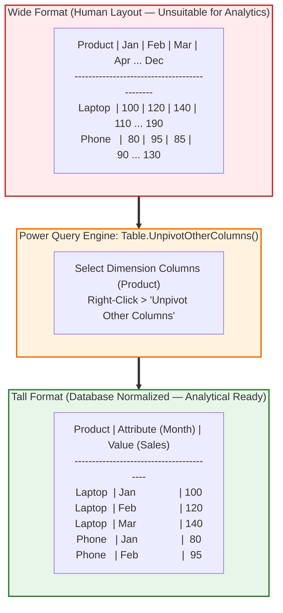
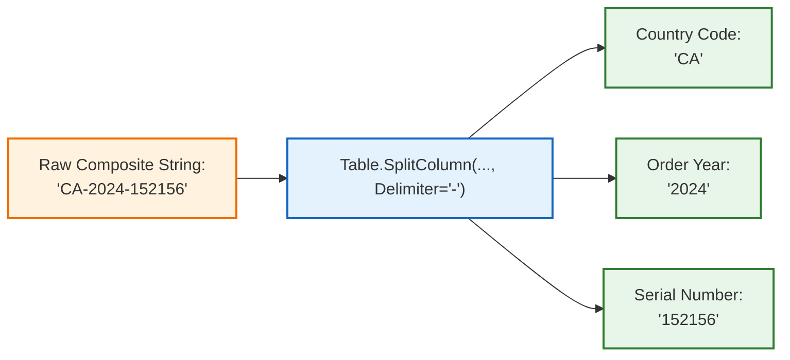
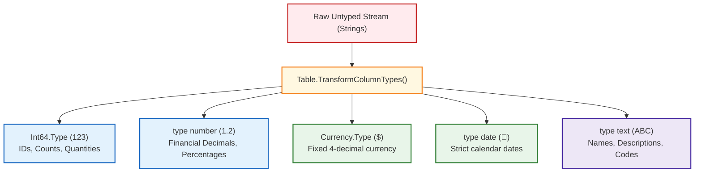

# Lesson 8.2: Core Power Query Transformations: Unpivoting, Splitting & Data Typing

> [!abstract] Learning Objective
> Execute essential data shaping transformations inside the Power Query Editor. Master the **Unpivot Columns** operation to convert human-readable wide reports into database-ready tall tables, split complex text fields, enforce strict data typing contracts, and perform automated row/column sanitization.

> 🎥 **Video Chapter**: [Chapter 8 – Power Query & M Language (4:20:30)](https://www.youtube.com/watch?v=uv1bxe2gdnU&t=15630s)

---

## 🔄 1. The Architectural Shift: Wide vs Tall Tabular Formats

In enterprise organizations, human stakeholders format monthly reports as **Wide Cross-Tabulations** (e.g. products down the rows, and calendar months spread across twelve horizontal columns). While pleasant for human reading, wide tables break relational database engines, dynamic filtering, and PivotTable aggregations!



### The Three Unpivot Operations Compared:

| Unpivot Command | Ribbon Navigation | When to Use & Behavioral Mechanics |
| :--- | :--- | :--- |
| **Unpivot Other Columns** *(Recommended)* | Select fixed key columns $\to$ **Transform > Unpivot Other Columns** | **Dynamic Ingestion (Best Practice)**.<br/>If new calendar months (e.g., `Nov`, `Dec`) are appended to the raw Excel report next quarter, this command automatically captures them into the tall table without modifying M code! |
| **Unpivot Columns** | Select monthly columns $\to$ **Transform > Unpivot Columns** | Transforms *only* the currently selected columns. If new columns appear in source files, they will be ignored and dropped from unpivoting. |
| **Unpivot Only Selected Columns** | Select specific metric columns $\to$ **Transform > Unpivot Only Selected** | Strictly confines unpivoting to the selected subset, leaving all other columns untouched. |

---

## 🔤 2. Text Splitting & Extraction Patterns

Raw transactional systems frequently bundle multiple discrete data attributes into a single delimited text string (e.g. `US-2024-10023` or `John Doe <john@company.com>`):



### Power Query Splitting Modalities:
1. **Split by Delimiter**:
   - Split at *Left-most*, *Right-most*, or *Each occurrence* of delimiters (Comma, Space, Hyphen, Semicolon, Custom character).
   - In M: `Table.SplitColumn(Source, "OrderID", Splitter.SplitTextByDelimiter("-", QuoteStyle.Csv), {"Country", "Year", "Serial"})`
2. **Split by Number of Characters**:
   - Splits fixed-width text streams (e.g. first 2 characters for state code, next 8 for account number).
3. **Split by Positions**:
   - Explicit 0-based character offsets: `0, 2, 6, 12`.
4. **Split by Transition**:
   - `Non-Digit to Digit` (e.g., converts `SKU450` into `SKU` and `450`).
   - `Lowercase to Uppercase` (e.g., camelCase parser converting `salesRevenue` into `sales` and `Revenue`).

---

## 🏷️ 3. Strict Data Type Enforcement & Locale Handling

Power Query enforces strict, strongly typed data contracts across all columns:



### The Regional Locale Pitfall (`Using Locale...`):
- In the United States: `1,250.50` (Comma = thousand separator, Period = decimal). Date: `MM/DD/YYYY`.
- In Continental Europe: `1.250,50` (Period = thousand separator, Comma = decimal). Date: `DD/MM/YYYY`.
- **The Error**: Casting European dates or numbers on an English OS converts values to errors or flips days and months (`03/04/2024` flips from March 4 to April 3)!
- **The Solution**: Right-click column $\to$ **Change Type > Using Locale...** $\to$ select target data type and explicit source country locale (e.g. `English (United Kingdom)` or `German (Germany)`).
- **Generated M Code**:
  ```powerquery
  #"Changed Type with Locale" = Table.TransformColumnTypes(#"PreviousStep", {{"OrderDate", type date}}, "en-GB")
  ```

---

## 🧹 4. Automated Row & Column Hygiene

### 1. Removing Blank & Corrupted Records:
- **`Remove Blank Rows`**: Purges completely blank rows created by worksheet padding.
- **`Remove Errors`**: Purges rows containing conversion failures (e.g. `#VALUE!` from bad dates).
- **`Remove Duplicates`**: Select key columns (e.g., `Booking_ID` or `CustomerID`) $\to$ right-click $\to$ **Remove Duplicates** to enforce 100% uniqueness.

### 2. Derived Columns: Visual vs Expression
- **Conditional Columns**: Visual rule wizard (e.g., `IF [Speed of answer] <= 20 THEN "Within SLA" ELSE "Breached SLA"`).
- **Custom Column (M Code)**: Direct calculations:
  ```powerquery
  = if [booking_status] = "Canceled" then [avg_price_per_room] * 0.20 else 0
  ```
- **Column From Examples**: Type desired output strings (e.g., extracting first names from emails) and Power Query infers the transformation pattern automatically.

---

## Related Knowledge
- Notes:
  - [[01_Power_Query_Fundamentals_and_ETL]]
  - [[03_Combining_Data_Append_and_Merge]]
  - [[04_Introduction_to_M_Language_and_APIs]]
  - [[02_Data_Cleaning_Techniques_in_Excel]]
- Concepts: [[Power Query]], [[Data Cleaning]], [[ETL Process]], [[M Language]]
- Workbook Laboratory: [`Module_7_Demo.xlsx`](file:///d:/courses/Data%20Analysis%2026-27/7-Introducation%20to%20Data%20Fields%20(Excel)/11_Demos_and_Workbooks/07_Data_Cleaning/Module_7_Demo.xlsx)
