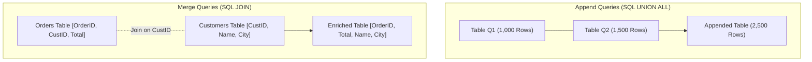

# Lesson 8.3: Combining Queries: Append (Unions) vs Merge (Relational Joins)

> [!abstract] Learning Objective
> Combine multiple disparate tables using Append Queries (stacking rows vertically) and Merge Queries (joining attributes horizontally based on matching keys).

> 🎥 **Video Chapter**: [Chapter 8 – Power Query & M Language (4:20:30)](https://www.youtube.com/watch?v=uv1bxe2gdnU&t=15630s)

## Append vs Merge Breakdown

## Merge Join Kinds
- **Left Outer**: All rows from first table, matching rows from second (most common).
- **Inner**: Only rows that match in both tables.
- **Full Outer**: All rows from both tables.
- **Left Anti**: Rows that exist ONLY in the first table (crucial for finding orphaned records!).

## Related Knowledge
- Concepts: [[Power Query]], [[ETL Process]]
