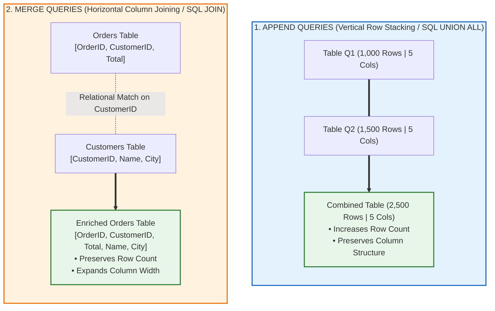
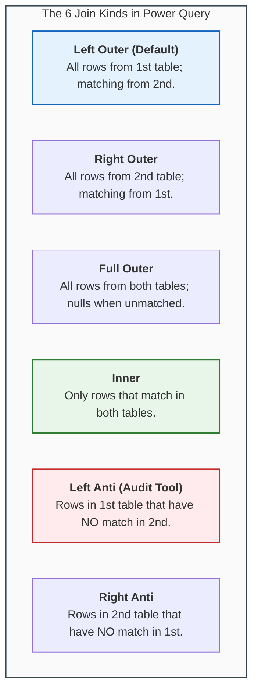
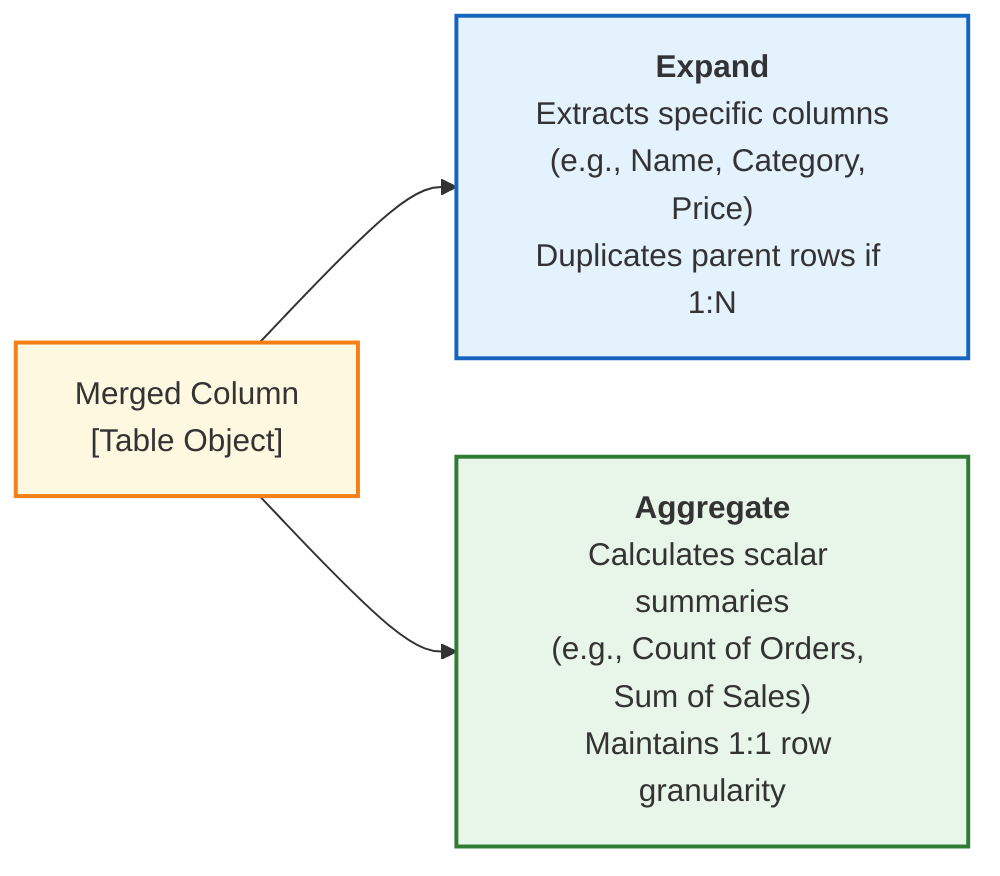

# Lesson 8.3: Combining Queries: Append (Unions) vs Merge (Relational Joins)

> [!abstract] Learning Objective
> Master the two fundamental mechanisms for combining multi-source data inside Power Query: **Append Queries** (stacking rows vertically like SQL `UNION ALL`) and **Merge Queries** (enriching rows horizontally across relational keys like SQL `JOIN`). Understand all 6 join kinds—including Left Anti-joins for forensic auditing—and configure fuzzy matching.

> 🎥 **Video Chapter**: [Chapter 8 – Power Query & M Language (4:20:30)](https://www.youtube.com/watch?v=uv1bxe2gdnU&t=15630s)

---

## 🔀 1. Append vs Merge: Conceptual Comparison

When combining two or more tables in Power Query, analysts must choose between vertical union stacking or horizontal relational enrichment:



| Operational Dimension | Append Queries (Vertical) | Merge Queries (Horizontal) |
| :--- | :--- | :--- |
| **SQL Relational Analog** | `UNION ALL` | `INNER JOIN`, `LEFT JOIN`, `FULL JOIN` |
| **Data Flow Direction** | Stacks rows top-to-bottom. | Appends columns side-by-side. |
| **Prerequisite Condition** | Tables share identical or similar column names. | Tables share a common key column (Primary Key / Foreign Key). |
| **Primary Use Cases** | Combining monthly sales dumps (Jan + Feb + Mar), consolidating multi-branch files. | Enriching orders with customer addresses, matching SKU codes with product catalog prices. |

---

## 📥 2. Append Queries: Vertical Stacking

### Mechanics:
- When you click **Home > Append Queries** (or **Append Queries as New**), Power Query maps columns across tables by **Exact Name Match** (case-sensitive!).
- If Column Name matches exactly, rows stack cleanly into a single column.
- If Column Name differs (e.g. `Client` in Table A vs `Customer` in Table B), Power Query creates two separate columns, placing nulls where data is absent.

```powerquery
// Combining two tables via Table.Combine
AppendedResult = Table.Combine({Table_January, Table_February, Table_March})
```

### Enterprise Folder Ingestion (`Folder.Files`):
Rather than appending 50 branch files manually, analysts use the **From Folder** connector:
1. **Data > Get Data > From File > From Folder** $\to$ select directory.
2. Click **Combine & Transform Data**.
3. Power Query creates a parameterized helper function that extracts, cleans, and auto-appends every CSV or Excel workbook in that folder automatically!
4. Whenever a new branch file is dropped into the Windows directory, clicking **Refresh All** ingests it in seconds.

---

## 🔗 3. Merge Queries: The 6 Relational Join Kinds

Clicking **Home > Merge Queries** opens the visual join interface. Selecting matching key columns and choosing the Join Kind governs the output:



### Forensic Auditing with Anti-Joins (`Left Anti`):
The **Left Anti** join is an indispensable diagnostic weapon for data analysts:
- **Business Problem**: Why did 15 customer orders fail to ship?
- **Execution**: Merge `Orders` with `Customers` using **Left Anti**.
- **Result**: Instantly isolates all orders that reference non-existent or deleted `CustomerID` values, exposing broken referential integrity in seconds!

---

## 🔍 4. Expanding vs Aggregating Merged Tables

When two tables are merged, Power Query inserts a new column containing nested `Table` objects. Clicking the dual-arrow icon on the column header presents two paths:



1. **Expand (`Table.ExpandTableColumn`)**:
   - Pulls individual fields into the main table.
   - **Warning**: If merging a 1-to-many relationship (e.g. Customers merged with Orders), expanding Order items will duplicate customer rows!
2. **Aggregate (`Table.AggregateTableColumn`)**:
   - Computes aggregations directly inside the join (e.g. `Count of Orders`, `Sum of TotalRevenue`, `Average of Rating`) without creating Cartesian row explosions.

---

## 🎛️ 5. Fuzzy Matching in Merge Queries

Transactional records frequently suffer from typos, casing variations, and minor discrepancies (e.g. `Microsoft Corporation` vs `Microsoft Corp`):
- Checking **Use fuzzy matching to perform the merge** activates text distance algorithms (Jaccard similarity).
- **Similarity Threshold**: Specify tolerance between `0.00` (matches everything) and `1.00` (exact match only). Default is `0.80`.
- **Ignore Case & Spaces**: Automatically bridges casing anomalies.
- **Transformation Table**: Connect an explicit mapping dictionary mapping abbreviations to standardized names.

---

## Related Knowledge
- Notes:
  - [[01_Power_Query_Fundamentals_and_ETL]]
  - [[02_Core_Data_Transformations]]
  - [[04_Introduction_to_M_Language_and_APIs]]
  - [[01_Dimensional_Modeling_Principles]]
- Concepts: [[Power Query]], [[ETL Process]], [[M Language]], [[Dimensional Modeling]]
- Workbook Laboratory: [`Module_7_Demo.xlsx`](file:///d:/courses/Data%20Analysis%2026-27/7-Introducation%20to%20Data%20Fields%20(Excel)/11_Demos_and_Workbooks/07_Data_Cleaning/Module_7_Demo.xlsx)
