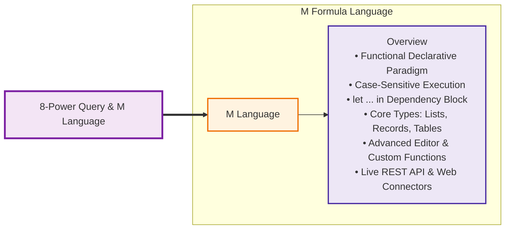
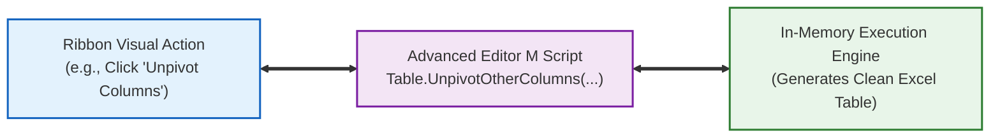
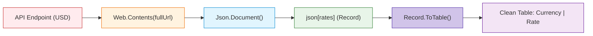

# Lesson 8.4: Introduction to M Language Architecture, Syntax & Custom API Queries

> [!abstract] Learning Objective
> Master the **M Language (Power Query Formula Language)** directly aligned with the curriculum mindmap (**M Language $\to$ Overview**). Understand the functional, declarative paradigm, navigate the **Advanced Editor**, manipulate Lists, Records, and Tables, and construct custom M ingestion scripts for live REST APIs and web scraping pipelines.

> 🎥 **Video Chapter**: [Chapter 8 – Power Query & M Language (4:20:30)](https://www.youtube.com/watch?v=uv1bxe2gdnU&t=15630s)

---

## 🧠 Curriculum Mindmap Anchor



```text
8-Power Query & M Language
└── M Language
    └── Overview
        ├── Functional & Declarative Architecture
        ├── The let ... in Dependency Block
        ├── Primitives & Structured Containers (List, Record, Table)
        ├── The Advanced Editor Workflow
        └── Enterprise Ingestion Scripts (REST APIs & Web Scraping)
```

---

## 💻 1. M Language Overview & Foundational Principles (`Overview`)

The **M Language** (officially the *Power Query Formula Language*) is Microsoft's specialized language designed specifically for high-throughput data extraction, transformation, and mashup.

### The Five Core Pillars of M:
1. **Purely Functional**:
   - In procedural languages (like Python or VBA), you write instructions that modify variables step-by-step (`x = x + 1`).
   - In M, there are no stateful variable reassignments or mutating loops. Everything is an immutable expression returning a new value.
2. **Strictly Case-Sensitive**:
   - `Table.SelectRows` is a valid built-in library function.
   - `table.selectrows` or `Table.selectRows` will immediately throw an error: `Expression.Error: The name '...' wasn't recognized`.
3. **Declarative & Lazy Evaluation**:
   - The engine does not execute lines in top-to-bottom sequence unless their output is required by the final step declared in the `in` block.
   - Unused steps are never calculated, saving tremendous memory during complex pipelines.
4. **Step-by-Step Dependency Graph**:
   - Every transformation step defines a variable that takes the prior step's table as its first parameter:
     $$\text{Table}_0 \xrightarrow{\text{PromoteHeaders}} \text{Table}_1 \xrightarrow{\text{ChangeType}} \text{Table}_2 \xrightarrow{\text{Filter}} \text{Table}_3$$
5. **Universal Formula Bar Integration**:
   - Every graphical action performed on the Power Query Ribbon writes a corresponding M expression directly into the formula bar.

---

## 🧱 2. Anatomy of the `let ... in` Execution Block

All standard queries compiled in the **Advanced Editor** follow the universal `let ... in` scoping block:

```powerquery
let
    // Step 1: Ingest source binary or stream
    Source = Csv.Document(File.Contents("D:\Data\Orders.csv"), [Delimiter=",", Columns=4]),
    
    // Step 2: Promote first row of text to column headers
    #"Promoted Headers" = Table.PromoteHeaders(Source, [PromoteAllScalars=true]),
    
    // Step 3: Enforce strict typed schema
    #"Changed Type" = Table.TransformColumnTypes(#"Promoted Headers",{
        {"OrderID", Int64.Type}, 
        {"Customer", type text}, 
        {"Revenue", type number}, 
        {"OrderDate", type date}
    }),
    
    // Step 4: Row-level predicate filter
    #"Filtered Rows" = Table.SelectRows(#"Changed Type", each [Revenue] >= 500)
in
    // Return expression delivering tabular output to Excel / Power Pivot
    #"Filtered Rows"
```

```mermaid
flowchart TD
    subgraph LET_BLOCK ["The 'let' Block: Sequence of Named Expressions"]
        S1["Step 1: Source = Csv.Document(...)"]
        S2["Step 2: #\"Promoted Headers\" = Table.PromoteHeaders(Source, ...)"]
        S3["Step 3: #\"Changed Type\" = Table.TransformColumnTypes(#\"Promoted Headers\", ...)"]
        S4["Step 4: #\"Filtered Rows\" = Table.SelectRows(#\"Changed Type\", ...)"]
        S1 --> S2 --> S3 --> S4
    end

    subgraph IN_BLOCK ["The 'in' Block: Evaluation Target"]
        RES["Output: #\"Filtered Rows\""]
    end

    LET_BLOCK ==> IN_BLOCK

    style LET_BLOCK fill:#e3f2fd,stroke:#1565c0,stroke-width:2px
    style IN_BLOCK fill:#e8f5e9,stroke:#2e7d32,stroke-width:2px
```

### Essential Syntax Rules:
1. **The Comma Rule**: Every line inside the `let` block must end with a comma (`,`) **except** the final step immediately preceding `in`.
2. **The Quoted Identifier Syntax (`#"..."`)**:
   - If a step name contains spaces or special characters (e.g. `Promoted Headers`, `Changed Type`, `Table 15`), M wraps the name in hash-quotes: `#"Step Name"`.
   - Identifiers without spaces (e.g. `Source`, `FilteredData`) require no hash-quotes.
3. **The `each` Syntactic Sugar**:
   - The keyword `each` is a shorthand for an anonymous function that accepts the current row (represented by `_`):
     $$\text{each } [\text{Revenue}] > 500 \iff (\_) \Rightarrow \_[\text{Revenue}] > 500$$

---

## 🗃️ 3. M Data Structures: Primitives vs Structured Containers

In M, data is organized into three primitive classifications and three foundational container structures:

```mermaid
classDiagram
    direction TB
    class M_Types {
        +Primitive Types
        +Container Structures
    }
    class Primitives {
        number (10, 42.5)
        text ("Cairo", "USD")
        logical (true, false)
        date (#date(2024, 1, 1))
        datetime (#datetime(..))
        null
    }
    class Containers {
        List { item1, item2, .. }
        Record [ Key = Value, .. ]
        Table #table( {cols}, {rows} )
    }

    M_Types <|-- Primitives
    M_Types <|-- Containers
```

### The Three Container Structures:

#### 1. Lists (`{ ... }`)
- An ordered, 0-indexed sequence of values enclosed in curly braces.
- Lists can hold homogeneous or mixed data types.
```powerquery
// Explicit list literal
MyList = {10, 20, 30, "Bonus", true}

// Accessing list elements (0-indexed)
FirstItem = MyList{0}      // Returns 10
FourthItem = MyList{3}     // Returns "Bonus"

// Common List Library Functions:
Sum = List.Sum({10, 20, 30})            // Returns 60
DistinctItems = List.Distinct(MyList)   // Purges duplicates
Count = List.Count(MyList)              // Returns 5
```

#### 2. Records (`[ ... ]`)
- A set of named fields (key-value dictionary) enclosed in square brackets.
- Represents a single discrete row or an entity's attribute collection.
```powerquery
// Explicit record literal
Employee = [
    ID = 101, 
    FullName = "Sarah Jenkins", 
    Department = "Finance", 
    Salary = 75000
]

// Accessing record fields via field selector:
EmpName = Employee[FullName]     // Returns "Sarah Jenkins"

// Common Record Library Functions:
FieldList = Record.FieldNames(Employee)   // Returns {"ID", "FullName", "Department", "Salary"}
RecordTable = Record.ToTable(Employee)   // Converts record into a 2-column key-value table
```

#### 3. Tables (`#table( ... )`)
- A two-dimensional grid of ordered rows and typed columns.
- The primary data structure manipulated across Power Query.
```powerquery
// Constructing an explicit table literal
SalesTable = #table(
    type table [OrderID = Int64.Type, Product = text, Price = number],
    {
        {1001, "Laptop", 1200.00},
        {1002, "Mouse", 25.50},
        {1003, "Monitor", 350.00}
    }
)

// Accessing a specific cell: Table{rowIndex}[columnName]
FirstProduct = SalesTable{0}[Product]    // Returns "Laptop"
```

---

## 🛠️ 4. The Advanced Editor Workflow

The **Advanced Editor** provides direct access to the raw M code script:



### How to Access & Edit M Code:
1. In Power Query Editor, navigate to **Home > Advanced Editor** (or **View > Advanced Editor**).
2. The code window displays the entire query pipeline from `let` to `in`.
3. Analysts use the Advanced Editor to:
   - **Parameterize file paths** (making workbooks portable across different computers).
   - **Inject error-handling expressions** (`try ... otherwise`).
   - **Construct custom iterative functions** (`(date) => ...`).
   - **Clean up redundant steps** generated by GUI actions.

---

## 🌐 5. Enterprise Ingestion Scripts from Course Materials

In our course curriculum, M language scripts connect Excel directly to enterprise endpoints:

### Case Study 1: Programmatic REST API Ingestion (`M language to Deal with API.txt`)
Students query a live currency exchange rate API (`https://api.exchangerate-api.com/v4/latest/USD`) using pure M:

```powerquery
let
    // 1. Declare base API endpoint and dynamic currency parameter
    baseUrl = "https://api.exchangerate-api.com/v4/latest/",
    currency = "USD",
    fullUrl = baseUrl & currency,

    // 2. Transmit HTTP GET Request via Web.Contents
    response = Web.Contents(fullUrl),

    // 3. Parse JSON stream into an M record object
    json = Json.Document(response),

    // 4. Navigate into the nested 'rates' dictionary record
    rates = json[rates],

    // 5. Convert JSON key-value pairs into a two-column Tabular Dataset
    table = Record.ToTable(rates),

    // 6. Rename columns for clean business reporting
    #"Renamed Columns" = Table.RenameColumns(table,{
        {"Name", "Target_Currency"}, 
        {"Value", "Exchange_Rate"}
    }),

    // 7. Enforce strict currency decimal precision
    #"Changed Type" = Table.TransformColumnTypes(#"Renamed Columns",{
        {"Target_Currency", type text}, 
        {"Exchange_Rate", type number}
    })
in
    #"Changed Type"
```



---

### Case Study 2: Web Scraping via CSS Selectors (Arabic Wikipedia Demographics)
From [`Module_7_Demo.xlsx`](file:///d:/courses/Data%20Analysis%2026-27/7-Introducation%20to%20Data%20Fields%20(Excel)/11_Demos_and_Workbooks/07_Data_Cleaning/Module_7_Demo.xlsx), extracting `Table 15` from Arabic Wikipedia:

```powerquery
shared #"Table 15" = let
    // 1. Render headless browser DOM
    Source = Web.BrowserContents("https://ar.wikipedia.org/wiki/%D8%A7%D9%84%D8%AA%D8%B1%D9%83%D9%8A%D8%A8%D8%A9_%D8%A7%D9%84%D8%B3%D9%83%D8%A7%D9%86%D9%8A%D8%A9_%D9%81%D9%8A_%D9%85%D8%B5%D8%B1"),
    
    // 2. Target specific HTML table ID using CSS selectors
    #"Extracted Table From Html" = Html.Table(Source, {
        {"Column1", "TABLE[id='mwAh4'] > * > TR > :nth-child(1)"}, 
        {"Column2", "TABLE[id='mwAh4'] > * > TR > :nth-child(2)"}, 
        {"Column3", "TABLE[id='mwAh4'] > * > TR > :nth-child(3)"}, 
        {"Column4", "TABLE[id='mwAh4'] > * > TR > :nth-child(4)"}, 
        {"Column5", "TABLE[id='mwAh4'] > * > TR > :nth-child(5)"}, 
        {"Column6", "TABLE[id='mwAh4'] > * > TR > :nth-child(6)"}, 
        {"Column7", "TABLE[id='mwAh4'] > * > TR > :nth-child(7)"}, 
        {"Column8", "TABLE[id='mwAh4'] > * > TR > :nth-child(8)"}, 
        {"Column9", "TABLE[id='mwAh4'] > * > TR > :nth-child(9)"}, 
        {"Column10", "TABLE[id='mwAh4'] > * > TR > :nth-child(10)"}
    }, [RowSelector="TABLE[id='mwAh4'] > * > TR"]),
    
    // 3. Promote first row to Arabic headers
    #"Promoted Headers" = Table.PromoteHeaders(#"Extracted Table From Html", [PromoteAllScalars=true]),
    
    // 4. Type cast numbers and integers
    #"Changed Type" = Table.TransformColumnTypes(#"Promoted Headers",{
        {"السنة", Int64.Type}, 
        {"عدد السكان", type text}, 
        {"المواليد", type text}, 
        {"الوفيات", type text}, 
        {"التغير الطبيعي", type text}, 
        {"معدل المواليد الخام (لكل 1000)", type number}, 
        {"معدل الوفيات الخام (لكل 1000)", type number}, 
        {"التغير الطبيعي (لكل 1000)", type number}, 
        {"معدل الهجرة الخام (لكل 1000)", type number}, 
        {"معدل الخطوبة الكلي", type text}
    })
in
    #"Changed Type";
```

---

### Case Study 3: Pushdown SQL Querying on Database Engine (`Query1`)
From `Module_7_Demo.xlsx`, querying `AdventureWorks2022` on local SQL Server:

```powerquery
shared Query1 = let
    // Executes server-side SQL pushdown; only filtered rows traverse network
    Source = Sql.Database("localhost", "AdventureWorks2022", [
        Query="SELECT #(lf)    p.BusinessEntityID, #(lf)    p.FirstName, #(lf)    p.LastName, #(lf)    e.EmailAddress#(lf)FROM Person.Person AS p#(lf)LEFT JOIN Person.EmailAddress AS e #(lf)    ON p.BusinessEntityID = e.BusinessEntityID#(lf)WHERE p.FirstName LIKE 'A%';"
    ])
in
    Source;
```

---

## 🛡️ 6. Error Handling & Defensive M Patterns

In enterprise data pipelines, missing files, changed column names, or bad cell data can break automated refreshes. M provides defensive error-handling expressions:

```powerquery
// 1. The 'try ... otherwise' Defensive Pattern
SafeCalculation = try [Sales] / [Units] otherwise 0

// 2. Inspecting detailed error metadata
Attempt = try Table.SelectRows(Source, each [Status] = "Active"),
Result = if Attempt[HasError] then "Pipeline Failed" else Attempt[Value]

// 3. Purging corrupted error rows before loading
CleanTable = Table.RemoveRowsWithErrors(Source, {"OrderID", "Amount"})
```

---

## Related Knowledge
- Notes:
  - [[01_Power_Query_Fundamentals_and_ETL]]
  - [[02_Core_Data_Transformations]]
  - [[03_Combining_Data_Append_and_Merge]]
  - [[03_Importing_Data_from_Enterprise_Sources]]
- Concepts: [[M Language]], [[Power Query]], [[ETL Process]], [[Data Cleaning]]
- Course Reference:
  - [[Module 7 Dataset Documentation]]
  - Course Roadmap: [[Course Map]]
  - Interactive Web Mind Map: [Course Mind Map](https://sohila-khaled-abbas.github.io/COURSE-EXCEL-ZERO-TO-HERO/mindmap/)
