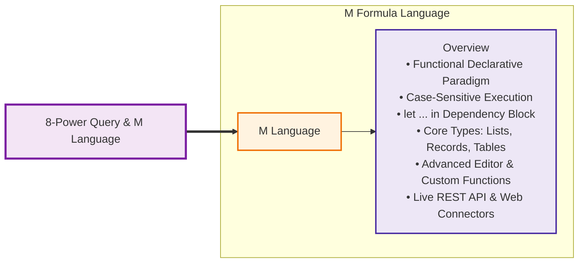
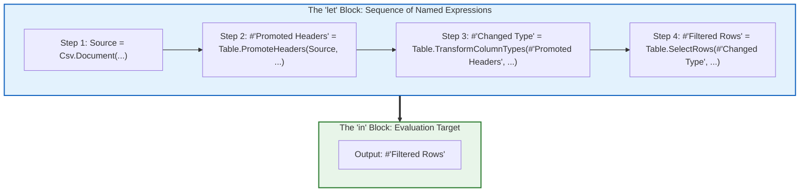
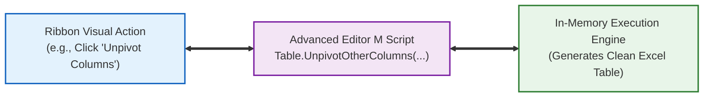
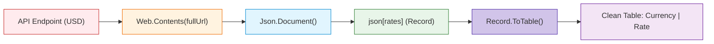
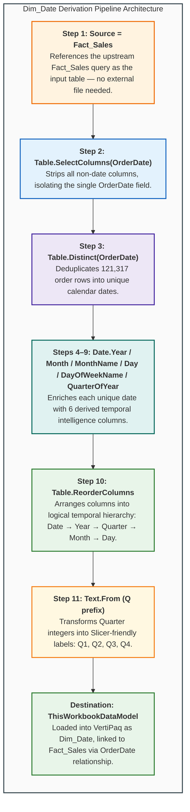
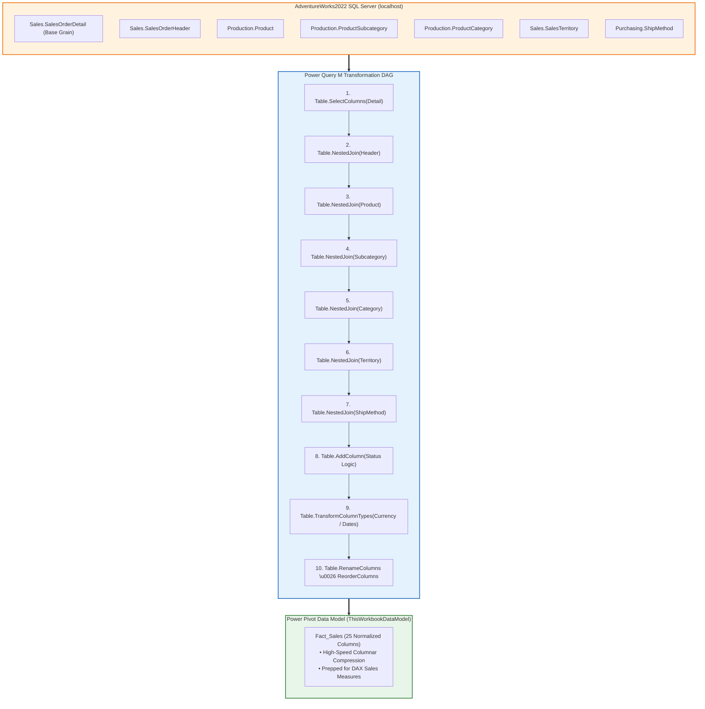

# Lesson 8.4: Introduction to M Language Architecture, Syntax & Custom API Queries

> [!abstract] Learning Objective
> Master the **M Language (Power Query Formula Language)** directly aligned with the curriculum mindmap (**M Language $\to$ Overview**). Understand the functional, declarative paradigm, navigate the **Advanced Editor**, manipulate Lists, Records, and Tables, and construct custom M ingestion scripts for live REST APIs and web scraping pipelines.

> 🎥 **Video Chapter**: [Chapter 8 – Power Query & M Language (4:20:30)](https://www.youtube.com/watch?v=uv1bxe2gdnU&t=15630s)

---

## 🧠 Curriculum Mindmap Anchor



```text
8-Power Query & M Language
└── M Language
    └── Overview
        ├── Functional & Declarative Architecture
        ├── The let ... in Dependency Block
        ├── Primitives & Structured Containers (List, Record, Table)
        ├── The Advanced Editor Workflow
        └── Enterprise Ingestion Scripts (REST APIs & Web Scraping)
```

---

## 💻 1. M Language Overview & Foundational Principles (`Overview`)

The **M Language** (officially the *Power Query Formula Language*) is Microsoft's specialized language designed specifically for high-throughput data extraction, transformation, and mashup.

### The Five Core Pillars of M:
1. **Purely Functional**:
   - In procedural languages (like Python or VBA), you write instructions that modify variables step-by-step (`x = x + 1`).
   - In M, there are no stateful variable reassignments or mutating loops. Everything is an immutable expression returning a new value.
2. **Strictly Case-Sensitive**:
   - `Table.SelectRows` is a valid built-in library function.
   - `table.selectrows` or `Table.selectRows` will immediately throw an error: `Expression.Error: The name '...' wasn't recognized`.
3. **Declarative & Lazy Evaluation**:
   - The engine does not execute lines in top-to-bottom sequence unless their output is required by the final step declared in the `in` block.
   - Unused steps are never calculated, saving tremendous memory during complex pipelines.
4. **Step-by-Step Dependency Graph**:
   - Every transformation step defines a variable that takes the prior step's table as its first parameter:
     $$\text{Table}_0 \xrightarrow{\text{PromoteHeaders}} \text{Table}_1 \xrightarrow{\text{ChangeType}} \text{Table}_2 \xrightarrow{\text{Filter}} \text{Table}_3$$
5. **Universal Formula Bar Integration**:
   - Every graphical action performed on the Power Query Ribbon writes a corresponding M expression directly into the formula bar.

---

## 🧱 2. Anatomy of the `let ... in` Execution Block

All standard queries compiled in the **Advanced Editor** follow the universal `let ... in` scoping block:

```powerquery
let
    // Step 1: Ingest source binary or stream
    Source = Csv.Document(File.Contents("D:\Data\Orders.csv"), [Delimiter=",", Columns=4]),
    
    // Step 2: Promote first row of text to column headers
    #"Promoted Headers" = Table.PromoteHeaders(Source, [PromoteAllScalars=true]),
    
    // Step 3: Enforce strict typed schema
    #"Changed Type" = Table.TransformColumnTypes(#"Promoted Headers",{
        {"OrderID", Int64.Type}, 
        {"Customer", type text}, 
        {"Revenue", type number}, 
        {"OrderDate", type date}
    }),
    
    // Step 4: Row-level predicate filter
    #"Filtered Rows" = Table.SelectRows(#"Changed Type", each [Revenue] >= 500)
in
    // Return expression delivering tabular output to Excel / Power Pivot
    #"Filtered Rows"
```



### Essential Syntax Rules:
1. **The Comma Rule**: Every line inside the `let` block must end with a comma (`,`) **except** the final step immediately preceding `in`.
2. **The Quoted Identifier Syntax (`#"..."`)**:
   - If a step name contains spaces or special characters (e.g. `Promoted Headers`, `Changed Type`, `Table 15`), M wraps the name in hash-quotes: `#"Step Name"`.
   - Identifiers without spaces (e.g. `Source`, `FilteredData`) require no hash-quotes.
3. **The `each` Syntactic Sugar**:
   - The keyword `each` is a shorthand for an anonymous function that accepts the current row (represented by `_`):
     $$\text{each } [\text{Revenue}] > 500 \iff (\_) \Rightarrow \_[\text{Revenue}] > 500$$

---

## 🗃️ 3. M Data Structures: Primitives vs Structured Containers

In M, data is organized into three primitive classifications and three foundational container structures:

```mermaid
flowchart TD
    subgraph M_TYPES ["M Language Type Hierarchy"]
        direction TB
        ROOT["<b>M Formula Language Types</b>"]
        
        subgraph PRIM ["Primitive Scalar Types"]
            direction TB
            P1["<b>number</b>: 10, 42.5, -3.14"]
            P2["<b>text</b>: &quot;Cairo&quot;, &quot;USD&quot;"]
            P3["<b>logical</b>: true, false"]
            P4["<b>date</b>: #date(2024, 1, 1)"]
            P5["<b>time</b>: #time(9, 30, 0)"]
            P6["<b>datetime</b>: #datetime(2024, 1, 1, 9, 30, 0)"]
            P7["<b>null</b>: missing value"]
        end
        
        subgraph CONT ["Structured Containers"]
            direction TB
            C1["<b>List</b>: { item1, item2, ... }<br/>0-indexed ordered collection"]
            C2["<b>Record</b>: [ Key = Value, ... ]<br/>Set of named field pairs"]
            C3["<b>Table</b>: #table(cols, rows)<br/>Two-dimensional tabular matrix"]
        end
        
        ROOT --> PRIM
        ROOT --> CONT
    end

    style M_TYPES fill:#fafafa,stroke:#37474f,stroke-width:2px
    style ROOT fill:#f3e5f5,stroke:#7b1fa2,stroke-width:2px
    style PRIM fill:#e3f2fd,stroke:#1565c0,stroke-width:2px
    style CONT fill:#fff3e0,stroke:#ef6c00,stroke-width:2px
    style P1 fill:#ffffff,stroke:#1565c0
    style P2 fill:#ffffff,stroke:#1565c0
    style P3 fill:#ffffff,stroke:#1565c0
    style P4 fill:#ffffff,stroke:#1565c0
    style P5 fill:#ffffff,stroke:#1565c0
    style P6 fill:#ffffff,stroke:#1565c0
    style P7 fill:#ffffff,stroke:#1565c0
    style C1 fill:#ffffff,stroke:#ef6c00
    style C2 fill:#ffffff,stroke:#ef6c00
    style C3 fill:#ffffff,stroke:#ef6c00
```



### The Three Container Structures:

#### 1. Lists (`{ ... }`)
- An ordered, 0-indexed sequence of values enclosed in curly braces.
- Lists can hold homogeneous or mixed data types.
```powerquery
// Explicit list literal
MyList = {10, 20, 30, "Bonus", true}

// Accessing list elements (0-indexed)
FirstItem = MyList{0}      // Returns 10
FourthItem = MyList{3}     // Returns "Bonus"

// Common List Library Functions:
Sum = List.Sum({10, 20, 30})            // Returns 60
DistinctItems = List.Distinct(MyList)   // Purges duplicates
Count = List.Count(MyList)              // Returns 5
```

#### 2. Records (`[ ... ]`)
- A set of named fields (key-value dictionary) enclosed in square brackets.
- Represents a single discrete row or an entity's attribute collection.
```powerquery
// Explicit record literal
Employee = [
    ID = 101, 
    FullName = "Sarah Jenkins", 
    Department = "Finance", 
    Salary = 75000
]

// Accessing record fields via field selector:
EmpName = Employee[FullName]     // Returns "Sarah Jenkins"

// Common Record Library Functions:
FieldList = Record.FieldNames(Employee)   // Returns {"ID", "FullName", "Department", "Salary"}
RecordTable = Record.ToTable(Employee)   // Converts record into a 2-column key-value table
```

#### 3. Tables (`#table( ... )`)
- A two-dimensional grid of ordered rows and typed columns.
- The primary data structure manipulated across Power Query.
```powerquery
// Constructing an explicit table literal
SalesTable = #table(
    type table [OrderID = Int64.Type, Product = text, Price = number],
    {
        {1001, "Laptop", 1200.00},
        {1002, "Mouse", 25.50},
        {1003, "Monitor", 350.00}
    }
)

// Accessing a specific cell: Table{rowIndex}[columnName]
FirstProduct = SalesTable{0}[Product]    // Returns "Laptop"
```

---

## 🛠️ 4. The Advanced Editor Workflow

The **Advanced Editor** provides direct access to the raw M code script:



### How to Access & Edit M Code:
1. In Power Query Editor, navigate to **Home > Advanced Editor** (or **View > Advanced Editor**).
2. The code window displays the entire query pipeline from `let` to `in`.
3. Analysts use the Advanced Editor to:
   - **Parameterize file paths** (making workbooks portable across different computers).
   - **Inject error-handling expressions** (`try ... otherwise`).
   - **Construct custom iterative functions** (`(date) => ...`).
   - **Clean up redundant steps** generated by GUI actions.

---

## 🌐 5. Enterprise Ingestion Scripts from Course Materials

In our course curriculum, M language scripts connect Excel directly to enterprise endpoints:

### Case Study 1: Programmatic REST API Ingestion (`M language to Deal with API.txt`)
Students query a live currency exchange rate API (`https://api.exchangerate-api.com/v4/latest/USD`) using pure M:

```powerquery
let
    // 1. Declare base API endpoint and dynamic currency parameter
    baseUrl = "https://api.exchangerate-api.com/v4/latest/",
    currency = "USD",
    fullUrl = baseUrl & currency,

    // 2. Transmit HTTP GET Request via Web.Contents
    response = Web.Contents(fullUrl),

    // 3. Parse JSON stream into an M record object
    json = Json.Document(response),

    // 4. Navigate into the nested 'rates' dictionary record
    rates = json[rates],

    // 5. Convert JSON key-value pairs into a two-column Tabular Dataset
    table = Record.ToTable(rates),

    // 6. Rename columns for clean business reporting
    #"Renamed Columns" = Table.RenameColumns(table,{
        {"Name", "Target_Currency"}, 
        {"Value", "Exchange_Rate"}
    }),

    // 7. Enforce strict currency decimal precision
    #"Changed Type" = Table.TransformColumnTypes(#"Renamed Columns",{
        {"Target_Currency", type text}, 
        {"Exchange_Rate", type number}
    })
in
    #"Changed Type"
```



---

### Case Study 2: Web Scraping via CSS Selectors (Arabic Wikipedia Demographics)
From [`Module_7_Demo.xlsx`](file:///d:/courses/Data%20Analysis%2026-27/7-Introducation%20to%20Data%20Fields%20(Excel)/11_Demos_and_Workbooks/07_Data_Cleaning/Module_7_Demo.xlsx), extracting `Table 15` from Arabic Wikipedia:

```powerquery
shared #"Table 15" = let
    // 1. Render headless browser DOM
    Source = Web.BrowserContents("https://ar.wikipedia.org/wiki/%D8%A7%D9%84%D8%AA%D8%B1%D9%83%D9%8A%D8%A8%D8%A9_%D8%A7%D9%84%D8%B3%D9%83%D8%A7%D9%86%D9%8A%D8%A9_%D9%81%D9%8A_%D9%85%D8%B5%D8%B1"),
    
    // 2. Target specific HTML table ID using CSS selectors
    #"Extracted Table From Html" = Html.Table(Source, {
        {"Column1", "TABLE[id='mwAh4'] > * > TR > :nth-child(1)"}, 
        {"Column2", "TABLE[id='mwAh4'] > * > TR > :nth-child(2)"}, 
        {"Column3", "TABLE[id='mwAh4'] > * > TR > :nth-child(3)"}, 
        {"Column4", "TABLE[id='mwAh4'] > * > TR > :nth-child(4)"}, 
        {"Column5", "TABLE[id='mwAh4'] > * > TR > :nth-child(5)"}, 
        {"Column6", "TABLE[id='mwAh4'] > * > TR > :nth-child(6)"}, 
        {"Column7", "TABLE[id='mwAh4'] > * > TR > :nth-child(7)"}, 
        {"Column8", "TABLE[id='mwAh4'] > * > TR > :nth-child(8)"}, 
        {"Column9", "TABLE[id='mwAh4'] > * > TR > :nth-child(9)"}, 
        {"Column10", "TABLE[id='mwAh4'] > * > TR > :nth-child(10)"}
    }, [RowSelector="TABLE[id='mwAh4'] > * > TR"]),
    
    // 3. Promote first row to Arabic headers
    #"Promoted Headers" = Table.PromoteHeaders(#"Extracted Table From Html", [PromoteAllScalars=true]),
    
    // 4. Type cast numbers and integers
    #"Changed Type" = Table.TransformColumnTypes(#"Promoted Headers",{
        {"السنة", Int64.Type}, 
        {"عدد السكان", type text}, 
        {"المواليد", type text}, 
        {"الوفيات", type text}, 
        {"التغير الطبيعي", type text}, 
        {"معدل المواليد الخام (لكل 1000)", type number}, 
        {"معدل الوفيات الخام (لكل 1000)", type number}, 
        {"التغير الطبيعي (لكل 1000)", type number}, 
        {"معدل الهجرة الخام (لكل 1000)", type number}, 
        {"معدل الخطوبة الكلي", type text}
    })
in
    #"Changed Type";
```

---

### Case Study 3: Pushdown SQL Querying on Database Engine (`Query1`)
From `Module_7_Demo.xlsx`, querying `AdventureWorks2022` on local SQL Server:

```powerquery
shared Query1 = let
    // Executes server-side SQL pushdown; only filtered rows traverse network
    Source = Sql.Database("localhost", "AdventureWorks2022", [
        Query="SELECT #(lf)    p.BusinessEntityID, #(lf)    p.FirstName, #(lf)    p.LastName, #(lf)    e.EmailAddress#(lf)FROM Person.Person AS p#(lf)LEFT JOIN Person.EmailAddress AS e #(lf)    ON p.BusinessEntityID = e.BusinessEntityID#(lf)WHERE p.FirstName LIKE 'A%';"
    ])
in
    Source;
```

---

### Case Study 4: Derived Calendar Dimension Table (`Dim_Date`)
From our official practice workbook ([`Module_8_Demo.xlsx`](file:///d:/courses/Data%20Analysis%2026-27/7-Introducation%20to%20Data%20Fields%20(Excel)/11_Demos_and_Workbooks/08_Power_Query/Module_8_Demo.xlsx)), constructing a **Star Schema calendar dimension** by deriving distinct dates from the `Fact_Sales` query and enriching them with temporal intelligence columns:

```powerquery
section Section1;

shared Dim_Date = let
    // 1. Reference the existing Fact_Sales query as input source
    Source = Fact_Sales,

    // 2. Isolate the date column — drop all non-date fields
    #"Removed Other Columns" = Table.SelectColumns(Source, {"OrderDate"}),

    // 3. Deduplicate to produce one row per unique calendar date
    #"Removed Duplicates" = Table.Distinct(#"Removed Other Columns", {"OrderDate"}),

    // 4. Extract Year component as integer
    #"Inserted Year" = Table.AddColumn(#"Removed Duplicates", "Year",
        each Date.Year([OrderDate]), Int64.Type),

    // 5. Extract Month number (1–12)
    #"Inserted Month" = Table.AddColumn(#"Inserted Year", "Month",
        each Date.Month([OrderDate]), Int64.Type),

    // 6. Extract full Month Name (e.g., "January", "February")
    #"Inserted Month Name" = Table.AddColumn(#"Inserted Month", "Month Name",
        each Date.MonthName([OrderDate]), type text),

    // 7. Extract Day of Month (1–31)
    #"Inserted Day" = Table.AddColumn(#"Inserted Month Name", "Day",
        each Date.Day([OrderDate]), Int64.Type),

    // 8. Extract Day Name (e.g., "Monday", "Tuesday")
    #"Inserted Day Name" = Table.AddColumn(#"Inserted Day", "Day Name",
        each Date.DayOfWeekName([OrderDate]), type text),

    // 9. Extract Quarter of Year (1–4)
    #"Inserted Quarter" = Table.AddColumn(#"Inserted Day Name", "Quarter",
        each Date.QuarterOfYear([OrderDate]), Int64.Type),

    // 10. Reorder columns into logical temporal hierarchy
    #"Reordered Columns" = Table.ReorderColumns(#"Inserted Quarter",
        {"OrderDate", "Year", "Quarter", "Month", "Month Name", "Day", "Day Name"}),

    // 11. Format Quarter as "Q1", "Q2", "Q3", "Q4" for Slicer-friendly display
    #"Added Prefix" = Table.TransformColumns(#"Reordered Columns",
        {{"Quarter", each "Q" & Text.From(_, "en-AE"), type text}})
in
    #"Added Prefix";
```



#### Technical Architectural Highlights:
1. **Query-to-Query Reference (`Source = Fact_Sales`)**: Instead of ingesting a separate external file, `Dim_Date` derives directly from the existing `Fact_Sales` query. This demonstrates M's **query dependency chaining** — Power Query builds a DAG where `Dim_Date` depends on `Fact_Sales`, guaranteeing the dimension table refreshes whenever the fact table refreshes.
2. **Date Intelligence Functions**: The pipeline uses six dedicated `Date.*` library functions (`Date.Year`, `Date.Month`, `Date.MonthName`, `Date.Day`, `Date.DayOfWeekName`, `Date.QuarterOfYear`) — each producing a new typed column. These are the foundational building blocks for **Time Intelligence** in Power Pivot DAX.
3. **Quarter Label Formatting (`Text.From` + `&` Concatenation)**: The expression `each "Q" & Text.From(_, "en-AE")` converts integer `1` → `"Q1"`, making Quarter values immediately ready for **Slicer** and **Timeline** filtering in dashboards without post-processing.
4. **Star Schema Architecture**: By building `Dim_Date` as a separate dimension table with `OrderDate` as its primary key, the workbook now implements a proper **Star Schema** — `Fact_Sales` (the central fact) connects to `Dim_Date` (a conformed dimension) via a 1-to-Many relationship in Power Pivot.

---

### Case Study 5: Enterprise SQL Server Multi-Table Star Schema Mashup (`Fact_Sales`)
From the active practice workbook ([`Module_8_Demo.xlsx`](file:///d:/courses/Data%20Analysis%2026-27/7-Introducation%20to%20Data%20Fields%20(Excel)/11_Demos_and_Workbooks/08_Power_Query/Module_8_Demo.xlsx)), constructing a denormalized Star Schema analytical table directly from **AdventureWorks2022** on Microsoft SQL Server across 7 relational tables via pure M:

```powerquery
section Section1;

shared Fact_Sales = let
    //==================================================
    // 1. CONNECT TO LOCAL SQL SERVER
    //==================================================
    Source = Sql.Database(
        "localhost",
        "AdventureWorks2022"
    ),

    //==================================================
    // 2. NAVIGATE TO SQL SERVER TABLES
    //==================================================
    SalesOrderDetail = Source{
        [Schema = "Sales", Item = "SalesOrderDetail"]
    }[Data],

    SalesOrderHeader = Source{
        [Schema = "Sales", Item = "SalesOrderHeader"]
    }[Data],

    Product = Source{
        [Schema = "Production", Item = "Product"]
    }[Data],

    ProductSubcategory = Source{
        [Schema = "Production", Item = "ProductSubcategory"]
    }[Data],

    ProductCategory = Source{
        [Schema = "Production", Item = "ProductCategory"]
    }[Data],

    SalesTerritory = Source{
        [Schema = "Sales", Item = "SalesTerritory"]
    }[Data],

    ShipMethod = Source{
        [Schema = "Purchasing", Item = "ShipMethod"]
    }[Data],

    //==================================================
    // 3. BASE TABLE: SALES ORDER DETAILS
    //    GRAIN: ONE ROW PER SALES ORDER LINE
    //==================================================
    Detail = Table.SelectColumns(
        SalesOrderDetail,
        {
            "SalesOrderID",
            "SalesOrderDetailID",
            "ProductID",
            "OrderQty",
            "UnitPrice",
            "UnitPriceDiscount",
            "LineTotal"
        }
    ),

    //==================================================
    // 4. MERGE SALES ORDER HEADER
    //==================================================
    MergeHeader = Table.NestedJoin(
        Detail,
        {"SalesOrderID"},
        SalesOrderHeader,
        {"SalesOrderID"},
        "Header",
        JoinKind.LeftOuter
    ),

    ExpandHeader = Table.ExpandTableColumn(
        MergeHeader,
        "Header",
        {
            "OrderDate",
            "DueDate",
            "ShipDate",
            "Status",
            "OnlineOrderFlag",
            "CustomerID",
            "SalesPersonID",
            "TerritoryID",
            "ShipMethodID"
        },
        {
            "OrderDate",
            "DueDate",
            "ShipDate",
            "StatusID",
            "OnlineOrderFlag",
            "CustomerID",
            "SalesPersonID",
            "TerritoryID",
            "ShipMethodID"
        }
    ),

    //==================================================
    // 5. MERGE PRODUCT
    //==================================================
    MergeProduct = Table.NestedJoin(
        ExpandHeader,
        {"ProductID"},
        Product,
        {"ProductID"},
        "ProductLookup",
        JoinKind.LeftOuter
    ),

    ExpandProduct = Table.ExpandTableColumn(
        MergeProduct,
        "ProductLookup",
        {
            "Name",
            "ProductSubcategoryID"
        },
        {
            "Product",
            "ProductSubcategoryID"
        }
    ),

    //==================================================
    // 6. MERGE PRODUCT SUBCATEGORY
    //==================================================
    MergeSubcategory = Table.NestedJoin(
        ExpandProduct,
        {"ProductSubcategoryID"},
        ProductSubcategory,
        {"ProductSubcategoryID"},
        "SubcategoryLookup",
        JoinKind.LeftOuter
    ),

    ExpandSubcategory = Table.ExpandTableColumn(
        MergeSubcategory,
        "SubcategoryLookup",
        {
            "Name",
            "ProductCategoryID"
        },
        {
            "ProductSubCategory",
            "ProductCategoryID"
        }
    ),

    //==================================================
    // 7. MERGE PRODUCT CATEGORY
    //==================================================
    MergeCategory = Table.NestedJoin(
        ExpandSubcategory,
        {"ProductCategoryID"},
        ProductCategory,
        {"ProductCategoryID"},
        "CategoryLookup",
        JoinKind.LeftOuter
    ),

    ExpandCategory = Table.ExpandTableColumn(
        MergeCategory,
        "CategoryLookup",
        {"Name"},
        {"ProductCategory"}
    ),

    //==================================================
    // 8. MERGE SALES TERRITORY
    //==================================================
    MergeTerritory = Table.NestedJoin(
        ExpandCategory,
        {"TerritoryID"},
        SalesTerritory,
        {"TerritoryID"},
        "TerritoryLookup",
        JoinKind.LeftOuter
    ),

    ExpandTerritory = Table.ExpandTableColumn(
        MergeTerritory,
        "TerritoryLookup",
        {
            "Name",
            "Group"
        },
        {
            "Territory",
            "TerritoryGroup"
        }
    ),

    //==================================================
    // 9. MERGE SHIPPING METHOD
    //==================================================
    MergeShipMethod = Table.NestedJoin(
        ExpandTerritory,
        {"ShipMethodID"},
        ShipMethod,
        {"ShipMethodID"},
        "ShipMethodLookup",
        JoinKind.LeftOuter
    ),

    ExpandShipMethod = Table.ExpandTableColumn(
        MergeShipMethod,
        "ShipMethodLookup",
        {"Name"},
        {"ShipMethod"}
    ),

    //==================================================
    // 10. ADD READABLE ORDER STATUS
    //==================================================
    AddStatus = Table.AddColumn(
        ExpandShipMethod,
        "Status",
        each
            if [StatusID] = 1 then "In Process"
            else if [StatusID] = 2 then "Approved"
            else if [StatusID] = 3 then "Backordered"
            else if [StatusID] = 4 then "Rejected"
            else if [StatusID] = 5 then "Shipped"
            else if [StatusID] = 6 then "Cancelled"
            else "Unknown",
        type text
    ),

    //==================================================
    // 11. SET DATA TYPES
    //==================================================
    SetTypes = Table.TransformColumnTypes(
        AddStatus,
        {
            {"SalesOrderID", Int64.Type},
            {"SalesOrderDetailID", type number},
            {"ProductID", Int64.Type},
            {"ProductSubcategoryID", Int64.Type},
            {"ProductCategoryID", Int64.Type},
            {"CustomerID", Int64.Type},
            {"SalesPersonID", Int64.Type},
            {"TerritoryID", Int64.Type},
            {"ShipMethodID", Int64.Type},
            {"OrderQty", Int64.Type},
            {"UnitPrice", Currency.Type},
            {"UnitPriceDiscount", type number},
            {"LineTotal", Currency.Type},
            {"OrderDate", type date},
            {"DueDate", type date},
            {"ShipDate", type date},
            {"StatusID", Int64.Type},
            {"OnlineOrderFlag", type logical}
        }
    ),

    //==================================================
    // 12. RENAME COLUMNS TO MATCH VISUALS
    //==================================================
    RenameColumns = Table.RenameColumns(
        SetTypes,
        {
            {"SalesOrderDetailID", "OrderDetailID"},
            {"SalesOrderID", "OrderID"}
        }
    ),

    //==================================================
    // 13. REORDER FINAL FACT SALES COLUMNS
    //==================================================
    Final = Table.ReorderColumns(
        RenameColumns,
        {
            "OrderDetailID",
            "OrderID",
            "OrderDate",
            "DueDate",
            "ShipDate",
            "StatusID",
            "Status",
            "OnlineOrderFlag",
            "CustomerID",
            "SalesPersonID",
            "TerritoryID",
            "Territory",
            "TerritoryGroup",
            "ShipMethodID",
            "ShipMethod",
            "ProductID",
            "Product",
            "ProductSubCategory",
            "ProductCategory",
            "OrderQty",
            "UnitPrice",
            "UnitPriceDiscount",
            "LineTotal",
            "ProductSubcategoryID",
            "ProductCategoryID"
        },
        MissingField.Ignore
    )

in

    Final;
```



---

## 🛡️ 6. Error Handling & Defensive M Patterns

In enterprise data pipelines, missing files, changed column names, or bad cell data can break automated refreshes. M provides defensive error-handling expressions:

```powerquery
// 1. The 'try ... otherwise' Defensive Pattern
SafeCalculation = try [Sales] / [Units] otherwise 0

// 2. Inspecting detailed error metadata
Attempt = try Table.SelectRows(Source, each [Status] = "Active"),
Result = if Attempt[HasError] then "Pipeline Failed" else Attempt[Value]

// 3. Purging corrupted error rows before loading
CleanTable = Table.RemoveRowsWithErrors(Source, {"OrderID", "Amount"})
```

---

## Related Knowledge
- Notes:
  - [[01_Power_Query_Fundamentals_and_ETL]]
  - [[02_Core_Data_Transformations]]
  - [[03_Combining_Data_Append_and_Merge]]
  - [[03_Importing_Data_from_Enterprise_Sources]]
- Concepts: [[M Language]], [[Power Query]], [[ETL Process]], [[Data Cleaning]]
- Course Reference:
  - [[Module 7 Dataset Documentation]]
  - [[Module 8 Dataset Documentation]]
  - Course Roadmap: [[Course Map]]
  - Interactive Web Mind Map: [Course Mind Map](https://sohila-khaled-abbas.github.io/COURSE-EXCEL-ZERO-TO-HERO/mindmap/)
