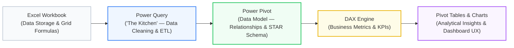
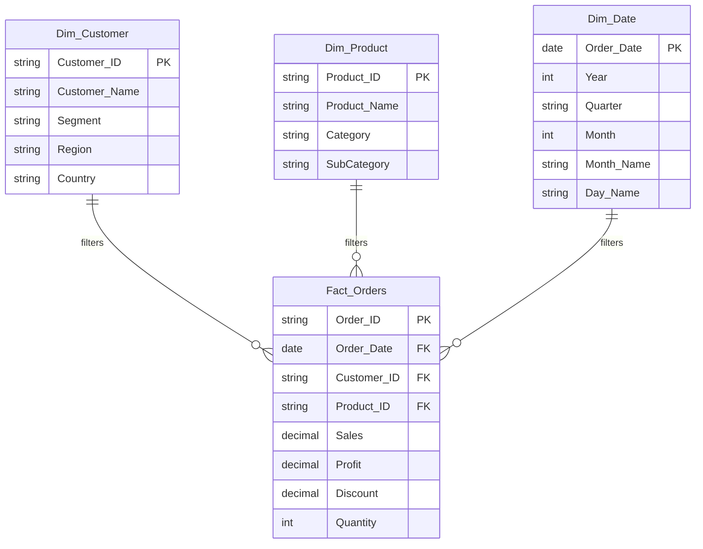
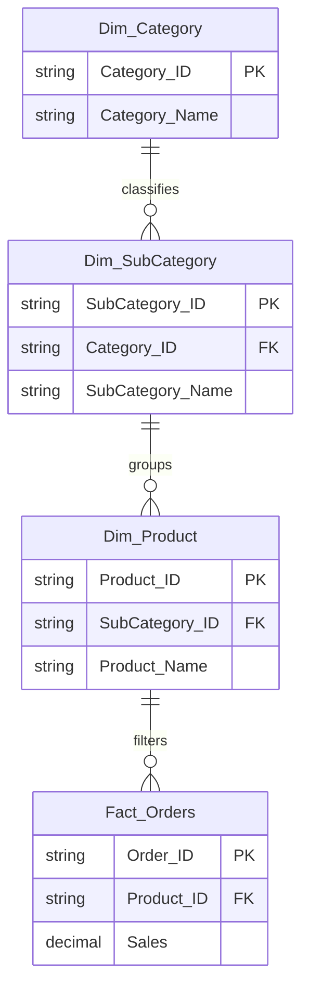
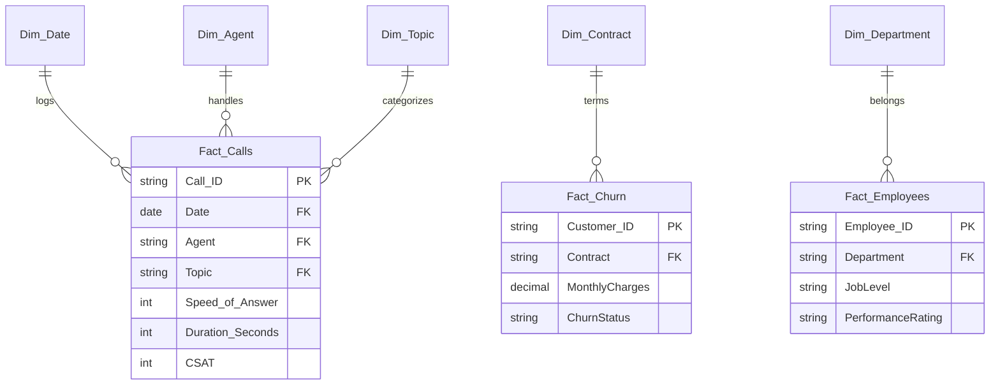

# Lesson 9.1: Dimensional Modeling Principles: Star, Snowflake & Galaxy Schemas

> [!abstract] Learning Objective
> Transition from flat spreadsheet thinking to dimensional modeling. Master the Ralph Kimball dimensional methodology, understand why flat tables collapse under high data volumes, and design performant **Star**, **Snowflake**, and **Galaxy (Fact Constellation)** schemas in Excel Power Pivot and Power BI.

> 🎥 **Video Chapter**: [Chapter 9 – Data Modeling, Power Pivot & DAX (5:03:39)](https://www.youtube.com/watch?v=uv1bxe2gdnU&t=18219s)

---

## 1. The Core Architecture: The Course Blueprint

In modern enterprise business intelligence, each component of Microsoft Excel plays a distinct, non-overlapping architectural role:

### The Analytical Workflow Analogy
* **Power Query = The Kitchen**: Where raw, messy ingredients (datasets) are washed, parsed, unpivoted, normalized, and prepared for cooking.
* **Power Pivot = The Dining Room / Data Model**: Where cleaned entities are arranged into formal relationships (Star Schema) and served to the user.
* **DAX = The Culinary Recipe**: Defining explicit calculations, KPIs, and aggregations that evaluate dynamically based on user interaction.
* **Pivot Tables & Charts = The Presentation**: The final interactive dashboard that delivers actionable insights to stakeholders.

### KPI vs Metric: The Critical Distinction
* **Metric**: An important quantitative figure or measure (e.g., `Total Sales = $2,297,200` or `Total Calls = 5,000`).
* **KPI (Key Performance Indicator)**: A strategic metric paired with a target, threshold, or context that evaluates operational health (e.g., `Answer Rate = 81.08%` vs `Target >= 80%`, `Abandonment Rate = 18.92%` [Critical Alert]).

---

## 2. Why Flat Tables Fail at Scale

Novice analysts often attempt to combine all columns into a single wide flat table (e.g., using `XLOOKUP` or `VLOOKUP` to append customer and product details into an orders table). At scale (+100K rows into millions), this approach creates fatal performance and governance problems:

| Dimension | Flat Denormalized Table | Star Schema Dimensional Model |
| :--- | :--- | :--- |
| **Memory Footprint** | Extremely high (text strings repeated across millions of rows) | Minimal (strings stored once in dimensions; integer FKs in fact) |
| **RAM Compression** | Poor Run-Length Encoding (RLE) efficiency due to row variation | Optimal VertiPaq columnar compression |
| **Referential Integrity**| Prone to typos, mismatched records, and orphaned entries | Guaranteed by 1-to-Many primary/foreign key relationships |
| **Query Speed** | Slow aggregations; full table scans required | Fast columnar scans; aggregations compute in milliseconds |
| **Maintenance** | Updating an agent name requires modifying 50,000+ rows | Updating an agent name requires modifying exactly 1 row in `Dim_Agent` |

---

## 3. The Three Dimensional Topologies

### A. Star Schema (The Gold Standard)
In a **Star Schema**, a central **Fact table** containing numeric quantitative measurements (metrics) is surrounded by independent, single-hop **Dimension tables** containing descriptive attributes.

* **Why Star Schema Wins**:
  1. Every dimension is exactly **1 relationship hop** away from the fact table.
  2. Simplest DAX formulas (no complex many-to-many ambiguity).
  3. Optimized for the VertiPaq columnar engine.

---

### B. Snowflake Schema (Normalized Dimensions)
A **Snowflake Schema** normalizes dimension tables into secondary lookup tables (e.g., `Dim_Product` links to `Dim_SubCategory`, which links to `Dim_Category`):

* **When Snowflake is Used**: Traditional relational databases to save disk space.
* **Why to Avoid in Power Pivot / Power BI**: Multi-hop relationships increase join complexity, confuse end users, and degrade the VertiPaq engine's relationship navigation speed.

---

### C. Galaxy Schema (Fact Constellation)
A **Galaxy Schema** contains **multiple Fact tables** that share one or more **conformed Dimension tables**:

* **Application in Practice**: This matches our **PwC Switzerland Virtual Case Suite**, where a unified Power Pivot semantic model hosts three distinct analytical areas (`Fact_Calls`, `Fact_Churn`, and `Fact_Employees`) under a single enterprise data model.

---

## 4. Live Synchronization: `Module_9_Demo.xlsx`

The companion workbook [`Module_9_Demo.xlsx`](file:///d:/courses/Data%20Analysis%2026-27/7-Introducation%20to%20Data%20Fields%20(Excel)/11_Demos_and_Workbooks/09_Data_Modeling_and_DAX/Module_9_Demo.xlsx) demonstrates the Star Schema implementation:

* **Fact Table**: `Fact_ Orders` (containing `Sales`, `Profit`, `Discount`, `Order Date`, `Customer ID`, `Product ID`).
* **Dimension Tables**:
  - `Dim_Customer` (linked via `Customer ID`)
  - `Dim_Product` (linked via `Product ID`)
  - `Dim_Date` (linked via `Order Date`)
* **PivotTable Implementations**:
  - **Sheet1**: Sales cross-tabulation by `Dim_Date[Month]` (rows), `Dim_Date[Year]` (columns: 2014–2017), with a top-level Page Filter on `Dim_Customer[Region]`.
  - **Sheet2**: Dual-metric performance table comparing `[Sum of Sales]` and `[Avg Sales]` by Month.

---

## 5. Related Knowledge & Next Steps
* [[02_Star_Schema_and_Relationships]] — Learn VertiPaq in-memory mechanics and filter propagation.
* [[03_DAX_Fundamentals_Calculated_Columns_vs_Measures]] — The Formula Engine vs Storage Engine and DAX measures.
* [[05_VertiPaq_Engine_Architecture_and_Optimization]] — In-depth architectural guide on columnar compression and cardinality.
