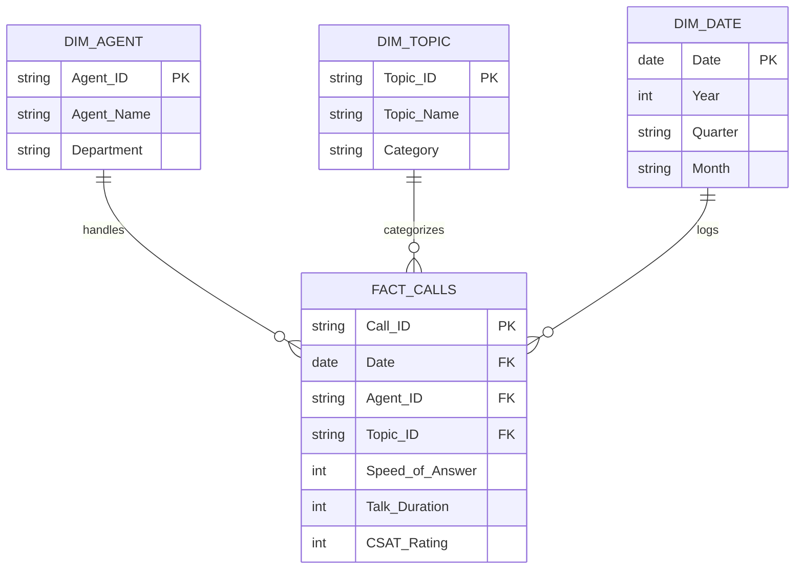

# Lesson 9.1: Dimensional Modeling Principles: Star Schema vs Snowflake Schema

> [!abstract] Learning Objective
> Transition from flat spreadsheet thinking to dimensional modeling, designing Star Schemas that optimize performance, reduce redundancy, and simplify analytical reporting.

> 🎥 **Video Chapter**: [Chapter 9 – Data Modeling, Power Pivot & DAX (5:03:39)](https://www.youtube.com/watch?v=uv1bxe2gdnU&t=18219s)

## Why Flat Tables Fail at Scale
Storing everything in a single massive flat table creates data anomalies, consumes huge memory, causes Cartesian product inflation, and makes multi-dimensional aggregation slow.

## Star Schema Architecture

## Related Knowledge
- Concepts: [[Dimensional Modeling]], [[Star Schema vs Snowflake Schema]], [[Fact vs Dimension Tables]]
