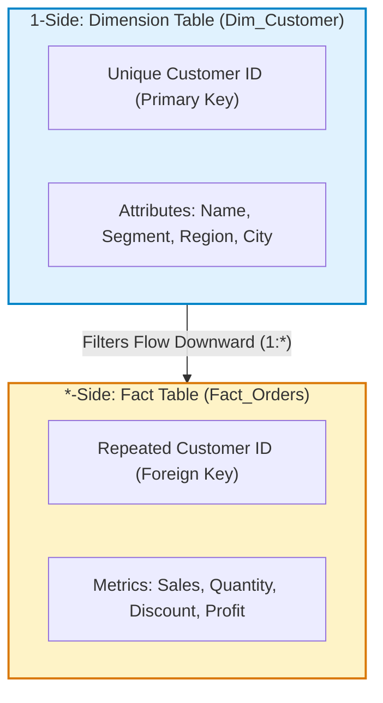
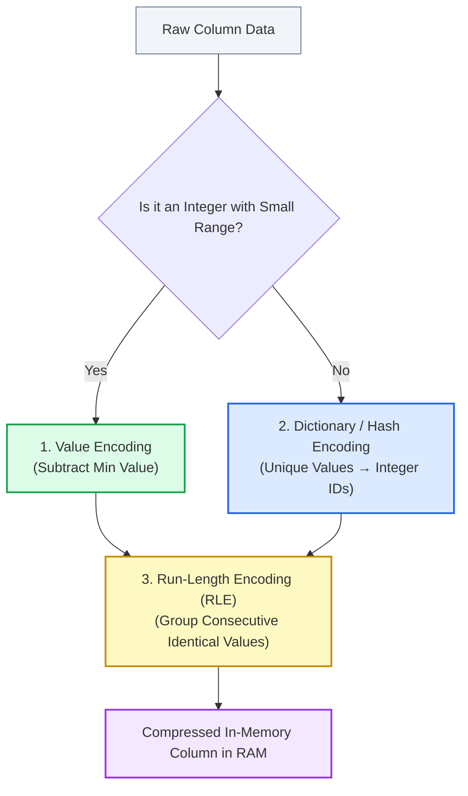

# Lesson 9.2: Establishing Relationships & Understanding the VertiPaq Engine

> [!abstract] Learning Objective
> Build and manage 1-to-Many relationships in Power Pivot Diagram View, enforce referential integrity, trace filter propagation direction, and master how the **VertiPaq columnar in-memory database engine** stores and compresses millions of rows.

> 🎥 **Video Chapter**: [Chapter 9 – Data Modeling, Power Pivot & DAX (5:03:39)](https://www.youtube.com/watch?v=uv1bxe2gdnU&t=18219s)  
> 📖 **Deep Dive Reference**: [Optimising DAX: How VertiPaq Stores Your Data (Endjin)](https://endjin.com/blog/optimising-dax-how-vertipaq-stores-your-data) & [Inside the VertiPaq Engine (Marco Russo, SQLBI)](https://www.youtube.com/watch?v=85rJ-9vQBbU&t=161)

---

## 1. Relationship Mechanics in Power Pivot

In relational and dimensional modeling, tables connect through formal key constraints:

* **Primary Key (PK)**: A column in a Dimension table where every single value is strictly unique (no duplicates, no blanks). Examples: `Dim_Customer[Customer ID]`, `Dim_Product[Product ID]`, `Dim_Date[Date]`.
* **Foreign Key (FK)**: A column in a Fact table that references the Primary Key of a dimension table. Examples: `Fact_Orders[Customer ID]`, `Fact_Orders[Product ID]`, `Fact_Orders[Order Date]`.
* **Cardinality: 1-to-Many (`1:*`)**:
  - The "1" side is always the Dimension table.
  - The "Many (`*`)" side is always the Fact table.
* **Filter Direction (Unidirectional)**:
  - Filters flow naturally from the **1-side (Dimension)** to the **Many-side (Fact)**.
  - When a user filters `Dim_Customer[Region] = "West"`, the dimension filters itself down to West customers, and that filter propagates down the relationship line to restrict `Fact_Orders` rows to only those matching customers.
  - Filters **do not** naturally flow backwards from Fact to Dimension.



---

## 2. How VertiPaq Stores Your Data: Columnar vs Row Storage

Traditional database engines (like SQL Server rowstore or standard Excel worksheets) store data **row-by-row**:

```text
Row 1: [Order_ID=101, Date=2021-01-01, Customer=C01, Sales=150.00, Profit=30.00, ...]
Row 2: [Order_ID=102, Date=2021-01-01, Customer=C05, Sales=45.00,  Profit=12.00, ...]
```
If you calculate `SUM(Sales)` across 1,000,000 rows, a row-oriented engine must read the entire table from memory/disk—all 20+ columns for every single row—and throw away 19 columns just to sum the one needed!

**VertiPaq** is an **in-memory, columnar database engine** powering Excel Power Pivot, Power BI, and Analysis Services Tabular. It stores each column in a contiguous, separate memory structure:

```text
Order_ID:  [101, 102, 103, ...]
Date:      [2021-01-01, 2021-01-01, 2021-01-02, ...]
Sales:     [150.00, 45.00, 890.00, ...]
```

### Why Columnar Storage is Blazingly Fast for Aggregations:
1. **Direct Column Access**: Calculating `SUM(Sales)` reads **only the Sales column vector**. Other columns are never touched.
2. **CPU Cache Utilization**: Columnar arrays fit directly into CPU L1/L2/L3 caches, executing SIMD (Single Instruction, Multiple Data) operations in milliseconds.
3. **Massive Compression**: Homogeneous data types in a single column allow dramatic compression ratios (typically 5x to 20x).

---

## 3. VertiPaq Encoding & Compression Techniques

VertiPaq achieves its speed and tiny RAM footprint using three sequential encoding methods:



### 1. Value Encoding
* Used on numeric columns (e.g., Year, IDs, bounded integers).
* Computes the mathematical minimum of the column and subtracts it from all rows:
  - If a column contains years `[2021, 2022, 2023, 2021]`, the minimum is `2021`.
  - Values stored: `[0, 1, 2, 0]`.
* **Benefit**: Storing `0, 1, 2` requires only **2 bits per row** instead of 32 bits (4 bytes) per row!

### 2. Dictionary / Hash Encoding
* Applied to string/text columns, dates, or non-linear numbers.
* Creates a distinct lookup table (the **Dictionary**) mapping each unique value to an integer index `[0, 1, 2, ..., N-1]`:
  - `Region` column with values `["East", "West", "North", "South"]`.
  - Dictionary: `{0: "East", 1: "North", 2: "South", 3: "West"}`.
  - Data column stores only the integer indexes: `[0, 3, 1, 2, 0, 3, ...]`.
* **Bit-Packing**: The number of bits required per row is $\lceil\log_2(\text{Cardinality})\rceil$.
  - 4 distinct regions = $\log_2(4) = 2$ bits per row!
  - 16 distinct values = 4 bits per row.
  - 1,000 distinct values = 10 bits per row.

### 3. Run-Length Encoding (RLE)
* Scans the encoded column and collapses consecutive repeated values into pairs of `(Value, Count)`:
  - Sequence: `[0, 0, 0, 0, 0, 1, 1, 1, 2, 2]` (10 rows).
  - RLE storage: `(0, 5), (1, 3), (2, 2)` (3 entries instead of 10 rows).
* **The Sorting Effect**: The physical sort order of the table determines RLE efficiency. If rows are sorted by low-cardinality columns first, runs can be tens of thousands of rows long, compressing millions of rows into a few kilobytes!

---

## 4. Why Cardinality is King ("Plus Millions")

**Cardinality** is the number of **unique (distinct) values** in a column.

> [!important] The Cardinality Rule
> The memory cost of a column in VertiPaq is almost entirely determined by its **cardinality**, NOT the number of rows!

* **Low Cardinality (e.g., `Gender` = 2, `Quarter` = 4, `Status` = 3)**:
  - Tiny dictionary (a few bytes).
  - Very few bits per row (1 or 2 bits).
  - Massive RLE runs.
  - A table of **10,000,000 rows** with low cardinality can consume less than 5 MB of RAM!
* **High Cardinality (e.g., `DateTime` with seconds, GUIDs, unrounded decimals)**:
  - Enormous dictionary (millions of unique entries).
  - High bit-packing (20–32 bits per row).
  - RLE run length is 1 (zero RLE compression).
  - Memory balloons into gigabytes.

### Practical Engineering Rules for BI Developers:
1. **Split Date and Time**: Never store `DateTime` in a single column. Split into `Date` (low cardinality) and `Hour`/`Time` (low cardinality).
2. **Remove Unused IDs**: Don't load transaction GUIDs into the data model unless strictly required for a relationship.
3. **Round Decimals**: Round currencies to 2 decimal places to reduce distinct decimal noise.

---

## 5. Live Demonstration in `Module_9_Demo.xlsx`

In [`Module_9_Demo.xlsx`](file:///d:/courses/Data%20Analysis%2026-27/7-Introducation%20to%20Data%20Fields%20(Excel)/11_Demos_and_Workbooks/09_Data_Modeling_and_DAX/Module_9_Demo.xlsx), the Power Pivot data model demonstrates these principles:

1. **`Fact_ Orders`**:
   - `Order Date` $\to$ related to `Dim_Date[Order Date]` (`1:*`)
   - `Customer ID` $\to$ related to `Dim_Customer[Customer ID]` (`1:*`)
   - `Product ID` $\to$ related to `Dim_Product[Product ID]` (`1:*`)
2. **VertiPaq Optimization**:
   - `Dim_Customer[Region]` has only 4 unique values (Central, East, South, West) $\to$ compressed to 2 bits per row.
   - `Dim_Date[Year]` spans 2014–2017 (4 unique values) $\to$ Value/Dictionary encoded with near-instant aggregation speed.
   - Slicing `Sheet1` PivotTable by Month and Year executes directly in VertiPaq memory.

---

## 6. Related Knowledge & Next Steps
* [[01_Dimensional_Modeling_Principles]] — Dimensional modeling topologies.
* [[03_DAX_Fundamentals_Calculated_Columns_vs_Measures]] — Formula Engine vs Storage Engine and DAX evaluation.
* [[05_VertiPaq_Engine_Architecture_and_Optimization]] — Advanced VertiPaq memory inspection and query optimization.
