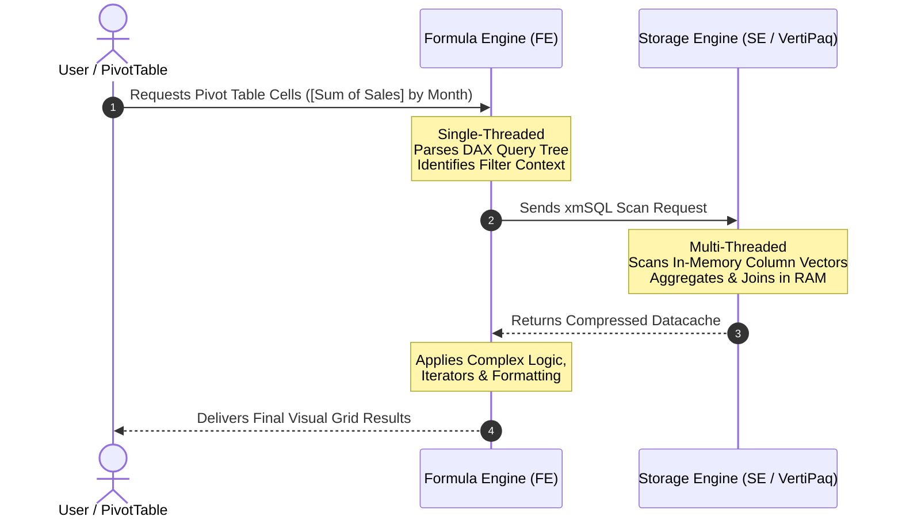

# Lesson 9.3: DAX Fundamentals: Calculated Columns vs DAX Measures

> [!abstract] Learning Objective
> Distinguish row context from filter context, evaluate the performance impact on the VertiPaq database, and understand how the **Formula Engine (FE)** and **Storage Engine (SE)** collaborate during query execution.

> 🎥 **Video Chapter**: [Chapter 9 – Data Modeling, Power Pivot & DAX (5:03:39)](https://www.youtube.com/watch?v=uv1bxe2gdnU&t=18219s)  
> 📖 **Architecture Reference**: [The Formula Engine and Storage Engine (Endjin)](https://endjin.com/blog/optimising-dax-how-vertipaq-stores-your-data) & [Inside the VertiPaq Engine (SQLBI)](https://www.youtube.com/watch?v=85rJ-9vQBbU&t=161)

---

## 1. Critical Differences: Calculated Columns vs DAX Measures

Every calculation in Power Pivot or Power BI belongs to one of two categories:

| Architectural Attribute | Calculated Column | Explicit DAX Measure |
| :--- | :--- | :--- |
| **Evaluation Context** | **Row Context** (evaluated row-by-row during data refresh) | **Filter Context** (evaluated dynamically at query time) |
| **Storage Location** | Physically written into the VertiPaq table structure in RAM and disk | Stored as a formula definition; **consumes 0 bytes of RAM** at rest |
| **RAM Impact** | High (creates a new column dictionary and encoded data vector) | Zero (computed dynamically on CPU demand) |
| **Recalculation Trigger** | When the data model is refreshed | Whenever a user slices, filters, or pivots the report |
| **Primary Usage** | Slicers, Column/Row headers in PivotTables | The **Values area ( $\Sigma$ )** of PivotTables, KPI cards, Charts |
| **Demo Formula Example** | `DurationMin = [DurationSec] / 60` | `[Sum of Sales] = SUM('Fact_ Order'[Sales])` |

```mermaid
flowchart TD
    subgraph CC ["Calculated Column (Row Context)"]
        CC1["Evaluated during ETL / Data Refresh"] --> CC2["Stores Result in Table Column"]
        CC2 --> CC3["Consumes In-Memory RAM"]
        CC3 --> CC4["Can be used in Slicers & Rows"]
    end

    subgraph M ["DAX Measure (Filter Context)"]
        M1["Evaluated on Query / User Click"] --> M2["Zero Memory Footprint at Rest"]
        M2 --> M3["Computes dynamically via SE & FE"]
        M3 --> M4["Placed in Values Area & Visual Cards"]
    end

    style CC fill:#fef2f2,stroke:#ef4444,stroke-width:2px
    style M fill:#f0fdf4,stroke:#22c55e,stroke-width:2px
```



---

## 2. The Dual Engine Architecture: Formula Engine vs Storage Engine

When a DAX query executes (e.g., when you drag a measure into a PivotTable or click a slicer), two distinct internal engines execute the request:



### 1. The Formula Engine (FE)
* **Characteristics**: **Single-threaded**, extremely powerful, can execute any complex logic, text manipulation, and DAX expression.
* **Responsibilities**:
  - Parses the incoming DAX query and produces an optimized execution tree.
  - Translates filter context into requests for the Storage Engine.
  - Handles complex iterative functions (`SUMX`, `RANKX`, `CALCULATE` context transitions).
  - Performs final math and formatting before returning values to Excel.

### 2. The Storage Engine (SE / VertiPaq)
* **Characteristics**: **Multi-threaded**, blazingly fast, operates directly on compressed in-memory columnar caches.
* **Responsibilities**:
  - Receives requests formatted in **xmSQL** from the Formula Engine.
  - Performs column scans, basic filters (`Fact_Orders[Region] = "West"`), and standard aggregations (`SUM`, `MIN`, `MAX`, `COUNT`).
  - Executes relationship joins across tables in memory.
  - Returns raw, aggregated datacaches back to the Formula Engine.

### The Materialization Trap (Performance Warning!)
When a calculation cannot be resolved inside the Storage Engine (e.g., poorly written nested iterators or complex cross-table row contexts), the Storage Engine is forced to **materialize millions of uncompressed rows** and dump them into the single-threaded Formula Engine.
* Result: The query stalls, CPU cores sit idle, and memory spikes.
* **The BI Developer Goal**: Always write DAX measures that allow the Storage Engine to do 95%+ of the heavy lifting!

---

## 3. The Golden Rules of DAX

> [!tip] Golden Rule #1: Never Use a Calculated Column When a Measure Suffices
> If you need to calculate an aggregation (sum, average, ratio, percentage), **always write an explicit DAX measure**. Only use a calculated column if you must place the result onto a **Slicer** or a **Row/Column Header**.

> [!tip] Golden Rule #2: Explicit Measures Over Implicit Measures
> In Excel, dragging a numeric field directly into the Values area creates an **implicit measure** (e.g., `Sum of Sales`). Never rely on implicit measures! Always author an **explicit DAX measure** (`Total Sales := SUM(Fact_Orders[Sales])`). Explicit measures can be referenced by downstream measures, formatted consistently, and optimized.

> [!tip] Golden Rule #3: Separate Metrics from KPIs
> * **Metric (Important Number)**: `[Sum of Sales] = SUM('Fact_ Order'[Sales])`
> * **KPI (Actionable Indicator)**: 
>   ```dax
>   Sales vs Target % := DIVIDE([Sum of Sales], [Target Sales], 0)
>   ```

---

## 4. Live Synchronization: `Module_9_Demo.xlsx`

In the companion file [`Module_9_Demo.xlsx`](file:///d:/courses/Data%20Analysis%2026-27/7-Introducation%20to%20Data%20Fields%20(Excel)/11_Demos_and_Workbooks/09_Data_Modeling_and_DAX/Module_9_Demo.xlsx), the Power Pivot data model implements these explicit DAX measures:

### Measure 1: Total Sales
```dax
-- Explicit Measure created on 'Fact_ Order'
[Sum of Sales] := SUM('Fact_ Order'[Sales])
```
* **Engine Execution**: Fully pushed to the **Storage Engine (SE)**. VertiPaq scans the compressed `Sales` column vector and computes the sum in sub-milliseconds across all years (2014–2017: **$2,297,200.86**).

### Measure 2: Average Order Sales
```dax
-- Explicit Measure created on 'Fact_ Order'
[Avg Sales] := AVERAGE('Fact_ Order'[Sales])
```
* **Engine Execution**: Executed in the Storage Engine, returning the average order ticket size ($229.86 overall).
* **Pivot Usage**:
  - `Sheet1`: `[Sum of Sales]` evaluated across `Dim_Date[Month]` and `Dim_Date[Year]`.
  - `Sheet2`: Side-by-side comparison of `[Sum of Sales]` and `[Avg Sales]` grouped by `Dim_Date[Month]`.

---

## 5. Related Knowledge & Next Steps
* [[04_Essential_DAX_Functions_and_Context]] — Master `CALCULATE`, `DIVIDE`, and context transition.
* [[05_VertiPaq_Engine_Architecture_and_Optimization]] — In-depth guide to VertiPaq memory metrics and query tuning.
