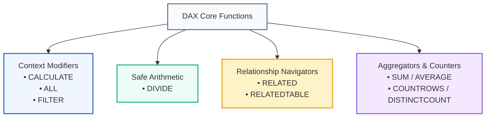
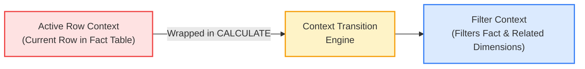

# Lesson 9.4: Essential DAX Calculations: CALCULATE, DIVIDE, RELATED & Context Transition

> [!abstract] Learning Objective
> Master the core functional vocabulary of DAX. Understand how `CALCULATE` modifies filter context, how `DIVIDE` safely eliminates mathematical errors, how `RELATED` navigates relationships, and how **Context Transition** transforms a row context into an equivalent filter context.

> 🎥 **Video Chapter**: [Chapter 9 – Data Modeling, Power Pivot & DAX (5:03:39)](https://www.youtube.com/watch?v=uv1bxe2gdnU&t=18219s)

---

## 1. The Core DAX Functions Reference



---

### 1.1 Safe Division with `DIVIDE`
In spreadsheet analysis, dividing by zero causes fatal `#DIV/0!` errors that break downstream calculations and ruin visual dashboards. The DAX `DIVIDE` function automatically intercepts division-by-zero or null denominators:

```dax
-- Syntax: DIVIDE(Numerator, Denominator, [AlternateResult])
Answer_Rate := 
DIVIDE(
    [Answered_Calls],
    [Total_Calls],
    0   -- Returns 0 instead of error when Total_Calls is 0 or Blank
)
```

---

### 1.2 Altering Filter Context with `CALCULATE`
`CALCULATE` is the single most important function in DAX. It is the **only** function that can alter, override, or add new filters to the evaluation context.

```dax
-- Syntax: CALCULATE(Expression, Filter1, Filter2, ...)
Resolved_Calls := 
CALCULATE(
    COUNT(Fact_Calls[Call Id]),
    Fact_Calls[Answered (Y/N)] = "Y",
    Fact_Calls[Resolved] = "Y"
)
```

#### How CALCULATE Evaluates Internally:
1. Takes a copy of the current filter context (e.g., from the PivotTable row/column).
2. Evaluates the filter arguments in the original context.
3. Overrides or intersects existing filters with the new filters.
4. Evaluates the core expression (`COUNT`) under the newly modified context.

---

### 1.3 Removing Filters with `ALL`
When calculating percentages of total (e.g., `% of Grand Total`), `ALL` clears filters from a table or column:

```dax
-- Removes filters on Dim_Date to get Total Sales across all time
Pct_of_Total_Sales := 
DIVIDE(
    [Sum of Sales],
    CALCULATE([Sum of Sales], ALL('Fact_ Order')),
    0
)
```

---

### 1.4 Fetching Dimensional Values with `RELATED`
In a **Calculated Column** on the Many-side (Fact table), `RELATED` traverses an existing relationship to retrieve a value from the 1-side (Dimension table):

```dax
-- Evaluated in a Calculated Column on Fact_Orders
Customer_Region = RELATED(Dim_Customer[Region])
```
* Note: `RELATED` requires a formal 1-to-Many relationship between the two tables.

---

### 1.5 Counting Rows vs Distinct Count
* **`COUNTROWS(Table)`**: Highly optimized in VertiPaq. Returns the row count of a table or filtered table.
  ```dax
  Total_Orders := COUNTROWS('Fact_ Order')
  ```
* **`DISTINCTCOUNT(Column)`**: Returns the count of unique values.
  ```dax
  Active_Customers := DISTINCTCOUNT('Fact_ Order'[Customer ID])
  ```

---

## 2. Context Transition: The Bridge Between Row and Filter Context

> [!important] Definition of Context Transition
> **Context Transition** occurs whenever `CALCULATE` (or a measure wrapped inside `CALCULATE`) is invoked within an active **Row Context**. It transforms the current row's column values into an equivalent **Filter Context** that filters the entire data model.



### The Invisible CALCULATE in Measures
Whenever you reference an existing measure inside a calculated column or iterator (e.g., `SUMX`), DAX automatically wraps that measure in an invisible `CALCULATE()`. This triggers context transition automatically!

---

## 3. Practical Enterprise Formula Catalog

Here is the standard metric library used across our **Sales** and **Call Center** production models:

| Measure Name | DAX Formulation | Business Meaning |
| :--- | :--- | :--- |
| **Total Demand** | `DISTINCTCOUNT(Fact_Calls[Call Id])` | Gross inbound call inquiries offered |
| **Calls Answered** | `CALCULATE(COUNT(Fact_Calls[Call Id]), Fact_Calls[Answered (Y/N)] = "Y")` | Connected interactions |
| **Abandonment %** | `DIVIDE([Abandoned Calls], [Total Demand], 0)` | Operational queue leakage rate |
| **First Contact Resolution** | `DIVIDE([Resolved Calls], [Calls Answered], 0)` | Efficiency of connected interactions |
| **Average Hold Time**| `AVERAGE(Fact_Calls[Speed of answer in seconds])` | Average queue wait time in seconds (ASA) |
| **Overall CSAT** | `AVERAGE(Fact_Calls[Satisfaction rating])` | Average customer satisfaction (1–5) |

---

## 4. Related Knowledge & Next Steps
* [[05_VertiPaq_Engine_Architecture_and_Optimization]] — How VertiPaq accelerates DAX filters and aggregations.
* [[Master Project Guidance Manual]] — Applying these DAX measures to the PwC Call Center project.
