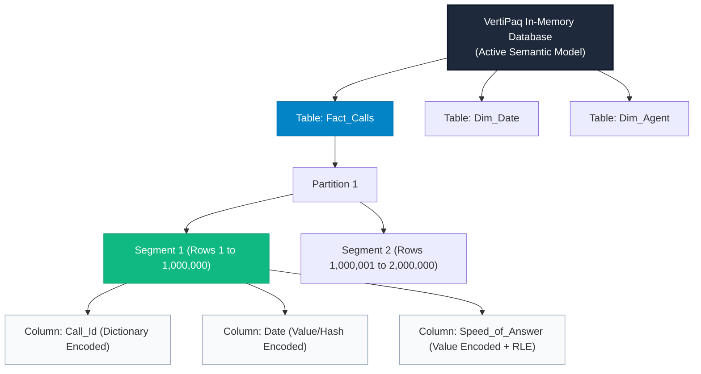
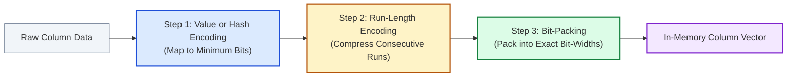
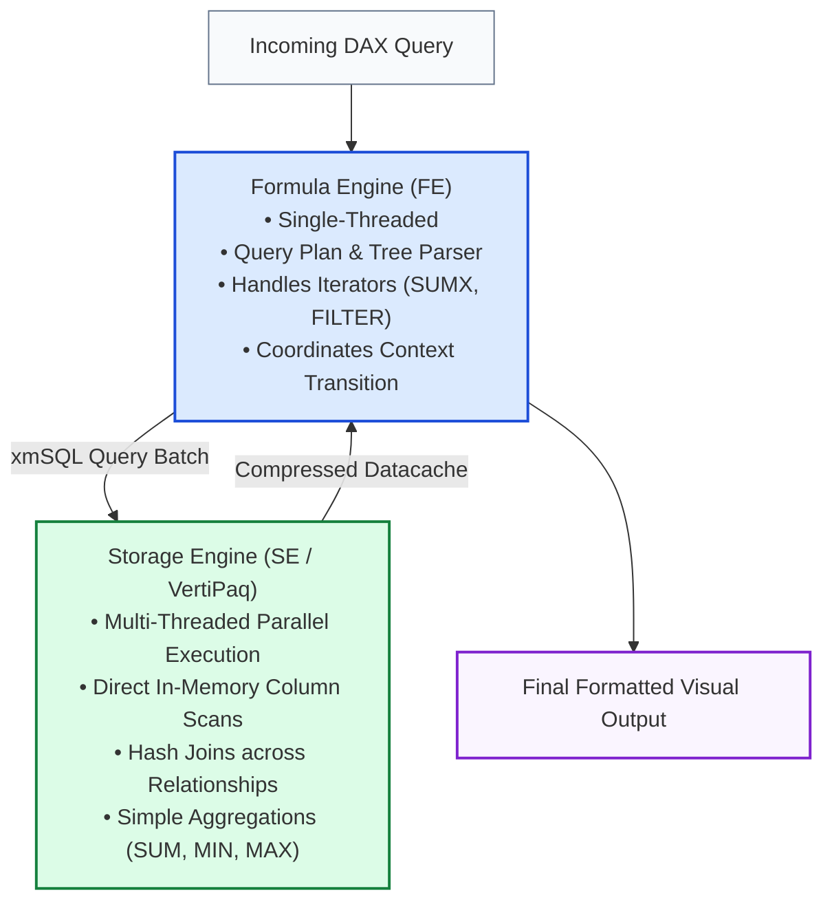

# Lesson 9.5: VertiPaq Engine Architecture & DAX Optimization Masterclass

> [!abstract] Architectural Mandate
> The **VertiPaq engine** is the in-memory, column-oriented analytical database engine behind Microsoft Excel Power Pivot, Power BI (Import Mode), and Analysis Services Tabular. Understanding its internal storage structures, compression algorithms, and query pipeline is the definitive difference between a spreadsheet user and a Senior BI Developer.

> 📖 **Foundational Reading**: [Optimising DAX: How VertiPaq Stores Your Data (Carmel Eve, Endjin)](https://endjin.com/blog/optimising-dax-how-vertipaq-stores-your-data)  
> 🎥 **Deep Dive Video**: [Inside the VertiPaq Engine (Marco Russo, SQLBI)](https://www.youtube.com/watch?v=85rJ-9vQBbU&t=161)

---

## 1. Physical Storage Hierarchy: The "Plus Millions" Architecture

VertiPaq organises data into a strict hierarchical memory structure:



### The Segment Rule
* Each table partition is broken into **Segments** of **1,000,000 rows** (default size).
* Each segment is compressed and indexed independently.
* **Why Multi-Million Rows Run Fast**: Multi-threaded CPU cores scan different segments simultaneously in parallel. A 10-million-row table across 10 segments running on an 8-core CPU completes scans in fractions of a second.

---

## 2. Deep Dive: The 3 Compression & Encoding Techniques

When data is loaded into Power Pivot, VertiPaq evaluates each column independently and chooses the optimal combination of three encoding strategies:



---

### Technique 1: Value Encoding
* **Application**: Numeric columns (integers) with a bounded mathematical range.
* **Mechanism**: VertiPaq computes the column minimum ($V_{\min}$) and subtracts it from every row ($V_{\text{stored}} = V - V_{\min}$).
* **Example**:
  - Raw column values: `[2021, 2023, 2022, 2021]`.
  - Base subtracted: `2021`.
  - Stored numbers: `[0, 2, 1, 0]`.
* **Bit Width**: To store the number `2`, VertiPaq needs only **2 bits** ($2^2 = 4 \ge 2$). Storing raw 32-bit integers would require 16 times more memory!

---

### Technique 2: Hash (Dictionary) Encoding
* **Application**: Text columns, non-integer numbers, or integers with vast gaps.
* **Mechanism**: Creates an auxiliary in-memory lookup table called the **Dictionary**, which holds each unique value once and maps it to a zero-based integer index ($0, 1, \dots, N-1$).
* **Bit Packing Calculation**:
  $$\text{Bits Per Row} = \lceil\log_2(\text{Cardinality})\rceil$$

| Distinct Values (Cardinality) | Required Bits per Row | Max Rows Compressed in 1 Byte (8 bits) |
| :---: | :---: | :---: |
| **2** (e.g. Yes/No, Gender) | **1 bit** | **8 rows** |
| **4** (e.g. Quarters) | **2 bits** | **4 rows** |
| **16** (e.g. US Regions/States) | **4 bits** | **2 rows** |
| **256** (e.g. Product Categories) | **8 bits (1 byte)** | **1 row** |
| **65,536** (e.g. Store SKU IDs) | **16 bits (2 bytes)**| **0.5 rows** |

---

### Technique 3: Run-Length Encoding (RLE)
* **Application**: Compressing repeated adjacent entries.
* **Mechanism**: Replaces consecutive runs of identical values with a single pair: `(Value, RunLength)`.
* **Example**:
  ```text
  Uncompressed Sequence: [0, 0, 0, 0, 0, 0, 1, 1, 1, 2] (10 rows)
  RLE Compressed:        (0, 6), (1, 3), (2, 1)          (3 pairs)
  ```
* **The Sort Order Impact**:
  If a 1,000,000-row table is sorted by `Region`, and "West" appears 250,000 times consecutively, VertiPaq stores that quarter of the table in a **single RLE entry** `("West", 250000)` taking just a few bytes!

---

## 3. Why Cardinality is King: The Storage Cost Formula

The total memory footprint of any column in VertiPaq is defined by:

$$\text{Memory}_{\text{Column}} = \text{Size}_{\text{Dictionary}} + \text{Size}_{\text{DataVector}} + \text{Size}_{\text{Hierarchies/Indexes}}$$

```text
High Cardinality Column (e.g., Transaction GUID or Millisecond Timestamp):
• Dictionary: 1,000,000 unique strings × 36 bytes = ~36 MB Dictionary!
• Bit-width: ceil(log2(1,000,000)) = 20 bits per row.
• RLE Efficiency: 0% (every row is unique, so run length is 1).
• Total Memory: Enormous (~40 MB for 1M rows).

Low Cardinality Column (e.g., Topic or Region):
• Dictionary: 5 unique strings × 20 bytes = 100 bytes!
• Bit-width: ceil(log2(5)) = 3 bits per row.
• RLE Efficiency: Massive (tens of thousands of rows per run).
• Total Memory: Tiny (~50 KB for 1M rows).
```

### The Top 4 Cardinality Reduction Rules:
1. **Never import raw DateTime timestamps**: Split `2021-01-15 14:23:45` into `Date` (`2021-01-15`, 90 distinct values) and `Hour` (`14`, 24 distinct values).
2. **Never import surrogate transactional GUIDs**: If a column like `Transaction_UUID` is not needed for a relationship or UI drill-through, delete it in Power Query!
3. **Round currency and float values**: Round amounts to 2 decimal places to eliminate unique floating-point variations.
4. **Group low-frequency categories**: Consolidate minor categories into an `"Other"` bucket in Power Query.

---

## 4. Dual Engine Performance Tuning: FE vs SE



### The "Materialization Trap" & How to Avoid It
* **The Goal**: Keep query execution in the Storage Engine (SE) for >90% of total query duration.
* **The Danger**: When a measure uses complex, row-by-row iterators over un-indexed cross-table expressions, the Storage Engine cannot aggregate the data. It must **materialize** the entire uncompressed dataset into temporary RAM and hand it off to the single-threaded Formula Engine (FE).
* **Symptoms**:
  - High query latency (5–30 seconds for a simple visual).
  - CPU utilization drops to a single core while memory spikes.
* **Solution**:
  - Use simple aggregations (`SUM`, `COUNTROWS`) inside explicit measures.
  - Rely on relationship-driven filter context rather than manually filtering entire tables with `FILTER(ALL(Table), ...)`.

---

## 5. Architectural Summary: BI Developer Checklist

| Checkpoint | Target State | Anti-Pattern |
| :--- | :--- | :--- |
| **Data Topology** | Pure **Star Schema** (Fact $\to$ Dim 1-hop) | Wide flat tables or Snowflake chains |
| **Calculations** | **Explicit DAX Measures** for all values | Calculated columns on large fact tables |
| **Cardinality** | Low distinct counts; Split Date/Time | Combined timestamps with seconds/GUIDs |
| **Division** | `DIVIDE(Num, Denom, 0)` | Raw slash arithmetic (`Num / Denom`) |
| **Relationships** | Single 1-to-Many (`1:*`) unidirectional | Many-to-Many (`*:*`) or Bi-directional cross-filtering |
