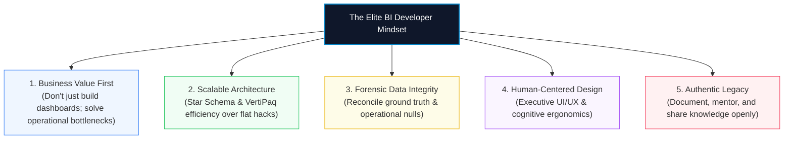

# Module 10.1: A Message to My Future Students: The Data Analytics Mindset & Legacy

> [!abstract] Architectural Purpose
> Technical knowledge in Power Query, Power Pivot, DAX, and VBA provides the tools, but your **mindset**, **integrity**, and **willingness to help others** define your career trajectory as an elite Data Analyst and BI Developer.

---

## 1. كلمة ورسالة إلى طلابي المستقبليين (Mentor's Note)

> [!quote] رسالة من القلب لكل من سلك طريق البيانات
> *"حابب أشكرك جداً لو وصلت لحد هنا، وأشكرك علشان أنا عارف إن محتوى الكورس تقيل لحد لسه في البداية، وعارف إنه محتوى مش هيخلص في أسبوع أو اتنين أو حتى شهر...*
>
> *بس عايز أفكّرك بحاجة:*
> *أنت بتذاكره علشان كدا، وعلشان يعمل فرق بينك وبين أي حد حواليك، وهتعرف بعد كدا إنه ده البداية، وإن ده مش مجرد كورس إكسيل، لا ده مجموعة من الحاجات اللي حبيت أكلمك عنهم وأنت لسه بتبدأ علشان متضيعش وقت، وعلشان مش عايزك تمشي الطريق الصعب اللي إحنا مشيناه من الأول...*
>
> *لا، أنا عايزك أحسن مني ومن الموجودين في السوق!*
> *وعايزك تساعد اللي بعدك في كدا...*
> *لأن بكل بساطة: هل في علم بيخلص؟*
> *هل أنت لو حبيت تخبي العلم علشان تتميز بيه، هل فعلاً هتعرف تتميز بالعقلية بتاعتك دي؟!*
> 
> *اللي بيعلي المستوى هي التنافسية الشريفة يا صديقي، فساعد اللي بعدك واللي أصغر منك وهتلاقي ربنا بيكرمك من حيث لا تدري، وافتكر دايماً إن الدنيا هي دار عبور للآخرة، وإن شرحك وكلامك وعلمك هو اللي هيقعد، ويمكن يساعد ناس بعدك بمئات السنين.*
>
> *مش هطول عليك، فكفاية كدا...*
> *بس حابب أقول إن كل فيديو وكل بريزنتيشن وكل سطر كود خد وقت ومجهود كبير مني، بس كل ما أفتكر إنه ممكن ينفع طالب عنده 18 ولا 20 سنة بكمل... علشان مش عايز الشباب الصغير ده يعاني في بداية الطريق زينا زمان في بداية طريقنا للداتا، ولا يقع ضحية من ضحايا السيلز اللي بيبيعوا كورسات وهمية."*

---

## 2. The 5 Pillars of the Senior BI Developer Mindset

### Pillar 1: Business Value First
Never measure success by how many charts or formulas you placed on a sheet. Measure success by **the operational decision the stakeholder can make in under 5 seconds**. If Claire cannot spot why callers are abandoning or which agents need coaching, the dashboard has failed regardless of visual flair.

### Pillar 2: Scalable Architecture
Build every solution with **+100K to multi-million row scale in mind**. 
* Use **Power Query** as "The Kitchen" for ETL.
* Use **Power Pivot** and **VertiPaq** for columnar in-memory modeling.
* Enforce **Star Schemas** with strict 1-to-Many relationships.
* Keep calculations in **explicit DAX measures**, keeping RAM footprint near zero.

### Pillar 3: Forensic Data Integrity
Never hide, delete, or arbitrarily impute missing data. Understand the business mechanism behind every null (e.g., the **946 null wait times** represent abandoned calls, not data errors). Always reconcile calculations against ground truth before executive delivery.

### Pillar 4: Human-Centered Design
Design for human cognitive limits:
* Restrict color palettes to a semantic design system (Dark navy `#0F172A`, canvas `#F8FAFC`, alert coral `#DC2626`, success green `#16A34A`).
* Maintain visual hierarchy: Hero KPI cards at top, trend dynamics in middle, multidimensional drill-down at bottom.
* Provide seamless, flicker-free navigation and one-click slicer resets using modular VBA.

### Pillar 5: Authentic Legacy & Mentorship
Knowledge grows by sharing. Document your architecture thoroughly, version-control your work cleanly with Git, and publish your portfolio so that future learners can learn from your standards.
