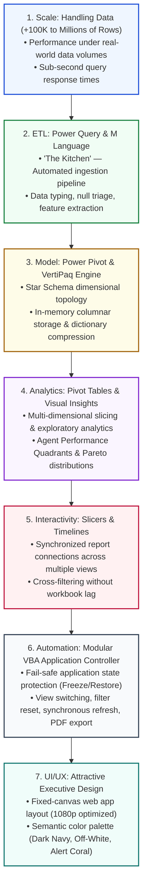
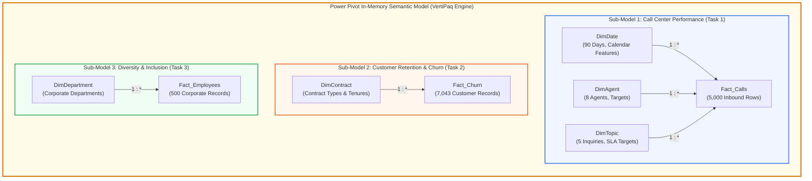

# Module 10.2: CV Portfolio Project Architecture: The 7 Pillars of a Standout Capstone

> [!abstract] Architectural Objective
> Build a production-grade enterprise business intelligence capstone designed to impress hiring managers, recruiters, and technical leads. This note codifies the **7 Pillars of a Standout CV Project** and outlines the unified multi-fact **Galaxy / Constellation Semantic Model** powering the PwC Switzerland case simulation.

---

## 1. The 7 Pillars of a Standout CV Project

To prove true enterprise readiness, your portfolio project must demonstrate mastery across all 7 layers of modern business intelligence:

---

## 2. Enterprise Unified Semantic Model: The PwC Tripartite Suite

Rather than presenting isolated, disjointed spreadsheets, our capstone unifies the **PwC Switzerland Virtual Case Experience** into a single **Power Pivot In-Memory Semantic Model** powered by the **VertiPaq Engine**:

### Dataset Ground Truth Reconciled:
* **`Fact_Calls`**: 5,000 interactions spanning Jan 1 – Mar 31, 2021. Filtered by `DimDate`, `DimAgent`, and `DimTopic`.
* **`Fact_Churn`**: 7,043 telecom accounts evaluating customer retention elasticity, fiber-optic dissatisfaction, and monthly charge variance. Filtered by `DimContract`.
* **`Fact_Employees`**: 500 corporate personnel evaluating executive gender balance, promotion velocity, and retention at Pharma Group AG. Filtered by `DimDepartment`.

---

## 3. How to Present and Defend This Project in Interviews

When interviewing for Senior Data Analyst, BI Developer, or Analytics Engineer roles, structure your project defense around these key talking points:

### 1. The Architectural Choice: "Why Power Pivot and Star Schema instead of VLOOKUP?"
> *"Instead of creating a sluggish 30-column flat table using formulas that recalculate on every cell change, I architected a Kimball Star Schema inside Excel Power Pivot's VertiPaq engine. This allowed me to leverage dictionary encoding, bit-packing, and Run-Length Encoding (RLE) to achieve sub-second aggregations while consuming near-zero memory for calculations via explicit DAX measures."*

### 2. The Data Quality Breakthrough: "How did you handle the 946 null values?"
> *"A forensic cross-tabulation of the 5,000 call records revealed that the 946 missing wait times and CSAT ratings were strictly correlated with `Answered == 'N'`. These were operational nulls representing caller abandonment in queue. Treating them as errors and imputing zero would have artificially skewed average wait times by 19%. I preserved these nulls in Power Query and designed explicit DAX measures using `DIVIDE` and `CALCULATE` to correctly isolate operational answer rates from customer satisfaction scores."*

### 3. The Business Impact: "What operational recommendations did you deliver to Claire?"
> *"By mapping agents across a 2D Performance Quadrant (Handle Time vs Calls Answered), I discovered that queue abandonment peaks occurred between 11 AM and 2 PM due to concurrent staff lunch breaks. I recommended staggered scheduling, pairing low-CSAT agents with high-CSAT mentors like Martha, and implementing an automated IVR callback option to reclaim lost demand."*

---

## 4. Related Knowledge & Implementation Files
* [[Master Project Guidance Manual]] — Complete step-by-step implementation guide.
* [[05_VertiPaq_Engine_Architecture_and_Optimization]] — In-depth guide to VertiPaq memory optimization.
