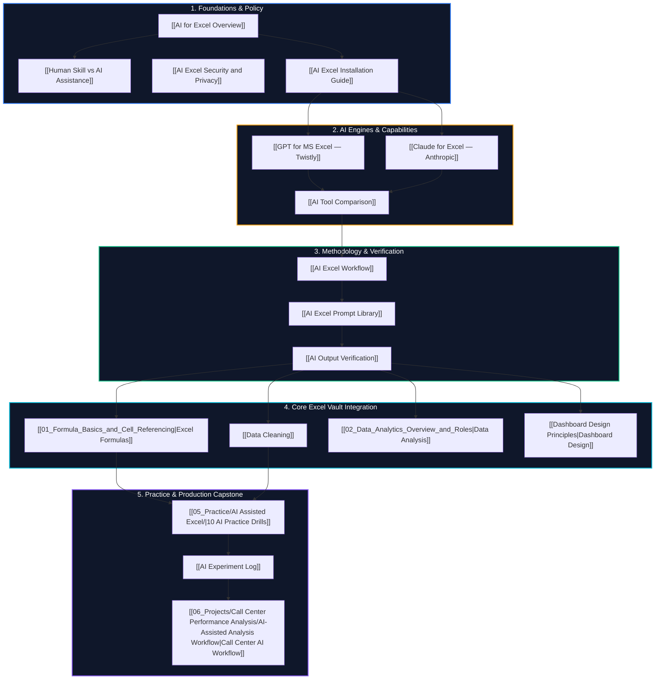

# 🤖 AI for Data Analysts: Master Map of Content (MOC)

> [!abstract] Knowledge Architecture
> This Map of Content organizes the complete **AI-Assisted Excel Learning Track**, integrating external tool documentation, installation guides, professional methodologies, prompt engineering patterns, verification frameworks, hands-on practice drills, and capstone project implementations into a single navigable graph.

---

## 🗺️ Visual Architecture & Global Knowledge Flow

---

## 🗂️ Systematic Knowledge Hubs

### 1. Architectural Overview & Governance
- **[[AI for Excel Overview]]**: Pedagogical mission, core principles, and learning progression.
- **[[Human Skill vs AI Assistance]]**: Matrix defining cognitive division of labor between human analyst and AI assistant.
- **[[AI Excel Security and Privacy]]**: 5-step security decision gate, PII anonymization, and corporate governance compliance.
- **[[AI Excel Installation Guide]]**: Verified deployment procedures for Microsoft AppSource Office Add-ins.

### 2. Verified AI Tools
- **[[GPT for MS Excel — Twistly]]**: Technical manual for cell-formula functions (`AI.ASK`, `AI.TABLE`, `AI.FILL`, `AI.CHOICE`, `AI.EXTRACT`).
- **[[Claude for Excel — Anthropic]]**: Contextual workbook reasoning, multi-tab DOM analysis, and cell citations.
- **[[AI Tool Comparison]]**: Objective architectural comparison matrix.

### 3. Professional Execution & Quality Control
- **[[AI Excel Workflow]]**: 14-step end-to-end analytical workflow from business framing to production deployment.
- **[[AI Excel Prompt Library]]**: Standardized prompt templates for formulas, debugging, ETL, and dashboard architecture.
- **[[AI Output Verification]]**: 6-stage verification pipeline, pre-flight checklist, and native Excel auditing tools (`F9`, `Evaluate Formula`).

### 4. Applied Practice & Long-Term Experimentation
- **[[05_Practice/AI Assisted Excel/]]**: 10 progressive hands-on lab exercises from formula generation to full manual rebuilds.
- **[[AI Experiment Log]]**: Reusable scientific logging template for tracking prompt iterations, successes, and failure modes.

### 5. Production Capstone Integration
- **[[06_Projects/Call Center Performance Analysis/AI-Assisted Analysis Workflow]]**: Real-world demonstration on 5,000 PwC call records, auditing which analytical tasks were AI-assisted vs manually performed.
